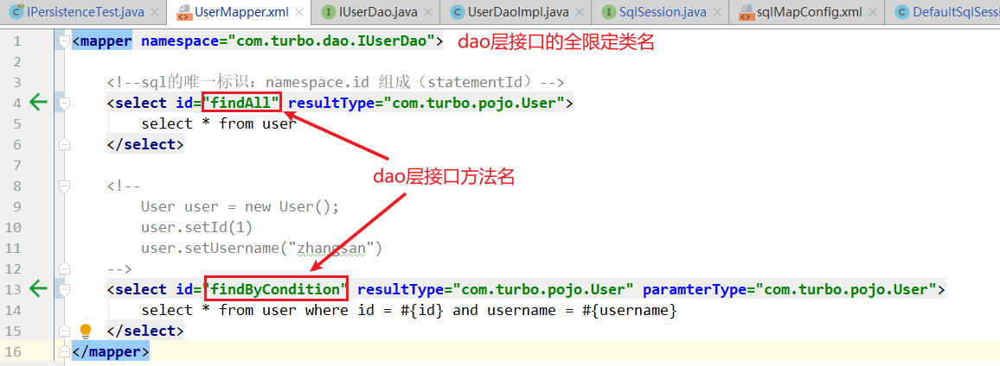

> 第一部分 自定义持久层框架

# 1 分析 JDBC 操作问题

```java
public static void main(String[] args) {
	Connection connection = null;
	PreparedStatement preparedStatement = null; ResultSet resultSet = null;
	try {
        // 加载数据库驱动
        Class.forName("com.mysql.jdbc.Driver"); 
        // 通过驱动管理类获取数据库链接
        connection =
        DriverManager
            .getConnection("jdbc:mysql://localhost:3306/mybatis?characterEncoding=utf-8"
                           , "root"
                           , "root");
        // 定义sql语句？表示占位符
        String sql = "select * from user where username = ?"; 
        // 获取预处理statement
        preparedStatement = connection.prepareStatement(sql);
        // 设置参数，第⼀个参数为sql语句中参数的序号(从1开始)，第⼆个参数为设置的参数值 
        preparedStatement.setString(1, "tom");
        // 向数据库发出sql执⾏查询，查询出结果集 
        resultSet = preparedStatement.executeQuery(); 
        // 遍历查询结果集
		while (resultSet.next()) {
            int id = resultSet.getInt("id");
            String username = resultSet.getString("username"); 
            // 封装User
            user.setId(id);
            user.setUsername(username); 
        }
        System.out.println(user); 
    }
	} catch (Exception e) { 
    	e.printStackTrace();
	} finally { 
    	// 释放资源
		if (resultSet != null) { 
            try { 
				resultSet.close();
			} catch (SQLException e) { 
                e.printStackTrace();
            }
			if (preparedStatement != null) { 
                try {
					preparedStatement.close(); 
                } catch (SQLException e) {
					e.printStackTrace();
				}
                
			if (connection != null) { 
                try {
					connection.close();
				} catch (SQLException e) {
					e.printStackTrace();

                } 
            }
            }
        }
}      
```


JDBC 问题总结：

原始 jdbc 开发存在的问题如下：

1. 数据库配置信息存在硬编码问题
2. 数据库连接创建，释放 频繁 造成系统资源浪费，从而影响系统性能。
3. Sql 语句在代码中存在硬编码，造成代理不易维护，实际应用中 sql 变化的可能较大，sql变动需要改变 java 代码。
4. 使用 preparedStatement 向占位符传参数存在硬编码，因为 sql 语句的 where 条件不一定，可能多也可能少，修改 sql 还要修改代码，系统不易维护。
5. 对结果解析存在硬编码（查询列名），sql 变化导致解析代码变化，系统不易维护，如果能够将数据库记录封装成 pojo 对象解析比较方便

# 2 问题解决思路

1. 使用**配置文件** 编辑数据库配置信息
2. 使用**数据库连接池**初始化连接资源
3. 将 sql 语句抽取到 xml **配置文件**中
4. 使用反射、内省 等底层技术，自动将实体与表进行属性与字段的自动映射

# 3 自定义框架设计

## 3.1 使用端

即 项目 ，然后引入自定义持久层框架的jar包。

提供两部分核心配置文件：数据库配置信息；sql配置信息：sql语句、参数类型、返回值类型

> 1. sqlMapConfig.xml：存放数据库配置信息，存放 mapper.xml 的全路径。
> 2. mapper.xml：存放sql配置信息。

## 3.2 框架端

即 工程，本质就是对 JDBC 代码进行了封装。

1. 加载配置文件，根据配置文件的路径，加载配置文件成字节输入流，存储在内存中

   > 创建 Resource 类，方法 InputSteam  getResourceAsSteam(String path)

2. 创建两个 JavaBean（容器对象）：存放的就是对配置文件解析出来的内容

   > Configuration：核心配置类，存放 sqlMapConfig.xml 解析出来的内容
   >
   > MappedStatement：映射配置类，存放 mapper.xml 解析出来的内容

3. 解析配置文件：dom4j

   创建类：SqlSessionFactoryBuilder ，方法：build(inputSteam in)

   > 第一：使用 dom4j 解析配置文件，将解析出来的内容封装到容器对象中
   >
   > 第二：创建 SqlSessionFactory 对象，生产 sqlSession（会话对象），使用**工厂模式**

4. 创建 SqlSessionFactory 接口及实现类 DefaultSqlSessionFactory

   > 方法 openSession：生产 sqlSession

5. 创建 SqlSession 接口及实现类 DefaultSession

   定义对数据库的 crud 操作：selectList()、selectOne()、update()、delete()

6. 创建 Executor 接口及实现类 SimpleExector 实现类

   query(Configuration, MappedStatement , Object... params)：执行的就是 JDBC 代码


**涉及到的设计模式**：

Builder构建者设计模式、工厂模式、代理模式。

# 4 自定义框架实现

## 4.1 使用端

[使用端代码 gitee地址](https://gitee.com/turboYuu/mybatis-1-1/tree/master/lab-mybatis/IPersistence_test)


pom增加属性配置：

```xml
<properties>
    <project.build.sourceEncoding>UTF-8</project.build.sourceEncoding>
    <maven.compiler.encoding>UTF-8</maven.compiler.encoding>
    <java.version>1.8</java.version>
    <maven.compiler.source>1.8</maven.compiler.source>
    <maven.compiler.target>1.8</maven.compiler.target>
</properties>
```


### 4.1.1 sqlMapConfig.xml

```xml
<configuration>
    <!--数据库配置信息-->
    <dataSource>
        <property name="driverClass" value="com.mysql.jdbc.Driver"></property>
        <property name="jdbcUrl" value="jdbc:mysql://152.136.177.192:3306/turbo"></property>
        <property name="username" value="root"></property>
        <property name="password" value="123456"></property>
    </dataSource>
    <!--存放 mapper.xml 的全路径-->
    <mapper resource="UserMapper.xml"></mapper>
</configuration>
```

### 4.1.2 创建 mapper.xml

```xml
<mapper namespace="user">

    <!--sql的唯一标识：namespace.id 组成（statementId）-->
    <select id="selectList" resultType="com.turbo.pojo.User">
        select * from user
    </select>

    <!--
        User user = new User();
        user.setId(1)
        user.setUsername("zhangsan")
    -->
    <select id="selectOne" resultType="com.turbo.pojo.User" paramterType="com.turbo.pojo.User">
        select * from user where id = #{id} and username = #{username}
    </select>
</mapper>
```

### 4.1.3 测试

完成框架端编写后，测试

pom中引入自定义框架的依赖：

```xml
<!--引入自定义持久层框架的依赖-->
<dependencies>
    <dependency>
        <groupId>com.turbo</groupId>
        <artifactId>IPersistence</artifactId>
        <version>1.0-SNAPSHOT</version>
    </dependency>
</dependencies>
```

```java
package com.turbo.test;

import com.turbo.io.Resources;
import com.turbo.pojo.User;
import com.turbo.sqlSession.SqlSession;
import com.turbo.sqlSession.SqlSessionFactory;
import com.turbo.sqlSession.SqlSessionFactoryBuilder;
import org.junit.Test;
import java.io.InputStream;
import java.util.List;

public class IPersistenceTest {

    @Test
    public void test() throws Exception {
        InputStream resourceAsStream = Resources.getResourceAsStream("sqlMapConfig.xml");
        SqlSessionFactory sqlSessionFactory = new SqlSessionFactoryBuilder().builder(resourceAsStream);
        SqlSession sqlSession = sqlSessionFactory.openSession();

        // 调用
        User user = new User();
        user.setId(1);
        user.setUsername("Lily");
        /*User user1 = sqlSession.selectOne("user.selectOne", user);
        System.out.println(user1);*/
        List<User> list = sqlSession.selectList("user.selectList");
        System.out.println(list);
    }
}
```


## 4.2 框架端

[框架端代码 gitee地址](https://gitee.com/turboYuu/mybatis-1-1/tree/master/lab-mybatis/IPersistence)


pom文件引入依赖和设置属性：

```xml
<properties>
    <project.build.sourceEncoding>UTF-8</project.build.sourceEncoding>
    <maven.compiler.encoding>UTF-8</maven.compiler.encoding>
    <java.version>1.8</java.version>
    <maven.compiler.source>1.8</maven.compiler.source>
    <maven.compiler.target>1.8</maven.compiler.target>
</properties>

<dependencies>
    <dependency>
        <groupId>mysql</groupId>
        <artifactId>mysql-connector-java</artifactId>
        <version>5.1.47</version>
    </dependency>
    <dependency>
        <groupId>c3p0</groupId>
        <artifactId>c3p0</artifactId>
        <version>0.9.1.2</version>
    </dependency>
    <dependency>
        <groupId>log4j</groupId>
        <artifactId>log4j</artifactId>
        <version>1.2.12</version>
    </dependency>
    <dependency>
        <groupId>junit</groupId>
        <artifactId>junit</artifactId>
        <version>4.10</version>
    </dependency>
    <dependency>
        <groupId>dom4j</groupId>
        <artifactId>dom4j</artifactId>
        <version>1.6.1</version>
    </dependency>
    <dependency>
        <groupId>jaxen</groupId>
        <artifactId>jaxen</artifactId>
        <version>1.1.6</version>
    </dependency>
</dependencies>
```


### 4.2.1 Resources.java

```java
package com.turbo.io;

import java.io.InputStream;

public class Resources {

    /**
     * 根据配置文件的路径，将配置文件加载成字节输入流，存储在内存中
     * @param path
     * @return
     */
    public static InputStream getResourceAsStream(String path){
        InputStream resourceAsStream = Resources.class.getClassLoader().getResourceAsStream(path);
        return resourceAsStream;
    }
}
```

#### 4.2.1.1 可以打包，供IPersistence_test 引用测试

打包的话 pom 文件增加如下属性：

```xml
<properties>
    <project.build.sourceEncoding>UTF-8</project.build.sourceEncoding>
    <maven.compiler.encoding>UTF-8</maven.compiler.encoding>
    <java.version>1.8</java.version>
    <maven.compiler.source>1.8</maven.compiler.source>
    <maven.compiler.target>1.8</maven.compiler.target>
</properties>
```

然后 maven-install 打包；接着，在 IPersistence_test 的 pom 中引入 自定义持久层框架的 jar，测试。

### 4.2.2 两个 JavaBean

#### 4.2.2.1 MappedStatement.java

```java
package com.turbo.pojo;

public class MappedStatement {

    // id 标识
    private String id;
    // 返回值类型
    private String resultType;
    // 参数值类型
    private String paramterType;
    // sql 语句
    private String sql;

    public String getId() {
        return id;
    }

    public void setId(String id) {
        this.id = id;
    }

    public String getResultType() {
        return resultType;
    }

    public void setResultType(String resultType) {
        this.resultType = resultType;
    }

    public String getParamterType() {
        return paramterType;
    }

    public void setParamterType(String paramterType) {
        this.paramterType = paramterType;
    }

    public String getSql() {
        return sql;
    }

    public void setSql(String sql) {
        this.sql = sql;
    }
}
```


#### 4.2.2.2 Configuration.java

```java
package com.turbo.pojo;

import javax.sql.DataSource;
import java.util.HashMap;
import java.util.Map;

public class Configuration {

    private DataSource dataSource;

    /**
     * key: statementId (namespace.id)
     * value：封装好的 MappedStatement 对象
     */
    Map<String,MappedStatement> mappedStatementMap = new HashMap<>();

    public DataSource getDataSource() {
        return dataSource;
    }

    public void setDataSource(DataSource dataSource) {
        this.dataSource = dataSource;
    }

    public Map<String, MappedStatement> getMappedStatementMap() {
        return mappedStatementMap;
    }

    public void setMappedStatementMap(Map<String, MappedStatement> mappedStatementMap) {
        this.mappedStatementMap = mappedStatementMap;
    }
}
```


### 4.2.3 解析配置文件

#### 4.2.3.1 SqlSessionFactoryBuilder.java

```java
package com.turbo.sqlSession;

import com.turbo.config.XMLConfigBuilder;
import com.turbo.pojo.Configuration;
import org.dom4j.DocumentException;

import java.beans.PropertyVetoException;
import java.io.InputStream;

public class SqlSessionFactoryBuilder {

    public SqlSessionFactory builder(InputStream in) throws DocumentException, PropertyVetoException {
        // 第一：使用 dom4j 解析配置文件，将解析出来的内容封装到Configuration中
        XMLConfigBuilder xmlConfigBuilder = new XMLConfigBuilder();
        Configuration configuration = xmlConfigBuilder.parseConfig(in);


        // 第二：创建 SqlSessionFactory对象，工厂类，生产 sqlSession 会话对象
        DefaultSqlSessionFactory defaultSqlSessionFactory = new DefaultSqlSessionFactory(configuration);
        return defaultSqlSessionFactory;
    }
}
```


#### 4.2.3.2 SqlSessionFactory.java

```java
package com.turbo.sqlSession;

public interface SqlSessionFactory {

    public SqlSession openSession();
}
```


#### 4.2.3.3 XMLConfigBuilder.java

```java
package com.turbo.config;

import com.mchange.v2.c3p0.ComboPooledDataSource;
import com.turbo.io.Resources;
import com.turbo.pojo.Configuration;
import org.dom4j.Document;
import org.dom4j.DocumentException;
import org.dom4j.Element;
import org.dom4j.io.SAXReader;

import java.beans.PropertyVetoException;
import java.io.InputStream;
import java.util.List;
import java.util.Properties;

public class XMLConfigBuilder {

    private Configuration configuration;

    public XMLConfigBuilder() {
        this.configuration = new Configuration();
    }

    /**
     * 该方法就是使用dom4j 将配置文件进行解析，封装 Configuration
     */
    public Configuration parseConfig(InputStream in) throws DocumentException, PropertyVetoException {
        Document document = new SAXReader().read(in);
        // <configuration>
        Element rootElement = document.getRootElement();
        List<Element> list = rootElement.selectNodes("//property");

        Properties properties = new Properties();
        for (Element element : list) {
            String name = element.attributeValue("name");
            String value = element.attributeValue("value");
            properties.setProperty(name,value);
        }
        ComboPooledDataSource comboPooledDataSource = new ComboPooledDataSource();
        comboPooledDataSource.setDriverClass(properties.getProperty("driverClass"));
        comboPooledDataSource.setJdbcUrl(properties.getProperty("jdbcUrl"));
        comboPooledDataSource.setUser(properties.getProperty("username"));
        comboPooledDataSource.setPassword(properties.getProperty("password"));

        configuration.setDataSource(comboPooledDataSource);

        // 解析 mapper.xml:拿到路径 -- 字节输入流 -- dom4j 进行解析
        List<Element> mapperList = rootElement.selectNodes("//mapper");
        for (Element element : mapperList) {
            String mapperPath = element.attributeValue("resource");
            InputStream resourceAsStream = Resources.getResourceAsStream(mapperPath);
            XMLMapperBuilder xmlMapperBuilder = new XMLMapperBuilder(configuration);
            xmlMapperBuilder.parse(resourceAsStream);
        }
        return configuration;
    }
}
```


#### 4.2.3.4 XMLMapperBuilder.java

```java
package com.turbo.config;

import com.turbo.pojo.Configuration;
import com.turbo.pojo.MappedStatement;
import org.dom4j.Document;
import org.dom4j.DocumentException;
import org.dom4j.Element;
import org.dom4j.io.SAXReader;

import java.io.InputStream;
import java.util.List;

public class XMLMapperBuilder {
    private Configuration configuration;
    public XMLMapperBuilder(Configuration configuration) {
        this.configuration = configuration;
    }

    /**
     * 该方法就是使用dom4j 将配置文件进行解析，封装 MappedStatement，再封装进Configuration
     * @param in
     * @throws DocumentException
     */
    public void parse(InputStream in) throws DocumentException {
        Document document = new SAXReader().read(in);
        // <mapper>
        Element rootElement = document.getRootElement();

        List<Element> list = rootElement.selectNodes("//select");

        String namespace = rootElement.attributeValue("namespace");

        for (Element element : list) {
            String id = element.attributeValue("id");
            String resultType = element.attributeValue("resultType");
            String paramterType = element.attributeValue("paramterType");
            String sqlText = element.getTextTrim();
            MappedStatement mappedStatement = new MappedStatement();
            mappedStatement.setId(id);
            mappedStatement.setResultType(resultType);
            mappedStatement.setParamterType(paramterType);
            mappedStatement.setSql(sqlText);
            String key = namespace+"."+id;
            configuration.getMappedStatementMap().put(key,mappedStatement);
        }

    }
}
```


#### 4.2.3.5 DefaultSqlSessionFactory.java

```java
package com.turbo.sqlSession;

import com.turbo.pojo.Configuration;

public class DefaultSqlSessionFactory implements SqlSessionFactory {

    private Configuration configuration;

    public DefaultSqlSessionFactory(Configuration configuration) {
        this.configuration = configuration;
    }

    @Override
    public SqlSession openSession() {
        return new DefaultSqlSession(configuration);
    }
}
```


### 4.2.4 SqlSession.java & DefaultSqlSession.java

```java
package com.turbo.sqlSession;

import java.sql.SQLException;
import java.util.List;

public interface SqlSession {

    // 查询所有
    public <E> List<E> selectList(String statementId,Object... params) throws Exception;

    // 根据条件查询单个
    public <T> T selectOne(String statementId,Object... params) throws Exception;
}

```

```java
package com.turbo.sqlSession;

import com.turbo.pojo.Configuration;
import com.turbo.pojo.MappedStatement;

import java.sql.SQLException;
import java.util.List;

public class DefaultSqlSession implements SqlSession {

    private Configuration configuration;

    public DefaultSqlSession(Configuration configuration) {
        this.configuration = configuration;
    }

    @Override
    public <E> List<E> selectList(String statementId, Object... params) throws Exception {
        // 将要去完成对 SimpleExecutor 里的 query 方法的调用
        SimpleExecutor simpleExecutor = new SimpleExecutor();
        MappedStatement mappedStatement = configuration.getMappedStatementMap().get(statementId);
        List<Object> list = simpleExecutor.query(configuration, mappedStatement, params);
        return (List<E>) list;
    }

    @Override
    public <T> T selectOne(String statementId, Object... params) throws Exception {
        List<Object> objects = selectList(statementId, params);
        if(objects.size() == 1){
            return (T) objects.get(0);
        }else {
            throw new RuntimeException("查询结果为空或者返回结果过多");
        }
    }
}
```


### 4.2.5 创建 Executor 接口及实现类 SimpleExector 实现类

```java
package com.turbo.sqlSession;

import com.turbo.pojo.Configuration;
import com.turbo.pojo.MappedStatement;
import java.util.List;

public interface Executor {

    public <E> List<E> query(Configuration configuration, MappedStatement mappedStatement, 
                             Object... params) throws Exception;
}

```

```java
package com.turbo.sqlSession;

import com.turbo.config.BoundSql;
import com.turbo.pojo.Configuration;
import com.turbo.pojo.MappedStatement;
import com.turbo.utils.GenericTokenParser;
import com.turbo.utils.ParameterMapping;
import com.turbo.utils.ParameterMappingTokenHandler;
import java.beans.PropertyDescriptor;
import java.lang.reflect.Field;

import java.lang.reflect.Method;
import java.sql.*;
import java.util.ArrayList;
import java.util.List;

public class SimpleExecutor implements Executor {
    @Override
    public <E> List<E> query(Configuration configuration, MappedStatement mappedStatement, 
                             Object... params) throws Exception {
        // 1. 注册驱动，获取链接
        Connection connection = configuration.getDataSource().getConnection();
        // 2. 获取sql语句  select * from user where id = #{id} and username = #{username}
        // 转换sql语句：select * from user where id = ? and username = ?
        // 转换过程中，还需要对 #{} 里面的值进行解析存储
        String sql = mappedStatement.getSql();
        BoundSql boundSql = getBoundSql(sql);

        // 3.获取预处理对象  PreparedStatement
        PreparedStatement preparedStatement = connection.prepareStatement(boundSql.getSqlText());

        // 4.设置参数
            // 获取到了参数的全路径
        String paramterType = mappedStatement.getParamterType();
        Class<?> paramterTypeClass = getClassType(paramterType);

        List<ParameterMapping> parameterMappings = boundSql.getParameterMappings();
        for (int i = 0; i < parameterMappings.size(); i++) {
            ParameterMapping parameterMapping = parameterMappings.get(i);
            String content = parameterMapping.getContent();

            // 使用反射
            Field declaredField = paramterTypeClass.getDeclaredField(content);
            // 暴力访问
            declaredField.setAccessible(true);
            Object o = declaredField.get(params[0]);
            preparedStatement.setObject(i+1,o);
        }

        // 5. 执行 sql
        ResultSet resultSet = preparedStatement.executeQuery();

        // 6. 封装返回结果集
        String resultType = mappedStatement.getResultType();
        Class<?> resultTypeClass = getClassType(resultType);


        ArrayList<Object> objects = new ArrayList<>();
        while (resultSet.next()){
            Object o = resultTypeClass.newInstance();
            // 元数据
            ResultSetMetaData metaData = resultSet.getMetaData();
            for (int i = 1; i <= metaData.getColumnCount() ; i++) {
                // 字段名
                String columnName = metaData.getColumnName(i);
                // 字段的值
                Object value = resultSet.getObject(columnName);
                // 使用反射或者内省，根数数据库表和实体的对应关系，完成封装
                PropertyDescriptor propertyDescriptor = 
                    new PropertyDescriptor(columnName, resultTypeClass);
                
                Method writeMethod = propertyDescriptor.getWriteMethod();
                writeMethod.invoke(o,value);

            }
            objects.add(o);
        }
        return (List<E>) objects;
    }

    private Class<?> getClassType(String paramterType) throws ClassNotFoundException {
        if(paramterType != null){
            Class<?> aClass = Class.forName(paramterType);
            return aClass;
        }
        return null;
    }

    /**
     *  完成对 #{} 的解析存工作：
     *      1.将#{}使用?代替，
     *      2.解析出#{}里面的值进行存储
     * @param sql
     * @return
     */
    private BoundSql getBoundSql(String sql) {
        // 标记处理类：配置标记标记解析器来完成对占位符的解析处理工作
        ParameterMappingTokenHandler parameterMappingTokenHandler = 
            new ParameterMappingTokenHandler();
        GenericTokenParser genericTokenParser = 
            new GenericTokenParser("#{", "}", parameterMappingTokenHandler);
        // 解析出来的sql
        String parseSql = genericTokenParser.parse(sql);
        // #{} 里面解析出来的参数名称
        List<ParameterMapping> parameterMappings = 
            parameterMappingTokenHandler.getParameterMappings();

        BoundSql boundSql = new BoundSql(parseSql, parameterMappings);
        return boundSql;
    }
}

```


# 5 自定义框架优化

存在的问题：

- dao的实现类中存在重复的代码，整个操作过程模板重复（创建sqlSession，调用 sqlSession，关闭 sqlSession）
- dao的实现类中存在硬编码，调用sqlSession的方法时，参数 statement 的 id 硬编码

解决：使用代理模式来创建Dao层接口的代理对象

1. 创建IUserDao接口

   ```java
   package com.turbo.dao;
   
   import com.turbo.pojo.User;
   
   import java.util.List;
   
   public interface IUserDao {
   
       // 查询所有用户
       public List<User> findAll() throws Exception;
   
       // 根据条件进行查询
       public User findByCondition(User user) throws Exception;
   }
   ```

2. 修改UserMapper.xml

   

3. 动态代理生成接口代理对象

   使用端的 接口 IUserDao.java

   ```java
   package com.turbo.dao;
   
   import com.turbo.pojo.User;
   
   import java.util.List;
   
   public interface IUserDao {
   
       // 查询所有用户
       public List<User> findAll() throws Exception;
   
       // 根据条件进行查询
       public User findByCondition(User user) throws Exception;
   }
   ```

   框架端：SqlSession.java

   ```java
   package com.turbo.sqlSession;
   
   import java.sql.SQLException;
   import java.util.List;
   
   public interface SqlSession {
       // ....
       // 为Dao接口生成代理对象
       public <T> T getMapper(Class<?> mapperClass);
   }
   
   ```

   框架端：[DefaultSqlSession.java](https://gitee.com/turboYuu/mybatis-1-1/blob/master/lab-mybatis/IPersistence/src/main/java/com/turbo/sqlSession/DefaultSqlSession.java)

   ```java
   package com.turbo.sqlSession;
   
   import com.turbo.pojo.Configuration;
   import com.turbo.pojo.MappedStatement;
   import java.lang.reflect.*;
   import java.util.List;
   
   public class DefaultSqlSession implements SqlSession {
   
       // ...
   
       /**
        * 使用 jdk 动态代理来为 dao 接口生成代理对象，并返回
        * @param mapperClass
        * @param <T>
        * @return
        */
       @Override
       public <T> T getMapper(Class<?> mapperClass) {
           Object proxyInstance = Proxy.newProxyInstance(DefaultSqlSession.class.getClassLoader(), 
                              new Class[]{mapperClass}, 
                              new InvocationHandler() {
               /**
                *
                * @param proxy 当前代理对象的引用
                * @param method 当前被调用方法的引用
                * @param args 传递的参数
                * @return
                * @throws Throwable
                */
               @Override
               public Object invoke(Object proxy, Method method, Object[] args) throws Throwable {
                   // 底层还是执行 jdbc 方法
                   // 根据不同情况调用 selectList 或者 selectOne
                   // 准备参数 1. statementId(sql语句的唯一标识：namespace.id=接口全限定名.方法名)
                   //String typeName = mapperClass.getTypeName();
                   String className = method.getDeclaringClass().getName(); // 接口全限定名
                   String methodName = method.getName(); // 方法名 findAll
   
                   String statementId = className+"."+methodName;
   
                   // 准备参数2：args
   
                   // 获取被调用方法的返回值类型
                   Type genericReturnType = method.getGenericReturnType();
                   // 判断是否进行了 泛型类型参数化（即：判断返回类型中是否有泛型）
                   if(genericReturnType instanceof ParameterizedType){
                        return selectList(statementId,args);
                   }
                   return selectOne(statementId,args);
               }
           });
   
           return (T) proxyInstance;
       }
   }
   ```

4. 使用端测试

   ```java
   package com.turbo.test;
   
   import com.turbo.dao.IUserDao;
   import com.turbo.io.Resources;
   import com.turbo.pojo.User;
   import com.turbo.sqlSession.SqlSession;
   import com.turbo.sqlSession.SqlSessionFactory;
   import com.turbo.sqlSession.SqlSessionFactoryBuilder;
   import org.junit.Test;
   import java.io.InputStream;
   import java.util.List;
   
   public class IPersistenceTest {
   
       @Test
       public void test() throws Exception {
           InputStream resourceAsStream = Resources.getResourceAsStream("sqlMapConfig.xml");
           SqlSessionFactory sqlSessionFactory = 
               new SqlSessionFactoryBuilder().builder(resourceAsStream);
           SqlSession sqlSession = sqlSessionFactory.openSession();
   
           // 调用
           User user = new User();
           user.setId(1);
           user.setUsername("Lily");
           IUserDao userDao = sqlSession.getMapper(IUserDao.class);
           /*List<User> all = userDao.findAll();
           System.out.println(all);*/
           User user1 = userDao.findByCondition(user);
           System.out.println(user1);
       }
   }
   ```