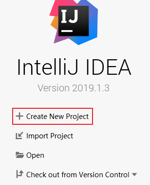
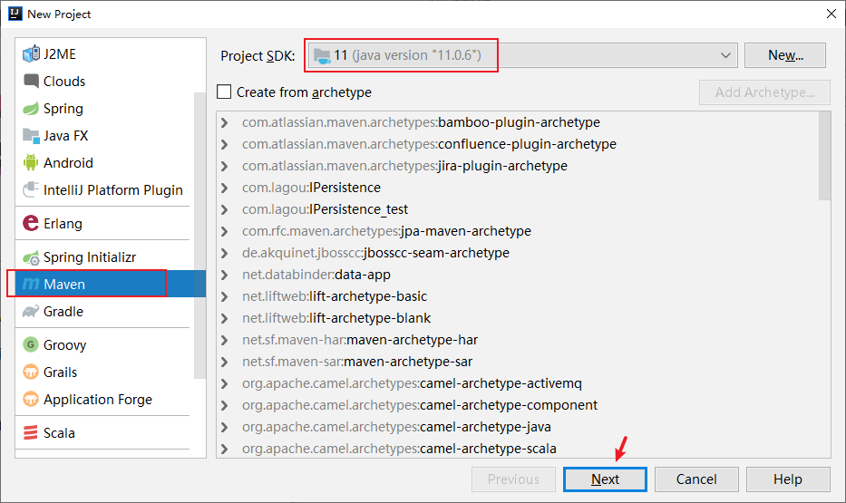
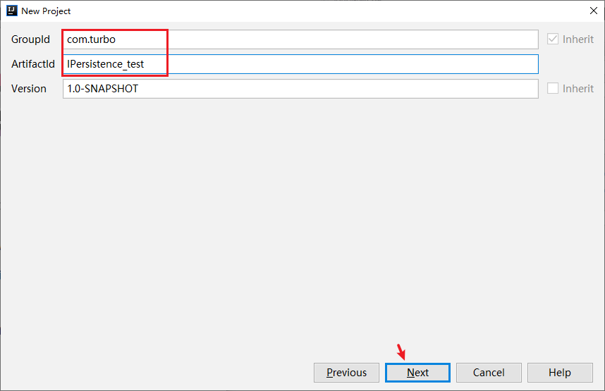
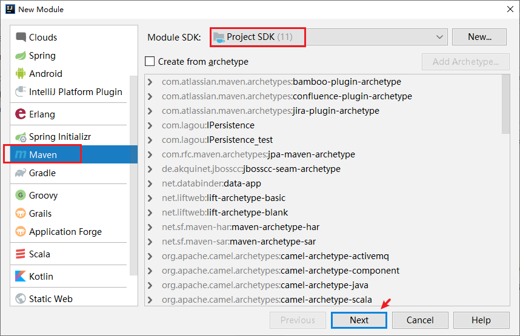
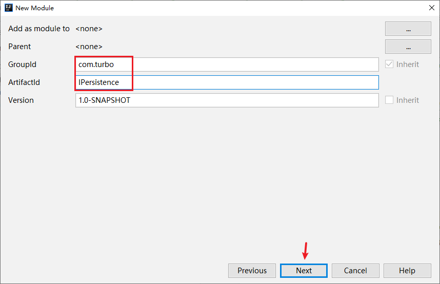
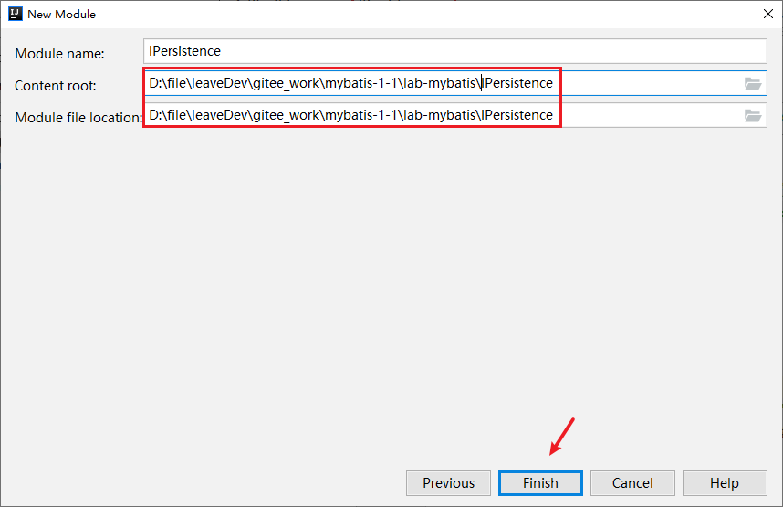

> 第一部分 自定义持久层框架

# 1 分析 JDBC 操作问题

```java
public static void main(String[] args) {
	Connection connection = null;
	PreparedStatement preparedStatement = null; ResultSet resultSet = null;
	try {
        // 加载数据库驱动
        Class.forName("com.mysql.jdbc.Driver"); 
        // 通过驱动管理类获取数据库链接
        connection =
        DriverManager
            .getConnection("jdbc:mysql://localhost:3306/mybatis?characterEncoding=utf-8"
                           , "root"
                           , "root");
        // 定义sql语句？表示占位符
        String sql = "select * from user where username = ?"; 
        // 获取预处理statement
        preparedStatement = connection.prepareStatement(sql);
        // 设置参数，第⼀个参数为sql语句中参数的序号(从1开始)，第⼆个参数为设置的参数值 
        preparedStatement.setString(1, "tom");
        // 向数据库发出sql执⾏查询，查询出结果集 
        resultSet = preparedStatement.executeQuery(); 
        // 遍历查询结果集
		while (resultSet.next()) {
            int id = resultSet.getInt("id");
            String username = resultSet.getString("username"); 
            // 封装User
            user.setId(id);
            user.setUsername(username); 
        }
        System.out.println(user); 
    }
	} catch (Exception e) { 
    	e.printStackTrace();
	} finally { 
    	// 释放资源
		if (resultSet != null) { 
            try { 
				resultSet.close();
			} catch (SQLException e) { 
                e.printStackTrace();
            }
			if (preparedStatement != null) { 
                try {
					preparedStatement.close(); 
                } catch (SQLException e) {
					e.printStackTrace();
				}
                
			if (connection != null) { 
                try {
					connection.close();
				} catch (SQLException e) {
					e.printStackTrace();

                } 
            }
            }
        }
}      
```


JDBC 问题总结：

原始 jdbc 开发存在的问题如下：

1. 数据库配置信息存在硬编码问题
2. 数据库连接创建，释放 频繁 造成系统资源浪费，从而影响系统性能。
3. Sql 语句在代码中存在硬编码，造成代理不易维护，实际应用中 sql 变化的可能较大，sql变动需要改变 java 代码。
4. 使用 preparedStatement 向占位符传参数存在硬编码，因为 sql 语句的 where 条件不一定，可能多也可能少，修改 sql 还要修改代码，系统不易维护。
5. 对结果解析存在硬编码（查询列名），sql 变化导致解析代码变化，系统不易维护，如果能够将数据库记录封装成 pojo 对象解析比较方便

# 2 问题解决思路

1. 使用**配置文件** 编辑数据库配置信息
2. 使用**数据库连接池**初始化连接资源
3. 将 sql 语句抽取到 xml **配置文件**中
4. 使用反射、内省 等底层技术，自动将实体与表进行属性与字段的自动映射

# 3 自定义框架设计

## 3.1 使用端

即 项目 ，然后引入自定义持久层框架的jar包。

提供两部分核心配置文件：数据库配置信息；sql配置信息：sql语句、参数类型、返回值类型

> 1. sqlMapConfig.xml：存放数据库配置信息，存放 mapper.xml 的全路径。
> 2. mapper.xml：存放sql配置信息。

## 3.2 框架端

即 工程，本质就是对 JDBC 代码进行了封装。

1. 加载配置文件，根据配置文件的路径，加载配置文件成字节输入流，存储在内存中

   > 创建 Resource 类，方法 InputSteam  getResourceAsSteam(String path)

2. 创建两个 JavaBean（容器对象）：存放的就是对配置文件解析出来的内容

   > Configuration：核心配置类，存放 sqlMapConfig.xml 解析出来的内容
   >
   > MappedStatement：映射配置类，存放 mapper.xml 解析出来的内容

3. 解析配置文件：dom4j

   创建类：SqlSessionFactoryBuilder ，方法：build(inputSteam in)

   > 第一：使用 dom4j 解析配置文件，将解析出来的内容封装到容器对象中
   >
   > 第二：创建 SqlSessionFactory 对象，生产 sqlSession（会话对象），使用**工厂模式**

4. 创建 SqlSessionFactory 接口及实现类 DefaultSqlSessionFactory

   > 方法 openSession：生产 sqlSession

5. 创建 SqlSession 接口及实现类 DefaultSession

   定义对数据库的 crud 操作：selectList()、selectOne()、update()、delete()

6. 创建 Executor 接口及实现类 SimpleExector 实现类

   query(Configuration, MappedStatement , Object... params)：执行的就是 JDBC 代码


**涉及到的设计模式**：

Builder构建者设计模式、工厂模式、代理模式。

# 4 自定义框架实现

## 4.1 使用端







### 4.1.1 sqlMapConfig.xml

```xml
<configuration>
    <!--数据库配置信息-->
    <dataSource>
        <property name="driverClass" value="com.mysql.jdbc.Driver"></property>
        <property name="jdbcUrl" value="jdbc:mysql://152.136.177.192:3306/turbo"></property>
        <property name="username" value="root"></property>
        <property name="password" value="123456"></property>
    </dataSource>
    <!--存放 mapper.xml 的全路径-->
    <mapper resource="UserMapper.xml"></mapper>
</configuration>
```

### 4.1.2 创建 mapper.xml

```xml
<mapper namespace="user">

    <!--sql的唯一标识：namespace.id 组成（statementId）-->
    <select id="selectList" resultType="com.turbo.pojo.User">
        select * from user
    </select>

    <!--
        User user = new User();
        user.setId(1)
        user.setUsername("zhangsan")
    -->
    <select id="selectOne" resultType="com.turbo.pojo.User" paramterType="com.turbo.pojo.User">
        select * from user where id = #{id} and username = #{username}
    </select>
</mapper>
```

## 4.2 框架端







### 4.2.1 Resources.java

```java
package com.turbo.io;

import java.io.InputStream;

public class Resources {

    /**
     * 根据配置文件的路径，将配置文件加载成字节输入流，存储在内存中
     * @param path
     * @return
     */
    public static InputStream getResourceAsStream(String path){
        InputStream resourceAsStream = Resources.class.getClassLoader().getResourceAsStream(path);
        return resourceAsStream;
    }
}
```

### 4.2.2 可以打包，供IPersistence_test 引用测试

打包的话 pom 文件增加如下属性：

```xml
<properties>
    <project.build.sourceEncoding>UTF-8</project.build.sourceEncoding>
    <maven.compiler.encoding>UTF-8</maven.compiler.encoding>
    <java.version>1.8</java.version>
    <maven.compiler.source>1.8</maven.compiler.source>
    <maven.compiler.target>1.8</maven.compiler.target>
</properties>
```

然后 maven-install 打包；接着，在 IPersistence_test 的 pom 中引入 自定义持久层框架的 jar，测试。


# 5 自定义框架优化

