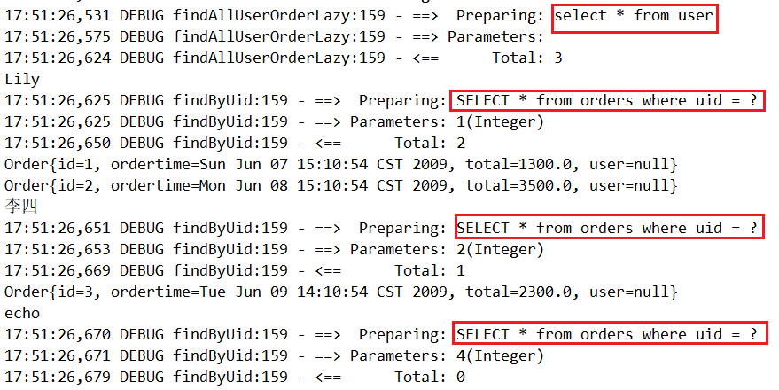
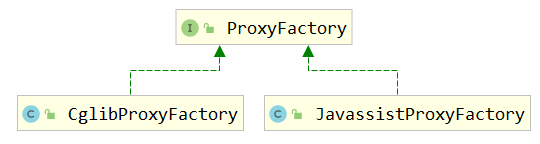
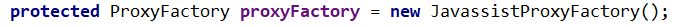

> 第十部分 Mybatis源码剖析

# 1 传统方式源码分析

## 1.1 源码剖析-初始化

```java
InputStream resourceAsStream = Resources.getResourceAsStream("SqlMapConfig.xml");
// 这一行代码时初始化工作的开始
SqlSessionFactory factory = new SqlSessionFactoryBuilder().build(resourceAsStream);
```

进入源码分析：

```java
// 1. 我们最初调用的 build
public SqlSessionFactory build(InputStream inputStream) {
    // 调用了重载方法
    return build(inputStream, null, null);
}

// 2. 调用的重载方法
public SqlSessionFactory build(InputStream inputStream, 
                               String environment, 
                               Properties properties) {
    try {
        // XMLConfigBuilder 是专门解析 mybatis 的配置文件的类
        XMLConfigBuilder parser = 
            new XMLConfigBuilder(inputStream, environment, properties);
        // 这里又调用了一个重载方法。parser.parse() 的返回值是 Configuration 对象
        return build(parser.parse());
    } catch (Exception e) {
        throw ExceptionFactory.wrapException("Error building SqlSession.", e);
    } finally {
        ErrorContext.instance().reset();
        try {
            inputStream.close();
        } catch (IOException e) {
            // Intentionally ignore. Prefer previous error.
        }
    }
}
```

Mybatis 在初始化的时候，会将 Mybatis 的配置信息全部加载到内存中，使用 org.apache.ibatis.session.Configuration 实例来维护。

下面进入对配置文件解析部分：

首先对 Configuration 对象进行介绍：

```xml
Configuration 对象的结构和xml配置文件的对象几乎相同。

回顾一下 xml 中的配置标签有哪些：
properties(属性)，settings(设置)，typeAliases(类型名称)，typeHandlers(类型处理器)，objectFactory(对象工厂)，mappers(映射器)等 Configuration 也有对应的对象属性来封装它们

也就是说，初始化配置文件信息的本质就是创建 Configuration 对象，将解析的 xml 数据封装到 Configuration 内部属性中
```


```java
// 解析 xml 成 Configuration 对象
public Configuration parse() {
    // 若已经解析，抛出 BuilderException 异常
    if (parsed) {
        throw new BuilderException("Each XMLConfigBuilder can only be used once.");
    }
    // 标记已解析
    parsed = true;
    // 解析 XML Configuration 节点
    parseConfiguration(parser.evalNode("/configuration"));
    return configuration;
}

// 解析 xml
private void parseConfiguration(XNode root) {
    try {
        //issue #117 read properties first
        // 解析 <properties/> 标签
        propertiesElement(root.evalNode("properties"));
        // 解析 <settings/> 标签
        Properties settings = settingsAsProperties(root.evalNode("settings"));
        // 加载自定义的 VFS 实现类
        loadCustomVfs(settings);
        // 解析 <typeAliases/> 标签
        typeAliasesElement(root.evalNode("typeAliases"));
        // 解析 <plugins/> 标签
        pluginElement(root.evalNode("plugins"));
        // 解析 <objectFactory/> 标签
        objectFactoryElement(root.evalNode("objectFactory"));
        // 解析 <objectWrapperFactory/> 标签
        objectWrapperFactoryElement(root.evalNode("objectWrapperFactory"));
        // 解析 <reflectorFactory/> 标签
        reflectorFactoryElement(root.evalNode("reflectorFactory"));
        // 赋值 <settings/> 至 Configuration 属性
        settingsElement(settings);
        // read it after objectFactory and objectWrapperFactory issue #631
        // 解析 <environments/> 标签
        environmentsElement(root.evalNode("environments"));
        // 解析 <databaseIdProvider/> 标签
        databaseIdProviderElement(root.evalNode("databaseIdProvider"));
        // 解析 <typeHandlers/> 标签
        typeHandlerElement(root.evalNode("typeHandlers"));
        // 解析 <mappers/> 标签
        mapperElement(root.evalNode("mappers"));
    } catch (Exception e) {
        throw new BuilderException("Error parsing SQL Mapper Configuration. Cause: " + e, e);
    }
}
```

介绍一下 MappedStatement：

作用：MappedStatement 与 Mapper 配置文件中的一个 select/update/insert/delete 节点相对应。

mapper 中配置的标签都被封装到了此对象中，主要用途是描述一条 SQL 语句。

**初始化过程**：回顾刚开始的加载配置文件的过程，会对 mybatis-config.xml 中的各个标签都进行解析，其中有 mappers 标签用来引入 mapper.xml 文件或者配置 mapper 接口的目录。

```xml
<select id="selectUserById" parameterType="int" resultType="user">
    select * from user where id=#{id}
</select>
```

这样一个 select 标签会在初始化配置文件时被解析封装成一个 MappedStatement 对象，然后存储在 Configuration 对象的 mappedStatements属性中，mappedStatements 是一个 HashMap，存储时 key = 全限定类名 + 方法名，value = 对应的 MappedStatement 对象。

在 Configuration 中对应的属性为：

```java
protected final Map<String, MappedStatement> mappedStatements = new StrictMap<MappedStatement>("Mapped Statements collection");
```

在 XMLConfigBuilder 中的处理：

```java
private void parseConfiguration(XNode root) {
    try {
        // ...
        // 解析 <mappers/> 标签
        mapperElement(root.evalNode("mappers"));
    } catch (Exception e) {
        throw new BuilderException("Error parsing SQL Mapper Configuration. Cause: " + e, e);
    }
}
```

到此对 xml 配置文件的解析就结束了，回到步骤2 中调用的重载 build 方法：

```java
// 调用的重载方法
public SqlSessionFactory build(Configuration config) {
    // 创建了 DefaultSqlSessionFactory 对象，传入 Configuration 对象
    return new DefaultSqlSessionFactory(config);
}
```

## 1.2 源码剖析-执行 SQL 流程

先简单介绍 **SqlSession**：

SqlSession 是一个接口，它有两个实现类：DefaultSqlSession（默认）和 SqlSessionManager（弃用，不做介绍）

SqlSession 是 Mybatis 中用于和数据库交互的顶层类，同城将它与 ThreadLocal 绑定，一个会话使用一个 SqlSession ，并且在使用完毕后需要 close。

```java
public class DefaultSqlSession implements SqlSession {

  private final Configuration configuration;
  private final Executor executor;
}
```

SqlSession 中的两个重要参数，configuration 与初始化时的相同，executor 为执行器。

### 1.2.1 Executor

Executor 也是一个接口，它有三个常用的实现类：

- BaseExecutor （重用语句并执行批量更新）
- ReuseExecutor（重用预处理语句 prepared statements）
- SimpleExecutor（普通的执行器，默认）

继续分析，初始化完毕后，我们就需要执行 SQL 了

```java
SqlSession sqlSession = factory.openSession();
List<User> list = sqlSession.selectList("com.turbo.mapper.UserMapper.findAllUser");
```

获得 sqlSession 

```java
// 进入 openSession 方法
public SqlSession openSession() {
    // getDefaultExecutorType() 传递的是 SimpleExecutor
    return openSessionFromDataSource(configuration.getDefaultExecutorType(), null, false);
}

// 进入 openSessionFromDataSource
// ExecutorType 为 Executor 的类型，TransactionIsolationLevel 为事务隔离级别，autoCommit 是否开启事务
// openSession 的入多个重载方法可以指定获得的 SqlSession 的 Executor 类型和事务的处理
private SqlSession openSessionFromDataSource(ExecutorType execType, 
                                             TransactionIsolationLevel level, 
                                             boolean autoCommit) {
    Transaction tx = null;
    try {
        final Environment environment = configuration.getEnvironment();
        final TransactionFactory transactionFactory = getTransactionFactoryFromEnvironment(environment);
        tx = transactionFactory.newTransaction(environment.getDataSource(), level, autoCommit);
        // 根据参数创建指定类型的 Executor
        final Executor executor = configuration.newExecutor(tx, execType);
        // 返回的是 DefaultSqlSession
        return new DefaultSqlSession(configuration, executor, autoCommit);
    } catch (Exception e) {
        closeTransaction(tx); // may have fetched a connection so lets call close()
        throw ExceptionFactory.wrapException("Error opening session.  Cause: " + e, e);
    } finally {
        ErrorContext.instance().reset();
    }
}
```

执行 sqlSession 中的 api

```java
// 进入 selectList 方法，多个重载方法
public <E> List<E> selectList(String statement) {
    return this.selectList(statement, null);
}

public <E> List<E> selectList(String statement, Object parameter) {
    return this.selectList(statement, parameter, RowBounds.DEFAULT);
}

public <E> List<E> selectList(String statement, Object parameter, RowBounds rowBounds) {
    try {
        // 根据传入的全限定名 + 方法名 从映射的 Map 中取出 MappedStatement 对象
        MappedStatement ms = configuration.getMappedStatement(statement);
        // 调用 executor 中的方法处理
        // RowBounds 是用来逻辑分页
        // wrapCollection(parameter) 是用来装饰集合或者数组参数
        return executor.query(ms, wrapCollection(parameter), rowBounds, Executor.NO_RESULT_HANDLER);
    } catch (Exception e) {
        throw ExceptionFactory.wrapException("Error querying database.  Cause: " + e, e);
    } finally {
        ErrorContext.instance().reset();
    }
}
```


## 1.3 源码剖析-executor

继续源码中的步骤，进入 executor.query()

```java
// 此方法在 SimpleExecutor 的父类 BaseExecutor 中实现
public <E> List<E> query(MappedStatement ms, 
                         Object parameter, 
                         RowBounds rowBounds, 
                         ResultHandler resultHandler) throws SQLException {
    // 根据传入的参数动态获得 SQL 语句，最后返回用 BoundSql 对象表示
    BoundSql boundSql = ms.getBoundSql(parameter);
    // 为本次查询创建缓存的 key
    CacheKey key = createCacheKey(ms, parameter, rowBounds, boundSql);
    return query(ms, parameter, rowBounds, resultHandler, key, boundSql);
}

// 进入 query 的重载方法中
public <E> List<E> query(MappedStatement ms, Object parameter, RowBounds rowBounds, 
                         ResultHandler resultHandler, CacheKey key, 
                         BoundSql boundSql) throws SQLException {
    ErrorContext.instance().resource(ms.getResource()).activity("executing a query").object(ms.getId());
    if (closed) {
        throw new ExecutorException("Executor was closed.");
    }
    if (queryStack == 0 && ms.isFlushCacheRequired()) {
        clearLocalCache();
    }
    List<E> list;
    try {
        queryStack++;
        list = resultHandler == null ? (List<E>) localCache.getObject(key) : null;
        if (list != null) {
            handleLocallyCachedOutputParameters(ms, key, parameter, boundSql);
        } else {
            // 如果缓存中没有本次查找的值，那么从数据库中查询
            list = queryFromDatabase(ms, parameter, rowBounds, resultHandler, key, boundSql);
        }
    } finally {
        queryStack--;
    }
    if (queryStack == 0) {
        for (DeferredLoad deferredLoad : deferredLoads) {
            deferredLoad.load();
        }
        // issue #601
        deferredLoads.clear();
        if (configuration.getLocalCacheScope() == LocalCacheScope.STATEMENT) {
            // issue #482
            clearLocalCache();
        }
    }
    return list;
}


// 从数据库查询
private <E> List<E> queryFromDatabase(MappedStatement ms, Object parameter, 
                                      RowBounds rowBounds, ResultHandler resultHandler, 
                                      CacheKey key, BoundSql boundSql) throws SQLException {
    List<E> list;
    localCache.putObject(key, EXECUTION_PLACEHOLDER);
    try {
        // 查询的方法
        list = doQuery(ms, parameter, rowBounds, resultHandler, boundSql);
    } finally {
        localCache.removeObject(key);
    }
    // 将查询结果放入缓存
    localCache.putObject(key, list);
    if (ms.getStatementType() == StatementType.CALLABLE) {
        localOutputParameterCache.putObject(key, parameter);
    }
    return list;
}

// SimpleExecutor 中实现父类的 doQuery 抽象方法
public <E> List<E> doQuery(MappedStatement ms, Object parameter, 
                           RowBounds rowBounds, ResultHandler resultHandler, 
                           BoundSql boundSql) throws SQLException {
    Statement stmt = null;
    try {
        Configuration configuration = ms.getConfiguration();
        // 传入参数创建 StatementHandler 对象来执行查询
        StatementHandler handler = configuration.newStatementHandler(wrapper, ms, parameter, rowBounds, resultHandler, boundSql);
        // 创建 jdbc 中的 statement 对象
        stmt = prepareStatement(handler, ms.getStatementLog());
        // StatementHandler 进行处理
        return handler.<E>query(stmt, resultHandler);
    } finally {
        closeStatement(stmt);
    }
}

// 创建 Statement 的方法
private Statement prepareStatement(StatementHandler handler, Log statementLog) throws SQLException {
    Statement stmt;
    // 代码中的 getConnection 方法经过重重调用最后会调用 openConnection 方法，从连接池中获得连接
    Connection connection = getConnection(statementLog);
    stmt = handler.prepare(connection, transaction.getTimeout());
    handler.parameterize(stmt);
    return stmt;
}

// 从连接池过的连接的方法
protected void openConnection() throws SQLException {
    if (log.isDebugEnabled()) {
        log.debug("Opening JDBC Connection");
    }
    // 从连接池获得连接
    connection = dataSource.getConnection();
    if (level != null) {
        connection.setTransactionIsolation(level.getLevel());
    }
    setDesiredAutoCommit(autoCommmit);
}
```

上述的 Executor.query() 方法几经转折，最后会创建一个 StatementHandler 对象，然后将必要的参数传递给 StatementHandler ，使用 StatementHandler 来完成对数据库的查询，最终返回 List 结果集。

从上面的代码中我们可以看出，Executor 的功能和作用是：

```xml
1. 根据传递的参数，完成 SQL 语句的动态解析，生成 BoundSql 对象，供 StatementHandler 使用。
2. 为查询创建缓存，以提高性能。
3. 创建 JDBC 的 Statement 连接对象，传递给 StatementHandler 对象，返回 List 查询结果。
```


## 1.4 源码剖析-StatementHandler

StatementHandler 对象主要完成两个工作：

-  对于 JDBC 的 PreparedStatement 类型的对象，创建的过程中，我们使用的是 SQL 语句字符串会包含若干个 ? 占位符，我们齐后再对占位符进行设值。StatementHandler 通过 parameterize(statement) 方法对 Statement 进行设值
- StatementHandler 通过 List query(Statement statement, ResultHandler resultHandler) 方法来完成 Statement，和将 Statement 对象返回的 resultSet 封装成 List；

进入 StatementHandler 的 parameterize(statement) 方法的实现：

```java
public void parameterize(Statement statement) throws SQLException {
	// 使用 parameterHandler 对象来完成对 statement 的设值
    parameterHandler.setParameters((PreparedStatement) statement);
}
```

```java
// ParameterHandler 类的 setParameters(PreparedStatement ps) 实现
// 对某一个 Statement 进行设置参数
public void setParameters(PreparedStatement ps) {
    ErrorContext.instance()
        .activity("setting parameters")
        .object(mappedStatement.getParameterMap().getId());
    List<ParameterMapping> parameterMappings = boundSql.getParameterMappings();
    if (parameterMappings != null) {
        for (int i = 0; i < parameterMappings.size(); i++) {
            ParameterMapping parameterMapping = parameterMappings.get(i);
            if (parameterMapping.getMode() != ParameterMode.OUT) {
                Object value;
                String propertyName = parameterMapping.getProperty();
                if (boundSql.hasAdditionalParameter(propertyName)) { // issue #448 ask first for additional params
                    value = boundSql.getAdditionalParameter(propertyName);
                } else if (parameterObject == null) {
                    value = null;
                } else if (typeHandlerRegistry.hasTypeHandler(parameterObject.getClass())) {
                    value = parameterObject;
                } else {
                    MetaObject metaObject = configuration.newMetaObject(parameterObject);
                    value = metaObject.getValue(propertyName);
                }
                // 每一个Mapping都有一个 TypeHandler，根据 TypeHandler 来对 prepearedStatemnt 进行设置参数
                TypeHandler typeHandler = parameterMapping.getTypeHandler();
                JdbcType jdbcType = parameterMapping.getJdbcType();
                if (value == null && jdbcType == null) {
                    jdbcType = configuration.getJdbcTypeForNull();
                }
                try {
                    // 设置参数
                    typeHandler.setParameter(ps, i + 1, value, jdbcType);
                } catch (TypeException e) {
                    throw new TypeException("Could not set parameters for mapping: " + parameterMapping + ". Cause: " + e, e);
                } catch (SQLException e) {
                    throw new TypeException("Could not set parameters for mapping: " + parameterMapping + ". Cause: " + e, e);
                }
            }
        }
    }
}
```

从上述代码可以看到，StatementHandler 的 parameterize(Statement) 方法调用了 parameterHandler.setParameters((PreparedStatement) statement) 方法，parameterHandler.setParameters((PreparedStatement) statement) 方法负责根据我们输入的参数，对 statement 对象的 ? 占位符处进行赋值。

进入到 StatementHandler  的 List query(Statement statement, ResultHandler resultHandler) 方法的实现：

```java
public <E> List<E> query(Statement statement, ResultHandler resultHandler) throws SQLException {
    // 1. 调用 PreparedStatement.execute() 方法，然后将 resultSet 交给 resultSetHandler 处理
    PreparedStatement ps = (PreparedStatement) statement;
    ps.execute();
    // 2. 使用 resultSetHandler 来处理 ResultSet
    return resultSetHandler.<E> handleResultSets(ps);
}
```

从上述代码我们可以看出，StatementHandler  的 List query(Statement statement, ResultHandler resultHandler) 方法的实现，是调用了 ResultSetHandler 的 handleResultSets(Statement) 方法。

ResultSetHandler 的 handleResultSets(Statement) 方法 会将 Statement 语句执行后生成的 resultSet 结果集转换成 List 结果集。

```java
public List<Object> handleResultSets(Statement stmt) throws SQLException {
    ErrorContext.instance().activity("handling results").object(mappedStatement.getId());
	// 多 ResultSet 的结果集合，每个 ResultSet 对应一个 Object 对象。而实际上，每个 Object 是 List<Object> 对象
    // 在不考虑存储过程的多ResultSet的情况，普通的查询，实际就是一个ResultSet,也就是说，multipleResults最多就一个元素
    final List<Object> multipleResults = new ArrayList<Object>();

    int resultSetCount = 0;
    // 获得首个 ResultSet 对象，并封装成ResultSetWrapper对象 
    ResultSetWrapper rsw = getFirstResultSet(stmt);
	// 获得 ResultMap数组
    // 在不考虑存储过程的多ResultSet的情况，普通的查询，实际就是一个ResultSet,也就是说，resultMaps最多就一个元素
    List<ResultMap> resultMaps = mappedStatement.getResultMaps();
    int resultMapCount = resultMaps.size();
    validateResultMapsCount(rsw, resultMapCount);
    while (rsw != null && resultMapCount > resultSetCount) {
        // 获得 ResultMap对象
        ResultMap resultMap = resultMaps.get(resultSetCount);
        // 处理ResultSet，将结果添加到multipleResults中
        handleResultSet(rsw, resultMap, multipleResults, null);
        // 获得下一个ResultSet对象，并封装成ResultSetWrapper对象 
        rsw = getNextResultSet(stmt);
        // 清理
        cleanUpAfterHandlingResultSet();
        resultSetCount++;
    }
	// 因为 mappedStatement.resultSets 只在存储过程中使用，本系列暂时不考虑，忽略即可
    String[] resultSets = mappedStatement.getResultSets();
    if (resultSets != null) {
        while (rsw != null && resultSetCount < resultSets.length) {
            ResultMapping parentMapping = nextResultMaps.get(resultSets[resultSetCount]);
            if (parentMapping != null) {
                String nestedResultMapId = parentMapping.getNestedResultMapId();
                ResultMap resultMap = configuration.getResultMap(nestedResultMapId);
                handleResultSet(rsw, resultMap, null, parentMapping);
            }
            rsw = getNextResultSet(stmt);
            cleanUpAfterHandlingResultSet();
            resultSetCount++;
        }
    }
	// 如果是 multipleResults 单元素，则取首元素返回
    return collapseSingleResultList(multipleResults);
}
```


# 2 Mapper代理方式

回顾下写法：

```java
@Test
public void test02() throws IOException {
    // 1. 读取配置文件，读成字节输入流，注意：现在还没有解析
    InputStream resourceAsStream = Resources.getResourceAsStream("SqlMapConfig.xml");
    // 2. 这一行代码时初始化工作的开始
    SqlSessionFactory factory = new SqlSessionFactoryBuilder().build(resourceAsStream);
    SqlSession sqlSession = factory.openSession();
    UserMapper userMapper = sqlSession.getMapper(UserMapper.class);
    List<User> all = userMapper.findAllUser();
    for (User user : all) {
        System.out.println(user);
    }
    sqlSession.close();
}
```

思考一个问题，通过的 Mapper 接口我们都没有实现的方法却可以使用，是为什么？答案很简单：动态代理

开始之前介绍一下 Mybatis 初始化时对接口的处理：MapperRegistry 是 Configuration 中的一个属性，它内部维护一个 HashMap 用于存放 mapper 接口的工厂类，每个接口对应一个工厂类。mappers 中可以配置接口的包路径，或者某个具体的接口类。

```xml
<mappers>
    <mapper resource="UserMapper.xml"></mapper>
    <mapper class="com.turbo.mapper.UserMapper"/>
    <package name="com.turbo.mapper"/>
</mappers>
```

当解析 mappers 标签时，它会判断解析到的是 <br>mapper 配置文件时，会再将对应配置文件中的增删改查 标签封装成 MappedStatement 对象，存入 mappedStatements 中；<br>判断解析到接口时，会建立接口对应的 MapperProxyFactory对象，存入 HashMap 中，key = 接口的字节码对象，value = 此接口对应的 MapperProxyFactory 对象。


## 2.1 源码剖析-getMapper

进入 sqlSession.getMapper(UserMapper.class)中

```java
// org.apache.ibatis.session.defaults.DefaultSqlSession#getMapper
public <T> T getMapper(Class<T> type) {
    return configuration.<T>getMapper(type, this);
}

// org.apache.ibatis.session.Configuration#getMapper
public <T> T getMapper(Class<T> type, SqlSession sqlSession) {
    return mapperRegistry.getMapper(type, sqlSession);
}

// org.apache.ibatis.binding.MapperRegistry#getMapper
public <T> T getMapper(Class<T> type, SqlSession sqlSession) {
    // 从 MapperRegistry 中的HashMap中拿 MapperProxyFactory
    final MapperProxyFactory<T> mapperProxyFactory = (MapperProxyFactory<T>) knownMappers.get(type);
    if (mapperProxyFactory == null) {
        throw new BindingException("Type " + type + " is not known to the MapperRegistry.");
    }
    try {
        // 通过动态代理工厂生成示例
        return mapperProxyFactory.newInstance(sqlSession);
    } catch (Exception e) {
        throw new BindingException("Error getting mapper instance. Cause: " + e, e);
    }
}

// MapperProxyFactory#newInstance(org.apache.ibatis.session.SqlSession)
public T newInstance(SqlSession sqlSession) {
    // 创建了 jdk动态代理的Handler类
    final MapperProxy<T> mapperProxy = new MapperProxy<T>(sqlSession, mapperInterface, methodCache);
    // 调用了重载方法
    return newInstance(mapperProxy);
}

// MapperProxy类，实现了InvocationHandler接口
public class MapperProxy<T> implements InvocationHandler, Serializable {

  // ...
  private final SqlSession sqlSession;
  private final Class<T> mapperInterface;
  private final Map<Method, MapperMethod> methodCache;

  // 构造，传入SqlSession，说明每个session中的代理对象的不同
  public MapperProxy(SqlSession sqlSession, Class<T> mapperInterface, 
                     Map<Method, MapperMethod> methodCache) {
    this.sqlSession = sqlSession;
    this.mapperInterface = mapperInterface;
    this.methodCache = methodCache;
  }
  // 省略部分源码
}

```


## 2.2 源码剖析-invoke()

在动态代理返回示例后，我们就可以直接调用 mapper 类中的方法了，但代理对象调用方法，执行的是在 MapperProxy中的invoke方法：

```java
public Object invoke(Object proxy, Method method, Object[] args) throws Throwable {
    try {
        // 如果是Object定义的方法，直接调用
        if (Object.class.equals(method.getDeclaringClass())) {
            return method.invoke(this, args);
        } else if (isDefaultMethod(method)) {
            return invokeDefaultMethod(proxy, method, args);
        }
    } catch (Throwable t) {
        throw ExceptionUtil.unwrapThrowable(t);
    }
    // 获得 MapperMethod 对象
    final MapperMethod mapperMethod = cachedMapperMethod(method);
    // 重点在这：MapperMethod最终调用了执行的方法
    return mapperMethod.execute(sqlSession, args);
}
```

进入 execute 方法：

```java
public Object execute(SqlSession sqlSession, Object[] args) {
    Object result;
    // 判断mapper中的方法类型，最终调用的还是 sqlSession 的方法
    switch (command.getType()) {
        case INSERT: {
            // 转换参数
            Object param = method.convertArgsToSqlCommandParam(args);
            // 执行 insert操作
            // 转换rowCount
            result = rowCountResult(sqlSession.insert(command.getName(), param));
            break;
        }
        case UPDATE: {
            // 转换参数
            Object param = method.convertArgsToSqlCommandParam(args);
            // 转换 rowCount
            result = rowCountResult(sqlSession.update(command.getName(), param));
            break;
        }
        case DELETE: {
            // 转换参数
            Object param = method.convertArgsToSqlCommandParam(args);
            // 转换 rowCount
            result = rowCountResult(sqlSession.delete(command.getName(), param));
            break;
        }
        case SELECT:
            // 无返回，并且有ResultHandler方法参数，则将查询的结果，提交给ResultHandler
            if (method.returnsVoid() && method.hasResultHandler()) {
                executeWithResultHandler(sqlSession, args);
                result = null;
            } else if (method.returnsMany()) { // 执行查询，返回列表
                result = executeForMany(sqlSession, args);
            } else if (method.returnsMap()) { // 执行查询，返回map
                result = executeForMap(sqlSession, args);
            } else if (method.returnsCursor()) { // 执行查询，返回Cursor
                result = executeForCursor(sqlSession, args);
            } else {
                // 执行拆线呢，返回单个对象
                // 转换参数
                Object param = method.convertArgsToSqlCommandParam(args);
                // 查询单条
                result = sqlSession.selectOne(command.getName(), param);
            }
            break;
        case FLUSH:
            result = sqlSession.flushStatements();
            break;
        default:
            throw new BindingException("Unknown execution method for: " + command.getName());
    }
    // 返回结果为 null，并且返回类型为基本类型，则抛出BindingException异常
    if (result == null && method.getReturnType().isPrimitive() && !method.returnsVoid()) {
        throw new BindingException("Mapper method '" + command.getName() 
                       + " attempted to return null from a method with a primitive return type (" 
                                   + method.getReturnType() + ").");
    }
    // 返回结果
    return result;
}
```


# 3 二级缓存源码剖析

二级缓存构建在一级缓存之上，在收到查询请求时，Mybatis首先会查询二级缓存，若二级缓存未命中，再去查询一级缓存，一级缓存没有，再查询数据库。

二级缓存 -->  一级缓存 --> 数据库

与一级缓存不同，二级缓存和具体的命名空间绑定，一个Mapper中有一个Cache，相同Mapper中的MappedStatement共用一个Cache，一级缓存则是和SqlSession绑定。


## 3.1 启用二级缓存

分为三步走：

1. 开启全局二级缓存配置

   ```xml
   <!--全局性地开启或关闭所有映射器配置文件中已配置的任何缓存。-->
   <settings>
       <setting name="cacheEnabled" value="true"/>
   </settings>
   ```

2. 在需要使用二级缓存的Mapper配置文件中配置标签

   ```xml
   <cache></cache>
   ```

3. 在具体CURD标签上配置 **useCache=true**

   ```xml
   <!--flushCache	将其设置为 true 后，只要语句被调用，都会导致本地缓存和二级缓存被清空，默认值：false。
       useCache	将其设置为 true 后，将会导致本条语句的结果被二级缓存缓存起来，默认值：对 select 元素为 true。-->
   <select id="selectUserById" parameterType="int" resultType="user" useCache="true" flushCache="fasle">
       select * from user where id=#{id}
   </select>
   ```

   

## 3.2 标签< cache/> 的解析

根据之前的mybatis源码剖析，xml的解析工作主要交给 XMLConfigBuilder.parse() 方法来实现

```java
// XMLConfigBuilder#parse
public Configuration parse() {
    if (parsed) {
        throw new BuilderException("Each XMLConfigBuilder can only be used once.");
    }
    parsed = true;
    parseConfiguration(parser.evalNode("/configuration")); // 这里解析
    return configuration;
}
// XMLConfigBuilder#parseConfiguration
// 既然是在 xml 中添加的，那么我们就直接看关于mappers标签的解析
private void parseConfiguration(XNode root) {
    try {
        //issue #117 read properties first
        propertiesElement(root.evalNode("properties"));
        Properties settings = settingsAsProperties(root.evalNode("settings"));
        loadCustomVfs(settings);
        typeAliasesElement(root.evalNode("typeAliases"));
        pluginElement(root.evalNode("plugins"));
        objectFactoryElement(root.evalNode("objectFactory"));
        objectWrapperFactoryElement(root.evalNode("objectWrapperFactory"));
        reflectorFactoryElement(root.evalNode("reflectorFactory"));
        settingsElement(settings);
        // read it after objectFactory and objectWrapperFactory issue #631
        environmentsElement(root.evalNode("environments"));
        databaseIdProviderElement(root.evalNode("databaseIdProvider"));
        typeHandlerElement(root.evalNode("typeHandlers"));
        // 就是这里
        mapperElement(root.evalNode("mappers"));
    } catch (Exception e) {
        throw new BuilderException("Error parsing SQL Mapper Configuration. Cause: " + e, e);
    }
}

// XMLConfigBuilder#mapperElement
private void mapperElement(XNode parent) throws Exception {
    if (parent != null) {
        for (XNode child : parent.getChildren()) {
            if ("package".equals(child.getName())) {
                String mapperPackage = child.getStringAttribute("name");
                configuration.addMappers(mapperPackage);
            } else {
                String resource = child.getStringAttribute("resource");
                String url = child.getStringAttribute("url");
                String mapperClass = child.getStringAttribute("class");
                // 按照我们本例的配置，则直接走该if判断
                if (resource != null && url == null && mapperClass == null) {
                    ErrorContext.instance().resource(resource);
                    InputStream inputStream = Resources.getResourceAsStream(resource);
                    XMLMapperBuilder mapperParser = new XMLMapperBuilder(inputStream, configuration, resource, configuration.getSqlFragments());
                    // 生成 XMLMapperBuilder，并执行其 parse 方法
                    mapperParser.parse();
                } else if (resource == null && url != null && mapperClass == null) {
                    ErrorContext.instance().resource(url);
                    InputStream inputStream = Resources.getUrlAsStream(url);
                    XMLMapperBuilder mapperParser = new XMLMapperBuilder(inputStream, configuration, url, configuration.getSqlFragments());
                    mapperParser.parse();
                } else if (resource == null && url == null && mapperClass != null) {
                    Class<?> mapperInterface = Resources.classForName(mapperClass);
                    configuration.addMapper(mapperInterface);
                } else {
                    throw new BuilderException("A mapper element may only specify a url, resource or class, but not more than one.");
                }
            }
        }
    }
}
```

看看解析 Mapper.xml

```java
// XMLMapperBuilder#parse
public void parse() {
    if (!configuration.isResourceLoaded(resource)) {
        // 解析 mapper 属性
        configurationElement(parser.evalNode("/mapper"));
        configuration.addLoadedResource(resource);
        bindMapperForNamespace();
    }

    parsePendingResultMaps();
    parsePendingCacheRefs();
    parsePendingStatements();
}

// XMLMapperBuilder#configurationElement
private void configurationElement(XNode context) {
    try {
        String namespace = context.getStringAttribute("namespace");
        if (namespace == null || namespace.equals("")) {
            throw new BuilderException("Mapper's namespace cannot be empty");
        }
        builderAssistant.setCurrentNamespace(namespace);
        cacheRefElement(context.evalNode("cache-ref"));
        // 最终在这里看到了关于 cache 属性的处理
        cacheElement(context.evalNode("cache"));
        parameterMapElement(context.evalNodes("/mapper/parameterMap"));
        resultMapElements(context.evalNodes("/mapper/resultMap"));
        sqlElement(context.evalNodes("/mapper/sql"));
        // 这里会将生成的 Cache包装到对应的 MappedStatement
        buildStatementFromContext(context.evalNodes("select|insert|update|delete"));
    } catch (Exception e) {
        throw new BuilderException("Error parsing Mapper XML. Cause: " + e, e);
    }
}

// XMLMapperBuilder#cacheElement
private void cacheElement(XNode context) throws Exception {
    if (context != null) {
        // 解析 <cache/>标签的type属性，这里我们可以自定义cache的实现类，比如redisCache,如果没有自定义，这里使用和一级缓存相同的 PERPETUAL
        String type = context.getStringAttribute("type", "PERPETUAL");
        Class<? extends Cache> typeClass = typeAliasRegistry.resolveAlias(type);
        String eviction = context.getStringAttribute("eviction", "LRU");
        Class<? extends Cache> evictionClass = typeAliasRegistry.resolveAlias(eviction);
        Long flushInterval = context.getLongAttribute("flushInterval");
        Integer size = context.getIntAttribute("size");
        boolean readWrite = !context.getBooleanAttribute("readOnly", false);
        boolean blocking = context.getBooleanAttribute("blocking", false);
        Properties props = context.getChildrenAsProperties();
        // 构建 Cache对象
        builderAssistant.useNewCache(typeClass, evictionClass, flushInterval, size, readWrite, blocking, props);
    }
}
```

先来看看是如何构建 Cache 对象的

```java
// org.apache.ibatis.builder.MapperBuilderAssistant#useNewCache
public Cache useNewCache(Class<? extends Cache> typeClass,
      Class<? extends Cache> evictionClass,
      Long flushInterval,
      Integer size,
      boolean readWrite,
      boolean blocking,
      Properties props) {
    // 1. 生成Cache对象
    Cache cache = new CacheBuilder(currentNamespace)
        // 这里如果我们定义了<cache/>中的type，就使用自定义的 Cache，否则使用和一级缓存相同的PerpetualCache
        .implementation(valueOrDefault(typeClass, PerpetualCache.class))
        .addDecorator(valueOrDefault(evictionClass, LruCache.class))
        .clearInterval(flushInterval)
        .size(size)
        .readWrite(readWrite)
        .blocking(blocking)
        .properties(props)
        .build();
    // 2. 添加到 Configuration中
    configuration.addCache(cache);
    // 3. 并将cache赋值给MapperBuilderAssistant.currentCache
    currentCache = cache;
    return cache;
}
```

我们看到一个 Mapper.xml 只会解析一次标签，也就死只创建一次 Cache 对象，放进 configuration 中，并将 cache赋值给 MapperBuilderAssistant.currentCache

**buildStatementFromContext(context.evalNodes("select|insert|update|delete")); 将Cache包装到 MappedStatement**

```java
// XMLMapperBuilder#buildStatementFromContext(java.util.List<org.apache.ibatis.parsing.XNode>)
private void buildStatementFromContext(List<XNode> list) {
    if (configuration.getDatabaseId() != null) {
        buildStatementFromContext(list, configuration.getDatabaseId());
    }
    buildStatementFromContext(list, null);
}

// XMLMapperBuilder#buildStatementFromContext
private void buildStatementFromContext(List<XNode> list, String requiredDatabaseId) {
    for (XNode context : list) {
        final XMLStatementBuilder statementParser = 
            new XMLStatementBuilder(configuration, builderAssistant, context, requiredDatabaseId);
        try {
            // 每一条执行语句转换成一个 MappedStatement
            statementParser.parseStatementNode();
        } catch (IncompleteElementException e) {
            configuration.addIncompleteStatement(statementParser);
        }
    }
}

// XMLStatementBuilder#parseStatementNode
public void parseStatementNode() {
    String id = context.getStringAttribute("id");
    String databaseId = context.getStringAttribute("databaseId");

    if (!databaseIdMatchesCurrent(id, databaseId, this.requiredDatabaseId)) {
        return;
    }

    Integer fetchSize = context.getIntAttribute("fetchSize");
    Integer timeout = context.getIntAttribute("timeout");
    String parameterMap = context.getStringAttribute("parameterMap");
    String parameterType = context.getStringAttribute("parameterType");
    Class<?> parameterTypeClass = resolveClass(parameterType);
    String resultMap = context.getStringAttribute("resultMap");
    String resultType = context.getStringAttribute("resultType");
    String lang = context.getStringAttribute("lang");
    LanguageDriver langDriver = getLanguageDriver(lang);

    Class<?> resultTypeClass = resolveClass(resultType);
    String resultSetType = context.getStringAttribute("resultSetType");
    StatementType statementType = StatementType.valueOf(context.getStringAttribute("statementType", StatementType.PREPARED.toString()));
    ResultSetType resultSetTypeEnum = resolveResultSetType(resultSetType);

    String nodeName = context.getNode().getNodeName();
    SqlCommandType sqlCommandType = SqlCommandType.valueOf(nodeName.toUpperCase(Locale.ENGLISH));
    boolean isSelect = sqlCommandType == SqlCommandType.SELECT;
    boolean flushCache = context.getBooleanAttribute("flushCache", !isSelect);
    boolean useCache = context.getBooleanAttribute("useCache", isSelect);
    boolean resultOrdered = context.getBooleanAttribute("resultOrdered", false);

    // Include Fragments before parsing
    XMLIncludeTransformer includeParser = new XMLIncludeTransformer(configuration, builderAssistant);
    includeParser.applyIncludes(context.getNode());

    // Parse selectKey after includes and remove them.
    processSelectKeyNodes(id, parameterTypeClass, langDriver);

    // Parse the SQL (pre: <selectKey> and <include> were parsed and removed)
    SqlSource sqlSource = langDriver.createSqlSource(configuration, context, parameterTypeClass);
    String resultSets = context.getStringAttribute("resultSets");
    String keyProperty = context.getStringAttribute("keyProperty");
    String keyColumn = context.getStringAttribute("keyColumn");
    KeyGenerator keyGenerator;
    String keyStatementId = id + SelectKeyGenerator.SELECT_KEY_SUFFIX;
    keyStatementId = builderAssistant.applyCurrentNamespace(keyStatementId, true);
    if (configuration.hasKeyGenerator(keyStatementId)) {
        keyGenerator = configuration.getKeyGenerator(keyStatementId);
    } else {
        keyGenerator = context.getBooleanAttribute("useGeneratedKeys",
                                                   configuration.isUseGeneratedKeys() && SqlCommandType.INSERT.equals(sqlCommandType))
            ? Jdbc3KeyGenerator.INSTANCE : NoKeyGenerator.INSTANCE;
    }
	// 创建 MappedStatement 对象
    builderAssistant.addMappedStatement(id, sqlSource, statementType, sqlCommandType,
                                        fetchSize, timeout, parameterMap, parameterTypeClass, 
                                        resultMap, resultTypeClass,
                                        resultSetTypeEnum, flushCache, useCache, resultOrdered, 
                                        keyGenerator, keyProperty, keyColumn, databaseId, 
                                        langDriver, resultSets);
}

// MapperBuilderAssistant#addMappedStatement
public MappedStatement addMappedStatement(
      String id,
      SqlSource sqlSource,
      StatementType statementType,
      SqlCommandType sqlCommandType,
      Integer fetchSize,
      Integer timeout,
      String parameterMap,
      Class<?> parameterType,
      String resultMap,
      Class<?> resultType,
      ResultSetType resultSetType,
      boolean flushCache,
      boolean useCache,
      boolean resultOrdered,
      KeyGenerator keyGenerator,
      String keyProperty,
      String keyColumn,
      String databaseId,
      LanguageDriver lang,
      String resultSets) {

    if (unresolvedCacheRef) {
        throw new IncompleteElementException("Cache-ref not yet resolved");
    }

    id = applyCurrentNamespace(id, false);
    boolean isSelect = sqlCommandType == SqlCommandType.SELECT;

    // 创建MappedStatement对象
    MappedStatement.Builder statementBuilder = 
        new MappedStatement.Builder(configuration, id, sqlSource, sqlCommandType)
        .resource(resource)
        .fetchSize(fetchSize)
        .timeout(timeout)
        .statementType(statementType)
        .keyGenerator(keyGenerator)
        .keyProperty(keyProperty)
        .keyColumn(keyColumn)
        .databaseId(databaseId)
        .lang(lang)
        .resultOrdered(resultOrdered)
        .resultSets(resultSets)
        .resultMaps(getStatementResultMaps(resultMap, resultType, id))
        .resultSetType(resultSetType)
        .flushCacheRequired(valueOrDefault(flushCache, !isSelect))
        .useCache(valueOrDefault(useCache, isSelect))
        .cache(currentCache); // 在这里将之前生成的Cache封装到MappedStatement

    ParameterMap statementParameterMap = getStatementParameterMap(parameterMap, parameterType, id);
    if (statementParameterMap != null) {
        statementBuilder.parameterMap(statementParameterMap);
    }

    MappedStatement statement = statementBuilder.build();
    configuration.addMappedStatement(statement);
    return statement;
}
```

我们看到将 Mapper中创建的Cache对象，加入到每个MappedStatement对象中。

## 3.3 查询源码分析

### 3.3.1 CachingExecutor

```java
// CachingExecutor#query
public <E> List<E> query(MappedStatement ms, Object parameterObject, 
                         RowBounds rowBounds, ResultHandler resultHandler) throws SQLException {
    BoundSql boundSql = ms.getBoundSql(parameterObject);
    // 创建 CacheKey
    CacheKey key = createCacheKey(ms, parameterObject, rowBounds, boundSql);
    return query(ms, parameterObject, rowBounds, resultHandler, key, boundSql);
}

// CachingExecutor#query
public <E> List<E> query(MappedStatement ms, Object parameterObject, 
                         RowBounds rowBounds, ResultHandler resultHandler, 
                         CacheKey key, BoundSql boundSql) throws SQLException {
    // 从MappedStatement中获取Cache，注意这里的Cache是从MappedStatement中获取的
    // 也就是我们上面解析Mapper中<cache/>标签中创建的，它保存在configuration中
    // 我们在上面解析 mapper.xml时分析过每一个mappedStatement都有一个Cache对象，就是这里
    Cache cache = ms.getCache();
    // 如果配置文件中没有配置<cache/>，则cache为空
    if (cache != null) {
        // 如果需要刷新缓存的话就刷新：flushCache="true"
        flushCacheIfRequired(ms);
        if (ms.isUseCache() && resultHandler == null) {
            ensureNoOutParams(ms, parameterObject, boundSql);
            @SuppressWarnings("unchecked")
            // 访问二级缓存
            List<E> list = (List<E>) tcm.getObject(cache, key);
            // 缓存未命中
            if (list == null) {
                // 如果没有值，则执行查询，这个查询实际也就是先走一级缓存查询，一级缓存也没有的话，进行DB查询
                list = delegate.<E> query(ms, parameterObject, rowBounds, resultHandler, key, boundSql);
                // 缓存查询结果
                tcm.putObject(cache, key, list); // issue #578 and #116
            }
            return list;
        }
    }
    return delegate.<E> query(ms, parameterObject, rowBounds, resultHandler, key, boundSql);
}
```

如果设置了 **flushCache="true"，则每次查询都会刷新缓存**

```xml
<!--flushCache	将其设置为true后，只要语句被调用，都会导致本地缓存和二级缓存被清空，默认值：false。-->
<select id="selectUserById" parameterType="int" resultType="user" useCache="true" flushCache="true">
    select * from user where id=#{id}
</select>
```

如上，注意二级缓存是从MappedStatement中获取的。由于 MappedStatement 存在于全局配置中，可以多个 CachingExecutor 获取到，这样就会出现线程安全问题。除此之外，若不加以控制，多个事务共用一个缓存实例，会导致脏读问题。至于脏读问题，需要借助其他类来处理，也就是上面代码中 tcm 变量对应的类型。下面分析一下：

### 3.3.2 TransactionalCacheManager

```java
// 事务缓存管理器
public class TransactionalCacheManager {

    // Cache 与 TransactionalCache 的映射关系表
  private final Map<Cache, TransactionalCache> transactionalCaches = 
      new HashMap<Cache, TransactionalCache>();

  public void clear(Cache cache) {
      // 获取 TransactionalCache对象，并调用该对象的 clear方法，下同
    getTransactionalCache(cache).clear();
  }

  public Object getObject(Cache cache, CacheKey key) {
      // 直接从 TransactionalCache中获取缓存
    return getTransactionalCache(cache).getObject(key);
  }
  
  public void putObject(Cache cache, CacheKey key, Object value) {
      // 直接存入TransactionalCache的缓存中
    getTransactionalCache(cache).putObject(key, value);
  }

  public void commit() {
    for (TransactionalCache txCache : transactionalCaches.values()) {
      txCache.commit();
    }
  }

  public void rollback() {
    for (TransactionalCache txCache : transactionalCaches.values()) {
      txCache.rollback();
    }
  }

  private TransactionalCache getTransactionalCache(Cache cache) {
      // 从映射表中获取TransactionalCache
    TransactionalCache txCache = transactionalCaches.get(cache);
    if (txCache == null) {
        // TransactionalCache也是一种装饰类，为Cache增加事务功能
        // 创建一个新的TransactionalCache，并将真正的Cache对象存进去
      txCache = new TransactionalCache(cache);
      transactionalCaches.put(cache, txCache);
    }
    return txCache;
  }

}
```

TransactionalCacheManager 内部维护了 Cache 实例与 TransactionalCache 实例间的映射关系，该类也仅负责维护两者的映射关系，真正做事的还是 TransactionalCache。TransactionalCache 是一种缓存装饰器，可以为 Cache 实例增加事务功能。之前提到的脏读问题正是由该类进行处理的。下面分析一下该类的逻辑。


### 3.3.3 TransactionalCache

```java
public class TransactionalCache implements Cache {

    private static final Log log = LogFactory.getLog(TransactionalCache.class);
	// 真正的缓存对象，和上面的 Map<Cache,TransactionalCache>中的Cache是同一个
    private final Cache delegate;
    private boolean clearOnCommit;
    // 在事务被提交前，所有从数据库中查询的结果将缓存在此集合中
    private final Map<Object, Object> entriesToAddOnCommit;
  	private final Set<Object> entriesMissedInCache;

    public TransactionalCache(Cache delegate) {
        this.delegate = delegate;
        this.clearOnCommit = false;
        this.entriesToAddOnCommit = new HashMap<Object, Object>();
        this.entriesMissedInCache = new HashSet<Object>();
    }

    @Override
    public String getId() {
        return delegate.getId();
    }

    @Override
    public int getSize() {
        return delegate.getSize();
    }

    @Override
    public Object getObject(Object key) {
        // issue #116
        // 查询的时候是直接从 delegate 中去查询的，也就是从真正的缓存对象中查询
        Object object = delegate.getObject(key);
        if (object == null) {
            // 缓存未命中，则将 key 存入到 entriesMissedInCache 中
            entriesMissedInCache.add(key);
        }
        // issue #146
        if (clearOnCommit) {
            return null;
        } else {
            return object;
        }
    }

    @Override
    public ReadWriteLock getReadWriteLock() {
        return null;
    }

    @Override
    public void putObject(Object key, Object object) {
        // 将键值对存入到entriesToAddOnCommit这个Map中，而非真实的缓存对象delegate中 
        entriesToAddOnCommit.put(key, object);
    }

    @Override
    public Object removeObject(Object key) {
        return null;
    }

    @Override
    public void clear() {
        clearOnCommit = true;
        // 清空entriesToAddOnCommit，但不清空delegate缓存
        entriesToAddOnCommit.clear();
    }

    public void commit() {
        // 根据clearOnCommit的值决定是否清空delegate
        if (clearOnCommit) {
            delegate.clear();
        }
        // 刷新未缓存的结果到delegate缓存中
        flushPendingEntries();
        // 重置entriesToAddOnCommit和entriesMissedInCache
        reset();
    }

    public void rollback() {
        unlockMissedEntries();
        reset();
    }

    private void reset() {
        clearOnCommit = false;
        // 清空集合
        entriesToAddOnCommit.clear();
        entriesMissedInCache.clear();
    }

    private void flushPendingEntries() {
        for (Map.Entry<Object, Object> entry : entriesToAddOnCommit.entrySet()) {
            // 将entriesToAddOnCommit中的内容转存到delegate中
            delegate.putObject(entry.getKey(), entry.getValue());
        }
        for (Object entry : entriesMissedInCache) {
            if (!entriesToAddOnCommit.containsKey(entry)) {
                // 存入空值
                delegate.putObject(entry, null);
            }
        }
    }

    private void unlockMissedEntries() {
        for (Object entry : entriesMissedInCache) {
            try {
                // 调用removeObject进行解锁
                delegate.removeObject(entry);
            } catch (Exception e) {
                log.warn("Unexpected exception while notifiying a rollback to the cache adapter."
                         + "Consider upgrading your cache adapter to the latest version.  Cause: " + e);
            }
        }
    }
}
```

存储二级缓存对象的时候是存放到 TransactionalCache.entriesToAddOnCommit 这个 map 中，但是每次查询的时候是直接从 TransactionalCache.delegate 中去查询的，所以这个二级缓存查询数据库之后，设置缓存值是没有立刻生效的，主要是因为直接存到 delegate 会导致脏数据问题

## 3.4 为何只有SqlSession提交或关闭之后

那看下 SqlSession.commit() 方法做了什么

```java
// DefaultSqlSession#commit(boolean)
public void commit(boolean force) {
    try {
        // 主要是这句
        executor.commit(isCommitOrRollbackRequired(force));
        dirty = false;
    } catch (Exception e) {
        throw ExceptionFactory.wrapException("Error committing transaction.  Cause: " + e, e);
    } finally {
        ErrorContext.instance().reset();
    }
}

// org.apache.ibatis.executor.CachingExecutor#commit
@Override
public void commit(boolean required) throws SQLException {
    delegate.commit(required);
    tcm.commit(); // 进入这里
}

// org.apache.ibatis.cache.TransactionalCacheManager#commit
public void commit() {
    for (TransactionalCache txCache : transactionalCaches.values()) {
        txCache.commit(); // 进入这里
    }
}

// org.apache.ibatis.cache.decorators.TransactionalCache#commit
public void commit() {
    if (clearOnCommit) {
        delegate.clear();
    }
    flushPendingEntries(); // 这一句
    reset();
}

// org.apache.ibatis.cache.decorators.TransactionalCache#flushPendingEntries
private void flushPendingEntries() {
    for (Map.Entry<Object, Object> entry : entriesToAddOnCommit.entrySet()) {
        // 在这里真正的将entriesToAddOnCommit的对象逐个添加到delegate中，只有这时，二级缓存才真正的生效
        delegate.putObject(entry.getKey(), entry.getValue());
    }
    for (Object entry : entriesMissedInCache) {
        if (!entriesToAddOnCommit.containsKey(entry)) {
            delegate.putObject(entry, null);
        }
    }
}
```


## 3.5 二级缓存的刷新

看一些 SqlSession 的更新操作：

```java
// DefaultSqlSession#update(java.lang.String, java.lang.Object)
@Override
public int update(String statement, Object parameter) {
    try {
        dirty = true;
        MappedStatement ms = configuration.getMappedStatement(statement);
        return executor.update(ms, wrapCollection(parameter));
    } catch (Exception e) {
        throw ExceptionFactory.wrapException("Error updating database.  Cause: " + e, e);
    } finally {
        ErrorContext.instance().reset();
    }
}

// org.apache.ibatis.executor.CachingExecutor#update
@Override
public int update(MappedStatement ms, Object parameterObject) throws SQLException {
    flushCacheIfRequired(ms);
    return delegate.update(ms, parameterObject);
}

// org.apache.ibatis.executor.CachingExecutor#flushCacheIfRequired
private void flushCacheIfRequired(MappedStatement ms) {
    // 获取MappedStatement对应的Cache，进行清空
    Cache cache = ms.getCache();
    // SQL需要设置flushCache="true" 才会执行清空
    if (cache != null && ms.isFlushCacheRequired()) {      
        tcm.clear(cache);
    }
}

```

Mybatis二级缓存只适用于不常进行 增、删、改 的数据。一旦数据变更，Mybatis会清空缓存，因此二级缓存不适合用于经常进行更新的数据。

## 3.6 总结

在二级缓存的设计上，Mybatis大量地运用了装饰者模式，如CachingExecutor，以及各种Cache接口的装饰器。

- 二级缓存实现了 SqlSession 之间的缓存数据共享，属于 namespace 级别。
- 二级缓存具有丰富的缓存策略。
- 二级缓存可由多个装饰器，与基础缓存组合而成。
- 二级缓存工作由一个缓存装饰执行器 CachingExecutor 和 一个事务型预缓存 TransactionalCache 完成。

# 4 延迟加载源码剖析

## 4.1 什么是延迟加载

就是在需要用到数据时才进行加载，不需要用到数据时就不加载数据。延迟加载也称懒加载。

```properties
*	优点：
	先从单表查询，需要时再从关联表去关联查询，大大提高数据库性能，因为查询单表要比关联查询多张表速度要快
    
*	缺点：
	因为只有当需要用到数据时，才会进行数据库查询，这样在大批量数据查询时，因为查询工作也要消耗时间，所以可能造成用户等待时间变长，造成用户体验下降。
	
*	在多表中：
	一对多，多对多：通常情况下采用延迟加载
	一对一（多对一）：通常情况下采用立即加载
	
*	注意：
	延迟加载是基于嵌套查询来实现的
```


## 4.2 实现

### 4.2.1 局部延迟加载

在 association 和 collection 标签中都有一个 fetchType 属性，通过修改它的值，可以修改局部的加载策略。


UserMapper.xml

```xml
<!-- 一对多 延迟加载 start-->
<resultMap id="userLazy" type="com.turbo.pojo.User">
    <result column="id" property="id"></result>
    <result column="username" property="username"></result>
    <result column="password" property="password"></result>
    <!--fetchType="lazy" 懒加载策略
            fetchType="eager" 立即加载策略-->
    <collection property="orders" ofType="com.turbo.pojo.Order" column="id"
                select="com.turbo.mapper.OrderMapper.findByUid" fetchType="lazy"/>
</resultMap>
<select id="findAllUserOrderLazy" resultMap="userLazy">
    select * from user
</select>
```

OrderMapper.xml

```xml
<select id="findByUid" resultType="com.turbo.pojo.Order">
    SELECT * from orders where uid = #{id}
</select>
```

UserMapper.java

```java
public interface UserMapper {
    List<User> findAllUserOrderLazy();
}
```

OrderMapper.java

```java
public interface OrderMapper {
    public List<Order> findByUid(Integer id);
}
```

测试：

```java
@Test
public void test() throws IOException {
    InputStream resourceAsStream = Resources.getResourceAsStream("SqlMapConfig.xml");
    SqlSessionFactory sqlSessionFactory = new SqlSessionFactoryBuilder().build(resourceAsStream);
    SqlSession sqlSession = sqlSessionFactory.openSession();
    // 获得 Mybatis 框架生成的 UserMapper 接口的实现类
    UserMapper userMapper = sqlSession.getMapper(UserMapper.class);
    List<User> allUserOrderLazy = userMapper.findAllUserOrderLazy();
    for (User user : allUserOrderLazy) {
        System.out.println(user.getUsername());
        List<Order> orders = user.getOrders();
        for (Order order : orders) {
            System.out.println(order);
        }
    }
}
```



### 4.2.2 全局延迟加载

在 Mybatis 的核心配置文件中可以使用 setting 标签修改全局的加载策略。

```xml
<settings>
    <!--开启全局延迟加载功能-->
    <setting name="lazyLoadingEnabled" value="true"/>
</settings>
```

**注意关闭一对一延迟加载**

```xml
<!--一对一 关闭延迟加载 start-->
<resultMap id="orderMapLazy" type="com.turbo.pojo.Order">
    <result column="id" property="id"></result>
    <result column="ordertime" property="ordertime"></result>
    <result column="total" property="total"></result>
    <association property="user" javaType="com.turbo.pojo.User" column="uid"
                 select="com.turbo.mapper.UserMapper.selectUserById" fetchType="eager"/>
</resultMap>
<select id="findAllLazy" resultMap="orderMapLazy">
    SELECT * FROM orders
</select>
```


## 4.3 延迟加载原理实现

它的原理是，使用 cglib 或 javassist（默认）创建目标对象的代理对象。当调用代理对象的延迟加载属性的 getting 方法时，**进入拦截器方法**。比如调用 `a.getB().getName()` 方法，进入拦截器的 `invoke(...)` 方法，发现 `a.getB()` 需要延迟加载时，那么就会单独发送事先保存好的查询关联 B 对象的 SQL，把 B 查询出来，然后调用 `a.setB(b)`，于是 `a` 对象 `b` 属性就有值了，接着完成 `a.getB().getName()` 方法的调用。这就是延迟加载的基本原理。

**总结**：延迟加载主要是通过动态代理的形式实现，通过代理拦截到指定方法，执行数据加载。

## 4.4 延迟加载原理（源码剖析）

Mybatis 延迟加载主要使用 Javassist，cglib 实现，类图展示：



### 4.4.1 Setting 配置加载

```java
public class Configuration {
	// aggressiveLazyLoading:当开启时，任何方法的调用都会加载该对象的所有属性。否则，每个属性会按需加载（参考lazyLoadTriggerMethods） 默认为 true
    protected boolean aggressiveLazyLoading;
    
    // 延迟加载触发方法
    protected Set<String> lazyLoadTriggerMethods = new HashSet<String>(Arrays.asList(new String[] { "equals", "clone", "hashCode", "toString" }));
    
    // 是否开启延迟加载
    protected boolean lazyLoadingEnabled = false;
    
    // 默认使用 Javassist 代理工厂
    public void setProxyFactory(ProxyFactory proxyFactory) {
        if (proxyFactory == null) {
            proxyFactory = new JavassistProxyFactory();
        }
        this.proxyFactory = proxyFactory;
    }
    // 省略 ...
}
```


### 4.4.2 延迟加载代理对象创建

Mybatis 的查询结果是由 ResultSetHandler 接口的 handleResultSets() 方法处理的。ResultSetHandler 接口只有一个实现，DefaultResultSetHandler，接下来看下延迟加载相关的一个核心方法

```java
// 创建结果对象
private Object createResultObject(ResultSetWrapper rsw, ResultMap resultMap, 
                                  ResultLoaderMap lazyLoader, 
                                  String columnPrefix) throws SQLException {
    this.useConstructorMappings = false; // reset previous mapping result
    final List<Class<?>> constructorArgTypes = new ArrayList<Class<?>>();
    final List<Object> constructorArgs = new ArrayList<Object>();
    // 创建返回的结果映射的真实对象
    Object resultObject = createResultObject(rsw, resultMap, constructorArgTypes, 
                                             constructorArgs, columnPrefix);
    if (resultObject != null && !hasTypeHandlerForResultObject(rsw, resultMap.getType())) {
        final List<ResultMapping> propertyMappings = resultMap.getPropertyResultMappings();
        for (ResultMapping propertyMapping : propertyMappings) {
            // issue gcode #109 && issue #149
            // 判断属性有没有配置嵌套查询，如果有就创建代理对象
            if (propertyMapping.getNestedQueryId() != null && propertyMapping.isLazy()) {
                // 创建延迟加载代理对象
                resultObject = configuration.getProxyFactory()
                    .createProxy(resultObject, lazyLoader, configuration, 
                                 objectFactory, constructorArgTypes, constructorArgs);
                break;
            }
        }
    }
    this.useConstructorMappings = (resultObject != null && !constructorArgTypes.isEmpty()); // set current mapping result
    return resultObject;
}
```

默认采用 javassistProxy 进行代理对象的创建



JavassistProxyFactory 实现

```java
public class JavassistProxyFactory implements org.apache.ibatis.executor.loader.ProxyFactory {
    
    /**
    * 接口实现
    * @param target 目标结果对象
    * @param lazyLoader 延迟加载对象
    * @param configuration 配置
    * @param objectFactory 对象工厂
    * @param constructorArgTypes 构造参数类型
    * @param constructorArgs 构造参数值
    * @return
    */
    @Override
    public Object createProxy(Object target, ResultLoaderMap lazyLoader, 
                              Configuration configuration, ObjectFactory objectFactory, 
                              List<Class<?>> constructorArgTypes, List<Object> constructorArgs) {
        return EnhancedResultObjectProxyImpl.createProxy(target, lazyLoader, 
                                                         configuration, objectFactory, 
                                                         constructorArgTypes, constructorArgs);
    }
    // 省略 ...
    
    /**
    * 代理对象实现，核心逻辑执行
    */
    private static class EnhancedResultObjectProxyImpl implements MethodHandler {
        public static Object createProxy(Object target, ResultLoaderMap lazyLoader, 
                                         Configuration configuration, 
                                         ObjectFactory objectFactory, 
                                         List<Class<?>> constructorArgTypes, 
                                         List<Object> constructorArgs) {
            final Class<?> type = target.getClass();
            EnhancedResultObjectProxyImpl callback = 
                new EnhancedResultObjectProxyImpl(type, lazyLoader, 
                                                  configuration, objectFactory, 
                                                  constructorArgTypes, constructorArgs);
            Object enhanced = crateProxy(type, callback, constructorArgTypes, constructorArgs);
            PropertyCopier.copyBeanProperties(type, target, enhanced);
            return enhanced;
        }
    }
    
    @Override
    public Object invoke(Object enhanced, Method method, 
                         Method methodProxy, Object[] args) throws Throwable {
        final String methodName = method.getName();
        try {
            synchronized (lazyLoader) {
                if (WRITE_REPLACE_METHOD.equals(methodName)) {
                    Object original;
                    if (constructorArgTypes.isEmpty()) {
                        original = objectFactory.create(type);
                    } else {
                        original = objectFactory.create(type, constructorArgTypes, constructorArgs);
                    }
                    PropertyCopier.copyBeanProperties(type, enhanced, original);
                    if (lazyLoader.size() > 0) {
                        return new JavassistSerialStateHolder(original, 
                                                              lazyLoader.getProperties(), 
                                                              objectFactory, 
                                                              constructorArgTypes, 
                                                              constructorArgs);
                    } else {
                        return original;
                    }
                } else {
                    if (lazyLoader.size() > 0 && !FINALIZE_METHOD.equals(methodName)) {
                        if (aggressive || lazyLoadTriggerMethods.contains(methodName)) {
                            lazyLoader.loadAll();
                        } else if (PropertyNamer.isSetter(methodName)) {
                            final String property = PropertyNamer.methodToProperty(methodName);
                            lazyLoader.remove(property);
                        } else if (PropertyNamer.isGetter(methodName)) {
                            final String property = PropertyNamer.methodToProperty(methodName);
                            if (lazyLoader.hasLoader(property)) {
                                lazyLoader.load(property);
                            }
                        }
                    }
                }
            }
            return methodProxy.invoke(enhanced, args);
        } catch (Throwable t) {
            throw ExceptionUtil.unwrapThrowable(t);
        }
    }
}
```


### 4.4.3 注意事项

IDEA 调试问题，当配置 aggressiveLazyLoading = true，在使用 IDEA 进行调试的时候，如果断点打到代理执行逻辑当中，你会发现延迟加载的代理永远不能进入，总是会被提前执行。主要产生的原因在 aggressiveLazyLoading ，因为在调试的时候，IDEA 的 Debuger 窗体中已经触发了延迟加载对象的方法。