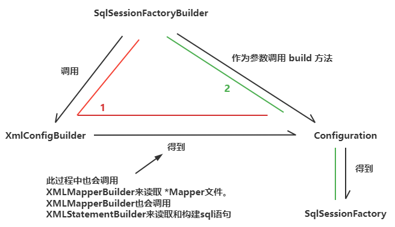
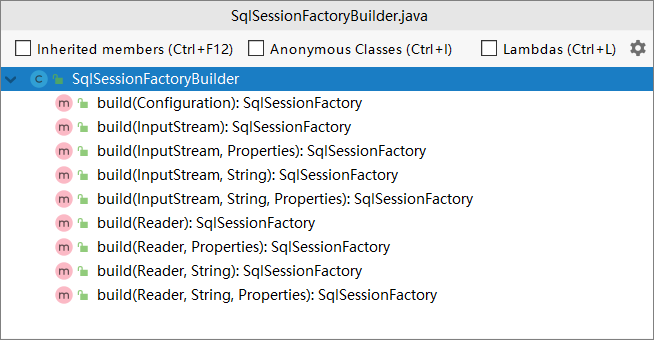

> 第十一部分 设计模式

虽然我们都知道有 3 类 23 种设计模式，但是大多停留在概念层面，Mybatis 源码种使用了大量的设计模式，观察设计模式在其中的应用，能够更深入的理解设计模式。

Mybatis至少用到了以下的设计模式：

| 模式         | Mybatis 体现                                                 |
| ------------ | ------------------------------------------------------------ |
| Builder模式  | 例如 SqlSessionFactoryBuilder、Environment                   |
| 工厂方法模式 | 例如 SqlSessionFactory，TransactionFactory，LogFactory       |
| 单例模式     | 例如 ErrorContext 和 LogFactory                              |
| 代理模式     | Mybatis实现的核心，比如 MapperProxy、ConnectionLogger，<br>用的 jdk 的动态代理还有 executor.loader 包 使用了 cglib <br>或者 javassist 达到延迟加载的效果 |
| 组合模式     | 例如 SqlNode 和 各个子类 ChooseSqlNode 等                    |
| 模板方法模式 | 例如 BaseExecutor 和 SimpleExecutor，还有 BaseTypeHandler <br>和 所有的子类例如 IntegerTypeHandler |
| 适配器模式   | 例如 Log 的 Mybatis 接口和它对 jdbc、log4j 等各种日志框架的适配实现 |
| 装饰者模式   | 例如 Cache 包中的 cache.decorators 子包中的各种装饰者的实现  |
| 迭代器模式   | 例如迭代器模式 PropertyTokenizer                             |

接下来对 Builder 构建者模式、工厂模式、代理模式 进行解读，先介绍模式自身的知识，然后解读在 Mybatis 中怎样应用了该模式。

# 1 Builder 构建者模式

Builder 模式的定义是 **将一个复杂对象的构建与它的表示分离，使得同样的构建过程可以创建不同的表示**。它属于创建类模式，一般来说，如果一个对象的构建比较复杂，超出了构造函数所能包含的范围，就可以使用工厂模式和Builder模式，相对于工厂模式会产生一个完整的产品，Builder应用于更加复杂的对象的构建，甚至只会构建产品的一个部分，直白来说，就是使用多个简单的对象一步一步构建成一个复杂的对象

例子：使用构建者实际模式来生产 Hero

主要步骤：

1. 将需要构建的目标类分成多个部件（电脑可以分为主机、显示器、键盘、音箱等部件）
2. 创建构建类
3. 一次创建部件
4. 将部件组装成目标对象

实现：

```java
package builder;

/**
 * Builder设计模式
 */
public class Hero {
    private String name;
    private String skill;
    private String armor;
    private String weapon;

    private Hero(Builder builder) {
        this.name = builder.name;
        this.skill = builder.skill;
        this.armor = builder.armor;
        this.weapon = builder.weapon;
    }
    public static Builder builder(){
        return new Builder();
    }

    @Override
    public String toString() {
        return "Hero{" +
                "name='" + name + '\'' +
                ", skill='" + skill + '\'' +
                ", armor='" + armor + '\'' +
                ", weapon='" + weapon + '\'' +
                '}';
    }

    public static class Builder{
        private String name;
        private String skill;
        private String armor;
        private String weapon;

        public Builder() {
        }
        public Builder withName(String name){
            this.name = name;
            return this;
        }
        public Builder withSkill(String skill){
            this.skill = skill;
            return this;
        }
        public Builder withArmor(String armor){
            this.armor = armor;
            return this;
        }
        public Builder withWeapon(String weapon){
            this.weapon = weapon;
            return this;
        }
        public Hero build(){
            return new Hero(this);
        }

    }
}
```

调用

```java
public static void main(String[] args) {
    Hero hero = Hero.builder()
        .withName("taylor")
        .withSkill("style")
        .withArmor("armor1")
        .withWeapon("weapon1").build();
    System.out.println(hero);
}
```

**Mybatis中的体现**

SqlSessionFactory 的构建过程：

Mybatis的初始化工作非常复杂，不是只用哟个构造函数就能搞定的。所以是用来建造者模式，使用了大量的Builder，进行分层构造，核心对象 Configuration使用了 XMLConfigBuilder 来进行构造。



在 Mybatis 环境的初始化过程中，SqlSessionFactoryBuilder 会调用 XMLConfigBuilder 读取所有的 MybatisMapConfig.xml 和所有的 **Mapper.xml 文件，构建 Mybatis 运行的核心对象 Configuration 对象，然后将该Configuration对象作为参数构建一个SqlSessionFactory对象。

```java
private void parseConfiguration(XNode root) {
    try {
        //issue #117 read properties first
        // 解析 <properties/> 标签
        propertiesElement(root.evalNode("properties"));
        // 解析 <settings/> 标签
        Properties settings = settingsAsProperties(root.evalNode("settings"));
        // 加载自定义的 VFS 实现类
        loadCustomVfs(settings);
        loadCustomLogImpl(settings);
        // 解析 <typeAliases/> 标签
        typeAliasesElement(root.evalNode("typeAliases"));
        // 解析 <plugins/> 标签
        pluginElement(root.evalNode("plugins"));
        // 解析 <objectFactory/> 标签
        objectFactoryElement(root.evalNode("objectFactory"));
        // 解析 <objectWrapperFactory/> 标签
        objectWrapperFactoryElement(root.evalNode("objectWrapperFactory"));
        // 解析 <reflectorFactory/> 标签
        reflectorFactoryElement(root.evalNode("reflectorFactory"));
        // 赋值 <settings/> 至 Configuration 属性
        settingsElement(settings);
        // read it after objectFactory and objectWrapperFactory issue #631
        // 解析 <environments/> 标签
        environmentsElement(root.evalNode("environments"));
        // 解析 <databaseIdProvider/> 标签
        databaseIdProviderElement(root.evalNode("databaseIdProvider"));
        // 解析 <typeHandlers/> 标签
        typeHandlerElement(root.evalNode("typeHandlers"));
        // 解析 <mappers/> 标签
        mapperElement(root.evalNode("mappers"));
    } catch (Exception e) {
        throw new BuilderException("Error parsing SQL Mapper Configuration. Cause: " + e, e);
    }
}
```

其中 XMLConfigBuilder  在构建 Configuration 对象时，也会调用 XMLMapperBuilder 用于读取 **Mapper 文件，而 XMLMapperBuilder 会使用 XMLStatementBuilder 来读取和 build 所有的 SQL 语句。

```java
// 解析 <mappers/> 标签
mapperElement(root.evalNode("mappers"));
```

在这个过程中，有一个相似的特点，就是这些 Builder会读取文件或者配置，然后做大量的 XpathParser 解析、配置或语法的解析、反射生成对象，存入结果缓存等步骤，这么多的工作都不是一个构造函数所能包括的，因此大量采用了 Builder 模式来接解决



SqlSessionFactoryBuilder 类根据不同的输入参数来构建 SqlSessionFactory 这个工厂对象。

# 2 工厂模式

在 Mybatis 中比如 SqlSessionFactory 使用的是工厂模式，该工厂没有那么复杂的逻辑，是一个简单工厂模式。

简单工厂模式（Simple Factory Pattern）：又称为静态工厂方法（Static Factory Method）模式，它属于创建型模式。

在简单工厂模式中，可以根据参数的不同返回不同类的实例。简单工厂模式专门定义一个类来负责创建其他类的实例，被创建的实例通常都具有共同的父类。

# 3 代理模式

代理模式（Proxy Pattern）：给某一个对象提供一个代理，并由代理对象控制对原对象的引用。代理模式的英文叫做 Proxy，它是一种对象结构型模式，代理模式分为静态代理和动态代理，我们来介绍动态代理：

举例：创建一个抽象类，Person接口，使用拥有一个没有返回值的 doSomething 方法

