> 第十二部分 Mybatis源码环境构建

# 1 源码下载

注意：

Mybatis源码还依赖于一个父工程 mybatis-parent，因此需要一起下载，并且需要注意 mybatis 中引入的 mybatis-parent 的版本要和自己下载的mybatis-parent 的版本一致。

[mybatis-3.5.3 源码地址](https://github.com/mybatis/mybatis-3/tree/mybatis-3.5.3)

https://github.com/mybatis/mybatis-3/releases/tag/mybatis-3.5.3

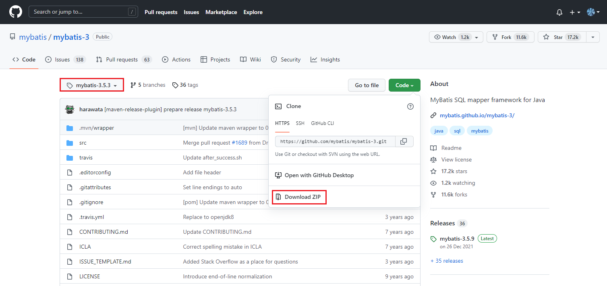

其中对应的 mybatis-parent的版本 

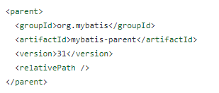

[mybatis-parent 源码地址](https://github.com/mybatis/parent/releases/tag/mybatis-parent-31)

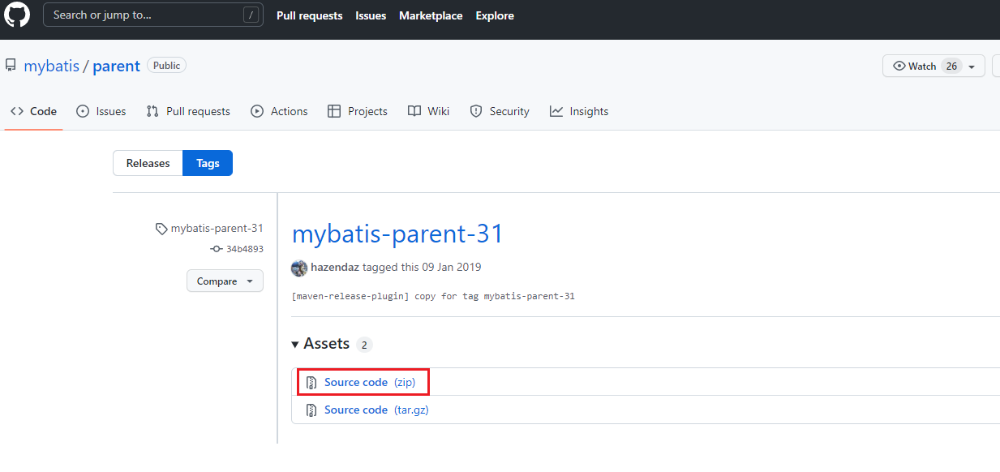

# 2 将源码安装到本地仓库中

## 2.1 mybatis-parent

切换到 parent-mybatis-parent-31 目录下

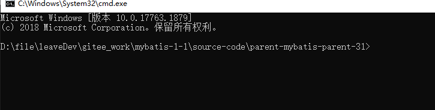

```bash
执行命令：mvn clean install -Dmaven.test.skip=true
看到 BUILD SUCCESS 代表 install 成功
```

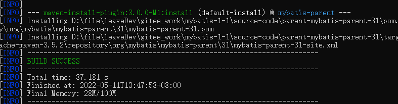


## 2.2 mybatis

切换到 mybatis-3-mybatis-3.5.3 目录下

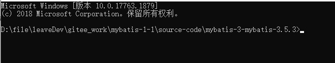

```bash
执行命令：mvn clean install -Dmaven.test.skip=true
看到 BUILD SUCCESS 代表 install 成功
```

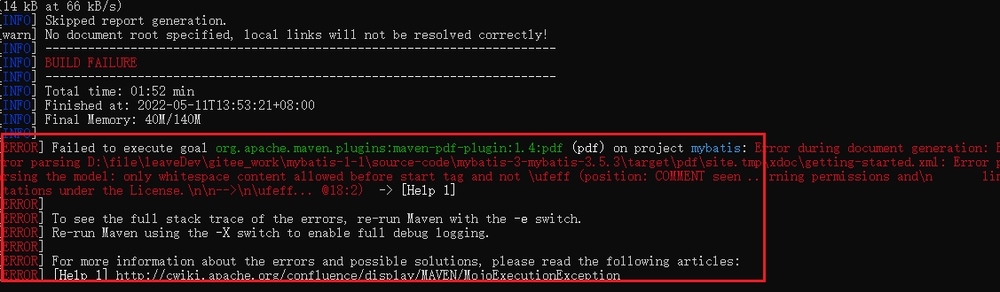

报错 pdf 插件的问题

```bash
打开pom.xml 文件注释掉 maven-pdf-plugin 插件（可以选择把项目导入到idea中进行相关内容的删除，或者直接使用文本编辑工具进行删除）
```

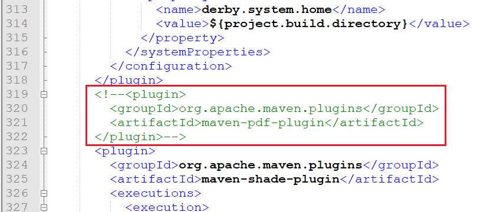

重新 install 

```bash
此时再次install，看到BUILD SUCCESS  代表install成功
```

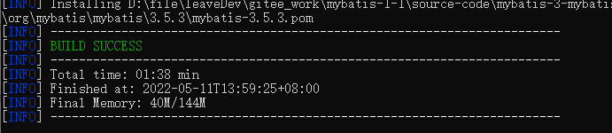

# 3 将 mybatis-parent 和 mybatis 导入 idea

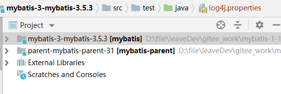

# 4 测试

在 mybatis 的 test 中增加如下代码：

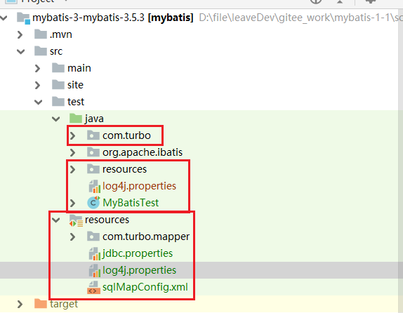

运行测试，

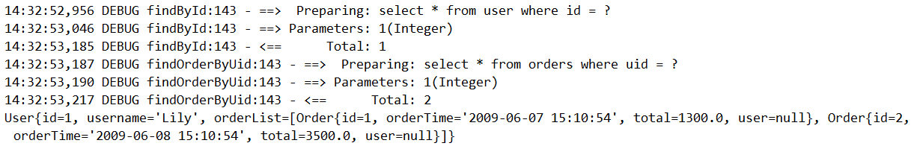

