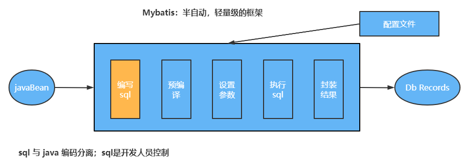

> 第二部分 Mybatis相关概念

# 1 对象/关系数据库映射（ORM）

ORM 全称 Object/Relation Mapping：表示对象 - 关系映射的缩写

ORM 完成面向对象编程语言关系 到 数据库的映射。当 ORM 框架完成映射后，程序员既可以利用面向对象程序设计语言的简单易用性，又可以利用关系数据库的技术优势。

ORM 把关系数据库包装成面向对象的模型。ORM框架是面向对象设计语言与关系数据库发展不同步时的中间解决方案，采用 ORM 框架后，应用程序不再直接访问底层数据库，而是以面向对象的方式来操作持久化对象。而 ORM 框架则将这些面向对象的操作转换成底层 SQL 操作。

ORM 框架实现的效果：把对持久化对象的保存、修改、删除等操作、转换为对数据库的操作。

# 2 Mybatis简介

[Mybatis官网](https://mybatis.org/mybatis-3/zh/index.html)

Mybatis 是一款优秀的基于 ORM 的**半自动**轻量级持久层框架，它支持定制化 SQL，存储过程以及高级映射。Mybatis避免了几乎所有的JDBC代码和手动设置参数 以及 获取结果集。Mybatis 可以使用简单的 XML 或 注解 来配置和映射原生类型、接口 和 Java 的 POJO（Plain Old Java Objects，普通老式 Java 对象）为数据库中的记录。

# 3 Mybatis历史

原是 apache 的一个开源项目 iBatus，2010年6月这个项目由 apache software foundation 迁移到了 google code，随着开发团队转投 Google Code 旗下，ibatis 3.x 正式更名为 Mybatis，代码于 2013 年 11月迁移到 GitHub。

ibatis 一词来源于 “internel” 和 “abatis” 的组合，是一个基于 Java 的持久层框架。iBATIS 提供的持久层框架包括 SQL Maps 和 Data Access Objects（Dao）。

# 4 Mybatis优势

Mybatis 是一个半自动的持久层框架，对开发人员来说，核心 sql 还是需要自己进行优化，sql 和 java 编码分离，功能边界清晰，一个专注业务，一个专注数据。

分析图示如下：

