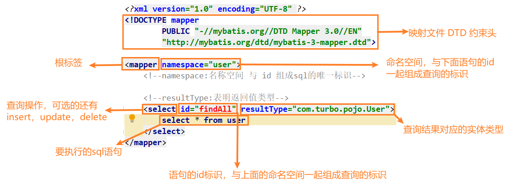
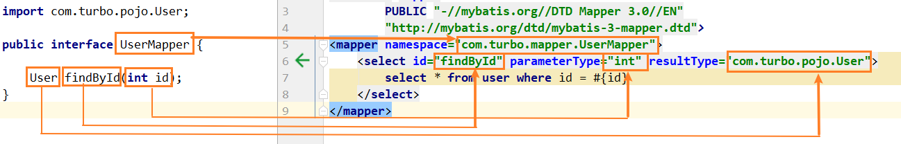

> 第三部分 Mybatis基本应用

# 1 快速入门

[Mybatis 官网](https://mybatis.org/mybatis-3/)


## 1.1 开发步骤

1. 添加 Mybatis 的坐标
2. 创建 user 数据表
3. 编写User实体类
4. 编写映射文件 UserMapper.xml 
5. 编写核心文件 SqlMapConfig.xml
6. 编写测试类

## 1.2 环境搭建

[mybatis-quickStart gitee代码地址](https://gitee.com/turboYuu/mybatis-1-1/tree/master/lab-mybatis/mybatis-quickStart)


1. 导入 Mybatis的坐标和其他相关坐标

   ```xml
   <properties>
       <project.build.sourceEncoding>UTF-8</project.build.sourceEncoding>
       <maven.compiler.encoding>UTF-8</maven.compiler.encoding>
       <java.version>1.8</java.version>
       <maven.compiler.source>1.8</maven.compiler.source>
       <maven.compiler.target>1.8</maven.compiler.target>
   </properties>
   
   <dependencies>
       <!--mybatis坐标-->
       <dependency>
           <groupId>org.mybatis</groupId>
           <artifactId>mybatis</artifactId>
           <version>3.4.5</version>
       </dependency>
       <!--mysql驱动坐标-->
       <dependency>
           <groupId>mysql</groupId>
           <artifactId>mysql-connector-java</artifactId>
           <version>5.1.46</version>
       </dependency>
       <!--单元测试坐标-->
       <dependency>
           <groupId>junit</groupId>
           <artifactId>junit</artifactId>
           <version>4.13.2</version>
       </dependency>
   </dependencies>
   ```

   

2. 创建user数据表

   

3. 编写User实体

   ```java
   package com.turbo.pojo;
   
   public class User {
   
       private Integer id;
   
       private String username;
   
       private String password;
   
       public Integer getId() {
           return id;
       }
   
       public void setId(Integer id) {
           this.id = id;
       }
   
       public String getUsername() {
           return username;
       }
   
       public void setUsername(String username) {
           this.username = username;
       }
   
       public String getPassword() {
           return password;
       }
   
       public void setPassword(String password) {
           this.password = password;
       }
   
       @Override
       public String toString() {
           return "User{" +
                   "id=" + id +
                   ", username='" + username + '\'' +
                   ", password='" + password + '\'' +
                   '}';
       }
   }
   
   ```

   

4. 编写UserMapper映射文件

   ```xml
   <?xml version="1.0" encoding="UTF-8" ?>
   <!DOCTYPE mapper
           PUBLIC "-//mybatis.org//DTD Mapper 3.0//EN"
           "http://mybatis.org/dtd/mybatis-3-mapper.dtd">
   
   <mapper namespace="user">
       <!--namespace:名称空间 与 id 组成sql的唯一标识-->
   
       <!--resultType:表明返回值类型-->
       <select id="findAll" resultType="com.turbo.pojo.User">
           select * from user
       </select>
   </mapper>
   ```

   

5. 编写Mybatis核心文件

   ```xml
   <?xml version="1.0" encoding="UTF-8" ?>
   <!DOCTYPE configuration
           PUBLIC "-//mybatis.org//DTD Config 3.0//EN"
           "http://mybatis.org/dtd/mybatis-3-config.dtd">
   <configuration>
   
       <!--environments：运行环境-->
       <environments default="development">
           <environment id="development">
               <!--表示当前事务交由JDBC进行管理-->
               <transactionManager type="JDBC"></transactionManager>
               <!--当前使用mybatis提供的连接池-->
               <dataSource type="POOLED">
                   <property name="driver" value="com.mysql.jdbc.Driver"/>
                   <property name="url" value="jdbc:mysql://152.136.177.192:3306/turbine"/>
                   <property name="username" value="root"/>
                   <property name="password" value="123456"/>
               </dataSource>
           </environment>
       </environments>
   
       <!--引入映射配置文件-->
       <mappers>
           <mapper resource="UserMapper.xml"></mapper>
       </mappers>
       
   </configuration>
   ```

6. 编写测试代码

   ```java
   package com.turbo.test;
   
   import com.turbo.pojo.User;
   import org.apache.ibatis.io.Resources;
   import org.apache.ibatis.session.SqlSession;
   import org.apache.ibatis.session.SqlSessionFactory;
   import org.apache.ibatis.session.SqlSessionFactoryBuilder;
   import org.junit.Test;
   
   import java.io.IOException;
   import java.io.InputStream;
   import java.util.List;
   
   public class MybatisTest {
   
       @Test
       public void test1() throws IOException {
           InputStream resourceAsStream = Resources.getResourceAsStream("SqlMapConfig.xml");
           SqlSessionFactory sqlSessionFactory = new SqlSessionFactoryBuilder().build(resourceAsStream);
           SqlSession sqlSession = sqlSessionFactory.openSession();
   
           List<User> list = sqlSession.selectList("user.findAll");
           System.out.println(list);
           sqlSession.close();
       }
   }
   ```


## 1.3 Mybatis 的插入操作

1. 编写UserMapper映射文件

   ```xml
   <insert id="add" parameterType="com.turbo.pojo.User">
       insert into user values (#{id},#{username},#{password})
   </insert>
   ```

   

2. 编写插入实体 User 的代码

   ```java
   @Test
   public void addTest() throws IOException {
       InputStream resourceAsStream = Resources.getResourceAsStream("SqlMapConfig.xml");
       SqlSessionFactory sqlSessionFactory = new SqlSessionFactoryBuilder().build(resourceAsStream);
       SqlSession sqlSession = sqlSessionFactory.openSession();
       User user = new User();
       user.setUsername("gaowuren");
       user.setPassword("123456");
       int insert = sqlSession.insert("user.add", user);
       System.out.println(insert);
       sqlSession.commit();
       sqlSession.close();
   }
   ```

   

3. 插入操作注意问题

   - 插入语句使用insert标签
   - 在映射文件中使用 parameterType属性指定要插入的数据类型
   - sql语句中使用 #{实体属性名} 方式引用实体中的属性值
   - 插入操作使用的是 API 是 sqlSession.insert("命名空间.id", "实体对象")
   - 插入操作涉及数据库数据变化，所以要使用 sqlSession 对象显示的提交事务，即 sqlSession.commit()


## 1.4 Mybatis 的修改数据操作

1. 编写UserMapper映射文件

   ```xml
   <update id="update" parameterType="com.turbo.pojo.User">
       update user set username=#{username},password=#{password} where id=#{id}
   </update>
   ```

2. 编写修改实体User的代码

   ```java
   @Test
   public void updateTest() throws IOException {
       InputStream resourceAsStream = Resources.getResourceAsStream("SqlMapConfig.xml");
       SqlSessionFactory sqlSessionFactory = new SqlSessionFactoryBuilder().build(resourceAsStream);
       SqlSession sqlSession = sqlSessionFactory.openSession();
       User user = new User();
       user.setId(3);
       user.setUsername("erwo");
       user.setPassword("123456");
       int update = sqlSession.update("user.update", user);
       System.out.println(update);
       sqlSession.commit();
       sqlSession.close();
   }
   ```

3. 修改操作注意问题

   - 修改语句使用 update 标签
   - 修改操作使用的API是 sqlSession.update("命名空间.id", "实体对象");


## 1.5 Mybatis的删除操作

1. 编写 UserMapper 映射文件

   ```xml
   <delete id="delete" parameterType="java.lang.Integer">
       delete from user where id = #{id}
   </delete>
   ```

2. 编写删除数据的代码

   ```java
   @Test
   public void deleteTest() throws IOException {
       InputStream resourceAsStream = Resources.getResourceAsStream("SqlMapConfig.xml");
       SqlSessionFactory sqlSessionFactory = new SqlSessionFactoryBuilder().build(resourceAsStream);
       SqlSession sqlSession = sqlSessionFactory.openSession();
       int delete = sqlSession.delete("user.delete", 3);
       System.out.println(delete);
       sqlSession.commit();
       sqlSession.close();
   }
   ```

3. 删除操作注意问题

   - 删除语句使用 delete 标签
   - sql 语句中使用 #{任意字符串} 方式引用传递的单个参数
   - 删除操作使用的 API 是 sqlSession.delete(命名空间.id", Object);

## 1.6 Mybatis 的映射文件概述



## 1.7 入门核心配置文件分析

[Mybatis 核心配置文件层级关系](https://mybatis.org/mybatis-3/zh/configuration.html)：


**Mybatis常用配置解析**

### 1.7.1 environments 标签

数据库环境的配置，支持多环境配置


其中，**事务管理器（transactionManager）**类型有两种：

- JDBC：这个配置就是直接使用了 JDBC 的提交和回滚设置，它依赖于从数据源得到的连接来管理事务作用域。
- MANAGED：这个配置几乎没做什么。它从不提交或回滚一个连接，而是让容器来管理事务的整个生命周期（比如 JEE 应用服务器的上下文）。默认情况下它会关闭连接，然而一些容器并不希望连接被关闭，因此需要将closeConnection 属性设置为 false 来阻止默认的关闭行为。

**数据源（dataSource）类型有三种**：

- UNPOOLED：这个数据源的实现只是每次被请求时打开和关闭连接。
- POOLED：这种数据源的实现利用 "池" 的概念将 JDBC 连接对象组织起来。
- JNDI：这个数据源的实现就是为了能在如 EJB 或应用服务器这类容器中使用，容器可以集中或在外部配置数据源，然后放置一个JNDI上下文的引用。

### 1.7.2 mappers 映射器

[加载映射文件](https://mybatis.org/mybatis-3/zh/configuration.html#mappers)的方式：

```xml
<!-- 使用相对于类路径的资源引用 -->
<mappers>
  <mapper resource="org/mybatis/builder/AuthorMapper.xml"/>
  <mapper resource="org/mybatis/builder/BlogMapper.xml"/>
  <mapper resource="org/mybatis/builder/PostMapper.xml"/>
</mappers>

<!-- 使用完全限定资源定位符（URL） -->
<mappers>
  <mapper url="file:///var/mappers/AuthorMapper.xml"/>
  <mapper url="file:///var/mappers/BlogMapper.xml"/>
  <mapper url="file:///var/mappers/PostMapper.xml"/>
</mappers>

<!-- 使用映射器接口实现类的完全限定类名 -->
<mappers>
  <mapper class="org.mybatis.builder.AuthorMapper"/>
  <mapper class="org.mybatis.builder.BlogMapper"/>
  <mapper class="org.mybatis.builder.PostMapper"/>
</mappers>

<!-- 将包内的映射器接口实现全部注册为映射器 -->
<mappers>
  <package name="org.mybatis.builder"/>
</mappers>
```


## 1.8 Mybatis 相应 API 介绍

### 1.8.1 SqlSession 工厂构建器 SqlSessionFactoryBuilder

常用 API：SqlSessionFactory build(InputStream inputStream)

通过加载 mybatis 的核心文件的输入流的形式构建一个 SqlSessionFactory 对象

```java
InputStream resourceAsStream = Resources.getResourceAsStream("SqlMapConfig.xml");
SqlSessionFactory sqlSessionFactory = new SqlSessionFactoryBuilder()
    .build(resourceAsStream);
```

其中，Resources工具类，这个类在 org.apache.ibatis.io 包中。Resources 类帮助从类路径下、文件系统 或 一个 web URL 中加载资源文件。

### 1.8.2 SqlSession 工厂对象 SqlSessionFactory

SqlSessionFactory 有多个方法创建 SqlSession 实例。常用的有如下两个：

| 方法                             | 解释                                                         |
| -------------------------------- | ------------------------------------------------------------ |
| openSession();                   | 会默认开启一个事务，但事务不会自动提交，也就意味着需要手动提交该事务，更新操作数据才会持久化到数据库中 |
| openSession(boolean autoCommit); | 参数为是否自动提交，如果设置为true，那么不需要手动提交事务   |

### 1.8.3 SqlSession 会话对象

SqlSession 实例在 Mybatis 中是非常强大的一个类。在这里你会看到所有执行语句，提交或回滚事务 和 获取映射器实例的方法。

执行语句的方法主要有：

```java
<T> T selectOne(String statement, Object parameter);
<E> List<E> selectList(String statement, Object parameter);
int insert(String statement, Object parameter);
int update(String statement, Object parameter);
int delete(String statement, Object parameter);
```

操作事务的方法主要有：

```java
void commit();
void rollback();
```

# 2 Mybatis 的 Dao 层实现

## 2.1 传统开发方式

编写 UserDao 接口

```java
public interface UserDao {
    public List<User> findAll() throws IOException;
}
```

编写 UserDaoImpl 实现

```java
public class UserDaoImpl implements UserDao {
    @Override
    public List<User> findAll() throws IOException {
        InputStream resourceAsStream = Resources
            .getResourceAsStream("SqlMapConfig.xml");
        SqlSessionFactory sqlSessionFactory = new SqlSessionFactoryBuilder()
            .build(resourceAsStream);
        SqlSession sqlSession = sqlSessionFactory.openSession();
        List<User> list = sqlSession.selectList("user.findAll");
        sqlSession.close();
        return list;
    }
}
```

测试传统方式

```java
@Test
public void testTraditionDao() throws IOException {
    UserDaoImpl userDao = new UserDaoImpl();
    List<User> all = userDao.findAll();
    System.out.println(all);
}
```


## 2.2 代理开发方式

代理开发方式介绍

采用 Mybatis 的代理开发方式实现 DAO 层的开发。

Mapper 接口开发方法只需要程序员编写 Mapper 接口（相当于 Dao 接口），由 Mybatis 框架根据接口定义创建动态代理对象，代理对象的方法体同上边 Dao 接口实现类方法。

Mapper 接口开发需要遵循以下规范：

1. Mapper.xml 文件中的 namespace 与 mapper 接口的全限定名相同
2. Mapper 接口方法名 和 Mapper.xml 中定义的每个 statement 的 id 相同
3. Mapper 接口方法的输入参数类型 和 Mapper.xml 中定义的每个 sql 的 parameterType 的类型相同
4. Mapper 接口方法的输出参数类型 和 mapper.xml 中定义的每个 sql 的 resultType 的类型相同


编写 UserMapper 接口



测试代理方式

```java
@Test
public void testProxyDao() throws IOException {
    InputStream resourceAsStream = Resources
        .getResourceAsStream("SqlMapConfig.xml");
    SqlSessionFactory sqlSessionFactory = new SqlSessionFactoryBuilder()
        .build(resourceAsStream);
    SqlSession sqlSession = sqlSessionFactory.openSession();
    UserMapper userMapper = sqlSession.getMapper(UserMapper.class);
    User user = userMapper.findById(1);
    System.out.println(user);
    sqlSession.close();
}
```