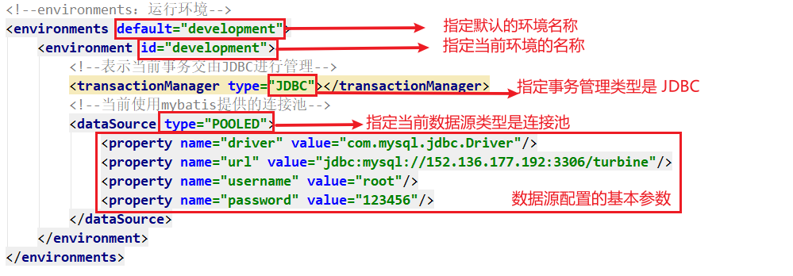

> 第四部分 Mybatis配置文件深入

# 1 Mybatis 核心配置文件层级关系

## 1.1 Mybatis 核心配置文件层级关系

[Mybatis 核心配置文件层级关系](https://mybatis.org/mybatis-3/zh/configuration.html)：


## 1.2 Mybatis 常用配置解析

### 1.2.1 environments 标签

数据库环境的配置，支持多环境配置



其中，**事务管理器（transactionManager）**类型有两种：

- JDBC：这个配置就是直接使用了 JDBC 的提交和回滚设置，它依赖于从数据源得到的连接来管理事务作用域。
- MANAGED：这个配置几乎没做什么。它从不提交或回滚一个连接，而是让容器来管理事务的整个生命周期（比如 JEE 应用服务器的上下文）。默认情况下它会关闭连接，然而一些容器并不希望连接被关闭，因此需要将closeConnection 属性设置为 false 来阻止默认的关闭行为。

**数据源（dataSource）类型有三种**：

- UNPOOLED：这个数据源的实现只是每次被请求时打开和关闭连接。
- POOLED：这种数据源的实现利用 "池" 的概念将 JDBC 连接对象组织起来。
- JNDI：这个数据源的实现就是为了能在如 EJB 或应用服务器这类容器中使用，容器可以集中或在外部配置数据源，然后放置一个JNDI上下文的引用。


### 1.2.2 mappers 映射器

[加载映射文件](https://mybatis.org/mybatis-3/zh/configuration.html#mappers)的方式：

```xml
<!-- 使用相对于类路径的资源引用 -->
<mappers>
  <mapper resource="org/mybatis/builder/AuthorMapper.xml"/>
  <mapper resource="org/mybatis/builder/BlogMapper.xml"/>
  <mapper resource="org/mybatis/builder/PostMapper.xml"/>
</mappers>

<!-- 使用完全限定资源定位符（URL） -->
<mappers>
  <mapper url="file:///var/mappers/AuthorMapper.xml"/>
  <mapper url="file:///var/mappers/BlogMapper.xml"/>
  <mapper url="file:///var/mappers/PostMapper.xml"/>
</mappers>

<!-- 使用映射器接口实现类的完全限定类名 -->
<mappers>
  <mapper class="org.mybatis.builder.AuthorMapper"/>
  <mapper class="org.mybatis.builder.BlogMapper"/>
  <mapper class="org.mybatis.builder.PostMapper"/>
</mappers>

<!-- 将包内的映射器接口实现全部注册为映射器 -->
<mappers>
  <package name="org.mybatis.builder"/>
</mappers>
```

### 1.2.3 properties 标签

实际开发中，习惯将数据源的配置信息单独抽取成一个 properties 文件，该标签可以加载额外配置的 properties 文件。


### 1.2.4 typeAliases 标签

类型别名是为 Java 类型设置一个短的名字。原来的类型名称配置如下


配置 typeAliases ，为 com.turbo.pojo.User 定义别名为 user


上面我们是自定义的别名，Mybatis 框架已经为我们设置好的一些常用的类型别名：[Mybatis官网参考 typeAliases 常用别名](https://mybatis.org/mybatis-3/zh/configuration.html#typeAliases)。

# 2 映射配置文件mapper.xml

[XML 映射器 - Mybatis 官网参考](https://mybatis.org/mybatis-3/zh/sqlmap-xml.html)

[动态 SQL - Mybatis 官网参考](https://mybatis.org/mybatis-3/zh/dynamic-sql.html)


## 2.1 if

```xml
<select id="findByCondition" resultType="user" parameterType="user">
    select * from user
    <where>
        <if test="id!=0">
            and id=#{id}
        </if>
        <if test="username!=null">
            and username = #{username}
        </if>
    </where>
</select>
```

当查询条件 id 和 username 都存在时，控制台打印的 sql 语句如下：

```java
// 获得 Mybatis 框架生成的 UserMapper 接口的实现类
UserMapper userMapper = sqlSession.getMapper(UserMapper.class);

User user1 = new User();
user1.setId(1);
user1.setUsername("Lily");
List<User> byCondition = userMapper.findByCondition(user1);
```


当查询条件只有 id 存在时，控制台打印的 sql 语句如下：

```java
// 获得 Mybatis 框架生成的 UserMapper 接口的实现类
UserMapper userMapper = sqlSession.getMapper(UserMapper.class);

User user1 = new User();
user1.setId(1);
List<User> byCondition = userMapper.findByCondition(user1);
```


## 2.2 foreach

循环执行sql的拼接操作，例如 ：SELECT * FROM USER WHERE id IN (1,2,5)。

```xml
<select id="findByIds" resultType="user" parameterType="list">
    select * from user
    <where>
        <foreach collection="list" open="id in (" close=")" item="id" separator=",">
            #{id}
        </foreach>
    </where>
</select>
```

测试代码片段：

```java
// 获得 Mybatis 框架生成的 UserMapper 接口的实现类
UserMapper userMapper = sqlSession.getMapper(UserMapper.class);
Integer[] ids = new Integer[]{1,2};
List<User> byIds = userMapper.findByIds(Arrays.asList(ids));
```


foreach 标签的属性含义如下：<br>标签用于遍历集合，它的属性：

- collection：代表要遍历的集合元素，注意编写时不要写 #{}
- open：代表语句的开始部分
- close：代表结束部分
- item：代表编辑集合的每个元素，生成的变量名
- separator：代表分隔符


## 2.3 SQL片段抽取之 include 

sql 中可将重复的 sql 提取出来，使用时用 include 引用即可，最终达到 sql 重用的目的

```xml
<sql id="selectUser">select * from user</sql>
<select id="findById" parameterType="int" resultType="user">
    <include refid="selectUser"></include> where id = #{id}
</select>
<select id="findByCondition" resultType="user" parameterType="user">
    <include refid="selectUser"></include>
    <where>
        <if test="id!=0">
            and id=#{id}
        </if>
        <if test="username!=null">
            and username = #{username}
        </if>
    </where>
</select>
<select id="findByIds" resultType="user" parameterType="list">
    <include refid="selectUser"></include>
    <where>
        <foreach collection="list" open="id in (" close=")" item="id" separator=",">
            #{id}
        </foreach>
    </where>
</select>
```