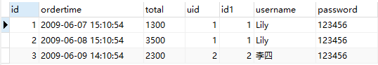
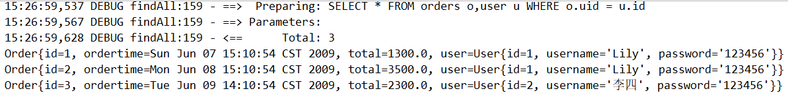
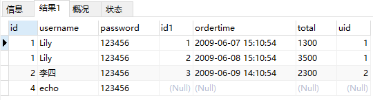
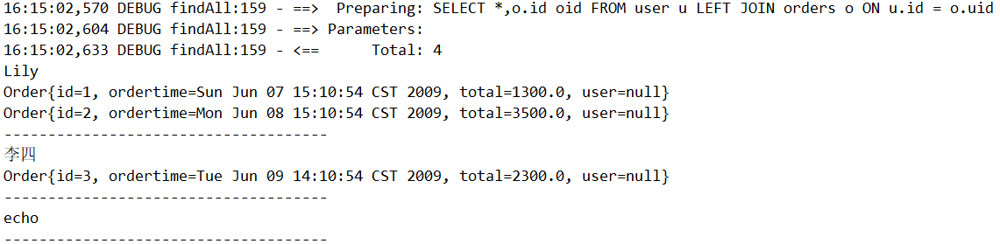
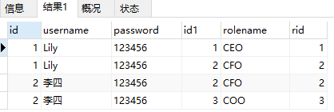
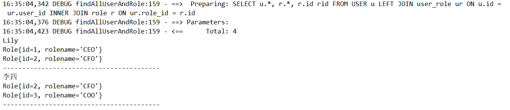

> 第五部分 Mybatis复杂映射开发

将 mybatis-quickStart 复制整理 成 [mybatis-multitable](https://gitee.com/turboYuu/mybatis-1-1/tree/master/lab-mybatis/mybatis-multitable) 项目

# 1 一对一查询

## 1.1 一对一查询的模型

用户表和订单表的关系为，一个用户有多个订单，一个订单只从属于一个用户。

一对一查询的需求：查询一个订单，与此同时查询出该订单所属的用户

## 1.2 一对一查询的语句

对用的 sql 语句：SELECT * FROM orders o ,user u WHERE o.uid = u.id;

查询结果如下：



## 1.3 创建 Order 和 User 实体

```java
public class Order {
    private int id;
    private Date ordertime;
    private double total;

    // 代表当前订单从属于哪一个客户
    private User user;
}

public class User {

    private Integer id;
    private String username;
    private String password;
}
```

## 1.4 创建 OrderMapper 接口

```java
public interface OrderMapper {
    public List<Order> findAll();
}
```

## 1.5 配置 OrderMapper.xml

```xml
<?xml version="1.0" encoding="UTF-8" ?>
<!DOCTYPE mapper
        PUBLIC "-//mybatis.org//DTD Mapper 3.0//EN"
        "http://mybatis.org/dtd/mybatis-3-mapper.dtd">
<mapper namespace="com.turbo.mapper.OrderMapper">
    <resultMap id="orderMap" type="com.turbo.pojo.Order">
        <result column="uid" property="user.id"></result>
        <result column="username" property="user.username"></result>
        <result column="password" property="user.password"></result>
    </resultMap>
    <select id="findAll" resultMap="orderMap">
        SELECT * FROM orders o,user u WHERE o.uid = u.id
    </select>
</mapper>
```

其中还可以配置如下：

```xml
<resultMap id="orderMap" type="com.turbo.pojo.Order">
    <result column="id" property="id"></result>
    <result column="ordertime" property="ordertime"></result>
    <result column="total" property="total"></result>
    <association property="user" javaType="com.turbo.pojo.User">
        <result column="uid" property="id"></result>
        <result column="username" property="username"></result>
        <result column="password" property="password"></result>
    </association>
</resultMap>
<select id="findAll" resultMap="orderMap">
    SELECT * FROM orders o,user u WHERE o.uid = u.id
</select>
```


## 1.6 测试结果

```java
// 获得 Mybatis 框架生成的 UserMapper 接口的实现类
OrderMapper orderMapper = sqlSession.getMapper(OrderMapper.class);
List<Order> orderList = orderMapper.findAll();
for (Order order : orderList) {
    System.out.println(order);
}
```



# 2 一对多查询

## 2.1 一对多查询的模型

用户和订单表单关系为：一个用户有多个订单，一个订单只从属于一个用户

一对多查询的需求：查询一个用户，与此同时查询出该用户具有的订单

## 2.2 一对多查询的语句

对应的sql语句：SELECT *,o.id oid FROM user u LEFT JOIN orders o ON u.id = o.uid

查询结果如下：



## 2.3 修改 User 实体

```java
public class Order {
    private int id;
    private Date ordertime;
    private double total;

    // 代表当前订单从属于哪一个客户
    private User user;
}

public class User {

    private Integer id;
    private String username;
    private String password;
    // 代表当前用户具备哪些订单
    private List<Order> orders;
}
```

## 2.4 创建 UserMapper 接口

```java
public interface UserMapper {
    List<User> findAll();
}
```

## 2.5 配置 UserMapper.xml

```xml
<resultMap id="user" type="com.turbo.pojo.User">
    <result column="id" property="id"></result>
    <result column="username" property="username"></result>
    <result column="password" property="password"></result>
    <collection property="orders" ofType="com.turbo.pojo.Order">
        <result column="oid" property="id"></result>
        <result column="ordertime" property="ordertime"></result>
        <result column="total" property="total"></result>
    </collection>
</resultMap>

<select id="findAll" resultMap="user">
    SELECT *,o.id oid FROM user u LEFT JOIN orders o ON u.id = o.uid
</select>
```

## 2.6 测试结果

```java
// 获得 Mybatis 框架生成的 UserMapper 接口的实现类
UserMapper userMapper = sqlSession.getMapper(UserMapper.class);
List<User> userList = userMapper.findAll();
for (User user : userList) {
    System.out.println(user.getUsername());
    List<Order> orders = user.getOrders();
    for (Order order : orders) {
        System.out.println(order);
    }
    System.out.println("-------------------------------------");
}
```




# 3 多对多查询

## 3.1 多对多查修你的模型

用户表个角色表的关系为：一个用户有多个角色，一个角色被多个用户使用

多对多查询的需求：查询用户同时查询出该用户的所有角色

## 3.2 多对多查询的语句

对应的 sql 语句：

```sql
SELECT
	u.*, r.*, r.id rid
FROM
	USER u
LEFT JOIN user_role ur ON u.id = ur.user_id
INNER JOIN role r ON ur.role_id = r.id
```

查询结果如下



## 3.3 创建 Role 实体，修改 User 实体

```java
public class User {
    private Integer id;
    private String username;
    private String password;
    // 代表当前用户具备哪些订单
    private List<Order> orders;
    // 代表当前用户具有哪些角色
    private List<Role> roles;
}

public class Role {
    private int id;
    private String rolename;
}
```

## 3.4 添加 UserMapper 接口方法

```java
List<User> findAllUserAndRole();
```

## 3.5 测试结果

```java
// 获得 Mybatis 框架生成的 UserMapper 接口的实现类
UserMapper userMapper = sqlSession.getMapper(UserMapper.class);
List<User> allUserAndRole = userMapper.findAllUserAndRole();
for (User user : allUserAndRole) {
    System.out.println(user.getUsername());
    List<Role> roles = user.getRoles();
    for (Role role : roles) {
        System.out.println(role);
    }
    System.out.println("-----------------------------------------");
}
```



# 4 知识小结

Mybatis 多表配置方式：

****