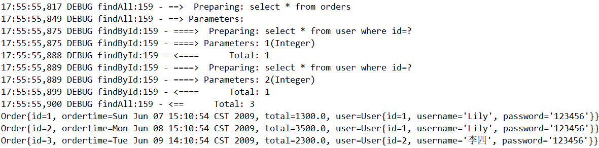
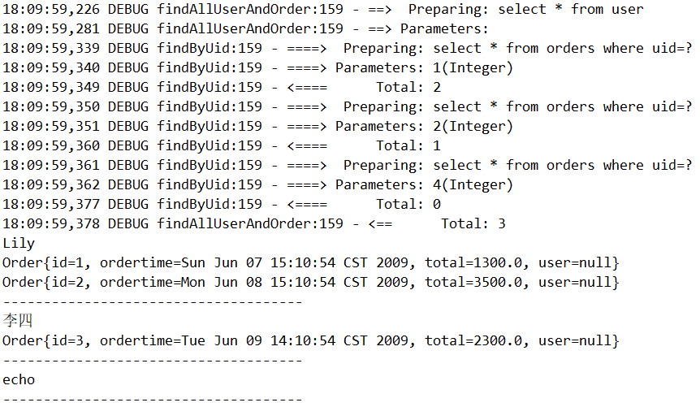
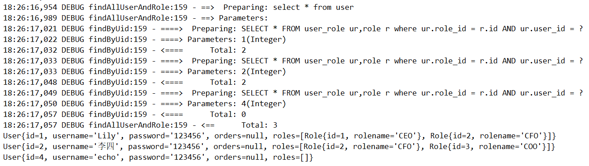

> 第六部分 Mybatis注解开发

将 mybatis-multitable 复制整理 [mybatis-multitable-anno](https://gitee.com/turboYuu/mybatis-1-1/tree/master/lab-mybatis/mybatis-multitable-anno)

# 1 Mybatis 的常用注解

注解可以减少编写 Mapper 映射文件，先学习基本 CRUD ：

```java
@Insert // 实现新增
@Update // 实现更新
@Delete // 实现删除
@Select // 实现查询
@Result // 实现结果集封装
@Results // 可以与 @Result 一起使用，封装多个结果集
@One // 实现一对一结果集封装
@Many // 实现一对多结果集封装
```

# 2 Mybatis 的增删改查

完成简单的 user 表的增删改查的操作

## 2.1 UserMapper 接口方法

```java
package com.turbo.mapper;

import com.turbo.pojo.User;
import org.apache.ibatis.annotations.Delete;
import org.apache.ibatis.annotations.Insert;
import org.apache.ibatis.annotations.Select;
import org.apache.ibatis.annotations.Update;

import java.util.List;

public interface UserMapper {


    @Insert(value = "insert into user values(#{id},#{username},#{password})")
    public void save(User user);

    @Update(value = "update user set username=#{username},password=#{password} where id=#{id}" )
    public void update(User user);

    @Select(value = "select * from user")
    public List<User> select();

    @Delete(value = "delete from user where id=#{id}")
    public void delete(Integer id);

    @Select(value = "select * from user where id=#{id}")
    public User findById(Integer id);
}
```

## 2.2 修改 Mybatis 核心配置文件

我们使用注解替代了映射文件，所以只需要加载使用了注解的 Mapper 接口即可

```xml
<mappers>
    <!--扫描使用注解的类-->
    <mapper class="com.turbo.mapper.UserMapper"></mapper>
</mappers>
```

或者指定扫描包含映射关系的接口所在的包也可以

```xml
<mappers>
    <!--扫描注解所在的包-->
    <package name="com.turbo.mapper"/>
</mappers>
```

## 2.3 测试

```java
public class MybatisTest {


    private UserMapper userMapper;

    @Before
    public void before() throws IOException {
        InputStream resourceAsStream = Resources.getResourceAsStream("SqlMapConfig.xml");
        SqlSessionFactory build = new SqlSessionFactoryBuilder()
            .build(resourceAsStream);
        // 自动提交事务
        SqlSession sqlSession = build.openSession(true);
        userMapper = sqlSession.getMapper(UserMapper.class);
    }

    @Test
    public void testSave(){
        User user = new User();
        user.setId(5);
        user.setUsername("Leno");
        user.setPassword("123456");
        userMapper.save(user);
    }


    @Test
    public void testUpdate(){
        User user = new User();
        user.setId(5);
        user.setUsername("Leno");
        user.setPassword("1234567");
        userMapper.update(user);
    }

    @Test
    public void testSelect(){
        List<User> userList = userMapper.select();
        System.out.println(userList);
    }

    @Test
    public void testDelete(){
        userMapper.delete(5);
    }

    @Test
    public void testFindById(){
        User user = userMapper.findById(1);
        System.out.println(user);
    }
}
```

# 3 Mybatis 的注解实现复杂映射开发

## 3.1 一对一查询

### 3.1.1 一对一查询的模型

用户表和订单表的关系为，一个用户有多个订单，一个订单只从属于一个用户。

一对一查询的需求：查询一个订单，与此同时查询出该订单所属的用户

### 3.1.2 一对一查询的语句

对用的 sql 语句：

```sql
select * from orders;
select * from user where id=查询出订单的uid;
```

查询结果如下：


### 3.1.3 创建 Order 和 User 实体

```java
public class Order {
    private int id;
    private Date ordertime;
    private double total;

    // 代表当前订单从属于哪一个客户
    private User user;
}

public class User {

    private Integer id;
    private String username;
    private String password;
}
```

### 3.1.4 创建 OrderMapper 接口

```java
public interface OrderMapper {
    public List<Order> findAll();
}
```

### 3.1.5 使用注解配置 Mapper

```java
public interface OrderMapper {

    @Select("select * from orders")
    @Results(value = {
         @Result(id = true,property = "id",column = "id"),
         @Result(property = "ordertime",column = "ordertime"),
         @Result(property = "total",column = "total"),
         @Result(property = "user",column = "uid",
                javaType = User.class,
                one = @One(select = "com.turbo.mapper.UserMapper.findById"))
    })
    public List<Order> findAll();
}
```

```java
public interface UserMapper {

    @Select(value = "select * from user where id=#{id}")
    public User findById(Integer id);
}
```

### 3.1.6 测试结果

```java
@Test
public void testOrderAndUser(){
    List<Order> all = orderMapper.findAll();
    for (Order order : all) {
        System.out.println(order);
    }
}
```




## 3.2 一对多查询

### 3.2.1 一对多查询的模型

用户和订单表单关系为：一个用户有多个订单，一个订单只从属于一个用户

一对多查询的需求：查询一个用户，与此同时查询出该用户具有的订单

### 3.2.2 一对多查询的语句

对应的sql语句：

```sql
select * from user;
select * from orders where uid=查询出⽤户的id;
```

查询结果如下：


### 3.2.3 修改 User 实体

```java
public class Order {
    private int id;
    private Date ordertime;
    private double total;

    // 代表当前订单从属于哪一个客户
    private User user;
}

public class User {

    private Integer id;
    private String username;
    private String password;
    // 代表当前用户具备哪些订单
    private List<Order> orders;
}
```

### 3.2.4 创建 UserMapper 接口

```java
public interface UserMapper {
    List<User> findAll();
}
```

### 3.2.5 使用注解配置 Mapper

```java
public interface UserMapper {
    
    @Select("select * from user")
    @Results({
            @Result(id = true,property = "id",column = "id"),
            @Result(property = "username",column = "username"),
            @Result(property = "password",column = "password"),
            @Result(property = "orders",column = "id",
                javaType = List.class,
                many = @Many(select = "com.turbo.mapper.OrderMapper.findByUid"))
    })
    List<User> findAllUserAndOrder();
}
```

```java
public interface OrderMapper {
    
    @Select(value = "select * from orders where uid=#{uid}")
    public List<Order> findByUid(int uid);
}
```

### 3.2.6 测试结果

```java
@Test
public void testAllUserAndOrder(){
    List<User> allUserAndOrder = userMapper.findAllUserAndOrder();
    for (User user : allUserAndOrder) {
        System.out.println(user.getUsername());
        List<Order> orders = user.getOrders();
        for (Order order : orders) {
            System.out.println(order);
        }
        System.out.println("-------------------------------------");
    }
}
```



## 3.3 多对多查询

### 3.3.1 多对多查修你的模型

用户表个角色表的关系为：一个用户有多个角色，一个角色被多个用户使用

多对多查询的需求：查询用户同时查询出该用户的所有角色

### 3.3.2 多对多查询的语句

对应的 sql 语句：

```sql
select * from user;
-- select * from role r,user_role ur where r.id=ur.role_id and ur.user_id=⽤户的id
SELECT * FROM user_role ur,role r where ur.role_id = r.id AND ur.user_id = ⽤户的id
```

查询结果如下


### 3.3.3 创建 Role 实体，修改 User 实体

```java
public class User {
    private Integer id;
    private String username;
    private String password;
    // 代表当前用户具备哪些订单
    private List<Order> orders;
    // 代表当前用户具有哪些角色
    private List<Role> roles;
}

public class Role {
    private int id;
    private String rolename;
}
```

### 3.3.4 添加 UserMapper 接口方法

```java
List<User> findAllUserAndRole();
```

### 3.3.5 使用注解配置 Mapper

```java
public interface UserMapper {

    @Select("select * from user")
    @Results({
            @Result(id = true,property = "id",column = "id"),
            @Result(property = "username",column = "username"),
            @Result(property = "password",column = "password"),
            @Result(property = "roles",column = "id",
             javaType = List.class,
            many = @Many(select = "com.turbo.mapper.RoleMapper.findByUid"))
    })
    List<User> findAllUserAndRole();
}
```

```java
public interface RoleMapper {

    @Select("SELECT * FROM user_role ur,role r where ur.role_id = r.id AND ur.user_id = #{uid}")
    List<Role> findByUid(int uid);
}
```

### 3.3.6 测试结果

```java
@Test
public void testAllUserAndRole(){
    List<User> allUserAndRole = userMapper.findAllUserAndRole();
    for (User user : allUserAndRole) {
        System.out.println(user);
    }
}
```

