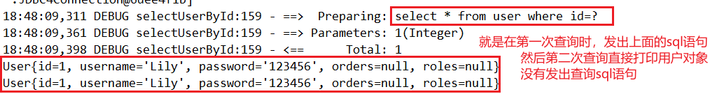
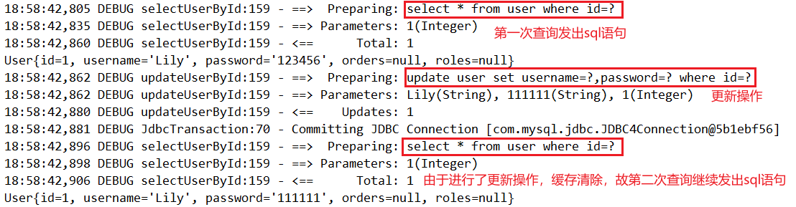

> 第七部分 Mybatis缓存

在 [mybatis-multitable](https://gitee.com/turboYuu/mybatis-1-1/tree/master/lab-mybatis/mybatis-multitable) 工程中操作

# 1 一级缓存

> 1 在一个 sqlSession 中，对 user 表根据 id 进行两次查询，查看它们发出 sql 语句的情况

```java
@Test
public void test0() throws IOException {
    InputStream resourceAsStream = Resources.getResourceAsStream("SqlMapConfig.xml");
    SqlSessionFactory sqlSessionFactory = new SqlSessionFactoryBuilder()
        .build(resourceAsStream);
    SqlSession sqlSession = sqlSessionFactory.openSession();
    // 获得 Mybatis 框架生成的 UserMapper 接口的实现类
    UserMapper userMapper = sqlSession.getMapper(UserMapper.class);
    // 第一次查询，发出sql语句，并将查询出来的结果放进缓存中
    User user = userMapper.selectUserById(1);
    System.out.println(user);
    // 第二次查询，由于是同一个 sqlSession，会在缓存中查询结果
    // 如果有，则直接从缓存中取出来，不和数据库进行交互
    User user1 = userMapper.selectUserById(1);
    System.out.println(user1);
    sqlSession.close();
}
```



> 2 同样是对user表进行两次查询，只不过两次查询之间进行了一次 update 操作

```java
@Test
    public void test1() throws IOException {
        InputStream resourceAsStream = Resources.getResourceAsStream("SqlMapConfig.xml");
        SqlSessionFactory sqlSessionFactory = new SqlSessionFactoryBuilder().build(resourceAsStream);
        SqlSession sqlSession = sqlSessionFactory.openSession();
        // 获得 Mybatis 框架生成的 UserMapper 接口的实现类
        UserMapper userMapper = sqlSession.getMapper(UserMapper.class);
        // 第一次查询，发出sql语句，并将查询出来的结果放进缓存中
        User user = userMapper.selectUserById(1);
        System.out.println(user);

        user.setPassword("111111");
        userMapper.updateUserById(user);
        sqlSession.commit();
        // 第二次查询，由于是同一个 sqlSession.commit()，会清空缓存信息
        // 则次此查询也会发出 sql 语句
        User user1 = userMapper.selectUserById(1);
        System.out.println(user1);
        sqlSession.close();
    }
```



**总结**

1. 第一次发起查询用户id为1的用户信息，先去找缓存中是否有 id 为 1 的用户信息，如果没有，从数据库查询用户信息。得到用户信息，将用户信息存储到一级缓存中。
2. 如果中间 sqlSession 去执行 commit 操作（执行插入、更新、删除），则会清空 sqlSession 中的一级缓存，这样做的目的为了让缓存中存储的是最新的信息，避免脏读。
3. 第二次发起查询用户 id 为 1 的用户信息，先去找缓存中是否有 id 为 1 的用户信息，缓存中有，直接重缓存中获取用户信息。

# 2 二级缓存

# 3 三级缓存整合 redis

