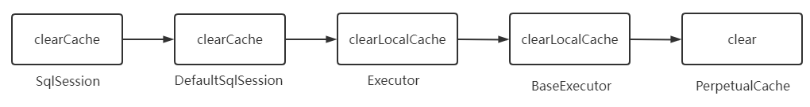
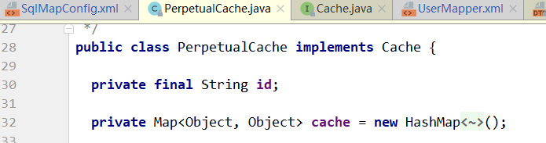

> 第七部分 Mybatis缓存

在 [mybatis-multitable](https://gitee.com/turboYuu/mybatis-1-1/tree/master/lab-mybatis/mybatis-multitable) 工程中操作

# 1 一级缓存

> 1 在一个 sqlSession 中，对 user 表根据 id 进行两次查询，查看它们发出 sql 语句的情况

```java
@Test
public void test0() throws IOException {
    InputStream resourceAsStream = Resources.getResourceAsStream("SqlMapConfig.xml");
    SqlSessionFactory sqlSessionFactory = new SqlSessionFactoryBuilder()
        .build(resourceAsStream);
    SqlSession sqlSession = sqlSessionFactory.openSession();
    // 获得 Mybatis 框架生成的 UserMapper 接口的实现类
    UserMapper userMapper = sqlSession.getMapper(UserMapper.class);
    // 第一次查询，发出sql语句，并将查询出来的结果放进缓存中
    User user = userMapper.selectUserById(1);
    System.out.println(user);
    // 第二次查询，由于是同一个 sqlSession，会在缓存中查询结果
    // 如果有，则直接从缓存中取出来，不和数据库进行交互
    User user1 = userMapper.selectUserById(1);
    System.out.println(user1);
    sqlSession.close();
}
```


> 2 同样是对user表进行两次查询，只不过两次查询之间进行了一次 update 操作

```java
@Test
    public void test1() throws IOException {
        InputStream resourceAsStream = Resources.getResourceAsStream("SqlMapConfig.xml");
        SqlSessionFactory sqlSessionFactory = new SqlSessionFactoryBuilder().build(resourceAsStream);
        SqlSession sqlSession = sqlSessionFactory.openSession();
        // 获得 Mybatis 框架生成的 UserMapper 接口的实现类
        UserMapper userMapper = sqlSession.getMapper(UserMapper.class);
        // 第一次查询，发出sql语句，并将查询出来的结果放进缓存中
        User user = userMapper.selectUserById(1);
        System.out.println(user);

        user.setPassword("111111");
        userMapper.updateUserById(user);
        sqlSession.commit();
        // 第二次查询，由于是同一个 sqlSession.commit()，会清空缓存信息
        // 则次此查询也会发出 sql 语句
        User user1 = userMapper.selectUserById(1);
        System.out.println(user1);
        sqlSession.close();
    }
```


**总结**

1. 第一次发起查询用户id为1的用户信息，先去找缓存中是否有 id 为 1 的用户信息，如果没有，从数据库查询用户信息。得到用户信息，将用户信息存储到一级缓存中。
2. 如果中间 sqlSession 去执行 commit 操作（执行插入、更新、删除），则会清空 sqlSession 中的一级缓存，这样做的目的为了让缓存中存储的是最新的信息，避免脏读。
3. 第二次发起查询用户 id 为 1 的用户信息，先去找缓存中是否有 id 为 1 的用户信息，缓存中有，直接重缓存中获取用户信息。


## 1.1 一级缓存原理探究与源码分析

一级缓存到底是什么？一级缓存什么时候被创建、一级缓存的工作流程是怎样的？

先从 SqlSession 中看看有没有创建缓存或者与缓存有关的属性或者方法？


发现上述所有方法中，好像只有 clearCache() 和缓存有点关系，那么直接就从这个方法入手，分析源码，**我们要看它（此类）是谁，它的父类和子类分别又是谁**，对如上关系了解了，你才会对这个类有更深的认识，分析一圈，你可能会得到如下这个流程图：



再深入分析，流程走到 **PerpetualCache** 中的 clear() 方法之后，会调用其 **cache.clear()** 方法，那么这个 cache 是什么东西呢？点进去发现，cache 其实就是 `private Map<Object, Object> cache = new HashMap<Object, Object>();` 也就是一个 Map ，所以说 cache.clear() 其实就是 map.clear()，也就是说，缓存其实就是 本地存放的一个 map 对象，每一个 SqlSession 都会存放一个 map 对象的引用，那么这个 cache 是何时创建的呢？

发现 Executor 中有一个 createCacheKey 方法，这个方法像是创建缓存的方法，跟进去看看，你发现 createCacheKey 方法是由 BaseExecutor 执行的，代码如下：

```java
@Override
public CacheKey createCacheKey(MappedStatement ms, 
                               Object parameterObject, 
                               RowBounds rowBounds, 
                               BoundSql boundSql) {
    
    CacheKey cacheKey = new CacheKey();
    // MappedStatement 的 id (namespace.id)
    cacheKey.update(ms.getId());
    // offset 就是 0
    cacheKey.update(rowBounds.getOffset());
    // limit 就是 Integer.MAXVALUE
    cacheKey.update(rowBounds.getLimit());
    // 具体的 sql 语句
    cacheKey.update(boundSql.getSql());
    
    // 后面是 update 了 sql 中带的参数
    List<ParameterMapping> parameterMappings = boundSql.getParameterMappings();
    TypeHandlerRegistry typeHandlerRegistry = ms.getConfiguration().getTypeHandlerRegistry();
    // mimic DefaultParameterHandler logic
    for (ParameterMapping parameterMapping : parameterMappings) {
        if (parameterMapping.getMode() != ParameterMode.OUT) {
            Object value;
            String propertyName = parameterMapping.getProperty();
            if (boundSql.hasAdditionalParameter(propertyName)) {
                value = boundSql.getAdditionalParameter(propertyName);
            } else if (parameterObject == null) {
                value = null;
            } else if (typeHandlerRegistry.hasTypeHandler(parameterObject.getClass())) {
                value = parameterObject;
            } else {
                MetaObject metaObject = configuration.newMetaObject(parameterObject);
                value = metaObject.getValue(propertyName);
            }
            cacheKey.update(value);
        }
    }
    if (configuration.getEnvironment() != null) {
        // issue #176
        cacheKey.update(configuration.getEnvironment().getId());
    }
    return cacheKey;
}
```

创建缓存 key 会经过一系列的 update 方法，update 方法由一个 CacheKey 这个对象来执行的，这个 update 方法最终由 updateList 把这 六 个值存进去，对照上面的代码和下面的图示，可以理解这六个值分别是什么。


这里需要注意以下最后一个值，`configuration.getEnvironment().getId()` 是什么，其实就是定义在 SqlMapConfig.xml 中的标签，见下：

```xml
<!--environments：运行环境-->
<environments default="development">
    <environment id="development">
        <!--表示当前事务交由JDBC进行管理-->
        <transactionManager type="JDBC"></transactionManager>
        <!--当前使用mybatis提供的连接池-->
        <dataSource type="POOLED">
            <property name="driver" value="${jdbc.driver}"/>
            <property name="url" value="${jdbc.url}"/>
            <property name="username" value="${jdbc.username}"/>
            <property name="password" value="${jdbc.password}"/>
        </dataSource>
    </environment>
</environments>
```

查看调用栈，发现调用 createCacheKey 的方法 `CachingExecutor#query(org.apache.ibatis.mapping.MappedStatement, java.lang.Object, org.apache.ibatis.session.RowBounds, org.apache.ibatis.session.ResultHandler)`


如果缓存中没有，就查询数据库，进入 **`queryFromDatabase`**：


在 queryFromDatabase 中会对 localCache 进行写入。交由 **PerpetualCache** 的 cache 进行存放。


# 2 二级缓存

二级缓存的原理和一级缓存原理一样，第一次查询，会将数据放入缓存中，然后第二次查询则会直接去缓存中取。但是一级缓存是基于sqlSession的，而**二级缓存是基于 mapper 文件 namespace 的**，也就是说多个 sqlSession 可以共享一个 mapper 中的二级缓存区域，并且如果两个 mapper 的 namespace 相同，即使是两个 mapper，那么这两个 mapper 中执行 sql 查询到的数据也将存在相同的二级缓存区域中。


如何使用二级缓存？

## 2.1 开启二级缓存

和一级缓存默认开启不一样，二级缓存需要手动开启

首先在全局配置文件 SqlMapConfig.xml 文件中加入如下代码：

```xml
<!--全局性地开启或关闭所有映射器配置文件中已配置的任何缓存。-->
<settings>
    <setting name="cacheEnabled" value="true"/>
</settings>
```

其次在 UserMapper.xml 文件中开启缓存：

```xml
<!--开启二级缓存-->
<cache/>
```

我们可以看到 mapper.xml 文件中就这么一个空标签，其实这里可以配置 ，**PerpetualCache**  这个类是 mybatis 默认实现缓存功能的类。我们不写 type 就使用 mybatis 默认的缓存，也可以去实现 Cache 接口来自定义缓存。




可以看到 二级缓存底层还是 HashMap 结构。

```java
public class User implements Serializable {

    private Integer id;
    private String username;
    private String password;
}
```

开启二级缓存后，还需要将缓存的 pojo 实现 Serializable 接口，为了将缓存数据取出执行反序列化操作。因为二级缓存数据存储介质多种多样，不一定只存在内存中，有可能存在硬盘中，如果我们要再取这个缓存的话，就需要反序列化。所以 mybatis 中的 pojo 都去实现 Serializable 接口。

## 2.2 测试

### 2.2.1 测试二级缓存和 sqlSession 无关

```java
@Test
public void testThCache() throws IOException {
    InputStream resourceAsStream = Resources.getResourceAsStream("SqlMapConfig.xml");
    SqlSessionFactory sqlSessionFactory = new SqlSessionFactoryBuilder().build(resourceAsStream);
    SqlSession sqlSession1 = sqlSessionFactory.openSession();
    SqlSession sqlSession2 = sqlSessionFactory.openSession();

    UserMapper userMapper1 = sqlSession1.getMapper(UserMapper.class);
    UserMapper userMapper2 = sqlSession2.getMapper(UserMapper.class);
    // 第一次查询，发出 sql 语句，并将查询的结果放入缓存中
    User user = userMapper1.selectUserById(1);
    System.out.println(user);
    sqlSession1.close(); // 第一次查询完关闭 sqlSession

    // 第二次查询，即使 sqlSession1 已经关闭，这次查询依然不发出 sql 语句
    User user1 = userMapper2.selectUserById(1);
    System.out.println(user1);
    sqlSession2.close();
}
```


### 2.2.2 测试执行 commit() 操作，二级缓存数据清空

```java
@Test
public void testThCache() throws IOException {
    InputStream resourceAsStream = Resources.getResourceAsStream("SqlMapConfig.xml");
    SqlSessionFactory sqlSessionFactory = new SqlSessionFactoryBuilder().build(resourceAsStream);
    SqlSession sqlSession1 = sqlSessionFactory.openSession();
    SqlSession sqlSession2 = sqlSessionFactory.openSession();
    SqlSession sqlSession3 = sqlSessionFactory.openSession();

    UserMapper userMapper1 = sqlSession1.getMapper(UserMapper.class);
    UserMapper userMapper2 = sqlSession2.getMapper(UserMapper.class);
    UserMapper userMapper3 = sqlSession3.getMapper(UserMapper.class);

    // 第一次查询，发出 sql 语句，并将查询的结果放入缓存中
    User user = userMapper1.selectUserById(1);
    System.out.println(user);
    sqlSession1.close(); // 第一次查询完关闭 sqlSession

    // 执行更新操作，commit()
    user.setPassword("123456");
    userMapper3.updateUserById(user);
    sqlSession3.commit();;

    // 第二次查询，由于上次更新操作，缓存数据已经清空（防止数据脏读），这里必须再次发出 sql 语句
    User user1 = userMapper2.selectUserById(1);
    System.out.println(user1);
    sqlSession2.close();
}
```


## 2.3 useCache 和 flushCache

mybatis 中 Select 元素的属性 还可以设置 useCache 和 flush 等配置项，useCache 是用来设置设否禁用二级缓存的，在 statement 中设置 useCache=false 可以禁用当前 select 语句的二级缓存，即每次查询都会发出 sql 去查询，默认情况是 true，即该 sql 使用二级缓存。


```xml
<select id="selectUserById" parameterType="int" resultType="user" useCache="false">
    select * from user where id=#{id}
</select>
```

这种情况是针对每次查询都需要最新的数据 sql，要设置成 useCache=false，禁用二级缓存，直接从数据库中获取。

在 mapper 的同一个 namespace 中，如果由其他 inset、update、delete 操作数据后需要刷新缓存，如过不执行刷新缓存会出现脏读。

设置 statement 配置中的 flushCache="true" 属性，默认情况下为 true，即刷新缓存，如果改成 false，则不会刷新。使用缓存时如果手动修改数据库表中的查询数据会出现脏读。

```xml
<!--flushCache	将其设置为 true 后，只要语句被调用，都会导致本地缓存和二级缓存被清空，默认值：false。
        useCache	将其设置为 true 后，将会导致本条语句的结果被二级缓存缓存起来，默认值：对 select 元素为 true。-->
<select id="selectUserById" parameterType="int" resultType="user" flushCache="true" useCache="false">
    select * from user where id=#{id}
</select>
```

一般执行完 commit 操作都需要刷新缓存，flushCache==true 标识刷新缓存，这样可以避免数据库脏读。所以我们不用设置，默认即可。

# 3 二级缓存整合 redis

