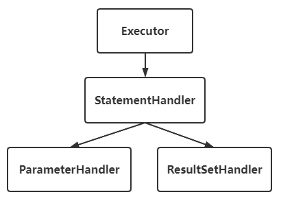
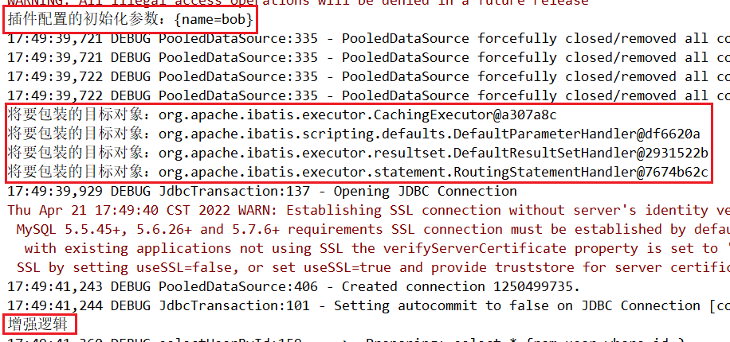
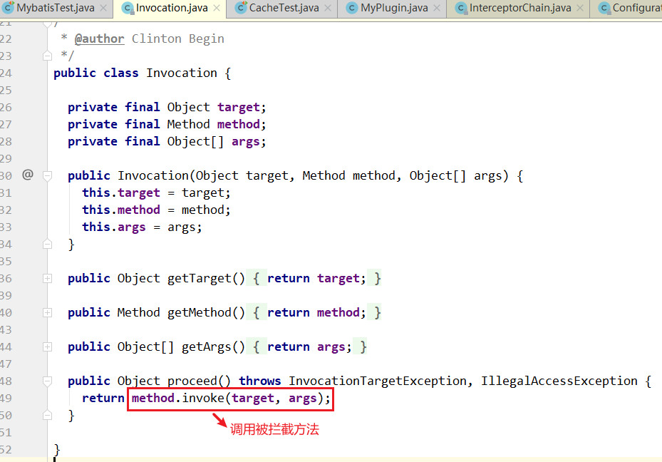

> 第八部分 Mybatis插件

# 1 插件简介

一般情况下，开源框架都会提供插件或其他形式的拓展点，供开发者自行拓展。这样的好处是显而易见的。一是增加了框架的灵活性；二是开发者可以结合实际需求，对框架进行拓展，使其能够更好的工作。以 Mybatis 为例，我们可基于 Mybatis 插件实现分页、分表，监控等功能。由于插件和业务无关，业务也无法感知插件的存在。因此可以无感植入插件，在无形中增强功能。


# 2 Mybatis 插件介绍

在四大组件（Executor、StatementHandler、ParameterHandler、ResultSetHandler）处提供了简单易用的插件扩展机制。Mybatis 对持久层的操作就是借助于四大核心对象。Mybatis 支持用插件对四大核心对象进行拦截，对 mybatis 来说插件就是拦截器，用来增强核心对象的功能，增强功能本质上是借助于底层的**动态代理**实现的，换句话说，Mybatis 中的四大对象都是代理对象。



**Mybatis所允许拦截的方法如下**：

- 执行器 Executor（update、query、commit、rollback 等方法）；
- SQL 语法构建器 StatementHandler （prepare、parameterize、batch、update、query 等方法）；
- 参数处理器 ParameterHandler （getParameterObject、setParameters 方法）；
- 结果集处理器 ResultSetHandler（handleResultSets、handleOutputParameters 等方法）；

# 3 Mybatis 插件原理

在四大对象创建的时候：

1. 每个创建出来的对象不是直接返回的，而是 InterceptorChain.pluginAll(ParameterHandler);
2. 获取到所有的 Interceptor （拦截器）（插件需要实现的接口）；调用 interceptor.plugin(target); 返回 target 包装后的对象
3. 插件机制，我们可以使用插件为目标对象创建一个代理对象；AOP（面向切面）我们的插件可以为四大对象创建出代理对象，代理对象就可以拦截到四大对象的每一个执行；

**拦截**

插件具体是如何拦截并附加额外的功能的呢？以 ParameterHandler 来说

```java
// org.apache.ibatis.session.Configuration#newParameterHandler
public ParameterHandler newParameterHandler(MappedStatement mappedStatement, 
                                            Object parameterObject, 
                                            BoundSql boundSql) {
    ParameterHandler parameterHandler = mappedStatement
        .getLang()
        .createParameterHandler(mappedStatement, parameterObject, boundSql);
    parameterHandler = (ParameterHandler) interceptorChain.pluginAll(parameterHandler);
    return parameterHandler;
}
// org.apache.ibatis.plugin.InterceptorChain#pluginAll
public Object pluginAll(Object target) {
    for (Interceptor interceptor : interceptors) {
        target = interceptor.plugin(target);
    }
    return target;
}
```

interceptorChain 保存了所有的拦截器（interceptors），是 mybatis 初始化的时候创建的。调用拦截器链中的拦截器一次的目标进行拦截或增强。Interceptor.plugin(target) 中的 target 就可以理解为 mybatis 中的四大对象。返回的 target 是被重重代理后的对象。

如果我们想要拦截 Executor 的 query 方法，那么可以这样定义插件：

```java
@Intercepts({ 
	@Signature(type = Executor.class, 
		method = "query", 
		args = {MappedStatement.class,Object.class, RowBounds.class, ResultHandler.class}) 
})
public class MyPlugin implements Interceptor {
    // 省略逻辑
}
```

除此之外，我们还需要将插件配置到 sqlMapConfig.xml 中。

```xml
<plugins>
    <plugin interceptor="com.turbo.plugin.MyPlugin">
        <property name="name" value="bob"/>
    </plugin>
</plugins>
```

这样 Mybatis在启动时可以加载插件，并保存插件实例到相关对象（InterceptorChain，拦截器链）中。待准备工作做完后，Mybatis处于就绪状态。我们在执行 SQL 时，需要先通过 DefaultSqlSessionFactory 创建 SqlSession。Executor 实例会在创建 SqlSession 的过程中被创建，Executor 实例创建完毕后，Mybatis 会通过 JDK 动态代理为实例生成代理类。这样，插件逻辑即可在 Executor 相关方法被调用前执行。

以上就是Mybatis 插件机制的基本原理。

# 4 自定义插件

## 4.1 插件接口

Mybatis 插件接口 - Interceptor

- intercept 方法，插件的核心方法
- plugin 方法，生成 target 的代理对象
- setProperties 方法，传递插件所需参数

**代码执行顺序：setProperties -> plugin -> intercept**

## 4.2 自定义插件

设计实现一个自定义插件，[gitee 代码地址](https://gitee.com/turboYuu/mybatis-1-1/blob/master/lab-mybatis/mybatis-multitable/src/main/java/com/turbo/plugin/MyPlugin.java)

1. MyPlugin

   ```java
   package com.turbo.plugin;
   
   import org.apache.ibatis.executor.statement.StatementHandler;
   import org.apache.ibatis.plugin.*;
   
   import java.sql.Connection;
   import java.util.Properties;
   
   @Intercepts({ // 注意看这个大花括号，也就是说这里可以定义多个 @Signature 对多个地方拦截，都用这个拦截器
           @Signature(type = StatementHandler.class, // 这里指拦截哪个接口
                   method = "prepare", // 这个接口内的哪个方法名，不要拼写错误
                   args = {Connection.class,Integer.class}) // 这是拦截方法的入参，按顺序写到这里，不要多不要少。如果方法重载，可以通过方法名的入参来确定唯一
   })
   public class MyPlugin implements Interceptor {
       @Override
       public Object intercept(Invocation invocation) throws Throwable {
           // 增强逻辑
           System.out.println("增强逻辑");
           return invocation.proceed(); //执行原方法
       }
   
       /**
        * 主要是为例把这个拦截器生成一个代理对象 放到拦截器链中
        * @param target 拦截的对象
        * @return 代理对象
        */
       @Override
       public Object plugin(Object target) {
           System.out.println("将要包装的目标对象："+ target);
           return Plugin.wrap(target,this);
       }
   
       /**
        * 获取配置文件的属性
        * 插件初始化的时候调用，也只调用一次，插件配置的属性从这里设置进来
        * @param properties
        */
       @Override
       public void setProperties(Properties properties) {
           System.out.println("插件配置的初始化参数："+properties);
       }
   }
   
   ```

2. SqlMapConfig.xml

   ```xml
   <plugins>
       <plugin interceptor="com.turbo.plugin.MyPlugin">
           <property name="name" value="bob"/>
       </plugin>
   </plugins>
   ```

3. Mapper 接口

   ```java
   public interface UserMapper {
       User selectUserById(int id);
   }
   ```

4. UserMapper.xml

   ```xml
   <select id="selectUserById" parameterType="int" resultType="user" useCache="false" flushCache="true">
       select * from user where id=#{id}
   </select>
   ```

5. 测试类

   ```java
   @Test
   public void test() throws IOException {
       InputStream resourceAsStream = Resources.getResourceAsStream("SqlMapConfig.xml");
       SqlSessionFactory sqlSessionFactory = new SqlSessionFactoryBuilder().build(resourceAsStream);
       SqlSession sqlSession = sqlSessionFactory.openSession();
   
       UserMapper userMapper = sqlSession.getMapper(UserMapper.class);
       User user = userMapper.selectUserById(1);
       System.out.println(user);
       sqlSession.close();
   }
   ```

   

# 5 源码分析

执行插件逻辑

Plugin 实现了 InvocationHandler 接口，因此它的 invoke 方法会拦截所有的方法调用。invoke 方法会对所有拦截的方法进行检测，以决定是否执行插件逻辑。该方法的逻辑如下：

```java
@Override
public Object invoke(Object proxy, Method method, Object[] args) throws Throwable {
    try {
        // 获取被拦截方法列表，比如 signatureMap.get(Executor.class)，可能返回 [query,update,commit]
        Set<Method> methods = signatureMap.get(method.getDeclaringClass());
        // 检测方法列表是否包含被拦截的方法
        if (methods != null && methods.contains(method)) {
            // 执行插件逻辑
            return interceptor.intercept(new Invocation(target, method, args));
        }
        return method.invoke(target, args);
    } catch (Exception e) {
        throw ExceptionUtil.unwrapThrowable(e);
    }
}
```

invoke 方法的代码比较少，逻辑不难理解。首先 ，invoke 方法会检测被拦截方式是否配置在插件的 @Signature 注解中，若是，则执行插件逻辑。插件逻辑封装在 intercept 中，该方法的参数类型为 Invocation ，Invocation 主要用于存储目标类，方法以及方法参数列表。下面简单看一下该类的定义：



关于插件的执行逻辑就分析结束。

# 6 pageHelper 分页插件

Mybatis 可以使用第三方的插件来对功能进行扩展，分页助手 PageHelper 是将分页的复杂操作进行封装，使用简单的方式即可获得分页的相关数据。

开发步骤：

1. 导入通用 PageHelper 坐标

   ```xml
   <dependency>
       <groupId>com.github.pagehelper</groupId>
       <artifactId>pagehelper</artifactId>
       <version>3.7.5</version>
   </dependency>
   <dependency>
       <groupId>com.github.jsqlparser</groupId>
       <artifactId>jsqlparser</artifactId>
       <version>0.9.1</version>
   </dependency>
   ```

2. 在 mybatis 核心配置文件中配置 PageHelper 插件

   ```xml
   <plugins>
       <plugin interceptor="com.github.pagehelper.PageHelper">
           <property name="dialect" value="mysql"/>
       </plugin>
   </plugins>
   ```

3. 测试分页代码实现

   ```java
   @Test
   public void testPageHelper() throws IOException {
       InputStream resourceAsStream = Resources.getResourceAsStream("SqlMapConfig.xml");
       SqlSessionFactory sqlSessionFactory = new SqlSessionFactoryBuilder().build(resourceAsStream);
       SqlSession sqlSession = sqlSessionFactory.openSession();
       // 获得 Mybatis 框架生成的 UserMapper 接口的实现类
       UserMapper userMapper = sqlSession.getMapper(UserMapper.class);
       PageHelper.startPage(1,2);
       List<User> allUser = userMapper.findAllUser();
   
       // 其他分页的数据
       PageInfo<User> userPageInfo = new PageInfo<>(allUser);
       System.out.println("总条数："+userPageInfo.getTotal());
       System.out.println("总页数："+userPageInfo.getPages());
   
       System.out.println("当前页："+userPageInfo.getPageNum());
       System.out.println("每页显示条数："+userPageInfo.getPageSize());
       System.out.println("是否第一页："+userPageInfo.isIsFirstPage());
       System.out.println("是否第二页："+userPageInfo.isIsLastPage());
   
   
       for (User user : allUser) {
           System.out.println(user);
       }
   }
   ```

   

# 7 通用 mapper

**什么是通用 Mapper**

通用 Mapper 就是为了解决单表增删改查，基于 Mybatis 的插件机制。开发人员不需要编写 sql，不需要在 Dao 中增加方法，只要写好实体类，就能支持相应的增删改查方法

**如何使用**

1. 首先在 pom 中引入依赖

   ```xml
   <dependency>
       <groupId>tk.mybatis</groupId>
       <artifactId>mapper</artifactId>
       <version>3.1.2</version>
   </dependency>
   ```

2. Mybatis 配置文件中完成配置

   ```xml
   <plugins>
       <!--分页插件，如果分页插件，要排在通用 mapper 之前-->
       <plugin interceptor="com.github.pagehelper.PageHelper">
           <property name="dialect" value="mysql"/>
       </plugin>
       <plugin interceptor="tk.mybatis.mapper.mapperhelper.MapperInterceptor">
           <!--通用Mapper接口，多个通用接口用逗号隔开-->
           <property name="mappers" value="tk.mybatis.mapper.common.Mapper"/>
       </plugin>
   </plugins>
   ```

3. 实体类设置主键

   ```java
   @Table(name = "user")
   public class User {
       @Id
       @GeneratedValue(strategy = GenerationType.IDENTITY)
       private Integer id;
       private String username;
       private String password;
   }
   ```

4. 定义通用 Mapper

   ```java
   package com.turbo.mapper;
   
   import com.turbo.pojo.User;
   import tk.mybatis.mapper.common.Mapper;
   
   public interface UserMapper extends Mapper<User> {
   
   }
   ```

5. 测试

   ```java
   @Test
   public void test1() throws IOException {
       InputStream resourceAsStream = Resources.getResourceAsStream("SqlMapConfig.xml");
       SqlSessionFactory sqlSessionFactory = new SqlSessionFactoryBuilder().build(resourceAsStream);
       SqlSession sqlSession = sqlSessionFactory.openSession();
       UserMapper userMapper = sqlSession.getMapper(UserMapper.class);
   
       User user = new User();
       user.setId(4);
       // 1.mapper 基础接口
       // select 接口
       User user1 = userMapper.selectOne(user); // 根据实体中的属性进行查询，只能有一个返回值
       System.out.println(user1);
   
       List<User> users = userMapper.select(null);
       System.out.println(users);
   
       User user2 = userMapper.selectByPrimaryKey(1);
       System.out.println(user2);
   
       int count = userMapper.selectCount(null);
       System.out.println(count);
   
       Example example = new Example(User.class);
       //example.createCriteria().andEqualTo("id",1);
       example.createCriteria().andLike("password","1234%");
       PageHelper.startPage(1,2);
       List<User> userList = userMapper.selectByExample(example);
       System.out.println(userList);
   
       sqlSession.close();
   }
   ```

   