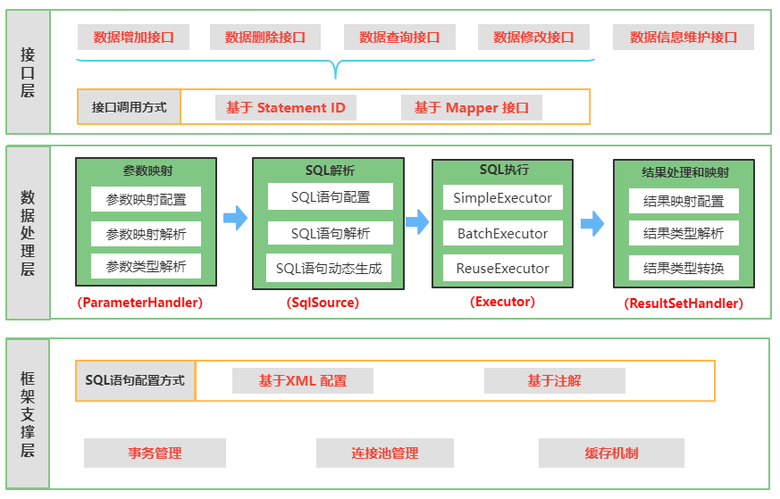
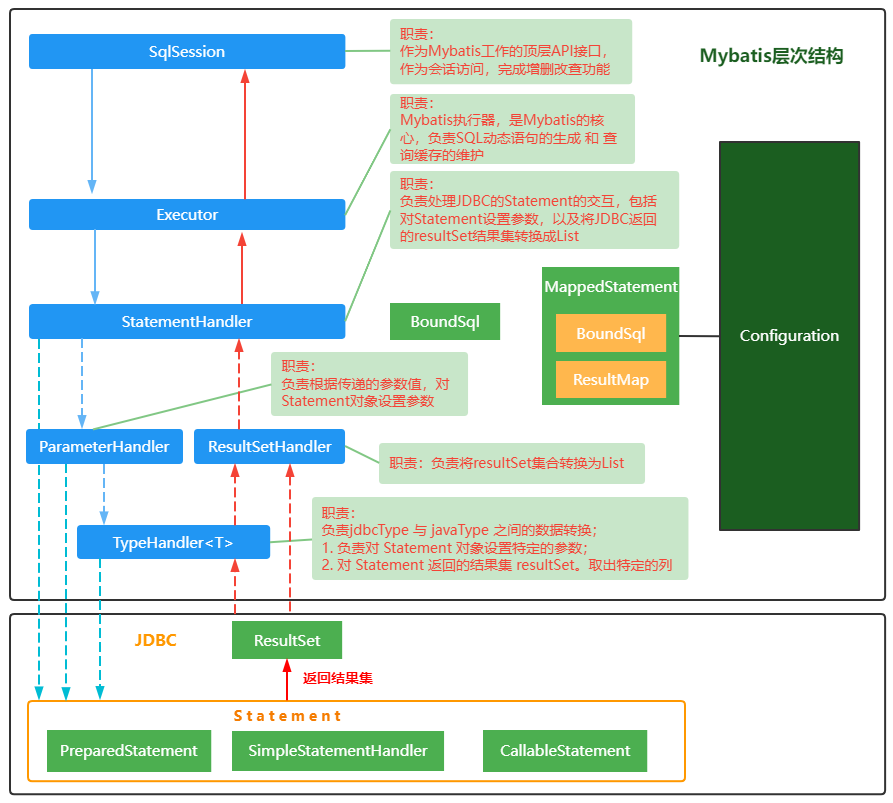

> 第九部分 Mybatis架构原理

# 1 架构设计

我们把Mybatis的功能架构分为三层：

1. API 接口层：提供给外部使用的接口 API，开发人员通过这些本地 API 来操纵数据库。接口层一接收到，调用请求就会调用数据处理层来完成具体的数据处理。

   Mybatis和数据库的交互有两种方式：

   - 使用传统的 Mybatis 提供的 API
   - 使用 Mapper 代理的方式

2. 数据处理层：负责具体的SQL查找、SQL解析、SQL执行和执行结果映射处理等。它的主要目的是根据调用的请求完成一次数据库操作。

3. 基础支撑层：负责最基础的功能支撑，包括连接管理、事务管理、配置加载和缓存处理，这些都是共用的东西，将他们抽取出来作为最基础的组件。为上层的数据处理提供最基础的支撑

# 2 主要构建及其相关关系

| 构件             | 描述                                                         |
| ---------------- | ------------------------------------------------------------ |
| SqlSession       | 作为Mybatis工作的主要顶层 API，表示和数据库交互的会话，完成必要数据库增删改查功能 |
| Executor         | Mybatis执行器，是 Mybatis调度的核心，负责 SQL 语句的生成和查询缓存的维护 |
| StatementHandler | 封装了 JDBC Statement 操作，负责对 JDBC statement 的操作，如设置参数，将 Statement 结果转换成 List 集合。 |
| ParameterHandler | 负责对用户传递的参数转换成 JDBC Statement 所需要的参数       |
| ResultSetHandler | 负责将 JDBC 返回的 ResultSet 结果集对象转换成 List 类型的集合 |
| TypeHandler      | 负责 java 数据类型 和 jdbc 数据类型之间的映射和转换          |
| MappedStatement  | MappedStatement 维护了一条 <select \| update \| insert>节点的封装 |
| SqlSource        | 负责根据用户传递的 parameterObject，动态地生成 SQL 语句，将信息封装到 BoundSql 对象中，并返回 |
| BoundSql         | 表示动态生成的 SQL 语句以及相应的参数信息                    |

# 3 总体流程

## 3.1 加载配置并初始化

**触发条件**：加载配置文件

配置来源于两个地方：一个是配置文件（主配置文件 conf.xml，mapper文件*.xml）；一个是 Java 代码中的注解。将主配置文件内容解析封装到 Configuration，将 sql 的配置信息加载成为一个 MappedStatement 对象，存储在内存之中。

## 3.2 接收调用请求

**触发条件**：调用 Mybatis 提供的 API

**传入参数**：为 SQL 的 ID 和 传入参数对象

**处理过程**：将请求传递给下层的请求处理层进行处理

## 3.3 处理操作请求

**触发条件**：API 接口层传递请求过来

**传入参数**：为 SQL 的 ID 和 传入参数对象

**处理过程**：

1. 根据 SQL 的 ID 查找对应的 MappedStatement 对象。
2. 根据传入参数对象解析 MappedStatement 对象，得到最终要执行的 SQL 和 执行传入参数。
3. 获取数据库连接，根据得到的最终 SQL 语句 和 执行传入参数 到数据库执行，并得到执行结果。
4. 根据 MappedStatement 对象中的结果映射配置 对得到的执行结果进行转换处理，并得到最终的处理结果。
5. 释放连接资源。

## 3.4 返回处理结果

将最终的处理结果返回。