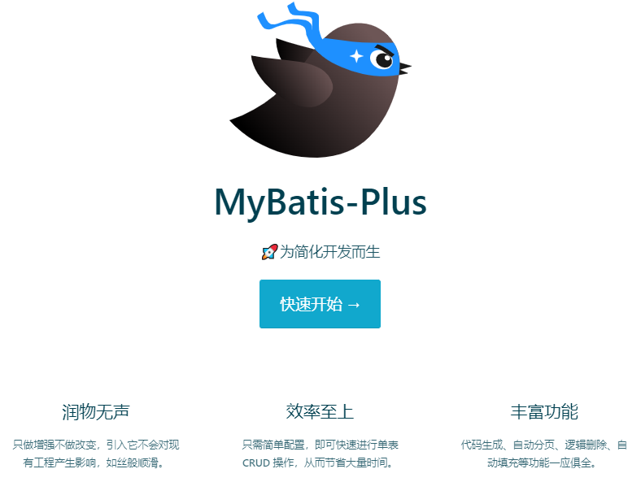
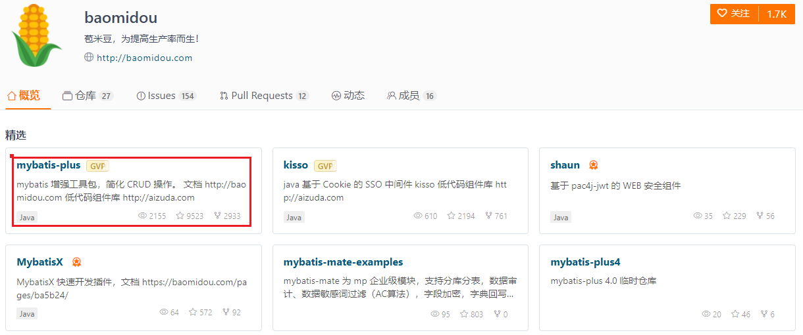

> 1 Mybatis-Plus 概念

# 1 Mybatis-Plus介绍

官网：https://baomidou.com/

Mybatis-Plus（简称MP）是一个Mybatis的增强工具，在Mybatis的基础上只做增强不做改变，为简化开发、提高效率而生。

# 2 特性

- 无侵入
- 损耗小
- 强大的CRUD操作
- 支持 Lambda 形式调用
- 支持主键自动生成
- 支持 ActiveRecord 模式
- 支持自定义全局通用操作
- 内置代码生成器
- 内置分页插件
- 分页插件支持多种数据库
- 内置性能分析插件
- 内置全局拦截插件

# 3 框架结构

# 4 作者

Mybatis-Plus 是由 baomidou（苞米豆）组织开发并且开源。

https://gitee.com/baomidou

