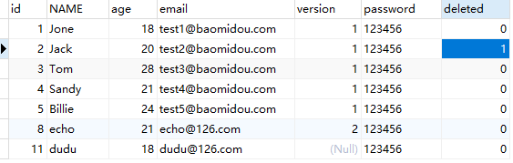

> 10 逻辑删除

https://baomidou.com/pages/6b03c5/#%E4%BD%BF%E7%94%A8%E6%96%B9%E6%B3%95

开发系统时，有时候在实现功能时，删除操作需要实现逻辑删除，所谓逻辑删除就是将数据标记为删除，并非真正的物理删除（非 delete 操作），查询时需要携带状态条件，确保被标记的数据不被查询到。这样做的目的就是避免数据被真正的删除。

# 1 修改表结构

为 td_user 表增加 deleted 字段，用于表示数据是否被删除，1 代表删除，0 代表未删除。

```sql
ALTER TABLE `tb_user` ADD COLUMN `deleted`  int(1) NULL DEFAULT 0 COMMENT '1代表删除，0代表未删除' AFTER `version`;
```

同时修改 User 实体，增加 deleted 属性并且增加 @TableLogic 注解：

```java
@TableLogic
private Integer deleted;
```

# 2 配置

application.properties

```properties
# 逻辑已删除值（默认为1）
mybatis-plus.global-config.db-config.logic-delete-value=1
# 逻辑未删除值（默认为0）
mybatis-plus.global-config.db-config.logic-not-delete-value=0
```


# 3 测试

测试删除：

```java
@Autowired
private UserMapper userMapper;

@Test
public void testDeleteTableLogic(){
    userMapper.deleteById(2L);
}
```

```sql
18:08:58,475 DEBUG deleteById:143 - ==>  Preparing: UPDATE td_user SET deleted=1 WHERE id=? AND deleted=0 
18:08:58,485 DEBUG HikariPool:729 - HikariPool-1 - Added connection com.mysql.jdbc.JDBC4Connection@3876699e
18:08:58,485 DEBUG HikariPool:421 - HikariPool-1 - After adding stats (total=10, active=1, idle=9, waiting=0)
18:08:58,509 DEBUG deleteById:143 - ==> Parameters: 2(Long)
18:08:58,534 DEBUG deleteById:143 - <==    Updates: 1
```



测试查询

```java
@Autowired
private UserMapper userMapper;

@Test
public void testDeleteTableLogic(){
    userMapper.selectById(2L);
}
```

```java
18:12:52,400 DEBUG selectById:143 - ==>  Preparing: SELECT id,name,age,email,password,version,deleted FROM td_user WHERE id=? AND deleted=0 
18:12:52,431 DEBUG selectById:143 - ==> Parameters: 2(Long)
18:12:52,455 DEBUG selectById:143 - <==      Total: 0
```

