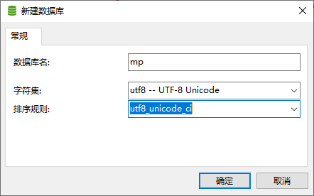
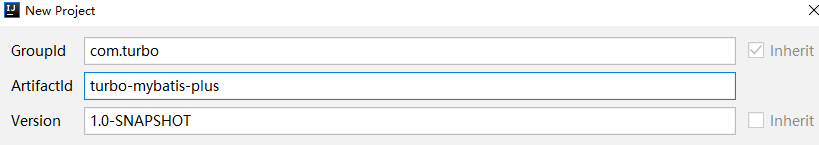
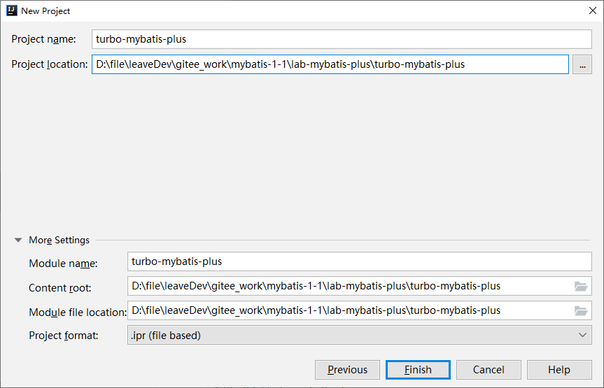
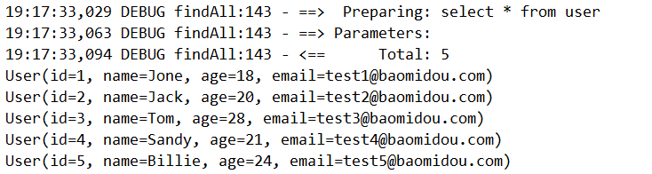
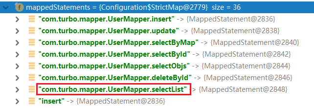
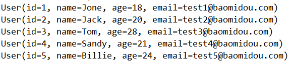
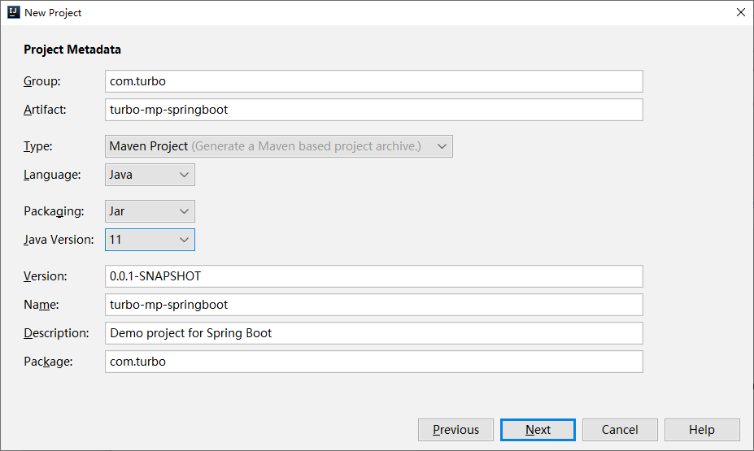
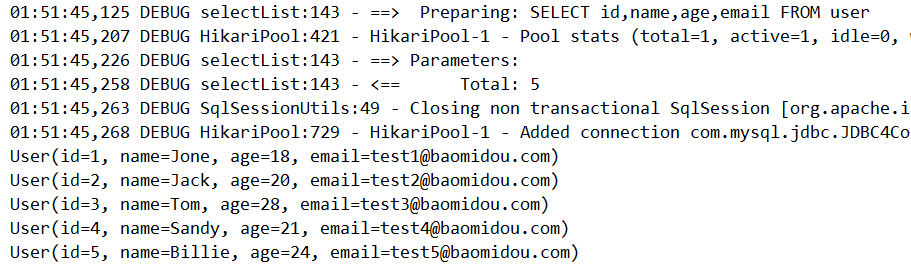

> 2 Mybatis-Plus 快速入门

# 1 安装

全新的 `Mybatis-Plus` 3.0 版本基于 JDK 8，提供了 `lambda` 形式的调用，所以安装集成 MP3.0 要求如下：

- JDK 8+
- Maven or Gradle

## 1.1 Spring Boot

Maven:

```xml
<dependency>
    <groupId>com.baomidou</groupId>
    <artifactId>mybatis-plus-boot-starter</artifactId>
    <version>最新版本</version>
</dependency>
```

## 1.2 Spring

Maven

```xml
<dependency>
    <groupId>com.baomidou</groupId>
    <artifactId>mybatis-plus</artifactId>
    <version>最新版本</version>
</dependency>

```


对于 Mybatis 整合 MP 常有三种用法，分别是 Mybatis +MP、Spring+Mybatis+MP、SproingBoot+Mybatis+MP。

# 2 创建数据库以及表



创建 user 表，其表结构如下：


```sql
--  创建测试表
DROP TABLE IF EXISTS tb_user;

CREATE TABLE USER (
	id BIGINT (20) NOT NULL COMMENT '主键ID',
	NAME VARCHAR (30) NULL DEFAULT NULL COMMENT '姓名',
	age INT (11) NULL DEFAULT NULL COMMENT '年龄',
	email VARCHAR (50) NULL DEFAULT NULL COMMENT '邮箱',
	PRIMARY KEY (id)
);

-- 插入测试数据
INSERT INTO user (id, name, age, email) VALUES 
(1, 'Jone', 18, 'test1@baomidou.com'),
(2, 'Jack', 20, 'test2@baomidou.com'), 
(3, 'Tom', 28, 'test3@baomidou.com'), 
(4, 'Sandy', 21, 'test4@baomidou.com'), 
(5, 'Billie', 24, 'test5@baomidou.com');
```

# 3 创建工程





导入依赖

```xml
<dependencies>
    <!--mybatis-plus插件依赖-->
    <dependency>
        <groupId>com.baomidou</groupId>
        <artifactId>mybatis-plus</artifactId>
        <version>3.3.2</version>
    </dependency>

    <!--mysql-->
    <dependency>
        <groupId>mysql</groupId>
        <artifactId>mysql-connector-java</artifactId>
        <version>5.1.47</version>
    </dependency>

    <!--连接池-->
    <dependency>
        <groupId>com.alibaba</groupId>
        <artifactId>druid</artifactId>
        <version>1.1.21</version>
    </dependency>

    <!--简化 bean代码的工具包-->
    <dependency>
        <groupId>org.projectlombok</groupId>
        <artifactId>lombok</artifactId>
        <version>1.18.10</version>
    </dependency>

    <dependency>
        <groupId>junit</groupId>
        <artifactId>junit</artifactId>
        <version>4.13</version>
    </dependency>

    <dependency>
        <groupId>org.slf4j</groupId>
        <artifactId>slf4j-log4j12</artifactId>
        <version>1.6.6</version>
    </dependency>
</dependencies>

<build>
    <plugins>
        <plugin>
            <groupId>org.apache.maven.plugins</groupId>
            <artifactId>maven-compiler-plugin</artifactId>
            <configuration>
                <source>1.8</source>
                <target>1.8</target>
            </configuration>
        </plugin>
    </plugins>
</build>
```


# 4 Mybatis + MP

下面延时，通过纯 Mybatis 与 Mybatis-Plus 整合

## 4.1 创建子Module

```xml
<?xml version="1.0" encoding="UTF-8"?>
<project xmlns="http://maven.apache.org/POM/4.0.0"
         xmlns:xsi="http://www.w3.org/2001/XMLSchema-instance"
         xsi:schemaLocation="http://maven.apache.org/POM/4.0.0 http://maven.apache.org/xsd/maven-4.0.0.xsd">
    <parent>
        <artifactId>turbo-mybatis-plus</artifactId>
        <groupId>com.turbo</groupId>
        <version>1.0-SNAPSHOT</version>
    </parent>
    <modelVersion>4.0.0</modelVersion>

    <artifactId>turbo-mybatis-plus-simple</artifactId>
    <version>1.0-SNAPSHOT</version>


</project>
```

log4j.properties

```properties
log4j.rootLogger=debug, stdout

log4j.appender.stdout=org.apache.log4j.ConsoleAppender
log4j.appender.stdout.Target=System.out
log4j.appender.stdout.layout=org.apache.log4j.PatternLayout
log4j.appender.stdout.layout.ConversionPattern=%d{ABSOLUTE} %5p %c{1}:%L - %m%n
```

## 4.2 Mybatis 实现查询 User

1. 编写 SqlMapConfig.xml 和 jdbc.properties

   ```xml
   <?xml version="1.0" encoding="UTF-8" ?>
   <!DOCTYPE configuration
           PUBLIC "-//mybatis.org//DTD Config 3.0//EN"
           "http://mybatis.org/dtd/mybatis-3-config.dtd">
   <configuration>
       <!--加载外部 properties-->
       <properties resource="jdbc.properties"></properties>
   
       <!--environments：运行环境-->
       <environments default="development">
           <environment id="development">
               <!--表示当前事务交由JDBC进行管理-->
               <transactionManager type="JDBC"></transactionManager>
               <!--当前使用mybatis提供的连接池-->
               <dataSource type="POOLED">
                   <property name="driver" value="${jdbc.driver}"/>
                   <property name="url" value="${jdbc.url}"/>
                   <property name="username" value="${jdbc.username}"/>
                   <property name="password" value="${jdbc.password}"/>
               </dataSource>
           </environment>
       </environments>
   
       <!--引入映射配置文件-->
       <mappers>
           <mapper resource="UserMapper.xml"></mapper>
       </mappers>
   </configuration>
   ```

   ```properties
   jdbc.driver=com.mysql.jdbc.Driver
   jdbc.url=jdbc:mysql://152.136.177.192:3306/mp
   jdbc.username=root
   jdbc.password=123456
   ```

2. 编写User实体对象：（这里使用lombok进行了优化 bean 操作）

   ```java
   @Data
   @NoArgsConstructor
   @AllArgsConstructor
   public class User {
       
       private Long id;
       private String name;
       private Integer age;
       private String email;
   }
   ```

3. 编写UserMapper接口

   ```java
   public interface UserMapper {
   
       List<User> findAll();
   }
   ```

4. 编写 UserMapper.xml

   ```xml
   <?xml version="1.0" encoding="UTF-8" ?>
   <!DOCTYPE mapper
           PUBLIC "-//mybatis.org//DTD Mapper 3.0//EN"
           "http://mybatis.org/dtd/mybatis-3-mapper.dtd">
   
   <mapper namespace="com.turbo.mapper.UserMapper">
       <!--namespace:名称空间 与 id 组成sql的唯一标识-->
   
       <!--resultType:表明返回值类型-->
       <select id="findAll" resultType="com.turbo.pojo.User">
           select * from user
       </select>
   
   </mapper>
   ```

5. 编写测试用例

   ```java
   public class MPTest {
   
       @Test
       public void test1() throws IOException {
           InputStream resourceAsStream = Resources.getResourceAsStream("SqlMapConfig.xml");
           SqlSessionFactory sqlSessionFactory = new SqlSessionFactoryBuilder().build(resourceAsStream);
           SqlSession sqlSession = sqlSessionFactory.openSession();
           UserMapper userMapper = sqlSession.getMapper(UserMapper.class);
           List<User> userList = userMapper.findAll();
           for (User user : userList) {
               System.out.println(user);
           }
           sqlSession.close();
       }
   }
   ```

   测试结果：

   

## 4.3 Mybatis + MP 实现查询 User

1. 将UserMapper继承 BaseMapper，将拥有了 BaseMapper中的所有方法：

   ```java
   package com.turbo.mapper;
   
   import com.baomidou.mybatisplus.core.mapper.BaseMapper;
   import com.turbo.pojo.User;
   
   public interface UserMapper extends BaseMapper<User> {
   
   }
   ```

2. 使用MP中的MybatisSqlSessionFactoryBuilder进程构建：

   ```java
   @Test
   public void test2() throws IOException {
       InputStream resourceAsStream = Resources.getResourceAsStream("SqlMapConfig.xml");
       // 这里使用的使用MP中的MybatisSqlSessionFactoryBuilder
       SqlSessionFactory sqlSessionFactory = new MybatisSqlSessionFactoryBuilder().build(resourceAsStream);
       SqlSession sqlSession = sqlSessionFactory.openSession();
       UserMapper userMapper = sqlSession.getMapper(UserMapper.class);
   
       // 可以调用BaseMapper中定义的方法
       List<User> userList = userMapper.selectList(null);
       for (User user : userList) {
           System.out.println(user);
       }
   }
   ```

   测试结果：

   

注：如果实体类名和表明不一致，可以在实体类上添加注解 @TableName("指定数据库表明")

简单说明：

- 由于使用了 MybatisSqlSessionFactoryBuilder进行了构建，继承的BaseMapper中的方法就载入到了 SqlSession中，所以就可以直接使用相关的方法；



# 5 Spring + Mybatis + MP

引入了Spring框架，数据源、构建等工作就交给了Spring管理。

## 5.1 创建子Module

1. 编写jdbc.properties

   ```properties
   jdbc.driver=com.mysql.jdbc.Driver
   jdbc.url=jdbc:mysql://152.136.177.192:3306/mp
   jdbc.username=root
   jdbc.password=123456
   ```

2. 编写applicationContext.xml

   ```xml
   <?xml version="1.0" encoding="UTF-8"?>
   <beans xmlns="http://www.springframework.org/schema/beans"
          xmlns:context="http://www.springframework.org/schema/context"
          xmlns:xsi="http://www.w3.org/2001/XMLSchema-instance"
          xsi:schemaLocation="
           http://www.springframework.org/schema/beans
           https://www.springframework.org/schema/beans/spring-beans.xsd
           http://www.springframework.org/schema/context
           https://www.springframework.org/schema/context/spring-context.xsd
   ">
       <!--引入 properties-->
       <context:property-placeholder location="classpath:jdbc.properties" />
   
       <bean id="dataSource" class="com.alibaba.druid.pool.DruidDataSource">
           <property name="driverClassName" value="${jdbc.driver}" />
           <property name="url" value="${jdbc.url}"/>
           <property name="username" value="${jdbc.username}" />
           <property name="password" value="${jdbc.password}"/>
       </bean>
   
       <!--这里使用MP提供的sqlSessionFactory,完成Spring与mp的整合-->
       <bean id="sqlSessionFactory" class="com.baomidou.mybatisplus.extension.spring.MybatisSqlSessionFactoryBean">
           <property name="dataSource" ref="dataSource"/>
       </bean>
   
       <!--扫描mapper接口，使用的依然是mybatis原生的扫描器-->
       <bean class="org.mybatis.spring.mapper.MapperScannerConfigurer">
           <property name="basePackage" value="com.turbo.mapper"/>
       </bean>
   </beans>
   ```

3. 编写User对象以及UserMapper接口

   ```java
   package com.turbo.pojo;
   
   import lombok.AllArgsConstructor;
   import lombok.Data;
   import lombok.NoArgsConstructor;
   
   @Data
   @NoArgsConstructor
   @AllArgsConstructor
   public class User {
   
       private Long id;
       private String name;
       private Integer age;
       private String email;
   }
   ```

   ```java
   package com.turbo.mapper;
   
   import com.baomidou.mybatisplus.core.mapper.BaseMapper;
   import com.turbo.pojo.User;
   
   public interface UserMapper extends BaseMapper<User> {
   }
   ```

4. 编写测试用例

   ```java
   @RunWith(SpringJUnit4ClassRunner.class)
   @ContextConfiguration(locations = "classpath:applicationContext.xml")
   public class TestSpringMP {
   
       @Autowired
       private UserMapper userMapper;
   
       @Test
       public void test1(){
           List<User> userList = userMapper.selectList(null);
           for (User user : userList) {
               System.out.println(user);
           }
       }
   }
   ```

   测试结果：

   

# 6 SpringBoot + Mybatis + MP

使用 SpringBoot将进一步的简化MP的整合，需要注意的是，由于使用 SpringBoot需要继承 parent，所以需要重新创建工程，并不是创建子Module。

## 6.1 创建工程



## 6.2 导入依赖

```xml
<?xml version="1.0" encoding="UTF-8"?>
<project xmlns="http://maven.apache.org/POM/4.0.0" xmlns:xsi="http://www.w3.org/2001/XMLSchema-instance"
         xsi:schemaLocation="http://maven.apache.org/POM/4.0.0 https://maven.apache.org/xsd/maven-4.0.0.xsd">
    <modelVersion>4.0.0</modelVersion>
    <parent>
        <groupId>org.springframework.boot</groupId>
        <artifactId>spring-boot-starter-parent</artifactId>
        <version>2.7.0</version>
        <relativePath/> <!-- lookup parent from repository -->
    </parent>
    <groupId>com.turbo</groupId>
    <artifactId>turbo-mp-springboot</artifactId>
    <version>0.0.1-SNAPSHOT</version>
    <name>turbo-mp-springboot</name>
    <packaging>jar</packaging>
    <description>Demo project for Spring Boot</description>
    <properties>
        <java.version>11</java.version>
    </properties>
    <dependencies>
        <dependency>
            <groupId>org.springframework.boot</groupId>
            <artifactId>spring-boot-starter</artifactId>
            <exclusions>
                <exclusion>
                    <artifactId>spring-boot-starter-logging</artifactId>
                    <groupId>org.springframework.boot</groupId>
                </exclusion>
            </exclusions>
        </dependency>

        <dependency>
            <groupId>org.springframework.boot</groupId>
            <artifactId>spring-boot-starter-test</artifactId>
            <scope>test</scope>
        </dependency>

        <!--简化代码的工具包-->
        <dependency>
            <groupId>org.projectlombok</groupId>
            <artifactId>lombok</artifactId>
            <version>1.18.20</version>
            <optional>true</optional>
        </dependency>
        <dependency>
            <groupId>com.baomidou</groupId>
            <artifactId>mybatis-plus-boot-starter</artifactId>
            <version>3.3.2</version>
        </dependency>

        <!--mysql驱动-->
        <dependency>
            <groupId>mysql</groupId>
            <artifactId>mysql-connector-java</artifactId>
            <version>5.1.47</version>
        </dependency>
        <dependency>
            <groupId>org.slf4j</groupId>
            <artifactId>slf4j-log4j12</artifactId>
            <version>1.7.21</version>
        </dependency>
        <dependency>
            <groupId>junit</groupId>
            <artifactId>junit</artifactId>
            <version>4.13</version>
        </dependency>
    </dependencies>

    <build>
        <plugins>
            <plugin>
                <groupId>org.springframework.boot</groupId>
                <artifactId>spring-boot-maven-plugin</artifactId>
            </plugin>
        </plugins>
    </build>

</project>
```


## 6.3 编写 application.properties

```properties
spring.datasource.driver-class-name=com.mysql.jdbc.Driver
spring.datasource.url=jdbc:mysql://152.136.177.192:3306/mp?useUnicode=true&characterEncoding=utf8&autoReconnect=true&allowMultiQueries=true&useSSL=false
spring.datasource.username=root
spring.datasource.password=123456
```


## 6.4 编写pojo

```java
@Data
@NoArgsConstructor
@AllArgsConstructor
public class User {

    private Long id;
    private String name;
    private Integer age;
    private String email;
}
```


## 6.5 编写mapper

```java
package com.turbo.mapper;

import com.baomidou.mybatisplus.core.mapper.BaseMapper;
import com.turbo.pojo.User;

public interface UserMapper extends BaseMapper<User> {
}
```


## 6.6 编写启动类

```java
package com.turbo;

import org.mybatis.spring.annotation.MapperScan;
import org.springframework.boot.SpringApplication;
import org.springframework.boot.autoconfigure.SpringBootApplication;

@MapperScan("com.turbo.mapper") // 设置mapper接口的扫描包
@SpringBootApplication
public class TurboMpSpringbootApplication {

    public static void main(String[] args) {
        SpringApplication.run(TurboMpSpringbootApplication.class, args);
    }
}
```


## 6.7 编写测试用例

```java
package com.turbo;

import com.turbo.mapper.UserMapper;
import com.turbo.pojo.User;
import org.junit.jupiter.api.Test;
import org.junit.runner.RunWith;
import org.springframework.beans.factory.annotation.Autowired;
import org.springframework.boot.test.context.SpringBootTest;
import org.springframework.test.context.junit4.SpringRunner;

import java.util.List;

@RunWith(SpringRunner.class)
@SpringBootTest
class TurboMpSpringbootApplicationTests {

    @Autowired
    private UserMapper userMapper;

    @Test
    public void test(){
        List<User> users = userMapper.selectList(null);
        for (User user : users) {
            System.out.println(user);
        }
    }
}
```

