> 3 通用CRUD

通过继承 BaseMapper就可以获取到各种各样的表单操作，接下来将详细讲解这些操作。

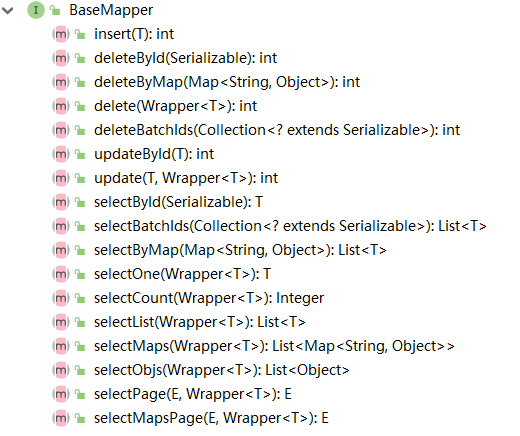

官网说明：https://baomidou.com/pages/49cc81/#service-crud-%E6%8E%A5%E5%8F%A3

# 1 插入操作

## 1.1 方法定义

插入一条记录

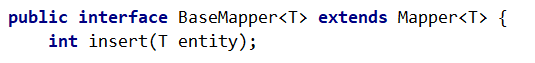

## 1.2 测试用例

```java
@RunWith(SpringRunner.class)
@SpringBootTest
class TurboMpSpringbootApplicationTests {

    @Autowired
    private UserMapper userMapper;

    @Test
    public void testInsert(){
        User user = new User();
        user.setAge(18);
        user.setName("echo");
        user.setEmail("echo@126.com");
        // 返回的insert是受影响的行数，并不是自增后的id
        int insert = userMapper.insert(user);
        System.out.println(insert);
        System.out.println(user.getId());
    }
}
```

结果：

```xml
1
1536542121278881794
```

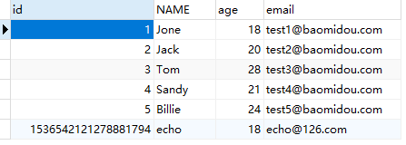

可以看到，数据已经写入到了数据库。但是，id的值不正确，期望的是数据库自增，实际是MP生成了id的值写入到了数据。

**如何设置id的生成策略？**

MP支持的id策略：

```java
package com.baomidou.mybatisplus.annotation;

import lombok.Getter;

/**
 * 生成ID类型枚举类
 *
 * @author hubin
 * @since 2015-11-10
 */
@Getter
public enum IdType {
    /**
     * 数据库ID自增
     */
    AUTO(0),
    /**
     * 该类型为未设置主键类型(注解里等于跟随全局,全局里约等于 INPUT)
     */
    NONE(1),
    /**
     * 用户输入ID
     * <p>该类型可以通过自己注册自动填充插件进行填充</p>
     */
    INPUT(2),

    /* 以下3种类型、只有当插入对象ID 为空，才自动填充。 */
    /**
     * 分配ID (主键类型为number或string）,
     * 默认实现类 {@link com.baomidou.mybatisplus.core.incrementer.DefaultIdentifierGenerator}(雪花算法)
     *
     * @since 3.3.0
     */
    ASSIGN_ID(3),
    /**
     * 分配UUID (主键类型为 string)
     * 默认实现类 {@link com.baomidou.mybatisplus.core.incrementer.DefaultIdentifierGenerator}(UUID.replace("-",""))
     */
    ASSIGN_UUID(4),
    /**
     * @deprecated 3.3.0 please use {@link #ASSIGN_ID}
     */
    @Deprecated
    ID_WORKER(3),
    /**
     * @deprecated 3.3.0 please use {@link #ASSIGN_ID}
     */
    @Deprecated
    ID_WORKER_STR(3),
    /**
     * @deprecated 3.3.0 please use {@link #ASSIGN_UUID}
     */
    @Deprecated
    UUID(4);

    private final int key;

    IdType(int key) {
        this.key = key;
    }
}
```

修改User对象

```java
@Data
@NoArgsConstructor
@AllArgsConstructor
@TableName("td_user")
public class User {

    @TableId(type = IdType.AUTO)
    private Long id;
    private String name;
    private Integer age;
    private String email;
}
```

数据插入成功：

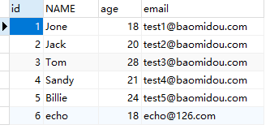

## 1.3 @TableField

官网说明：https://baomidou.com/pages/223848/#tablefield

在MP中通过@TableField注解可以指定自定字段的一些属性，常常解决的问题有两个：

1. 对象中的属性和字段名不一致的问题（非驼峰）
2. 对象中的属性字段在表中不存在的问题

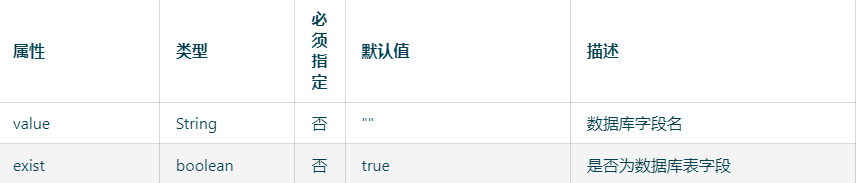

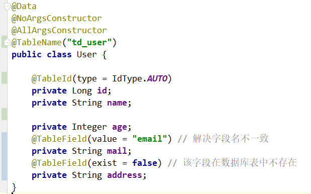

其他用法，如大的字段不加入查询：

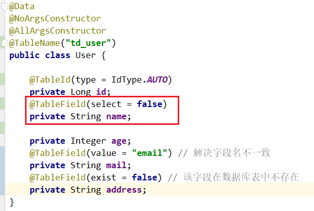

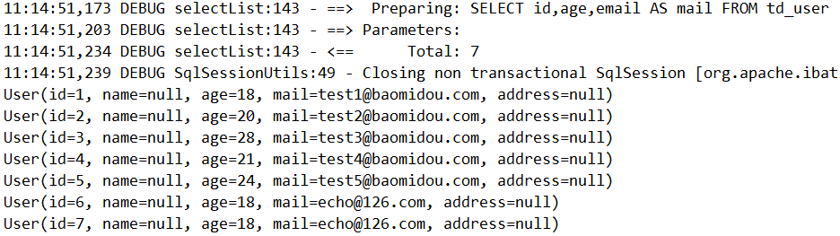


# 2 更新操作

在MP中，更新操作有两种，一种是根据id更新，另一种是根据条件更新。

## 2.1 根据id更新

方法定义：

```java
// 根据 ID 修改
int updateById(@Param(Constants.ENTITY) T entity);
```

测试：

```java
@Autowired
private UserMapper userMapper;

@Test
public void testUpdateById(){
    User user = new User();
    user.setId(6L);
    user.setAge(21);
    // 根据id更新不为null的字段
    userMapper.updateById(user);
}
```

结果：

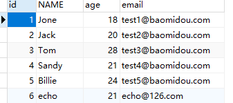

## 2.2 根据条件更新

方法定义：

```java
// 根据 whereWrapper 条件，更新记录
/**
* 根据 whereEntity 条件，更新记录 
*
* @param entity        实体对象 (set 条件值,可以为 null)
* @param updateWrapper 实体对象封装操作类（可以为 null,⾥⾯的 entity ⽤于⽣成 where 语句）
*/
int update(@Param(Constants.ENTITY) T updateEntity, @Param(Constants.WRAPPER) Wrapper<T> whereWrapper);
```

测试用例：

```java
@Autowired
private UserMapper userMapper;

@Test
public void testUpdate(){
    User user = new User();
    user.setAge(23); // 更新的字段

    // 更新条件
    QueryWrapper<User> wrapper = new QueryWrapper<>();
    wrapper.eq("id",6);

    // 执行更新操作
    int update = userMapper.update(user, wrapper);
    System.out.println("result="+update);
}
```

或者通过UpdateWrapper进行更新：

```java
@Test
public void testUpdate(){
    // 更新的条件以及字段
    UpdateWrapper<User> updateWrapper = new UpdateWrapper<>();
    updateWrapper.eq("id",6).set("age",20);

    // 执行更新操作
    int update = userMapper.update(null,updateWrapper);
    System.out.println("result="+update);
}
```

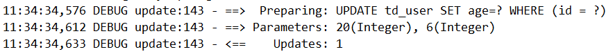

均可达到更新的效果。

关于wrapper更多的用法后面会详细讲解。

# 3 删除操作

```java
// 根据 entity 条件，删除记录
/**
* 根据 entity 条件，删除记录
*
* @param wrapper 实体对象封装操作类（可以为 null） 
*/
int delete(@Param(Constants.WRAPPER) Wrapper<T> wrapper);
// 删除（根据ID 批量删除）
// @param idList 主键ID列表(不能为 null 以及 empty)
int deleteBatchIds(@Param(Constants.COLLECTION) Collection<? extends Serializable> idList);
// 根据 ID 删除
int deleteById(Serializable id);

// 根据 columnMap 条件，删除记录
/**
* 根据 columnMap 条件，删除记录 
*
* @param columnMap 表字段 map 对象 
*/
int deleteByMap(@Param(Constants.COLUMN_MAP) Map<String, Object> columnMap);

```

## 3.1 deleteById

测试用例

```java
@Autowired
private UserMapper userMapper;

@Test
public void testDeleteById(){
    // 执行删除操作
    int delete = userMapper.deleteById(6L);
    System.out.println("result="+delete);
}
```

结果：

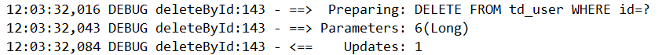

## 3.2 deleteByMap

测试用例

```java
@Autowired
private UserMapper userMapper;

@Test
public void testDeleteByMap(){
    Map<String,Object> columnMap = new HashMap<>();
    columnMap.put("name","echo");
    columnMap.put("age",22);
    // 将 columnMap 中的元素设置为删除的条件，多个之间为 and 关系
    int byMap = userMapper.deleteByMap(columnMap);
    System.out.println("result="+byMap);
}
```

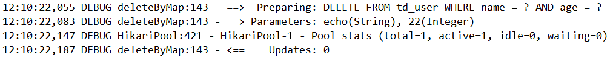

## 3.3 delete

测试用例：

```java
@Autowired
private UserMapper userMapper;

@Test
public void testDelete(){
    User user = new User();
    user.setName("echo");
    user.setAge(21);

    // 将实体对象进行包装，包装为操作条件
    QueryWrapper<User> userQueryWrapper = new QueryWrapper<>(user);
    int delete = userMapper.delete(userQueryWrapper);
    System.out.println("result="+delete);
}
```

结果：

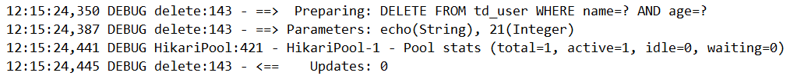

## 3.4 deleteBatchIds

测试用例：

```java
@Autowired
private UserMapper userMapper;

@Test
public void testDeleteBatchIds(){
    int result = userMapper.deleteBatchIds(Arrays.asList(10L, 11L));
    System.out.println("result="+result);
}
```

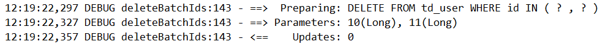

# 4 查询操作

MP提供了多种查询操作，包括根据id查询、批量查询、查询单条数据、查询列表、分页查询等操作。

```java
// 根据 ID 查询
T selectById(Serializable id);

// 根据 entity 条件，查询一条记录
/**
* 根据 entity 条件，查询⼀条记录 
*
* @param queryWrapper 实体对象封装操作类（可以为 null） 
*/
T selectOne(@Param(Constants.WRAPPER) Wrapper<T> queryWrapper);

// 查询（根据ID 批量查询）
List<T> selectBatchIds(@Param(Constants.COLLECTION) Collection<? extends Serializable> idList);
// 根据 entity 条件，查询全部记录
/**
* 根据 entity 条件，查询全部记录 
*
* @param queryWrapper 实体对象封装操作类（可以为 null） 
*/
List<T> selectList(@Param(Constants.WRAPPER) Wrapper<T> queryWrapper);
// 查询（根据 columnMap 条件）
List<T> selectByMap(@Param(Constants.COLUMN_MAP) Map<String, Object> columnMap);
// 根据 Wrapper 条件，查询全部记录
List<Map<String, Object>> selectMaps(@Param(Constants.WRAPPER) Wrapper<T> queryWrapper);
// 根据 Wrapper 条件，查询全部记录。注意： 只返回第一个字段的值
List<Object> selectObjs(@Param(Constants.WRAPPER) Wrapper<T> queryWrapper);

// 根据 entity 条件，查询全部记录（并翻页）
/**
* 根据 entity 条件，查询全部记录（并翻⻚） 
*
* @param page         分⻚查询条件（可以为 RowBounds.DEFAULT） 
* @param queryWrapper 实体对象封装操作类（可以为 null）
*/
IPage<T> selectPage(IPage<T> page, @Param(Constants.WRAPPER) Wrapper<T> queryWrapper);
// 根据 Wrapper 条件，查询全部记录（并翻页）
IPage<Map<String, Object>> selectMapsPage(IPage<T> page, @Param(Constants.WRAPPER) Wrapper<T> queryWrapper);

// 根据 Wrapper 条件，查询总记录数
/**
* 根据 Wrapper 条件，查询总记录数 
*
* @param queryWrapper 实体对象封装操作类（可以为 null） 
*/
Integer selectCount(@Param(Constants.WRAPPER) Wrapper<T> queryWrapper);

```

## 4.1 selectById

测试用例：

```java
@Autowired
private UserMapper userMapper;

@Test
public void testSelectById(){
    // 根据id查询数据
    User user = userMapper.selectById(5L);
    System.out.println(user);
}
```

结果：

```java
User(id=5, name=null, age=24, mail=test5@baomidou.com)
```

## 4.2 selectBatchIds

测试用例：

```java
@Autowired
private UserMapper userMapper;

@Test
public void testSelectBatchIds(){
    // 根据id集合批量查询
    List<User> users = userMapper.selectBatchIds(Arrays.asList(1L, 2L, 3L));
    for (User user : users) {
        System.out.println(user);
    }
}
```

结果：

```java
User(id=1, name=Jone, age=18, mail=test1@baomidou.com)
User(id=2, name=Jack, age=20, mail=test2@baomidou.com)
User(id=3, name=Tom, age=28, mail=test3@baomidou.com)
```


## 4.3 selectOne

```java
@Autowired
private UserMapper userMapper;

@Test
public void testSelectOne(){
    QueryWrapper<User> wrapper = new QueryWrapper<>();
    wrapper.eq("name","Billie");
    // 根据条件查询一条数据，如果结果超过一条会报错
    User user = userMapper.selectOne(wrapper);
    System.out.println(user);
}
```

结果：

```java
User(id=5, name=Billie, age=24, mail=test5@baomidou.com)
```


## 4.4 selectCount

测试用例：

```java
@Autowired
private UserMapper userMapper;

@Test
public void testSelectCount(){
    QueryWrapper<User> queryWrapper = new QueryWrapper<>();
    queryWrapper.gt("age",20);

    // 根据条件查询数据条数
    Integer count = userMapper.selectCount(queryWrapper);
    System.out.println("result="+count);
}
```

结果：

```java
result=3
```


## 4.5 selectList

测试用例：

```java
@Autowired
private UserMapper userMapper;

@Test
public void testSelectList(){
    QueryWrapper<User> wrapper = new QueryWrapper<>();
    wrapper.gt("age",20);

    // 根据条件查询数据
    List<User> users = userMapper.selectList(wrapper);
    for (User user : users) {
        System.out.println(user);
    }
}
```

结果：

```java
User(id=3, name=Tom, age=28, mail=test3@baomidou.com)
User(id=4, name=Sandy, age=21, mail=test4@baomidou.com)
User(id=5, name=Billie, age=24, mail=test5@baomidou.com)
```


## 4.6 selectPage

测试用例：

```java
@Autowired
private UserMapper userMapper;

@Test
public void testSelectPage(){
    QueryWrapper<User> wrapper = new QueryWrapper<>();
    wrapper.gt("age",20);

    Page<User> page = new Page<>();
    page.setCurrent(1);
    page.setSize(1);
    Page<User> userPage = userMapper.selectPage(page, wrapper);
    System.out.println("数据总条数："+userPage.getTotal());
    System.out.println("总页数："+userPage.getPages());

    List<User> records = userPage.getRecords();
    for (User user : records) {
        System.out.println(user);
    }
}
```

结果：

```java
数据总条数：3
总页数：3
User(id=3, name=Tom, age=28, mail=test3@baomidou.com)
```


# 5 SQL注入原理