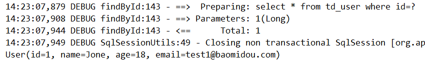

> 4 配置

在MP中有大量的配置，其中一部分是Mybatis原生的配置，另一部分是 MP 的配置，详情：https://baomidou.com/pages/56bac0/#%E5%9F%BA%E6%9C%AC%E9%85%8D%E7%BD%AE

下面对常用的配置做讲解

# 1 基本配置

## 1.1 configLocation

Mybatis 配置文件位置，如果有单独的Mybatis配置，请将其路径配置到 configLocation 中。Mybatis Configuration 的具体内容参考 Mybatis 官方文档

Spring Boot:

```properties
mybatis-plus.config-location=classpath:mybatis-config.xml
```

Spring :

```xml
<bean id="sqlSessionFactory" class="com.baomidou.mybatisplus.extension.spring.MybatisSqlSessionFactoryBean">
    <property name="configuration" value="classpath:mybatis-config.xml"/><!--非必须-->
</bean>
```


## 1.2 mapperLocations

Mybatis Mapper 所对应的 XML 文件位置，如果你在 Mapper 中有自定义方法（XML中有自定义实现），需要进行该配置，告诉 Mapper 所对应的 XML 文件位置

SpringBoot:

```properties
mybatis-plus.mapper-locations=classpath*:mybatis/*.xml
```

Spring：

```xml
<bean id="sqlSessionFactory" class="com.baomidou.mybatisplus.extension.spring.MybatisSqlSessionFactoryBean">
    <property name="mapperLocations" ref="classpath*:mybatis/*.xml"/>
</bean>
```

> **Maven 多模块项目的扫描路径需以 `classpath*:` 开头 （即加载多个 jar 包下的 XML 文件）**

测试：

UserMapper.xml

```xml
<?xml version="1.0" encoding="UTF-8" ?>
<!DOCTYPE mapper
        PUBLIC "-//mybatis.org//DTD Mapper 3.0//EN"
        "http://mybatis.org/dtd/mybatis-3-mapper.dtd">

<mapper namespace="com.turbo.mapper.UserMapper">
    <!--namespace:名称空间 与 id 组成sql的唯一标识-->

    <!--resultType:表明返回值类型-->
    <select id="findById" resultType="com.turbo.pojo.User">
        select * from td_user where id=#{id}
    </select>

</mapper>
```

UserMapper.java

```java
public interface UserMapper extends BaseMapper<User> {

    User findById(Long id);
}
```

测试用例：

```java
@Autowired
private UserMapper userMapper;

@Test
public void test02(){
    User user = userMapper.findById(1L);
    System.out.println(user);
}
```

运行结果：



## 1.3 typeAliasesPackage

Mybatis 别名包扫描路径，通过该属性可以给包中的类注册别名，注册后在 Mapper 对应的 XML 文件中可以直接使用类名，而不用使用全限定的类名（即 XML 中调用的时候不用包含包名）。

SpringBoot:

```properties
mybatis-plus.type-aliases-package=com.turbo.pojo
```

Spring：

```xml
<!--这里使用MP提供的sqlSessionFactory,完成Spring与mp的整合-->
<bean id="sqlSessionFactory" class="com.baomidou.mybatisplus.extension.spring.MybatisSqlSessionFactoryBean">
    <property name="typeAliasesPackage" value="com.turbo.pojo"/>
</bean>
```


# 2 进阶配置

本部分（Configuration）的配置大都为 Mybatis 原生支持的配置，这意味着你可以通过 Mybatis XML 配置文件的形式进行配置。

## 2.1 mapUnderscoreToCamelCase

- 类型：`boolean`
- 默认值：`true`

是否开启自动驼峰命名规则（camel case）映射，即从经典数据库列名 A_COLUMN（下划线命名）到经典 Java 属性名 aColumn（驼峰命名）的类似映射。

> 注意：
>
> 此属性在 Mybatis 中原默认值为 false，在 Mybatis-Plus 中，此属性也将用于生成最终的 SQL 的 select body
>
> 如果你的数据库命名符合规则无需使用 `@TableField`注解指定数据库字段名

示例（SpringBoot）：

```properties
# 关闭自动驼峰映射，该参数不能和 mybatis-plus.config-locations 同时存在
mybatis-plus.configuration.map-underscore-to-camel-case=false
```


## 2.2 cacheEnabled

- 类型：`boolean`
- 默认值：`true`

全局的开启或关闭配置文件中的所有映射器已经配置的任何缓存，默认为true。

示例：

```properties
mybatis-plus.configuration.cache-enabled=false
```


# 3 DB策略配置

## 3.1 idType

- 类型：`com.baomidou.mybatisplus.annotation.IdType`
- 默认值：`ASSIGN_ID`

全局默认主键类型，设置后，即可省略实体对象中的 @TableId(type=IdType.AUTO) 配置。

示例：

SpringBoot:

```properties
mybatis-plus.global-config.db-config.id-type=auto
```

Spring：

```xml
<!--这里使用MP提供的sqlSessionFactory,完成Spring与mp的整合-->
<bean id="sqlSessionFactory" class="com.baomidou.mybatisplus.extension.spring.MybatisSqlSessionFactoryBean">
    <property name="dataSource" ref="dataSource"/>
    <property name="mapperLocations" value="classpath*:mybatis/*.xml"/>
    <property name="typeAliasesPackage" value="com.turbo.pojo"/>
    <property name="globalConfig">
        <bean class="com.baomidou.mybatisplus.core.config.GlobalConfig">
            <property name="dbConfig">
                <bean class="com.baomidou.mybatisplus.core.config.GlobalConfig$DbConfig">
                    <property name="idType" value="AUTO"/>
                </bean>
            </property>
        </bean>
    </property>
</bean>
```

## 3.2 tablePrefix

- 类型：`String`
- 默认值：`null`

表名前缀，全局配置后可省略 @TableName() 配置

SpringBoot:

```properties
mybatis-plus.global-config.db-config.table-prefix=td_
```

Spring：

```xml
<!--这里使用MP提供的sqlSessionFactory,完成Spring与mp的整合-->
<bean id="sqlSessionFactory" class="com.baomidou.mybatisplus.extension.spring.MybatisSqlSessionFactoryBean">
    <property name="dataSource" ref="dataSource"/>
    <property name="mapperLocations" value="classpath*:mybatis/*.xml"/>
    <property name="typeAliasesPackage" value="com.turbo.pojo"/>
    <property name="globalConfig">
        <bean class="com.baomidou.mybatisplus.core.config.GlobalConfig">
            <property name="dbConfig">
                <bean class="com.baomidou.mybatisplus.core.config.GlobalConfig$DbConfig">
                    <property name="idType" value="AUTO"/>
                    <property name="tablePrefix" value="td_"/>
                </bean>
            </property>
        </bean>
    </property>
</bean>
```