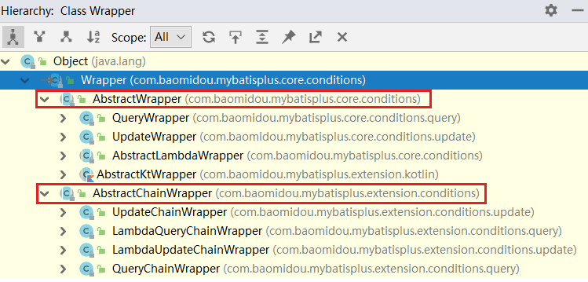

> 5 条件构造器

官网说明：https://baomidou.com/pages/10c804/#abstractwrapper

在 MP 中，Wrapper 接口的实现类关系如下：



可以看到，AbstractWrapper 和 AbstractChainWrapper 是重点实现，接下来重点学习 AbstractWrapper 及其子类。

> 说明：
>
> QueryWrapper（LambdaQueryWrapper）和  UpdateWrapper（LambdaUpdateWrapper）的父类用于生成 sql 的 where 条件，entity属性也用于生成 sql 的 where 条件。
>
> 注意：entity 生成的 where 条件与使用各个 api 生成的 where 条件**没有任何关联行为**


# 1 allEq

说明

```java
allEq(Map<R, V> params)
allEq(Map<R, V> params, boolean null2IsNull)
allEq(boolean condition, Map<R, V> params, boolean null2IsNull)
```

- 全部eq（或个别 isNull）

  > 个别参数说明：
  >
  > `params`：`key` 为数据库字段名，`value` 为字段值
  >
  > `null2IsNull`：为 `true` 则在 `map` 的 `value` 为 `null` 时调用 isNull，为 `false` 时则忽略 `value` 为 `null` 的。

- 例子1：`allEq({id:1,name:"老王",age:null})` --> `id = 1 and name = '老王' and age is null`

- 例子2：`allEq({id:1,name:"老王",age:null}, false)` --> `id = 1 and name = '老王'`


```java
allEq(BiPredicate<R, V> filter, Map<R, V> params)
allEq(BiPredicate<R, V> filter, Map<R, V> params, boolean null2IsNull)
allEq(boolean condition, BiPredicate<R, V> filter, Map<R, V> params, boolean null2IsNull) 
```

> 个别参数说明：
>
> `filter`：过滤函数，是否允许字段传入对比条件中
>
> `params` 与 `null2IsNull` ：同上

- 例子1：`allEq((k,v) -> k.indexOf("a") >= 0, {id:1,name:"老王",age:null})` --> `name = '老王' and age is null`
- 例子2：`allEq((k,v) -> k.indexOf("a") >= 0, {id:1,name:"老王",age:null}, false)` --> `name = '老王'`

测试用例

```java
@Autowired
    private UserMapper userMapper;

    @Test
    public void testWrapper(){
        Map<String,Object> params = new HashMap<>();
        params.put("name","echo");
        params.put("email",null);

        QueryWrapper<User> wrapper = new QueryWrapper<>();
        //wrapper.allEq(params);
        //List<User> users = userMapper.selectList(wrapper); // SELECT id,name,age,email FROM td_user WHERE (name = 'echo' AND email IS NULL)

        // wrapper.allEq(params,false);
        // List<User> users = userMapper.selectList(wrapper); // SELECT id,name,age,email FROM td_user WHERE (name = 'echo')
        
        wrapper.allEq((s,o)->s.indexOf("a")>0,params,false);
       /* wrapper.allEq(new BiPredicate<String, Object>() {
            @Override
            public boolean test(String s, Object o) {
                return s.indexOf("a")>0;
            }
        },params,false);*/
        List<User> users = userMapper.selectList(wrapper); // SELECT id,name,age,email FROM td_user WHERE (name = 'echo') 

        for (User user : users) {
            System.out.println(user);
        }

        for (User user : users) {
            System.out.println(user);
        }
    }
```


# 2 基本比较操作

- eq （等于 = ）
- ne（不等于 <>）
- gt（大于 >）
- ge（大于等于 >=）
- lt（小于 <）
- le（小于等于 <=）
- between （BETWEEN 值1 AND 值2）
- notBetween（NOT BETWEEN 值1 AND 值2）
- in（字段 IN (value.get(0), value.get(1), ...)）
- notIn（字段 NOT IN (value.get(0), value.get(1), ...)）

测试用例：

```java
@Autowired
private UserMapper userMapper;

@Test
public void testWrapper01(){
    QueryWrapper<User> queryWrapper = new QueryWrapper<>();
    queryWrapper.eq("email","echo@126.com")
        .gt("age",17).in("name","Tom","Jone","Jack","echo");
    // SELECT id,name,age,email FROM td_user WHERE (email = ? AND age > ? AND name IN (?,?,?))
    List<User> users = userMapper.selectList(queryWrapper);
    for (User user : users) {
        System.out.println(user);
    }
}
```


# 3 模糊查询

- like
  - LIKE '%值%'
  - 例: `like("name", "王")`--->`name like '%王%'`
- notLike
  - NOT LIKE '%值%'
  - `notLike("name", "王")`--->`name not like '%王%'`
- likeLeft
  - LIKE '%值'
  - `likeLeft("name", "王")`--->`name like '%王'`
- likeRight
  - LIKE '值%'
  - `likeRight("name", "王")`--->`name like '王%'`

测试用例

```java
@Autowired
private UserMapper userMapper;

@Test
public void testWrapperLike(){
    QueryWrapper<User> queryWrapper = new QueryWrapper<>();
    queryWrapper.like("name","e");

    // SELECT id,name,age,email FROM td_user WHERE (name LIKE ?) 
    List<User> users = userMapper.selectList(queryWrapper);
    for (User user : users) {
        System.out.println(user);
    }
}
```


# 4 排序

- orderBy
  - ORDER BY 字段, ...
  - `orderBy(true, true, "id", "name")`--->`order by id ASC,name ASC`
- orderByAsc
  - 排序：ORDER BY 字段, ... ASC
  - 例: `orderByAsc("id", "name")`--->`order by id ASC,name ASC`
- orderByDesc
  - 排序：ORDER BY 字段, ... DESC
  - 例: `orderByDesc("id", "name")`--->`order by id DESC,name DESC`


测试用例

```java
@Autowired
private UserMapper userMapper;

@Test
public void testWrapperOrder(){
    QueryWrapper<User> queryWrapper = new QueryWrapper<>();
    queryWrapper.like("name","e").orderByDesc("age","name");

    // SELECT id,name,age,email FROM td_user WHERE (name LIKE ?) ORDER BY age DESC,name DESC 
    List<User> users = userMapper.selectList(queryWrapper);
    for (User user : users) {
        System.out.println(user);
    }
}
```


# 5 逻辑查询

- or

  - 拼接 OR

    ```java
    or()
    or(boolean condition)
    ```

    > 注意事项:
    >
    > 主动调用`or`表示紧接着下一个**方法**不是用`and`连接!(不调用`or`则默认为使用`and`连接)

    例: `eq("id",1).or().eq("name","老王")`--->`id = 1 or name = '老王'`

  - or嵌套

    ```java
    or(Consumer<Param> consumer)
    or(boolean condition, Consumer<Param> consumer)
    ```

    例: `or(i -> i.eq("name", "李白").ne("status", "活着"))`--->`or (name = '李白' and status <> '活着')`

- and

  ```java
  and(Consumer<Param> consumer)
  and(boolean condition, Consumer<Param> consumer)
  ```

  - AND 嵌套
  - 例: `and(i -> i.eq("name", "李白").ne("status", "活着"))`--->`and (name = '李白' and status <> '活着')`


测试用例

```java
@Autowired
private UserMapper userMapper;

@Test
public void testWrapperOr(){
    QueryWrapper<User> queryWrapper = new QueryWrapper<>();
    // queryWrapper.eq("name","echo").or().eq("age",18); // SELECT id,name,age,email FROM td_user WHERE (name = ? OR age = ?)
    queryWrapper.and(i->i.eq("name","tom").ne("age",20)); // SELECT id,name,age,email FROM td_user WHERE ((name = ? AND age <> ?)) 

    List<User> users = userMapper.selectList(queryWrapper);
    for (User user : users) {
        System.out.println(user);
    }
}
```

# 6 select

在 MP 查询中，默认查询所有的字段，如果有需要也可以通过 select 方法进行指定字段。

```java
@Autowired
private UserMapper userMapper;

@Test
public void testWrapperSelect(){
    QueryWrapper<User> queryWrapper = new QueryWrapper<>();
    queryWrapper.eq("name","echo")
        .or()
        .eq("age",18)
        .select("name","age","email");

    // SELECT name,age,email FROM td_user WHERE (name = ? OR age = ?) 
    List<User> users = userMapper.selectList(queryWrapper);
    for (User user : users) {
        System.out.println(user);
    }
    // User(id=null, name=Jone, age=18, email=test1@baomidou.com)
    //User(id=null, name=echo, age=18, email=echo@126.com)
}
```


