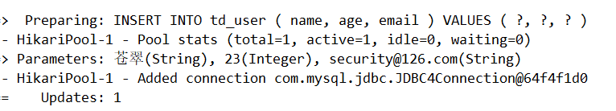
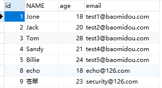
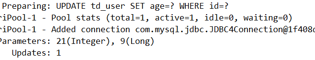
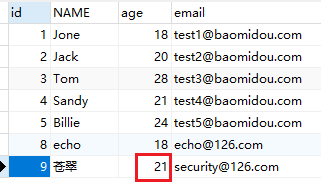
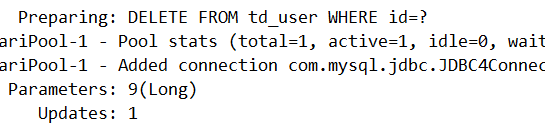
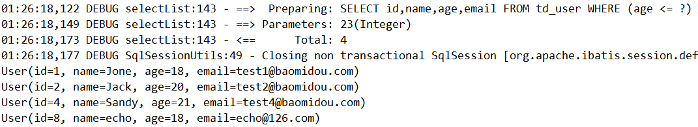

> 6 ActiveRecord

ActiveRecord（简称AR）一致广受动态语言（PHP、Ruby等）的喜爱，而 Java 作为静态语言，对于ActiveRecord 往往只能感叹其优雅，所以我们也在 AR 道路上进行一一定的探索，希望大家能够喜欢。

> **什么是 ActiveRecord？**
>
> ActiveRecod 也属于 ORM（对象关系映射）层，由 Rails 最早提出，遵循标准的 ORM模型：表映射到记录，记录映射到对象，字段映射到对象属性。配合遵循的命名和配置惯例，能够很大程度的快速实现模型的操作，而且简洁易懂。
>
> ActiveRecord的主要思想是：
>
> - 每一个数据表对应创建一个类，类的每一个对象实例对应于数据库中表的一行记录；通常表的每个字段在类中都有相应Field；
> - ActiveRecord同时负责把自己持久化，在ActiveRecord中封装了对数据库的访问，即CURD；
> - ActiveRecord 是一种领域模型（Domain Model），封装了部分业务逻辑；

# 1 开启AR之旅

在MP中，开启AR非常简单，只需要将实体对象继承 Model 即可

```java
package com.turbo.pojo;

import com.baomidou.mybatisplus.annotation.IdType;
import com.baomidou.mybatisplus.annotation.TableField;
import com.baomidou.mybatisplus.annotation.TableId;
import com.baomidou.mybatisplus.annotation.TableName;
import com.baomidou.mybatisplus.extension.activerecord.Model;
import lombok.AllArgsConstructor;
import lombok.Data;
import lombok.NoArgsConstructor;

@Data
@NoArgsConstructor
@AllArgsConstructor
public class User extends Model<User> {

    @TableId(type = IdType.AUTO)
    private Long id;
    private String name;
    private Integer age;
    private String email;
}
```


# 2 根据主键查询

```java
@RunWith(SpringRunner.class)
@SpringBootTest
public class UserMapperARTest {

    @Autowired
    private UserMapper userMapper;

    @Test
    public void testSelectById(){
        User user = new User();
        user.setId(2L);

        User user1 = user.selectById();
        System.out.println(user1);
    }
}
```


# 3 新增数据

```java
@RunWith(SpringRunner.class)
@SpringBootTest
public class UserMapperARTest {
    @Test
    public void testInsert(){
        User user = new User();
        user.setAge(23);
        user.setName("苍翠");
        user.setEmail("security@126.com");

        boolean insert = user.insert();
        System.out.println(insert);
    }
}
```





# 4 更新操作

```java
@RunWith(SpringRunner.class)
@SpringBootTest
public class UserMapperARTest {

    @Test
    public void testUpdateById(){
        User user = new User();
        user.setId(9L);
        user.setAge(21);

        boolean b = user.updateById();
        System.out.println(b);
    }
}
```





# 5 删除操作

```java
@RunWith(SpringRunner.class)
@SpringBootTest
public class UserMapperARTest {

    @Test
    public void testDelete(){
        User user = new User();
        user.setId(9L);

        boolean b = user.deleteById();
        System.out.println(b);
    }
}
```




# 6 根据条件查询

```java
@RunWith(SpringRunner.class)
@SpringBootTest
public class UserMapperARTest {

    @Test
    public void testSelect(){
        User user = new User();
        QueryWrapper<User> queryWrapper = new QueryWrapper<>();
        queryWrapper.le("age",23);

        List<User> users = user.selectList(queryWrapper);
        for (User user1 : users) {
            System.out.println(user1);
        }
    }
}
```

结果：

