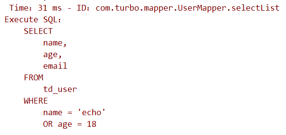

> 7 插件

# 1 Mybatis 的插件机制

Mybatis 允许你在已映射语句执行过程中的某一点进行拦截调用。默认情况下，Mybatis 允许使用插件来拦截的方法调用包括：

1. Executor（update, query, flushStatements, commit, rollback, getTransaction, close, isClosed）
2. ParameterHandler（getParameterObject，setParameters）
3. ResultSetHandler（handleResultSets, handleOutputParameters）
4. StatementHandler（prepare, parameterize, batch, update, query）

我们看到了可以拦截Executor接口的部分方法，比如 update，query，commit，rollback 等方法，还有其他接口的一些方法等。

总体概括为：

1. 拦截执行器的方法
2. 拦截参数的处理
3. 拦截结果集的处理
4. 拦截Sql语法构建的处理

拦截器示例：

```java
package com.turbo.plugin;

import org.apache.ibatis.executor.Executor;
import org.apache.ibatis.mapping.MappedStatement;
import org.apache.ibatis.plugin.*;

import java.util.Properties;

@Intercepts({
        @Signature(type = Executor.class,
                method = "update",
                args = {MappedStatement.class,Object.class})
})
public class MyInterceptor implements Interceptor {

    /**
     * 拦截方法：只要被拦截的目标对象的目标方法执行时，每次都会执行 intercept方法
     * @param invocation
     * @return
     * @throws Throwable
     */
    @Override
    public Object intercept(Invocation invocation) throws Throwable {
        System.out.println("增强逻辑");
        return invocation.proceed();
    }


    /**
     * 主要是为了把这个拦截器生成一个代理对象，放到拦截器链中
     * @param target 拦截的对象
     * @return 代理对象
     */
    @Override
    public Object plugin(Object target) {
        System.out.println("将要包装的目标对象："+target);
        return Plugin.wrap(target,this);
    }

    /**
     * 获取配置文件的属性
     * 插件初始化的调用，也只调用一次，插件配置的属性从这里设置进来
     * @param properties
     */
    @Override
    public void setProperties(Properties properties) {
        System.out.println("插件配置的初始化参数："+properties);
    }
}
```

SpringBoot 注入到 Spring 容器

```java
@Configuration
public class MybatisPlusConfig {

    /**
     * 自定义插件
     * @return
     */
    @Bean
    public MyInterceptor myInterceptor(){
        return new MyInterceptor();
    }
}
```

或者通过 xml 配置，mybatis-config.xml

```xml
<?xml version="1.0" encoding="UTF-8" ?>
<!DOCTYPE configuration
        PUBLIC "-//mybatis.org//DTD Config 3.0//EN"
        "http://mybatis.org/dtd/mybatis-3-config.dtd">
<configuration>
    <plugins>
        <plugin interceptor="com.turbo.plugin.MyPlugin">
            <property name="name" value="bob"/>
        </plugin>        
    </plugins>
</configuration>    
```


# 2 执行分析插件

在 MP 中提供了对 SQL 执行分析的插件，可用作阻断全表更新、删除的操作，注意：该插件仅适用于开发环境，不适用于生产环境。

SpringBoot 配置：

```java
@Configuration
public class MybatisPlusConfig {

    @Bean
    public SqlExplainInterceptor sqlExplainInterceptor(){
        SqlExplainInterceptor sqlExplainInterceptor = new SqlExplainInterceptor();
        List<ISqlParser> sqlParserList = new ArrayList<>();
		// 攻击 sql 阻断解析器，加入解析连
        sqlParserList.add(new BlockAttackSqlParser());
        sqlExplainInterceptor.setSqlParserList(sqlParserList);
        return sqlExplainInterceptor;
    }
}
```

测试：

```java
@Test
public void testUpdate2(){
    User user = new User();
    user.setAge(20);
    int result = this.userMapper.update(user, null);
    System.out.println("result = " + result);
}
```

结果：

```xml
Caused by: com.baomidou.mybatisplus.core.exceptions.MybatisPlusException: Prohibition of table update operation
	at com.baomidou.mybatisplus.core.toolkit.ExceptionUtils.mpe(ExceptionUtils.java:49)
	at com.baomidou.mybatisplus.core.toolkit.Assert.isTrue(Assert.java:38)
	at com.baomidou.mybatisplus.core.toolkit.Assert.notNull(Assert.java:72)
	at com.baomidou.mybatisplus.extension.parsers.BlockAttackSqlParser.processUpdate(BlockAttackSqlParser.java:45)
	at com.baomidou.mybatisplus.core.parser.AbstractJsqlParser.processParser(AbstractJsqlParser.java:94)
	at com.baomidou.mybatisplus.core.parser.AbstractJsqlParser.parser(AbstractJsqlParser.java:69)
	at com.baomidou.mybatisplus.extension.handlers.AbstractSqlParserHandler.sqlParser(AbstractSqlParserHandler.java:76)
	at com.baomidou.mybatisplus.extension.plugins.SqlExplainInterceptor.intercept(SqlExplainInterceptor.java:65)
	at org.apache.ibatis.plugin.Plugin.invoke(Plugin.java:61)
	at com.sun.proxy.$Proxy93.update(Unknown Source)
	at java.base/jdk.internal.reflect.NativeMethodAccessorImpl.invoke0(Native Method)
	at java.base/jdk.internal.reflect.NativeMethodAccessorImpl.invoke(NativeMethodAccessorImpl.java:62)
	at java.base/jdk.internal.reflect.DelegatingMethodAccessorImpl.invoke(DelegatingMethodAccessorImpl.java:43)
	at java.base/java.lang.reflect.Method.invoke(Method.java:566)
	at org.apache.ibatis.plugin.Invocation.proceed(Invocation.java:49)
	at com.turbo.plugin.MyInterceptor.intercept(MyInterceptor.java:25)
	at org.apache.ibatis.plugin.Plugin.invoke(Plugin.java:61)
	at com.sun.proxy.$Proxy93.update(Unknown Source)
	at org.apache.ibatis.session.defaults.DefaultSqlSession.update(DefaultSqlSession.java:197)
	... 78 more
```

可以看到，当执行全表更新时，会抛出异常，这样有效防止了一些误操作。

# 3 性能分析插件

性能分析拦截器，用于输出每条 SQL 语句及其执行时间，可以设置最大执行时间，超过时间会抛出异常。

> 该插件只用于开发环境，不建议生产环境使用

配置：

SpringBoot：

```java
/**
     * 性能分析插件
     * <groupId>com.baomidou</groupId>
     * <artifactId>mybatis-plus-boot-starter</artifactId>
     * <version>3.1.1</version>
     * @return
     */
@Bean
public PerformanceInterceptor performanceInterceptor(){
    PerformanceInterceptor performanceInterceptor = new PerformanceInterceptor();
    performanceInterceptor.setMaxTime(100);
    performanceInterceptor.setFormat(true);
    return performanceInterceptor;
}
```

XML方式：

```xml
<?xml version="1.0" encoding="UTF-8" ?>
<!DOCTYPE configuration
        PUBLIC "-//mybatis.org//DTD Config 3.0//EN"
        "http://mybatis.org/dtd/mybatis-3-config.dtd">
<configuration>
    <!--加载外部 properties-->
    <properties resource="jdbc.properties"></properties>
    
    <plugins>
        <!--SQL执行性能分析，开发环境使用，线上不推荐。maxTime指的是sql最大执行时长-->
        <plugin interceptor="com.baomidou.mybatisplus.extension.plugins.PerformanceInterceptor">
            <property name="maxTime" value="100"/>
            <!--sql是否格式化 默认false-->
            <property name="format" value="true"/>
        </plugin>
    </plugins>
</configuration>    
```

执行结果：



可以看到，执行时间为 31 ms。如果将maxTime设置为1，那么该操作会抛出异常。

```properties
org.mybatis.spring.MyBatisSystemException: nested exception is org.apache.ibatis.exceptions.PersistenceException: 
### Error querying database.  Cause: com.baomidou.mybatisplus.core.exceptions.MybatisPlusException:  The SQL execution time is too large, please optimize ! 
### The error may exist in com/turbo/mapper/UserMapper.java (best guess)
### The error may involve com.turbo.mapper.UserMapper.selectList
```


# 4 乐观锁插件

## 4.1 主要使用场景

## 4.2 插件配置

## 4.3 注解实体字段

## 4.4 测试

## 4.5 特别说明