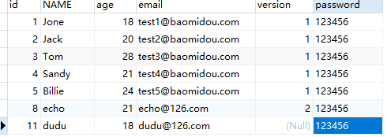

> 9th 自动填充功能

有些时候可能有这样的需求，插入或者更新数据时，希望有些字段可以自动填充数据，比如密码，version等。在MP中提供了这样的功能，可以实现自动填充。

# 1 添加@TableField注解

```java
@TableField(fill = FieldFill.INSERT) // 插入数据时进行填充
private String password;
```

为 password 添加自动填充功能，在新增数据时有效。

FieldFill 提供了多种模式选择：

```java
package com.baomidou.mybatisplus.annotation;

/**
 * 字段填充策略枚举类
 *
 * <p>
 * 判断注入的 insert 和 update 的 sql 脚本是否在对应情况下忽略掉字段的 if 标签生成
 * <if test="...">......</if>
 * 判断优先级比 {@link FieldStrategy} 高
 * </p>
 *
 * @author hubin
 * @since 2017-06-27
 */
public enum FieldFill {
    /**
     * 默认不处理
     */
    DEFAULT,
    /**
     * 插入时填充字段
     */
    INSERT,
    /**
     * 更新时填充字段
     */
    UPDATE,
    /**
     * 插入和更新时填充字段
     */
    INSERT_UPDATE
}
```


# 2 编写MyMetaObjectHandler

```java
package com.turbo.handler;

import com.baomidou.mybatisplus.core.handlers.MetaObjectHandler;
import org.apache.ibatis.reflection.MetaObject;
import org.springframework.stereotype.Component;

@Component
public class MyMetaObjectHandler implements MetaObjectHandler {
    @Override
    public void insertFill(MetaObject metaObject) {
        Object password = getFieldValByName("password", metaObject);
        if(null == password){
            // 字段为空可以填充
            setFieldValByName("password","123456",metaObject);
        }
    }

    @Override
    public void updateFill(MetaObject metaObject) {

    }
}
```


# 3 测试

```java
@Test
public void testInsert(){
    User user = new User();
    user.setAge(18);
    user.setName("dudu");
    user.setEmail("dudu@126.com");
    // 返回的insert是受影响的行数，并不是自增后的id
    int insert = userMapper.insert(user);
    System.out.println(insert);
    System.out.println(user.getId());
}
```

sql

```sql
17:44:39,765 DEBUG insert:143 - ==>  Preparing: INSERT INTO td_user ( name, age, email, password ) VALUES ( ?, ?, ?, ? ) 
17:44:39,798 DEBUG insert:143 - ==> Parameters: dudu(String), 18(Integer), dudu@126.com(String), 123456(String)
17:44:39,806 DEBUG HikariPool:729 - HikariPool-1 - Added connection com.mysql.jdbc.JDBC4Connection@45d8c017
17:44:39,823 DEBUG insert:143 - <==    Updates: 1

```

