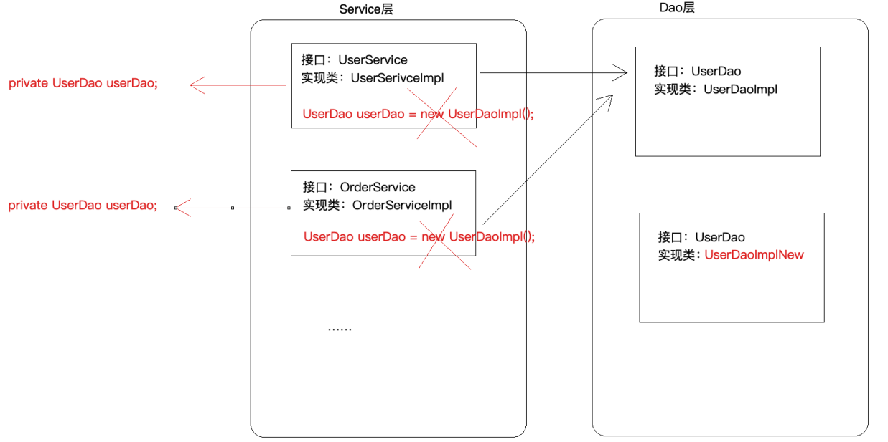

模块二 IoC容器设计实现及Spring源码分析

# 1 Spring概述

# 2 核心思想

注意：IoC和AOP不是spring提出来的，在spring之前就已经存在了，只不过更偏向于理论化，spring在技术层面把这两个思想做了非常好的实现（Java）。

## 2.1 IoC

### 2.1.1 什么是IoC

IoC（Inversion of Control）控制反转/反转控制，注意它是一个技术思想，不是一个技术实现。

描述的事情：Java开发领域对象的创建，管理的问题。

比如A依赖于B，IoC思想下，是由IoC容器（Spring框架）去帮助我们实例化对象并且管理它，我们需要使用哪个对象，去找IoC容器要即可。

为什么叫做控制反转？

控制：指的是对象创建（实例化，管理）的权利

反转：控制权利交给外部环境了（Spring框架、IoC容器）

### 2.1.2 IoC解决了什么问题

IoC解决对象之间的耦合问题

### 2.1.3 IoC和DI的区别

DI：Dependancy Injection（依赖注入）

IOC和DI描述的是同一件事，著不过角度不一样罢了

## 2.2 AOP

### 2.2.1 什么是AOP

AOP：Aspect oriented Programming 面向切面编程/面向方面编程

AOP是OOP的延续，从OOP说起

### 2.2.2 AOP在解决什么问题

在不改变原有的业务逻辑的情况下，增强横切逻辑代码，根本上解耦合，避免横切逻辑代码重复。

### 2.2.3 为什么叫做面向切面编程

# 3 手写实现IoC和AOP

# 4 Spring IoC应用

# 5 Spring IoC源码深度剖析

# 6 Spring AOP应用

# 7 Spring AOP源码深度剖析