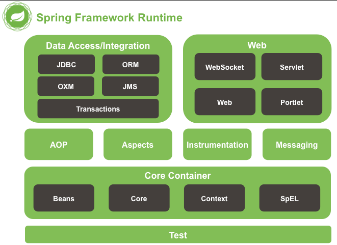
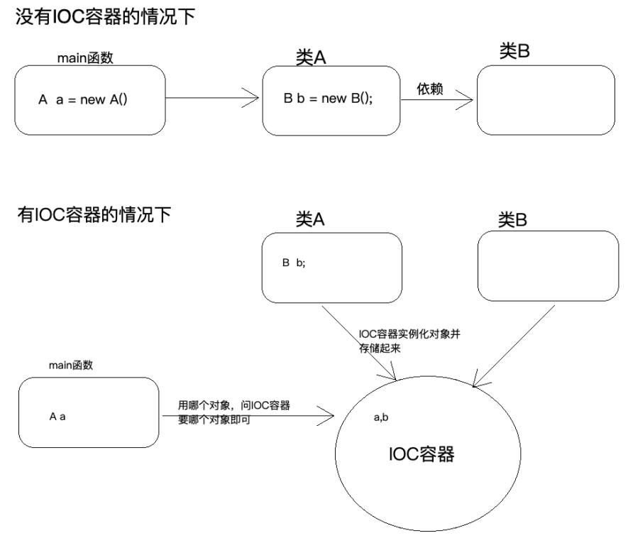
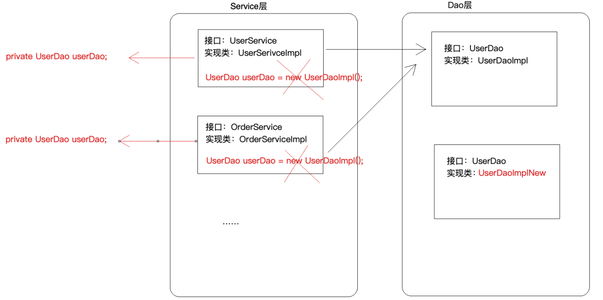
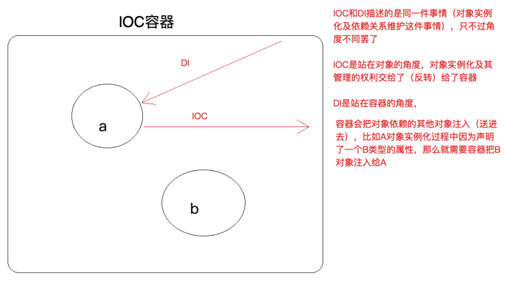

第一部分 Spring概述

# 1 Spring简介

Spring 是分层的 full-stack（全栈）轻量级开源框架，以 `IoC` 和 `AOP` 为内核，提供了展现层 SpringMVC 和 业务层事务事务管理等 众多的企业级应用技术，还整合开源世界众多著名的第三方框架和类库，已经成为使用最多的 Java EE 企业应用开源框架。

Spring 官方网址：https://spring.io/

我们常说的 Spring 其实指的是 Spring Framework（spring 框架）。

# 2 Spring发展历程

- 1997 年 IBM 提出了 EJB 的思想；1998 年，SUN 指定开发标准规范 EJB 1.0；1999 年，EJB 1.1 发布；2001 年，EJB 2.0 发布；2003年，EJB 2.1 发布；2006年，EJB 3.0 发布；

- Rod Johnson（Spring之父）

  - Expert One-to-One J2EE Design and Development（2002）阐述了J2EE使用 EJB 开发设计的优点以及解决方案
  - Expert One-to-One J2EE Development without EJB（2004）简述了J2EE 开发不使用 EJB 的解决方式（Spring 雏形）

  2017 年 9 月，发布了 Spring 的最新版本 Spring 5.0 通用版（GA）

# 3 Spring 的优势

> 整个 Spring 优势，传达出一个信号，Spring 是一个综合性，且有很强的思想性的框架，每学习一天，就能体会到它的一些优势。

- 方便解耦，简化开发

  通过 Spring 提供的 IoC 容器，可以将对象间的依赖关系交由 Spring 进行控制，避免硬编码所造成的过度程序耦合，用户也不必再为单例模式类，属性文件解析等这些底层的需求编写代码，可以更专注于上层的应用。

- AOP编程的支持

  通过 Spring 的 AOP 功能，方便进行面向切面的编程，许多不容易用传统 OOP 实现的功能可以通过 AOP 轻松应付。

- 声明式事务的支持

  @Transactional

  可以将我们从单调烦闷的事务管理代码中解脱出来，通过声明式方式灵活的进行事务的管理，提高开发效率和质量。

- 方便的程序测试

  可以用非容器依赖的编程方式进行几乎所有的测试工作，测试不再是昂贵的操作，而是随手可做的事情。

- 方便集成各种优秀框架

  Spring 可以降低各种框架的使用难度，提供了对各种优秀框架（Struts、Hibernate、Hessian、Quartz 等）的直接支持。

- 降低 JavaEE API 的使用难度

  Spring 对 JavaEE API（如 JDBC、JavaMail、远程调用等）进行了薄薄的封装层，使这些 API 的使用难度大为降低。

- 源码是经典的 Java 学习范例

  Spring 的源码设计精妙，结构清晰，处处体现着大师对 Java 设计模式灵活运用以及对 Java 技术的高深造诣。它的源码无意是 Java 技术的最佳实践的范例。

# 4 Spring 的核心结构

Spring 是一个分层非常清晰并且依赖关系，职责定位非常明确的轻量级框架，主要包括几个大模块：数据处理模块、Web模块、AOP（Aspect Oriented Programming）/ Aspect 模块、Core Container 模块和Test模块，如下图所示，Spring 依靠这些基本模块，实现了一个令人愉悦的融合了现有解决方案的零侵入的轻量级框架。

- Spring 核心容器（Core Container）：容器是 Spring 框架最核心的部分，它管理着 Spring 应用中 bean 的创建、配置和管理。在该模块中，包括了 Spring bean 工厂，它为 Spring 提供了 DI 的功能。基于bean工厂，我们还会发现有多种 Spring 应用上下文的实现。所有的 Spring 模块都构建于核心容器之上。

- 面向切面编程（AOP）/ Aspect ：Spring 对面向切面编程提供了丰富的支持。这个模块是 Spring 应用系统中开发切面的基础，于 DI 一样，AOP 可以帮助应用对象解耦。

- 数据访问与集成（Data Access/Integration）

  Spring 的 JDBC 和 DAO 模块封装了大量样板代码，这样可以使得数据库代码变得简单，也可以更专注于我们的业务，还可以避免数据库资源释放失败而引起的问题。另外，Spring AOP 为数据访问提供了事务管理服务，同时 Spring 还对 ORM 进行了集成，如 Hibernate、Mybatis 等。该模块由 JDBC、Transaction 、ORM、OXM 和 JMS 等模块组成。

- Web 该模块提供了 SpringMVC 框架给 Web 应用，还提供了多种构建和其他应用交互的远程调用方案。SpringMVC 框架在Web 层提升了应用的松耦合水平。

- Test 为了使得开发者能够很方便的进行测试，Spring 提供了测试模块以致力于Spring应用的测试。通过该模块，Spring为使用 Servlet、JNDI 等编写单元测试提供了一系列的 mock 对象实现。

# 5 Spring框架版本

## 1.4 Spring的核心结构

Spring Framework 不同版本对 jdk 的要求

------

# 2 核心思想

注意：IoC和AOP不是spring提出来的，在spring之前就已经存在了，只不过更偏向于理论化，spring在技术层面把这两个思想做了非常好的实现（Java）。

## 2.1 IoC

### 2.1.1 什么是IoC

IoC（Inversion of Control）控制反转/反转控制，注意它是一个技术思想，不是一个技术实现。

描述的事情：Java开发领域对象的创建，管理的问题。

比如A依赖于B，IoC思想下，是由IoC容器（Spring框架）去帮助我们实例化对象并且管理它，我们需要使用哪个对象，去找IoC容器要即可。

为什么叫做控制反转？

控制：指的是对象创建（实例化，管理）的权利

反转：控制权利交给外部环境了（Spring框架、IoC容器）

### 2.1.2 IoC解决了什么问题

IoC解决对象之间的耦合问题

### 2.1.3 IoC和DI的区别

DI：Dependancy Injection（依赖注入）

IOC和DI描述的是同一件事，只不过角度不一样罢了

## 2.2 AOP

### 2.2.1 什么是AOP

AOP：Aspect oriented Programming 面向切面编程/面向方面编程

AOP是OOP的延续，从OOP说起

### 2.2.2 AOP在解决什么问题

在不改变原有的业务逻辑的情况下，增强横切逻辑代码，根本上解耦合，避免横切逻辑代码重复。

### 2.2.3 为什么叫做面向切面编程

# 3 手写实现IoC和AOP

# 4 Spring IoC应用

## 4.1 Spring IoC基础

### 4.1.1 BeanFactory与ApplicationContext区别

BeanFactory是Spring框架中的IoC容器的顶层接口，它只是用来定义一些基础功能，定义一些基础规范。而ApplicationContext是它的一个子接口，所以ApplicationContext是具备BeanFactory提供的全部功能。

通常，我们称BeanFactory为Spring IoC的基础容器，ApplicationContext是高级接口，比BeanFactory要拥有更多的功能，比如说国际化支持和资源访问（xml，java配置类）等等。

启动IoC容器的方式

- Java环境下启动IoC容器
  - ClassPathXmlApplicationContext：从类的根路径下加载配置文件（推荐使用）
  - FileSystemXmlApplicationContext：从磁盘路径上加载配置文件
  - AnnotationConfigApplicationContext：纯注解模式下启动Spring容器
- Web环境下启动IoC容器
  - 从xml启动容器
  - 从配置类启动容器

# 5 Spring IoC源码深度剖析

# 6 Spring AOP应用

## 6.4 Spring种AOP实现

### 6.4.1 XML模式

**五种通知类型**

- 前置通知

- 正常执行通知

- 异常通知

- 最终通知

  执行时机：无论切入点方法执行是否产生异常，它都会在返回之前执行

- 环绕通知

### 6.4.2 XML+注解模式

### 6.4.3 注解模式

## 6.5 Spring声明式事务

### 6.5.1 事务回顾

#### 6.5.1.1 事务的概念

事务指逻辑上的一组操作，组成这组操作的各个单元，要么全部成功，要么全部不成功。从而确保了数据的准确与安全。

#### 6.5.1.2 事务的四大特性

原子性（Atomicity）

一致性（Consistency）

隔离性（Isolation）

永久性（Durability）

#### 6.5.1.3 事务的隔离级别

不考虑隔离级别，会出现以下情况：

- 脏读
- 不可重复读
- 幻读

数据库共定义了4中隔离级别，**级别依次升高，效率依次降低**

- Read uncommitted（读未提交）
- Read committed（读已提交）
- Repeatable read（可重复读）
- Serializable（串行化）

MySQL的默认隔离级别是：Repeatable Read

查询当前使用的隔离级别：`select @@tx_isolation;`

#### 6.5.1.4 事务的传播行为

事务往往在service层进行控制，如果出现service层方法A调用了另外一个service层方法B，A和B方法本身都已经被添加了事务控制，那么A调用B的时候，就需要进行事务的一些协商，这就叫做事务的传播行为。

A调用B，我们站在B的角度来观察定义事务的传播行为

| PROPAGATION_REQUIRED      | 如果已经存在一个事务中，加入到这个事务，如果当前没有事务，就新建一个事务，这是最常见的选择 |
| ------------------------- | ------------------------------------------------------------ |
| PROPAGATION_SUPPORTS      | 使用当前事务，如果当前没有事务，就以非事务方式执行。         |
| PROPAGATION_MANDATORY     | 使用当前事务，如果当前没有事务，就抛出异常。                 |
| PROPAGATION_REQUIRES_NEW  | 新建事务，如果当前存在事务，把当前事务挂起。                 |
| PROPAGATION_NOT_SUPPORTED | 以非事务方式执行，如果当前存在事务，就把当前事务挂起         |
| PROPAGATION_NEVER         | 以非事务方式执行，如果当前存在事务，则抛出异常               |
| PROPAGATION_NESTED        | 如果当前存在事务，则在嵌套事务内执行。如果当前没有事务，则执行与PROPAGATION_REQUIRED类似的操作。 |

# 7 Spring AOP源码深度剖析

