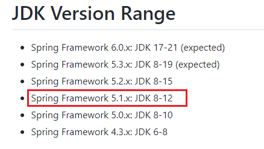

第一部分 Spring概述

# 1 Spring简介

Spring 是分层的 full-stack（全栈）轻量级开源框架，以 `IoC` 和 `AOP` 为内核，提供了展现层 SpringMVC 和 业务层事务事务管理等 众多的企业级应用技术，还整合开源世界众多著名的第三方框架和类库，已经成为使用最多的 Java EE 企业应用开源框架。

Spring 官方网址：https://spring.io/

我们常说的 Spring 其实指的是 Spring Framework（spring 框架）。

# 2 Spring发展历程

- 1997 年 IBM 提出了 EJB 的思想；1998 年，SUN 指定开发标准规范 EJB 1.0；1999 年，EJB 1.1 发布；2001 年，EJB 2.0 发布；2003年，EJB 2.1 发布；2006年，EJB 3.0 发布；

- Rod Johnson（Spring之父）

  - Expert One-to-One J2EE Design and Development（2002）阐述了J2EE使用 EJB 开发设计的优点以及解决方案
  - Expert One-to-One J2EE Development without EJB（2004）简述了J2EE 开发不使用 EJB 的解决方式（Spring 雏形）

  2017 年 9 月，发布了 Spring 的最新版本 Spring 5.0 通用版（GA）

# 3 Spring 的优势

> 整个 Spring 优势，传达出一个信号，Spring 是一个综合性，且有很强的思想性的框架，每学习一天，就能体会到它的一些优势。

- 方便解耦，简化开发

  通过 Spring 提供的 IoC 容器，可以将对象间的依赖关系交由 Spring 进行控制，避免硬编码所造成的过度程序耦合，用户也不必再为单例模式类，属性文件解析等这些底层的需求编写代码，可以更专注于上层的应用。

- AOP编程的支持

  通过 Spring 的 AOP 功能，方便进行面向切面的编程，许多不容易用传统 OOP 实现的功能可以通过 AOP 轻松应付。

- 声明式事务的支持

  @Transactional

  可以将我们从单调烦闷的事务管理代码中解脱出来，通过声明式方式灵活的进行事务的管理，提高开发效率和质量。

- 方便的程序测试

  可以用非容器依赖的编程方式进行几乎所有的测试工作，测试不再是昂贵的操作，而是随手可做的事情。

- 方便集成各种优秀框架

  Spring 可以降低各种框架的使用难度，提供了对各种优秀框架（Struts、Hibernate、Hessian、Quartz 等）的直接支持。

- 降低 JavaEE API 的使用难度

  Spring 对 JavaEE API（如 JDBC、JavaMail、远程调用等）进行了薄薄的封装层，使这些 API 的使用难度大为降低。

- 源码是经典的 Java 学习范例

  Spring 的源码设计精妙，结构清晰，处处体现着大师对 Java 设计模式灵活运用以及对 Java 技术的高深造诣。它的源码无意是 Java 技术的最佳实践的范例。

# 4 Spring 的核心结构

Spring 是一个分层非常清晰并且依赖关系，职责定位非常明确的轻量级框架，主要包括几个大模块：数据处理模块、Web模块、AOP（Aspect Oriented Programming）/ Aspect 模块、Core Container 模块和Test模块，如下图所示，Spring 依靠这些基本模块，实现了一个令人愉悦的融合了现有解决方案的零侵入的轻量级框架。

- Spring 核心容器（Core Container）：容器是 Spring 框架最核心的部分，它管理着 Spring 应用中 bean 的创建、配置和管理。在该模块中，包括了 Spring bean 工厂，它为 Spring 提供了 DI 的功能。基于bean工厂，我们还会发现有多种 Spring 应用上下文的实现。所有的 Spring 模块都构建于核心容器之上。

- 面向切面编程（AOP）/ Aspect ：Spring 对面向切面编程提供了丰富的支持。这个模块是 Spring 应用系统中开发切面的基础，于 DI 一样，AOP 可以帮助应用对象解耦。

- 数据访问与集成（Data Access/Integration）

  Spring 的 JDBC 和 DAO 模块封装了大量样板代码，这样可以使得数据库代码变得简单，也可以更专注于我们的业务，还可以避免数据库资源释放失败而引起的问题。另外，Spring AOP 为数据访问提供了事务管理服务，同时 Spring 还对 ORM 进行了集成，如 Hibernate、Mybatis 等。该模块由 JDBC、Transaction 、ORM、OXM 和 JMS 等模块组成。

- Web 该模块提供了 [SpringMVC](https://docs.spring.io/spring-framework/docs/current/reference/html/web.html) 框架给 Web 应用，还提供了多种构建和其他应用交互的远程调用方案。SpringMVC 框架在Web 层提升了应用的松耦合水平。

- Test 为了使得开发者能够很方便的进行测试，Spring 提供了测试模块以致力于Spring应用的测试。通过该模块，Spring为使用 Servlet、JNDI 等编写单元测试提供了一系列的 mock 对象实现。

# 5 Spring框架版本

Spring Framework 不同版本对 jdk 的要求 

https://github.com/spring-projects/spring-framework/wiki/Spring-Framework-Versions#jdk-version-range

我使用的 

Spring Framework 5.1.12 RELEASE

idea 2019.1

Maven 3.5.2
