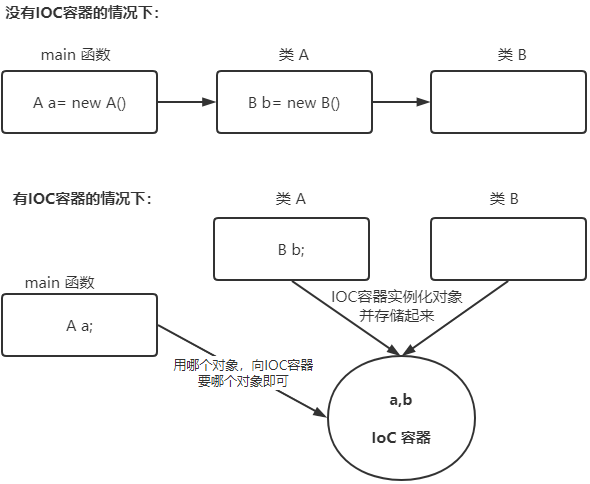
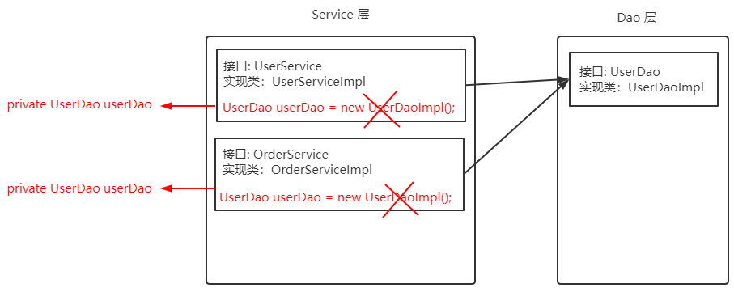
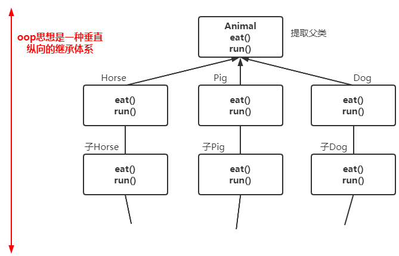
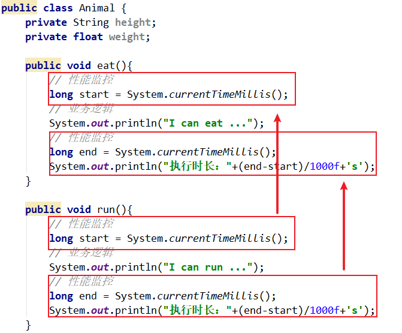
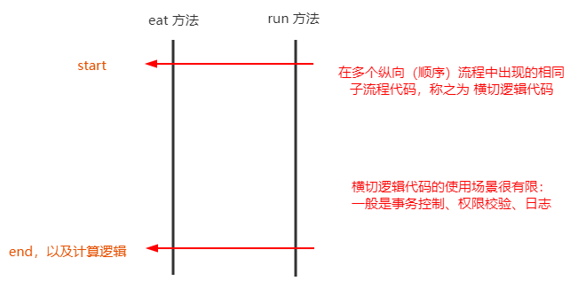

第二部分 Spring 核心思想

> 注意：IOC 和 AOP 不是 Spring 提出的，在Spring之前已经存在，只不过更偏向于理论化，Spring 在技术层面把这两个思想做了非常好的实现（Java）

# 1 IoC

## 1.1 什么是IoC

IoC （Inversion of Control 控制反转/反转控制），注意它是一个技术思想，不是一个技术实现。

描述的事情：Java 开发领域对象的创建，管理的问题

传统开发模式：比如类A依赖于类B，往往会在类A中 new 一个B的对象。

IoC 思想下开发方式：不需要自己去 new 对象了，而是由 IoC 容器（Spring 框架）去帮助我们实例化对象并且管理它，我们需要使用哪个对象，去向 IoC 容器要即可。

我们丧失了一个权力（创建、管理对象的权力），得到了一个福利（不用考虑对象的创建、管理等一系列事情）。

**为什么叫做控制反转？** 

控制：指的是对象创建（实例化、管理）的权利

反转：控制权交给外部环境了（Spring框架，IoC 容器）

## 1.2 IoC解决了什么问题

**IoC 解决对象之间的耦合问题**

## 1.3 IoC 和 DI 的区别

DI：Dependancy Injection（依赖注入）

IOC 和 DI 描述的是同一件事情，只不过角度不一样罢了。

> IOC 和 DI 描述的是同一间事情（对象实例化及依赖关系维护这件事情），只不过角度不同：
>
> IOC是站在对象的角度，对象实例化及其管理的权利交给了（反转给了）容器。
>
> DI是站在容器的角度 容器会把对象依赖的其他对象注入（送进去），比如A对象实例化过程中因为声明了一个 B 类型的属性，那么就需要容器把B对象注入给A

# 2 AOP

## 2.1 什么是 AOP

AOP：Aspect oriented Programming 面向切面编程/面向方面编程

AOP 是 OOP 的延续，从 OOP 说起：

OOP 三大特征：封装、继承 和 多态

OOP 是一种垂直继承体系：

OOP 编程思想可以解决大多数的代码重复问题，但是有一些情况是处理不了的，比如下面的在顶级父类 Animal 中的多个方法中相同为止出现了重复代码，OOP就无法解决了。

**横切逻辑代码**

横切逻辑代码存在什么问题：

- 横切代码重复问题
- 横切逻辑代码和业务代码混杂在一起，代码臃肿，维护不方便。

AOP 独辟蹊径提出横向抽取机制，将横切逻辑代码和业务逻辑分离。

代码拆分容易，那么如何在不改变原有业务逻辑的情况下，把横切逻辑代码应用到原有的业务逻辑中，达到和原来一样的效果？

## 2.2 AOP在解决什么问题

在不改变原有业务逻辑情况下，增强横切逻辑代码，根本上解耦合，避免横切逻辑代码重复。

## 2.3 为什么叫做面向切面编程

切：指的是横切逻辑，原有业务逻辑代码我们不能动，只能操作横切逻辑代码，所以面向横切逻辑。

面：横切逻辑代码往往要影响很多个方法，每一个方法都如同一个点，多个点构成面，有一个面的概念在里面。

