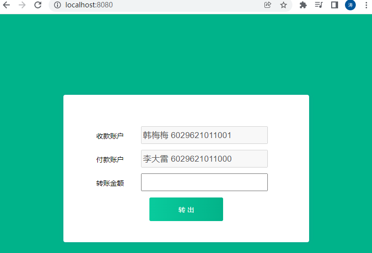
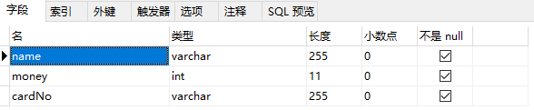
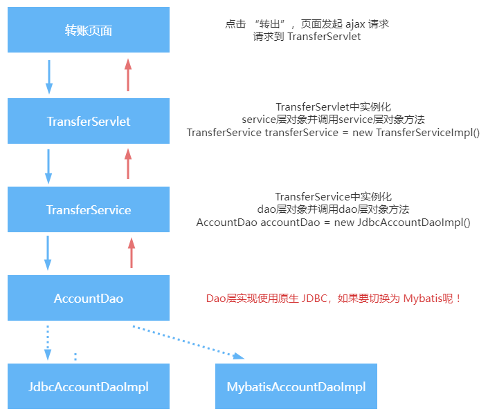
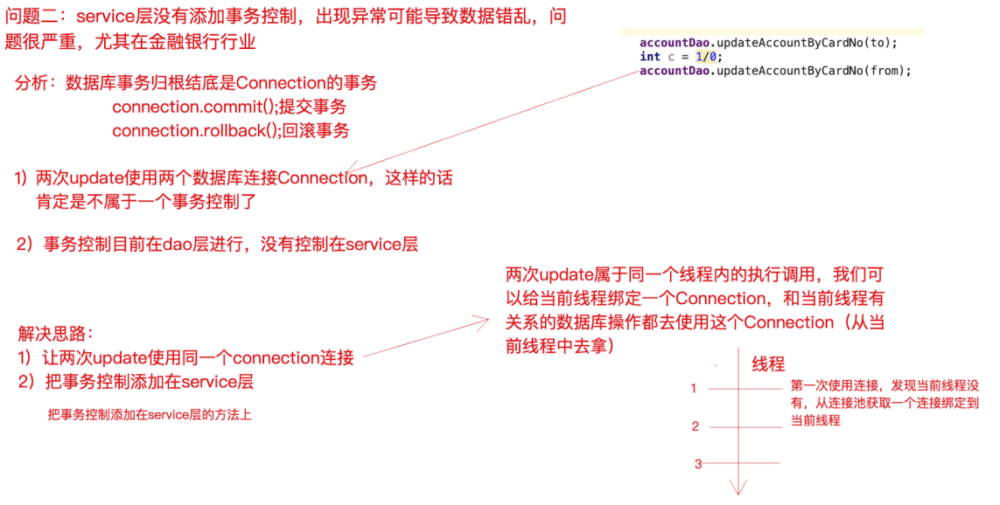

第三部分 手写实现 IOC 和 AOP

> 上一部分我们理解了 IoC 和 AOP 思想，我们先不考虑 Spring 是如何实现这两个思想的，此处准备一个 “银行转行” 的案例，请分析该案例在代码层次有什么问题？分析之后使用我们已有的知识解决这些问题。其实这个过程我们就是在一步步分析并手写实现 IoC 和 AOP。

案例原始代码：https://gitee.com/turboYuu/spring-1-2/blob/master/lab/turbo-transfer-%E4%BF%AE%E6%94%B9%E5%89%8D.zip

# 1 银行转账案例界面



# 2 银行转账案例表结构



# 3 银行转账案例代码调用关系



# 4 银行转账案例关键代码

1. TransferServlet

   ```java
   package com.turbo.edu.servlet;
   
   import com.turbo.edu.service.impl.TransferServiceImpl;
   import com.turbo.edu.utils.JsonUtils;
   import com.turbo.edu.pojo.Result;
   import com.turbo.edu.service.TransferService;
   
   import javax.servlet.ServletException;
   import javax.servlet.annotation.WebServlet;
   import javax.servlet.http.HttpServlet;
   import javax.servlet.http.HttpServletRequest;
   import javax.servlet.http.HttpServletResponse;
   import java.io.IOException;
   
   /**
    * @author turbo
    */
   @WebServlet(name="transferServlet",urlPatterns = "/transferServlet")
   public class TransferServlet extends HttpServlet {
   
       // 1. 实例化service层对象
       private TransferService transferService = new TransferServiceImpl();
   
       @Override
       protected void doGet(HttpServletRequest req, HttpServletResponse resp) throws ServletException, IOException {
           doPost(req,resp);
       }
   
       @Override
       protected void doPost(HttpServletRequest req, HttpServletResponse resp) throws ServletException, IOException {
   
           // 设置请求体的字符编码
           req.setCharacterEncoding("UTF-8");
   
           String fromCardNo = req.getParameter("fromCardNo");
           String toCardNo = req.getParameter("toCardNo");
           String moneyStr = req.getParameter("money");
           int money = Integer.parseInt(moneyStr);
   
           Result result = new Result();
   
           try {
   
               // 2. 调用service层方法
               transferService.transfer(fromCardNo,toCardNo,money);
               result.setStatus("200");
           } catch (Exception e) {
               e.printStackTrace();
               result.setStatus("201");
               result.setMessage(e.toString());
           }
   
           // 响应
           resp.setContentType("application/json;charset=utf-8");
           resp.getWriter().print(JsonUtils.object2Json(result));
       }
   }
   ```

2. TransferService 接口及实现类

   ```java
   package com.turbo.edu.service;
   
   /**
    * @author turbo
    */
   public interface TransferService {
   
       void transfer(String fromCardNo,String toCardNo,int money) throws Exception;
   }
   ```

   ```java
   package com.turbo.edu.service.impl;
   
   import com.turbo.edu.dao.AccountDao;
   import com.turbo.edu.dao.impl.JdbcAccountDaoImpl;
   import com.turbo.edu.pojo.Account;
   import com.turbo.edu.service.TransferService;
   
   /**
    * @author turbo
    */
   public class TransferServiceImpl implements TransferService {
   
       private AccountDao accountDao = new JdbcAccountDaoImpl();
   
       @Override
       public void transfer(String fromCardNo, String toCardNo, int money) throws Exception {
           Account from = accountDao.queryAccountByCardNo(fromCardNo);
           Account to = accountDao.queryAccountByCardNo(toCardNo);
   
           from.setMoney(from.getMoney()-money);
           to.setMoney(to.getMoney()+money);
   
           accountDao.updateAccountByCardNo(to);
           accountDao.updateAccountByCardNo(from);
       }
   }
   ```

3. AccountDao层接口及基于Jdbc 的实现类

   ```java
   package com.turbo.edu.dao;
   
   import com.turbo.edu.pojo.Account;
   
   /**
    * @author turbo
    */
   public interface AccountDao {
   
       Account queryAccountByCardNo(String cardNo) throws Exception;
   
       int updateAccountByCardNo(Account account) throws Exception;
   }
   ```

   ```java
   package com.turbo.edu.dao.impl;
   
   import com.turbo.edu.pojo.Account;
   import com.turbo.edu.dao.AccountDao;
   import com.turbo.edu.utils.DruidUtils;
   
   import java.sql.Connection;
   import java.sql.PreparedStatement;
   import java.sql.ResultSet;
   
   /**
    * @author turbo
    */
   public class JdbcAccountDaoImpl implements AccountDao {
   
   
       @Override
       public Account queryAccountByCardNo(String cardNo) throws Exception {
           //从连接池获取连接
           Connection con = DruidUtils.getInstance().getConnection();
           String sql = "select * from account where cardNo=?";
           PreparedStatement preparedStatement = con.prepareStatement(sql);
           preparedStatement.setString(1,cardNo);
           ResultSet resultSet = preparedStatement.executeQuery();
   
           Account account = new Account();
           while(resultSet.next()) {
               account.setCardNo(resultSet.getString("cardNo"));
               account.setName(resultSet.getString("name"));
               account.setMoney(resultSet.getInt("money"));
           }
   
           resultSet.close();
           preparedStatement.close();
           con.close();
   
           return account;
       }
   
       @Override
       public int updateAccountByCardNo(Account account) throws Exception {
           // 从连接池获取连接
           Connection con = DruidUtils.getInstance().getConnection();
           String sql = "update account set money=? where cardNo=?";
           PreparedStatement preparedStatement = con.prepareStatement(sql);
           preparedStatement.setInt(1,account.getMoney());
           preparedStatement.setString(2,account.getCardNo());
           int i = preparedStatement.executeUpdate();
   
           preparedStatement.close();
           return i;
       }
   }
   ```

   

# 5 银行转账案例代码问题分析

1. 问题一：在上述案例中，service 层实现类在使用 dao 层对象时，直接在 TransferServiceImpl 中通过 `AccountDao accountDao = new JdbcAccountDaoImpl();` 获得了 dao 层对象，然而一个 new 关键字却将 TransferServiceImpl 和 dao 层具体实现类 JdbcAccountDaoImpl 耦合在了一起，如果说技术结构发生一些变动，dao 层的实现要使用其他技术，比如 Mybatis，思考切换起来的成本？每一个 new 的地方都需要修改源代码，重新编译，面向接口开发的意义将大打折扣。
2. 问题二：service 层代码竟然还没有进行事务控制？！如果转账过程中出现异常，将可能导致数据库数据错乱，后果可能会很严重。

# 6 问题解决思路

- 对问题一：

  - 实例化对象除了使用 new 之外，还有什么技术？反射（`Class.forName("全限定类名")`）（需要把类的全限定类名配置在xml中）
  - 考虑使用设计模式中的工厂模式解耦，另外项目中往往有很多对象需要实例化，那就在工厂中使用反射技术实例化对象，工厂模式很合适。
  - 更进一步，代码中能否只声明所需的接口类型，不出现 new 也不出现工厂类的字眼。可以，声明一个变量并提供 set 方法，在反射的时候将所需的对象注入进去。

- 对问题二

  - service 层没有添加事务控制，怎么办？没有事务就添加上事务控制，手动控制 JDBC 的 Connection 事务，但要注意将 Connection 和当前线程绑定（即保证一个线程只有一个 Connection，这样操作才针对的是同一个 Connection，进而控制的是同一个事务 ）

  

# 7 案例代码改造