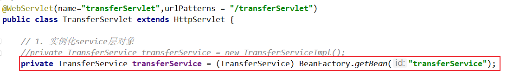
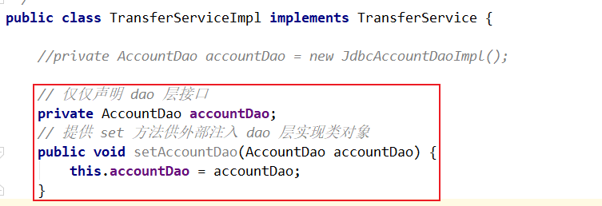

第三部分 手写实现 IOC 和 AOP

> 上一部分我们理解了 IoC 和 AOP 思想，我们先不考虑 Spring 是如何实现这两个思想的，此处准备一个 “银行转行” 的案例，请分析该案例在代码层次有什么问题？分析之后使用我们已有的知识解决这些问题。其实这个过程我们就是在一步步分析并手写实现 IoC 和 AOP。

案例原始代码：https://gitee.com/turboYuu/spring-1-2/blob/master/lab/turbo-transfer-%E4%BF%AE%E6%94%B9%E5%89%8D.zip

# 1 银行转账案例界面


# 2 银行转账案例表结构


# 3 银行转账案例代码调用关系


# 4 银行转账案例关键代码

1. TransferServlet

   ```java
   package com.turbo.edu.servlet;
   
   import com.turbo.edu.service.impl.TransferServiceImpl;
   import com.turbo.edu.utils.JsonUtils;
   import com.turbo.edu.pojo.Result;
   import com.turbo.edu.service.TransferService;
   
   import javax.servlet.ServletException;
   import javax.servlet.annotation.WebServlet;
   import javax.servlet.http.HttpServlet;
   import javax.servlet.http.HttpServletRequest;
   import javax.servlet.http.HttpServletResponse;
   import java.io.IOException;
   
   /**
    * @author turbo
    */
   @WebServlet(name="transferServlet",urlPatterns = "/transferServlet")
   public class TransferServlet extends HttpServlet {
   
       // 1. 实例化service层对象
       private TransferService transferService = new TransferServiceImpl();
   
       @Override
       protected void doGet(HttpServletRequest req, HttpServletResponse resp) throws ServletException, IOException {
           doPost(req,resp);
       }
   
       @Override
       protected void doPost(HttpServletRequest req, HttpServletResponse resp) throws ServletException, IOException {
   
           // 设置请求体的字符编码
           req.setCharacterEncoding("UTF-8");
   
           String fromCardNo = req.getParameter("fromCardNo");
           String toCardNo = req.getParameter("toCardNo");
           String moneyStr = req.getParameter("money");
           int money = Integer.parseInt(moneyStr);
   
           Result result = new Result();
   
           try {
   
               // 2. 调用service层方法
               transferService.transfer(fromCardNo,toCardNo,money);
               result.setStatus("200");
           } catch (Exception e) {
               e.printStackTrace();
               result.setStatus("201");
               result.setMessage(e.toString());
           }
   
           // 响应
           resp.setContentType("application/json;charset=utf-8");
           resp.getWriter().print(JsonUtils.object2Json(result));
       }
   }
   ```

2. TransferService 接口及实现类

   ```java
   package com.turbo.edu.service;
   
   /**
    * @author turbo
    */
   public interface TransferService {
   
       void transfer(String fromCardNo,String toCardNo,int money) throws Exception;
   }
   ```

   ```java
   package com.turbo.edu.service.impl;
   
   import com.turbo.edu.dao.AccountDao;
   import com.turbo.edu.dao.impl.JdbcAccountDaoImpl;
   import com.turbo.edu.pojo.Account;
   import com.turbo.edu.service.TransferService;
   
   /**
    * @author turbo
    */
   public class TransferServiceImpl implements TransferService {
   
       private AccountDao accountDao = new JdbcAccountDaoImpl();
   
       @Override
       public void transfer(String fromCardNo, String toCardNo, int money) throws Exception {
           Account from = accountDao.queryAccountByCardNo(fromCardNo);
           Account to = accountDao.queryAccountByCardNo(toCardNo);
   
           from.setMoney(from.getMoney()-money);
           to.setMoney(to.getMoney()+money);
   
           accountDao.updateAccountByCardNo(to);
           accountDao.updateAccountByCardNo(from);
       }
   }
   ```

3. AccountDao层接口及基于Jdbc 的实现类

   ```java
   package com.turbo.edu.dao;
   
   import com.turbo.edu.pojo.Account;
   
   /**
    * @author turbo
    */
   public interface AccountDao {
   
       Account queryAccountByCardNo(String cardNo) throws Exception;
   
       int updateAccountByCardNo(Account account) throws Exception;
   }
   ```

   ```java
   package com.turbo.edu.dao.impl;
   
   import com.turbo.edu.pojo.Account;
   import com.turbo.edu.dao.AccountDao;
   import com.turbo.edu.utils.DruidUtils;
   
   import java.sql.Connection;
   import java.sql.PreparedStatement;
   import java.sql.ResultSet;
   
   /**
    * @author turbo
    */
   public class JdbcAccountDaoImpl implements AccountDao {
   
   
       @Override
       public Account queryAccountByCardNo(String cardNo) throws Exception {
           //从连接池获取连接
           Connection con = DruidUtils.getInstance().getConnection();
           String sql = "select * from account where cardNo=?";
           PreparedStatement preparedStatement = con.prepareStatement(sql);
           preparedStatement.setString(1,cardNo);
           ResultSet resultSet = preparedStatement.executeQuery();
   
           Account account = new Account();
           while(resultSet.next()) {
               account.setCardNo(resultSet.getString("cardNo"));
               account.setName(resultSet.getString("name"));
               account.setMoney(resultSet.getInt("money"));
           }
   
           resultSet.close();
           preparedStatement.close();
           con.close();
   
           return account;
       }
   
       @Override
       public int updateAccountByCardNo(Account account) throws Exception {
           // 从连接池获取连接
           Connection con = DruidUtils.getInstance().getConnection();
           String sql = "update account set money=? where cardNo=?";
           PreparedStatement preparedStatement = con.prepareStatement(sql);
           preparedStatement.setInt(1,account.getMoney());
           preparedStatement.setString(2,account.getCardNo());
           int i = preparedStatement.executeUpdate();
   
           preparedStatement.close();
           return i;
       }
   }
   ```

   

# 5 银行转账案例代码问题分析

1. 问题一：在上述案例中，service 层实现类在使用 dao 层对象时，直接在 TransferServiceImpl 中通过 `AccountDao accountDao = new JdbcAccountDaoImpl();` 获得了 dao 层对象，然而一个 new 关键字却将 TransferServiceImpl 和 dao 层具体实现类 JdbcAccountDaoImpl 耦合在了一起，如果说技术结构发生一些变动，dao 层的实现要使用其他技术，比如 Mybatis，思考切换起来的成本？每一个 new 的地方都需要修改源代码，重新编译，面向接口开发的意义将大打折扣。
2. 问题二：service 层代码竟然还没有进行事务控制？！如果转账过程中出现异常，将可能导致数据库数据错乱，后果可能会很严重。

# 6 问题解决思路

- 对问题一：

  - 实例化对象除了使用 new 之外，还有什么技术？反射（`Class.forName("全限定类名")`）（需要把类的全限定类名配置在xml中）
  - 考虑使用设计模式中的工厂模式解耦，另外项目中往往有很多对象需要实例化，那就在工厂中使用反射技术实例化对象，工厂模式很合适。
  - 更进一步，代码中能否只声明所需的接口类型，不出现 new 也不出现工厂类的字眼。可以，声明一个变量并提供 set 方法，在反射的时候将所需的对象注入进去。

- 对问题二

  - service 层没有添加事务控制，怎么办？没有事务就添加上事务控制，手动控制 JDBC 的 Connection 事务，但要注意将 Connection 和当前线程绑定（即保证一个线程只有一个 Connection，这样操作才针对的是同一个 Connection，进而控制的是同一个事务 ）

  

# 7 案例代码改造

**对问题一的代码改造**

- 在resources 下增加 bean.xml

  ```xml
  <?xml version="1.0" encoding="UTF-8" ?>
  <beans>
      <bean id="transferService" class="com.turbo.edu.service.impl.TransferServiceImpl">
          <property name="AccountDao" ref="accountDao"></property>
      </bean>
      <bean id="accountDao" class="com.turbo.edu.dao.impl.JdbcAccountDaoImpl"></bean>
  </beans>
  ```

- 增加BeanFactory.java

  ```java
  package com.turbo.edu.factory;
  
  import org.dom4j.Document;
  import org.dom4j.DocumentException;
  import org.dom4j.Element;
  import org.dom4j.io.SAXReader;
  
  import java.io.InputStream;
  import java.lang.reflect.InvocationTargetException;
  import java.lang.reflect.Method;
  import java.util.HashMap;
  import java.util.List;
  import java.util.Map;
  
  /**
   *
   */
  public class BeanFactory {
  
      /**
       * 工厂类的两个任务
       * 任务一：加载解析xml，读取 xml 中的 bean 信息，通过反射技术实例化 bean 对象，然后放入 map 待用
       * 任务二：提供接口方法根据 id 从 map 中获取 bean（静态方法）
       */
      private static Map<String,Object> map = new HashMap<>();
  
      static {
          InputStream resourceAsStream = BeanFactory.class.getClassLoader().getResourceAsStream("beans.xml");
          SAXReader saxReader = new SAXReader();
  
          try {
              final Document document = saxReader.read(resourceAsStream);
              final Element rootElement = document.getRootElement();
              final List<Element> list = rootElement.selectNodes("//bean");
              // 实例化对象
              for (int i = 0; i < list.size(); i++) {
                  final Element element = list.get(i);
                  final String id = element.attributeValue("id");
                  final String clazz = element.attributeValue("class");
  
                  final Class<?> aClass = Class.forName(clazz);
                  final Object o = aClass.newInstance();
                  map.put(id,o);
              }
              // 维护 bean 之间的依赖关系
              final List<Element> propertyNodes = rootElement.selectNodes("//property");
              for (int i = 0; i < propertyNodes.size(); i++) {
                  final Element element = propertyNodes.get(i);
                  // 处理 property
                  final String name = element.attributeValue("name");
                  final String ref = element.attributeValue("ref");
  
                  final String parentId = element.getParent().attributeValue("id");
                  final Object parentObject = map.get(parentId);
  
                  final Method[] methods = parentObject.getClass().getMethods();
                  for (int j = 0; j < methods.length; j++) {
                      final Method method = methods[j];
                      if(("set"+name).equalsIgnoreCase(method.getName())){
                          // bean 之间的依赖关系（注入bean）
                          final Object propertyObject = map.get(ref);
                          method.invoke(parentObject,propertyObject);
  
                      }
  
                  }
                  // 维护依赖关系重新将 bean 放入 map 中
                  map.put(parentId,parentObject);
              }
          } catch (DocumentException e) {
              e.printStackTrace();
          } catch (ClassNotFoundException e) {
              e.printStackTrace();
          } catch (IllegalAccessException e) {
              e.printStackTrace();
          } catch (InstantiationException e) {
              e.printStackTrace();
          } catch (InvocationTargetException e) {
              e.printStackTrace();
          }
      }
  
      public static Object getBean(String id){
          return map.get(id);
      }
  }
  ```
  
- 修改 TransferServlet

  

- 修改 TransferServiceImpl

  


**对问题二的改造**

- 增加 ConnectionUtils

  ```java
  package com.turbo.edu.utils;
  
  import java.sql.Connection;
  import java.sql.SQLException;
  
  public class ConnectionUtils {
  
      // 存储当前线程的连接
      private ThreadLocal<Connection> threadLocal = new ThreadLocal<>();
  
      public Connection getCurrentThreadConn() throws SQLException {
          /**
           * 判断当前线程是否已经绑定连接，如果没有，需要从连接池取一个连接绑定到当前线程
           */
          Connection connection = threadLocal.get();
          if(connection == null){
              connection = DruidUtils.getInstance().getConnection();
              threadLocal.set(connection);
          }
          return connection;
      }
  }
  ```

- 增加 TransactionManager 事务管理器类

  ```java
  package com.turbo.edu.utils;
  
  import java.sql.SQLException;
  
  public class TransactionManager {
  
      private ConnectionUtils connectionUtils;
  
      public void setConnectionUtils(ConnectionUtils connectionUtils) {
          this.connectionUtils = connectionUtils;
      }
  
      //开启手动事务
      public void beginTransaction() throws SQLException {
          connectionUtils.getCurrentThreadConn().setAutoCommit(false);
      }
  
      //事务提交
      public void commit() throws SQLException {
          connectionUtils.getCurrentThreadConn().commit();
      }
  
      //事务回滚
      public void rollback() throws SQLException {
          connectionUtils.getCurrentThreadConn().rollback();
      }
  }
  ```

- 增加 ProxyFactory 代理工厂类

  ```java
  package com.turbo.edu.factory;
  
  import com.turbo.edu.utils.TransactionManager;
  
  import java.lang.reflect.InvocationHandler;
  import java.lang.reflect.Method;
  import java.lang.reflect.Proxy;
  
  public class ProxyFactory {
  
      private TransactionManager transactionManager;
  
      public void setTransactionManager(TransactionManager transactionManager) {
          this.transactionManager = transactionManager;
      }
  
      public Object getJDKProxy(Object obj){
          return Proxy.newProxyInstance(obj.getClass().getClassLoader(), obj.getClass().getInterfaces(), new InvocationHandler() {
              @Override
              public Object invoke(Object o, Method method, Object[] objects) throws Throwable {
                  Object invoke = null;
                  try {
                      //增强逻辑
                      transactionManager.beginTransaction();
                      invoke = method.invoke(obj, objects);
                      transactionManager.commit();
                  }catch (Exception e){
                      e.printStackTrace();
                      transactionManager.rollback();
                      throw e;
                  }
                  return invoke;
              }
          });
      }
  }
  ```

- 修改 JdbcAccountDaoImpl

  ```java
  package com.turbo.edu.dao.impl;
  
  import com.turbo.edu.pojo.Account;
  import com.turbo.edu.dao.AccountDao;
  import com.turbo.edu.utils.ConnectionUtils;
  import java.sql.Connection;
  import java.sql.PreparedStatement;
  import java.sql.ResultSet;
  
  /**
   * @author turbo
   */
  public class JdbcAccountDaoImpl implements AccountDao {
  
      private ConnectionUtils connectionUtils;
  
      public void setConnectionUtils(ConnectionUtils connectionUtils) {
          this.connectionUtils = connectionUtils;
      }
  
      @Override
      public Account queryAccountByCardNo(String cardNo) throws Exception {
          //从连接池获取连接
          //Connection con = DruidUtils.getInstance().getConnection();
          // 改造为：从当前线程当中获取绑定的connection连接
          Connection con = connectionUtils.getCurrentThreadConn();
          String sql = "select * from account where cardNo=?";
          PreparedStatement preparedStatement = con.prepareStatement(sql);
          preparedStatement.setString(1,cardNo);
          ResultSet resultSet = preparedStatement.executeQuery();
  
          Account account = new Account();
          while(resultSet.next()) {
              account.setCardNo(resultSet.getString("cardNo"));
              account.setName(resultSet.getString("name"));
              account.setMoney(resultSet.getInt("money"));
          }
  
          resultSet.close();
          preparedStatement.close();
          //不要关闭连接，关闭就把链接释放了（不要忘记）
          //con.close();
  
          return account;
      }
  
      @Override
      public int updateAccountByCardNo(Account account) throws Exception {
          // 从连接池获取连接
          //Connection con = DruidUtils.getInstance().getConnection();
          // 改造为：从当前线程当中获取绑定的connection连接
          Connection con = connectionUtils.getCurrentThreadConn();
          String sql = "update account set money=? where cardNo=?";
          PreparedStatement preparedStatement = con.prepareStatement(sql);
          preparedStatement.setInt(1,account.getMoney());
          preparedStatement.setString(2,account.getCardNo());
          int i = preparedStatement.executeUpdate();
  
          preparedStatement.close();
          return i;
      }
  }
  ```
  
- 修改 beans.xml

  ```xml
  <?xml version="1.0" encoding="UTF-8" ?>
  <beans>
      <bean id="transferService" class="com.turbo.edu.service.impl.TransferServiceImpl">
          <property name="AccountDao" ref="accountDao"></property>
      </bean>
      <bean id="accountDao" class="com.turbo.edu.dao.impl.JdbcAccountDaoImpl">
          <property name="ConnectionUtils" ref="connectionUtils"></property>
      </bean>
  
  
      <bean id="connectionUtils" class="com.turbo.edu.utils.ConnectionUtils"></bean>
      <bean id="transactionManager" class="com.turbo.edu.utils.TransactionManager">
          <property name="ConnectionUtils" ref="connectionUtils"></property>
      </bean>
      <bean id="proxyFactory" class="com.turbo.edu.factory.ProxyFactory">
          <property name="TransactionManager" ref="transactionManager"></property>
      </bean>
  </beans>
  ```

- 修改 TransferServlet

  ```java
  package com.turbo.edu.servlet;
  
import com.turbo.edu.factory.BeanFactory;
  import com.turbo.edu.factory.ProxyFactory;
  import com.turbo.edu.utils.JsonUtils;
  import com.turbo.edu.pojo.Result;
  import com.turbo.edu.service.TransferService;
  
  import javax.servlet.ServletException;
  import javax.servlet.annotation.WebServlet;
  import javax.servlet.http.HttpServlet;
  import javax.servlet.http.HttpServletRequest;
  import javax.servlet.http.HttpServletResponse;
  import java.io.IOException;
  
  /**
   * @author turbo
   */
  @WebServlet(name="transferServlet",urlPatterns = "/transferServlet")
  public class TransferServlet extends HttpServlet {
  
      // 首先从 BeanFactory 获取到 proxyFactory 代理工厂的实例化对象
      ProxyFactory proxyFactory = (ProxyFactory) BeanFactory.getBean("proxyFactory");
      private TransferService transferService = 
          (TransferService) proxyFactory.getJDKProxy(BeanFactory.getBean("transferService"));
  
  
      @Override
      protected void doGet(HttpServletRequest req, HttpServletResponse resp) 
          throws ServletException, IOException {
          doPost(req,resp);
      }
  
      @Override
      protected void doPost(HttpServletRequest req, HttpServletResponse resp) 
          throws ServletException, IOException {
  
          // 设置请求体的字符编码
          req.setCharacterEncoding("UTF-8");
  
          String fromCardNo = req.getParameter("fromCardNo");
          String toCardNo = req.getParameter("toCardNo");
          String moneyStr = req.getParameter("money");
          int money = Integer.parseInt(moneyStr);
  
          Result result = new Result();
  
          try {
              // 2. 调用service层方法
              transferService.transfer(fromCardNo,toCardNo,money);
              result.setStatus("200");
          } catch (Exception e) {
              e.printStackTrace();
              result.setStatus("201");
              result.setMessage(e.toString());
          }
  
          // 响应
          resp.setContentType("application/json;charset=utf-8");
          resp.getWriter().print(JsonUtils.object2Json(result));
      }
  }
  ```
  
  