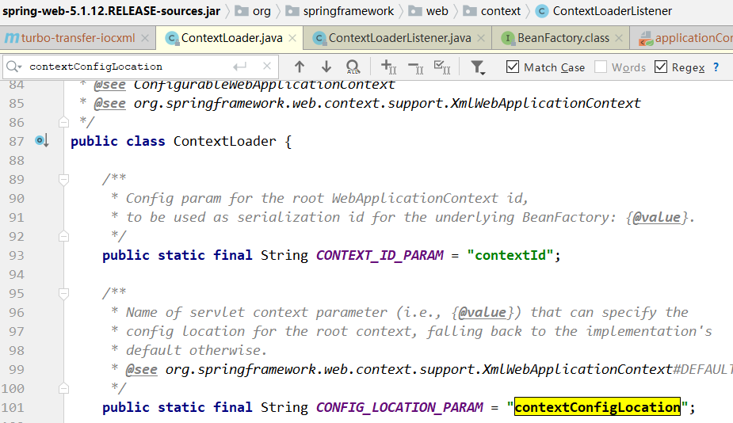

第四部分 Spring IOC应用

# 1 Spring IoC基础


## 1.1 BeanFactory 和 ApplicationContext 区别

BeanFactory 是 Spring 框架中 IoC 容器的顶层接口，它只是用来定义一些基础功能，定义一些基础规范，而ApplicationContext 是它的一个子接口，所以 ApplicationContext 是具备 BeanFactory 提供的全部功能的。

通常，我们称 BeanFactory 为 SpringIOC 的基础容器，ApplicationContext 是容器的高级接口，比 BeanFactory 要拥有更多的功能，比如说国际化支持和资源访问（xml，java配置类）等等。

（*Ctrl+H 查看 hierarchy*）


启动 IoC 容器的方式：

- Java 环境下启动 IoC 容器

  - ClassPathXmlApplicationContext：从类的根路径下加载配置文件（推荐使用）
  - FileSystemXmlApplicationContext：从磁盘路径上加载配置文件
  - AnnotationConfigApplicationContext：纯注解模式下启动Spring容器

- Web环境下启动 IoC 容器

  - 从 xml 启动容器

    ```xml
    <!DOCTYPE web-app PUBLIC
     "-//Sun Microsystems, Inc.//DTD Web Application 2.3//EN"  "http://java.sun.com/dtd/web-app_2_3.dtd" >
  <web-app>
    	<display-name>Archetype Created Web Application</display-name> 
      <!--配置Spring ioc容器的配置⽂件-->
    	<context-param>
    		<param-name>contextConfigLocation</param-name>
    		<param-value>classpath:applicationContext.xml</param-value> 
      </context-param>
    	<!--使⽤监听器启动Spring的IOC容器-->
    	<listener>
            <listener-class>org.springframework.web.context.ContextLoaderListener</listener-class>
        </listener>
    </web-app>
    ```
  
  - 从配置类启动容器
  
    ```xml
    <!DOCTYPE web-app PUBLIC
      "-//Sun Microsystems, Inc.//DTD Web Application 2.3//EN"
    "http://java.sun.com/dtd/web-app_2_3.dtd" >
    <web-app>
    	<display-name>Archetype Created Web Application</display-name>
        
        <!--告诉ContextloaderListener知道我们使⽤注解的⽅式启动ioc容器-->
    	<context-param>
            <param-name>contextClass</param-name> 
            <param-value>org.springframework.web.context.support.AnnotationConfigWebAppli cationContext</param-value>
        </context-param>
        
        <!--配置启动类的全限定类名-->
    	<context-param>
            <param-name>contextConfigLocation</param-name>
            <param-value>com.lagou.edu.SpringConfig</param-value>
        </context-param>
        
    	<!--使⽤监听器启动Spring的IOC容器-->
        <listener>
            <listener-
    class>org.springframework.web.context.ContextLoaderListener</listener-class>
        </listener>
    </web-app>
    ```
    
    

## 1.2 纯 xml 模式

（复制 turbo-transfer 到 turbo-transfer-iocxml）代码地址：https://gitee.com/turboYuu/spring-1-2/tree/master/lab/turbo-transfer-iocxml

```xml
<!--引入 spring ioc 容器功能-->
<dependency>
    <groupId>org.springframework</groupId>
    <artifactId>spring-context</artifactId>
    <version>5.1.12.RELEASE</version>
</dependency>
```


本部分内容不采用一一讲解知识点的方式，而是采用 Spring IoC 纯 xml 模式改造前面手写的 IoC 和 AOP 实现，在改造的过程中，把各个知识点串起来。

### 1.2.1 xml 文件头

[XML-based configuration metadata](https://docs.spring.io/spring-framework/docs/current/reference/html/core.html#beans-factory-metadata)


```xml
<?xml version="1.0" encoding="UTF-8"?>
<beans xmlns="http://www.springframework.org/schema/beans"
    xmlns:xsi="http://www.w3.org/2001/XMLSchema-instance"
    xsi:schemaLocation="http://www.springframework.org/schema/beans
        https://www.springframework.org/schema/beans/spring-beans.xsd">
```

#### 1.2.1.1 JavaSE 应用模式下启动 IoC 容器

```java
import com.turbo.edu.dao.AccountDao;
import org.junit.Test;
import org.springframework.context.ApplicationContext;
import org.springframework.context.support.ClassPathXmlApplicationContext;
import org.springframework.context.support.FileSystemXmlApplicationContext;

public class IoCTest {

    @Test
    public void testIoC(){
        // 通过读取 classPath 下的 xml 文件来启动容器（xml模式SE应用下推荐使用的）
        ApplicationContext applicationContext = 
            new ClassPathXmlApplicationContext("applicationContext.xml");
        // 不推荐使用
        // ApplicationContext applicationContext1 = new FileSystemXmlApplicationContext("文件系统的绝对路径");
        final AccountDao accountDao = (AccountDao) applicationContext.getBean("accountDao");
        System.out.println(accountDao);
    }
}
```


#### 1.2.1.2 JavaWeb 应用模式下启动 IoC 容器

1. 需要引入 spring-web 模块（ContextLoaderListener 在 spring-web 模块下）

   ```xml
   <!--引入spring web 功能-->
   <dependency>
       <groupId>org.springframework</groupId>
       <artifactId>spring-web</artifactId>
       <version>5.1.12.RELEASE</version>
   </dependency>
   ```

2. 在 web.xml 中配置监听器（监听器是 java 中的组件，做一些初始化的工作）

   ```xml
   <!--配置Spring IoC 容器的配置文件-->
   <context-param>
       <param-name>contextConfigLocation</param-name>
       <param-value>classpath:applicationContext.xml</param-value>
   </context-param>
   <!--使用监听器启动spring 的IoC 容器-->
   <listener>
       <listener-class>org.springframework.web.context.ContextLoaderListener</listener-class>
   </listener>
   ```

   

   

3. 修改 TransferServlet

   ```java
   @WebServlet(name="transferServlet",urlPatterns = "/transferServlet")
   public class TransferServlet extends HttpServlet {
   
       // 1. 实例化service层对象
       //private TransferService transferService = new TransferServiceImpl();
       //private TransferService transferService = (TransferService) BeanFactory.getBean("transferService");
   
       // 首先从 BeanFactory 获取到 proxyFactory 代理工厂的实例化对象
       //ProxyFactory proxyFactory = (ProxyFactory) BeanFactory.getBean("proxyFactory");
       private TransferService transferService = null;
   
       @Override
       public void init() throws ServletException {
           WebApplicationContext webApplicationContext = WebApplicationContextUtils.getWebApplicationContext(this.getServletContext());
           ProxyFactory proxyFactory = (ProxyFactory) webApplicationContext.getBean("proxyFactory");
           transferService = (TransferService) proxyFactory.getJDKProxy(webApplicationContext.getBean("transferService"));
       }
       // ....
   }
   ```

4. 测试成功

   

### 12.2 实例化 Bean 的 三种方式

- 方式一：使用无参构造函数

  在默认情况下，它会通过反射调用无参构造函数来创建对象。如果类中没有无参构造函数，将创建失败

  ```xml
  <!--方式一：使用无参构造器 （推荐）-->
  <bean id="connectionUtils" class="com.turbo.edu.utils.ConnectionUtils"></bean>
  ```

- 方式二：使用静态方法创建

  在实际开发中，我们使用的对象有些时候不是直接通过构造函数就可以创建出来的，他可能在创建的过程中会做很多额外的操作。此时会提供一个创建对象的方法，恰好这个方法是 `static` 修饰的方法。

  例如：我们在做Jdbc 操作时，会用到 java.sql.Connection 接口的实现类，如果是 mysql 数据库，那么用的就是 JDBC4Connection，但是我们不会去写 `JDBC4Connection connection = new JDBC4Connection()`，因为我们要注册驱动，还要提供 URL 和凭证信息，用 `DriverManager.getConnection` 方法来获取链接。

  那么在实际开发中，尤其早期的项目中没有使用Spring框架来管理对象的创建，但是在设计时使用了工厂模式解耦，那么当接入 Spring 之后，工厂类创建对象就具有和上述例子相同特征，即可采用此种方式配置。

  ```java
  package com.turbo.edu.factory;
  
  import com.turbo.edu.utils.ConnectionUtils;
  
  public class CreateBeanFactory {
  
      public static ConnectionUtils getInstanceStatic(){
          return new ConnectionUtils();
      }
  }
  ```

  

  ```xml
  <!--方式二：静态方法-->
  <bean id="connectionUtils" class="com.turbo.edu.factory.CreateBeanFactory" factory-method="getInstanceStatic"/>
  ```

- 方式三：使用实例化方法创建

  此种方式和上面静态方法创建其实类似，区别是用于获取对象的方法不再是 static 修饰的了，而是类中的一个普通方法。此种方式比静态方法创建的使用几率要高一些。

  在早期开发的项目中，工厂类中的方法有可能是静态的，也有可能是非静态方法，当是非静态方法时，即可采用下面的配置方式：

  ```java
  package com.turbo.edu.factory;
  
  import com.turbo.edu.utils.ConnectionUtils;
  
  public class CreateBeanFactory {
  
      public  ConnectionUtils getInstance(){
          return new ConnectionUtils();
      }
  }
  ```
  
  
  
  ```xml
  <!--方式三：实例化方法-->
  <bean id="createBeanFactory" class="com.turbo.edu.factory.CreateBeanFactory"></bean>
  <bean id="connectionUtils" factory-bean="createBeanFactory" factory-method="getInstance"></bean>
  ```

### 1.2.3 Bean的作用范围及生命周期

- 作用范围的改变

  在Spring 框架管理 Bean 对象的创建时，Bean 对象默认都是单例的，但是它支持配置的方式改变作用范围。[作用范围官方提供的说明](https://docs.spring.io/spring-framework/docs/current/reference/html/core.html#beans-factory-scopes)如下：

  

  在上图中提供的这些选项中，我们实际开发中用到做多的作用范围就是 `singleton`（单例模式）和 `prototype` （原型模式，也叫多例模式）。配置方式参考下面的代码：

  ```xml
  <bean id="transferService" class="com.turbo.edu.service.impl.TransferServiceImpl" scope="singleton"/>
  ```

- 不同作用范围的生命周期

  **单例模式：singleton**

  对象出生：当创建容器时，对象就被创建。

  对象活着：只要容器在，对象一直活着

  对象死亡：当销毁容器时，对象就被销毁了。

  一句话总结：单例模式的 bean 对象生命周期与容器相同。

  **多例模式：prototype**

  对象出生：当使用对象时，创建新的对象实例。

  对象活着：只要对象在使用中，就一直活着

  对象死亡：当对象长时间不用时，被 java 的垃圾回收器回收

  一句话总结：多例模式的 bean 对象，Spring 框架只负责创建，不负责销毁。

- Bean 标签属性

  在基于xml的 IoC 配置中，bean 标签是最基础的标签。它表示了 IoC 容器中的一个对象。换句话说，如果一个对象想让 Spring 管理，在 xml 的配置中都需要使用此标签配置，bean 标签的属性如下：

  **id属性**：用于给 bean 提供一个唯一标识。在一个标签内部，标识必须唯一。

  **class属性**：用于指定创建 Bean 对象的全限定类名。

  **name属性**：用于给 bean 提供一个或多个名称。多个名称用空格分割。

  **factory-bean属性**：用于指定创建当前 bean 对象的工厂 bean 的唯一标识。当指定了此属性之后，class 属性失效。

  **factory-method 属性**：用于指定创建当前 bean 对象的工厂方法，如配合 factory-bean 属性使用，则class 属性失效。如配合 class 属性使用，则方法必须是 static 的。

  **scope属性**：用于指定 bean 对象的作用范围。通常情况下就是 singleton。当要用到多例模式时，可以配置为 prototype。

  **init-method属性**：用于指定 bean 对象的初始化方法，此方法会在 bean 对象装配后调用。必须是一个无参方法。

  **destory-method属性**：用于指定 bean 对象的销毁方法，此方法会在 bean 对象销毁前执行。它只能当 scope 是 singleton 时起作用。
  
  ```xml
  <bean id="accountDao" class="com.turbo.edu.dao.impl.JdbcAccountDaoImpl" init-method="init" destroy-method="destory">
  ```
  
  ```java
  public class JdbcAccountDaoImpl implements AccountDao {
      // ...
      public void init(){
          System.out.println("初始化方法...");
      }
      public void destory(){
          System.out.println("销毁方法...");
      }
      // ...
  }
  ```
  
  ```java
  import com.turbo.edu.dao.AccountDao;
  import com.turbo.edu.utils.ConnectionUtils;
  import org.junit.Test;
  import org.springframework.context.ApplicationContext;
  import org.springframework.context.support.ClassPathXmlApplicationContext;
  import org.springframework.context.support.FileSystemXmlApplicationContext;
  
  public class IoCTest {
  
      @Test
      public void testIoC(){
          // 通过读取 classPath 下的 xml 文件来启动容器（xml模式SE应用下推荐使用的）
          ClassPathXmlApplicationContext applicationContext = 
              new ClassPathXmlApplicationContext("applicationContext.xml");    
          final AccountDao accountDao = (AccountDao) applicationContext.getBean("accountDao");
          System.out.println(accountDao);
          applicationContext.close();
      }
  }
  ```
  
  ```
  初始化方法...
  com.turbo.edu.dao.impl.JdbcAccountDaoImpl@3e27ba32
  销毁方法...
  ```
  
  

### 1.2.4 DI 依赖注入的 xml 配置

- 依赖注入分类

  - 按照注入的方式分类

    **构造函数注入**：顾名思义，就是利用带参构造函数实现对类成员的数据赋值。

    **set方法注入**：它是通过类成员的 set 方法实现数据的注入。（使用最多的）

  - 按照注入的数据类型分类

    **基本类型和String**：注入的数据类型是基本类型或者字符串类型的数据。

    **其他Bean类型**：注入的数据类型是对象类型，称为其他 Bean 的原因是，这个对象是要求出现在 IoC 容器中的。那么针对当前 Bean 来说，就是其他 Bean 了。

    **复杂类型（集合类型）**：注入的数据类型是 Array、List、Set、Map、Properties 中的一种类型。


依赖注入的配置实现之 **构造函数** 注入，就是利用构造函数实现对类成员的赋值。它的使用要求是。类中提供的构造函数参数个数必须和配置的参数个数一致，且数据类型匹配。同时需要注意的是，当没有无参构造时，则必须提供构造函数参数的注入，否则 Spring 框架会报错。

在使用**构造函数**注入时，涉及的标签是 `constructor-arg`，该标签有如下属性：

**name**：用于给构造函数中指定名称的参数赋值

**index**：用于给构造函数中指定索引位置的参数赋值

**value**：用于指定基本类型或者 String 类型的数据

**ref**：用于指定其他 Bean 类型的数据。写的是其他 bean 的唯一标识


------

依赖注入的配置实现之 **set方法** 注入。此种方式在实际开发中是使用最多的注入方式。

在使用 set 方法注入时，需要使用 `property` 标签，该标签属性如下：

**name**：指定注入时调用的 set 方法名称（注：不包含 set 这三个字母，）

**value**：指定注入的数据，它支持基本类型和 String 类型

**ref**：指定注入的数据。它支持其他 bean 类型。写的是其他 bean 的唯一标识：

- 复杂数据类型注入，首先，解释一下复杂类型数据，它指的是集合类型数据。集合分为两类，一类是 List 结构（数组结构），一类是Map接口（键值对）。


------

接下来就是注入的方式选择，只能在构造函数和set方法中选择，示例选用 set 方法注入。

在 List 结构的集合数据注入时，`array`,`list`,`set` 这三个标签通用，另外 注入的值 `value` 标签内部可以直接写值，也可以使用 `bean` 标签配置一个对象，或者用 `ref` 标签引用一个已经配合 bean 的唯一标识。

在 Map 结构的集合数据注入时，`map` 标签使用 `entry` 子标签实现数据注入，`entry` 标签可以使用 `key` 和 `value` 属性 指定存入 map 中的数据。使用 **value-ref** 属性指定已经配置好的 bean 的引用。同时 `entry` 标签中也可以使用 `ref` 标签 ，但是不能使用 `bean` 标签。而 `property` 标签中不能使用 `ref` 或者 `bean` 标签引用对象。


## 1.3 xml 与注解相结合模式

> 注意：
>
> 1. 实际企业开发中，纯 xml 模式已经很少使用了
> 2. 引入注解，不需要引入额外的 jar
> 3. xml + 注解结合模式，xml 文件依然存在。所以，Spring IoC 容器的启动仍然从加载 xml 开始
> 4. 哪些 bean 的定义写在 xml，哪些bean的定义使用注解
>    - **第三方jar包中的bean 定义在 xml，比如 druid 数据库连接池**
>    - **自己开发的 bean 定义使用注解**

（复制 turbo-transfer-iocxml 到 turbo-transfer-iocxml-anno 项目）代码地址：https://gitee.com/turboYuu/spring-1-2/tree/master/lab/turbo-transfer-iocxml-anno

- xml 中标签与注解的对应 （IoC）

  | xml形式                    | 对应注解形式                                                 |
  | -------------------------- | ------------------------------------------------------------ |
  | 标签                       | @Component("accountDao")，注解加在类上<br>bean 的 id 属性内容直接配置在注解后面，如果不配置，默认定义这个 bean 的 id 为类名（首字母小写）；<br>另外针对分层代码开发提供了 @Component 的三种别名 <br>@Controller、@Service、@Repository 分别用于控制层类、服务层类、dao层类的 bean 定义，这四个注解的用法完全一致，只是为了更清晰的区分而已 |
  | 标签的scope属性            | @Scope("prototype")，默认单例，注解加在类上                  |
  | 标签的 init-method 属性    | @PostConstruct，注解加在方法上，该方法就是初始化后调用的方法 |
  | 标签的 destory-method 属性 | @PreDestory，注解加在方法上，该方法就是销毁前调用的方法      |

- DI 依赖注入的注解实现方式

  **@Autowired**（推荐使用）

  @Autowired 为 Spring 提供的注解，需要导入包 `org.springframework.beans.factory.annotation.Autowired`。

  @Autowired 采取的策略是按照类型注入。

  ```java
  @Service("transferService")
  public class TransferServiceImpl implements TransferService {
    @Autowired
      private AccountDao accountDao;

  ```

  如上代码所示，这样装配会去 Spring 容器中找到类型为 AccountDao 的类，然后将其注入进来。这样会产生一个问题，当一个类型有多个 bean 值的时候，会造成无法选择具体注入哪一个的情况，这个时候我们就需要配合着使用 `@Qualifier` 。
  
  `@Qualifier` 告诉 Spring 具体去装配哪个对象。

  ```java
@Service("transferService")
  public class TransferServiceImpl implements TransferService {

      // 按照类型注入
    // 如果按照类型无法唯一锁定对象 可以结合 @Qualifier 指定具体的 id
      @Qualifier("accountDao")
    @Autowired
      private AccountDao accountDao;

  ```
  
   这个时候就可以通过类型和名称定位到我们想要注入的对象。
  
  ------
  
  **@Resource**
  
  `@Resource` 注解是由 J2EE 提供，需要导入包 `javax.annotation.Resource`
  
  `@Resource` 默认按照 ByName 自动注入。
  
```java
  public class TransferService {
  	@Resource
  	private AccountDao accountDao; 
      @Resource(name="studentDao")  
    private StudentDao studentDao; 
      @Resource(type="TeacherDao")  
    private TeacherDao teacherDao;
      @Resource(name="manDao",type="ManDao")  
      private ManDao manDao;
  }    
  ```
  
  - 如果同时指定了 name 和 type，则从 Spring 上下文中找到唯一匹配的 bean 进行装配，找不到则抛出异常
  - 如果指定了 name，则从上下文中查找名称 （id）匹配的 bean 进行装配，找不到则抛出异常
- 如果指定了 type，则从上下文中找到类似匹配的唯一 bean 进行装配，找不到或是找到多个，都会抛出异常
  - 如果既没有指定 name，有没有指定 type，则自动按照 byName 方式进行装配；
  
  **注意**：@Resource 在 Jdk 11 中已经移除，如果要使用，需要单独引入 jar 包
  
  ```xml
  <dependency>
      <groupId>javax.annotation</groupId>
      <artifactId>javax.annotation-api</artifactId>
      <version>1.3.2</version>
  </dependency>
  ```
  


**配置注解扫描 和 提取数据库配置文件到 properties 文件中**

```xml
<?xml version="1.0" encoding="UTF-8"?>
<beans xmlns="http://www.springframework.org/schema/beans"
       xmlns:context="http://www.springframework.org/schema/context"
    xmlns:xsi="http://www.w3.org/2001/XMLSchema-instance"
    xsi:schemaLocation="
        http://www.springframework.org/schema/beans
        https://www.springframework.org/schema/beans/spring-beans.xsd
        http://www.springframework.org/schema/context
        https://www.springframework.org/schema/context/spring-context.xsd

">

    <!--开启注解扫描，base-package 指定扫描的包路径-->
    <context:component-scan base-package="com.turbo.edu"/>

    <!--引入外部资源文件-->
    <context:property-placeholder location="classpath:jdbc.properties"/>

    <!--第三方 jar 包中的 bean 定义在 xml 中-->
    <bean id="dataSource" class="com.alibaba.druid.pool.DruidDataSource">
        <property name="driverClassName" value="${jdbc.driver}"/>
        <property name="url" value="${jdbc.url}"/>
        <property name="username" value="${jdbc.username}"/>
        <property name="password" value="${jdbc.password}"/>
    </bean>

</beans>
```


## 1.4 纯注解模式

改造 xml + 注解模式，将 xml 中遗留的内容全部以注解的形式迁移出去，最终删除 xml，从 Java 配置类启动。

`@Configuration` 注解，表明当前类是一个配置类

`@ComponentScan` 注解，替代 `context:component-scan`

`@PropertySource`，引入外部属性配置文件

`@Import` 引入其他配置类

`@Value` 对变量赋值，可以直接赋值，也可以使用 ${} 读取资源配置文件中的信息

`@Bean` 将方法返回对象加入 Spring IoC 容器

# 2 Spring IoC 高级特性

## 2.1 lazy-Init 延迟加载

Bean 的延迟加载（延迟创建）

ApplicationContext 容器的默认行为是在启动服务器时将所有 singleton bean 提前进行实例化。提前实例化意味着作为初始化过程的一部分，ApplicationContext 实例会创建并配置所有的 singleton bean。

比如：

```xml
<bean id="testBean" class="cn.turbo.LazyBean" /> 
该bean默认的设置为:
<bean id="testBean" calss="cn.turbo.LazyBean" lazy-init="false" />
```

`lazy-init="false"`，立即加载，表示在 Spring 启动时，立刻进行实例化。

如果不想让一个 singleton bean 在 ApplicationContext 实现初始化时被提前实例化，那么可以将 bean 设置为延迟实例化。

```xml
<bean id="testBean" calss="cn.turbo.LazyBean" lazy-init="true" />
```

设置 `lazy-init` 为 `true` 的 bean 将不会在 ApplicationContext 启动时提前被实例化，而是第一次向容器通过 getBean 索取 bean 时实例化的。

如果一个设置了立即加载的 bean1，引用了一个延迟加载的 bean2，那么 bean1 在容器启动时被实例化，而 bean2 由于被 bean1 引用，所以也被实例化。这种情况也符合延时加载的 bean 的第一次调用时才被实例化的规则。

也可以在容器层次中通过在 元素上使用 `default-lazy-init` 属性来控制延时初始化。如下面配置：

```xml
<beans default-lazy-init="true">
	<!-- no beans will be eagerly pre-instantiated... -->
</beans>
```

如果一个 bean 的 scope 属性为 scope="prototype" 时，即使设置了 `lazy-init="false"`，容器启动时也不会实例化 bean，而是调用 getBean 方法实例化的。

**应用场景**

1. 开启延迟加载一定程度提高容器启动和运转性能。
2. 对于不常使用的 Bean 设置延迟加载，这样偶尔使用的时候在加载，不必要从一开始该 Bean 就占用资源。

## 2.2 FactoryBean 和 BeanFactory

BeanFactory 接口使容器的顶级接口，定义了容器的一些基础行为，负责生产和管理 Bean 的一个工厂，具体使用它下面的子接口类型，比如 ApplicationContext；此处重点分析 FactoryBean。

Bean 创建的三种方式中的静态方法和实例化方法 和 FactoryBean 作用类似，FactoryBean 使用较多，尤其在 Spring 框架一些组件中会使用，还有其他框架和 Spring 框架整合时使用

```java

```

Company 类

```java

```

CompanyFactoryBean 类

```java

```

xml配置

```xml

```

测试，获取 FactoryBean 产生的对象

```java

```

测试，获取 FactoryBean，需要在 id 之间添加 ”&“

```java

```


## 2.3 后置处理器

Spring 提供了两种后置处理 bean 的扩展接口：分别是 `BeanPostProcessor` 和 `BeanFactoryPostProcessor`，两者在使用上是有所区别的。

工厂初始化（BeanFactory）-> Bean 对象

在 Bean 对象实例化之后可以使用 BeanFactoryPostProcessor 进行后置处理一些事情，

在 Bean 对象实例化（并不是Bean的整个生命周期完成）之后可以使用 BeanPostProcessor 进行后置处理做一些事情。

> 注意：对象不一定是 springbean，而 springbean 一定是个对象

SpringBean 的生命周期

### 2.3.1 BeanPostProcessor

BeanPostProcessor 是针对 Bean 级别的处理，可以针对某个具体的 Bean.


该接口提供了两个方法，分别在 Bean 的**初始化方法前**和**初始化方法后**执行，具体这个初始化方法指的是什么方法，类似我们在定义 bean 时，定义了 init-method 所指定的方法。

定义一个类实现了 BeanPostProcessor，**默认是会对整个 Spring 容器中所有的 bean 进行处理**。如果要对具体的某个 bean 处理，可以通过方法参数判断，两个类型参数分别为 Object 和 String ，第一个参数是每个 bean 的实例，第二个参数是每个 bean 的 name 或者 id 属性的值。所以我们可以通过第二个参数，来判断我们将要处理的具体的 bean。

注意：处理时发生在 Spring 容器的实例化和依赖注入之后。

### 2.3.2 BeanFactoryPostProcessor

BeanFactory 级别的处理，是针对整个 Bean 的工厂进行处理的，典型应用：`PropertyPlaceholderConfigurer`


此接口只提供了一个方法，方法参数为 ConfigurableListableBeanFactory，该参数类型定义了一些方法：


其中有个方法名为 getBeanDefinition 的方法，我们可以根据此方法，找到我们定义 bean 的 BeanDefinition 对象。然后我们可以对定义的属性进行修改，以下是 BeanDefinition 中的方法


方法名字类似我们 bean 标签的属性，setBeanClassName 对应 bean 标签中的 class 属性，所以我们拿到 BeanDefinition 对象时，我们可以手动修改 bean 标签中所定义的属性值。

**BeanDefinition对象**：我们在 xml 定义的 bean 标签，Spring 解析 bean 标签成为一个 JavaBean，这个 JavaBean 就是 BeanDefinition。

注意：调用 BeanFactoryPostProcessor方法时，这时候 bean 还没有实例化，此时 bean 刚被解析成 BeanDefinition 对象。

