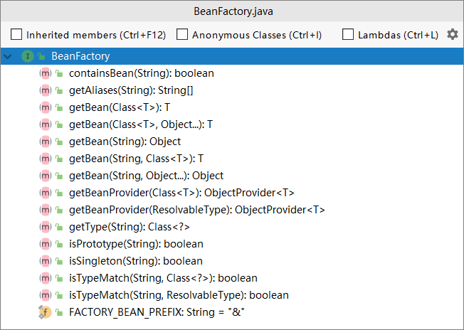
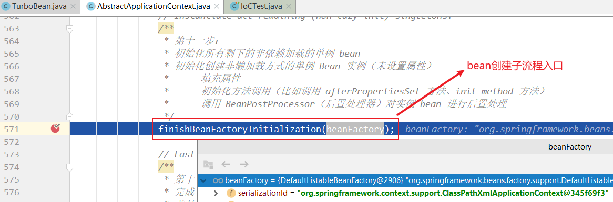

第五部分 Spring IOC 源码深度剖析

# 1 Spring IoC 容器初始化主体流程

## 1.1 Spring IoC 的容器体系

IoC容器是 Spring 的核心模块，是抽象了对象管理，依赖关系管理的框架解决方案。Spring 提供了很多的容器，其中 BeanFactory 是顶层容器（根容器），不能被实例化，它定义了所有 IoC 容器必须遵从的一套原则，具体的容器实现可以增加额外的功能，比如我们常用到 ApplicationContext，其下更具体的实现如 ClassPathXmlApplicationContext 包含了解析 xml 等一系列的内容，AnnotationConfigApplicationContext 则是包含了注解解析等一系列的内容。Spring IoC 容器继承体系非常聪明，需要使用哪个层次就用哪个层次即可，不必使用功能大而全的。

BeanFactory 顶级接口方法栈如下：



BeanFactory 容器继承体系：


通过其接口设置，我们可以看到我们一贯使用的 ApplicationContext 除了继承 BeanFactory 的子接口，还继承了 ResourceLoader、MessageSource 等接口，因此其提供的功能也就更丰富了。

下面以 ClassPathXmlApplicationContext 为例，深入源码说明 IoC 容器的初始化流程。

## 1.2 Bean 生命周期关键时机点

**思路**：创建一个类 TurboBean，让其实现几个特殊的接口，并分别在接口的实现构造器、接口方法中断点，观察线程调用栈，分析出 Bean 对象创建和管理关键点的触发时机。

TurboBean 类：

```java
package com.turbo;

import org.springframework.beans.factory.InitializingBean;

public class TurboBean implements InitializingBean {

	public TurboBean() {
		System.out.println("TurboBean 构造函数");
	}

	/**
	 * InitializingBean 接口实现
	 * @throws Exception
	 */
	@Override
	public void afterPropertiesSet() throws Exception {
		System.out.println("TurboBean afterPropertiesSet .....");
	}
}
```

BeanPostProcessor 接口实现类：

```java
package com.turbo;

import org.springframework.beans.BeansException;
import org.springframework.beans.factory.config.BeanPostProcessor;

public class MyBeanPostProcessor implements BeanPostProcessor {

	public MyBeanPostProcessor() {
		System.out.println("BeanPostProcessor 实现类构造函数...");
	}

	@Override
	public Object postProcessBeforeInitialization(Object bean, String beanName) throws BeansException {
		if("turboBean".equalsIgnoreCase(beanName)){
			System.out.println("BeanPostProcessor 实现类 postProcessBeforeInitialization 方法调用中...");
		}
		return bean;
	}

	@Override
	public Object postProcessAfterInitialization(Object bean, String beanName) throws BeansException {
		if("turboBean".equalsIgnoreCase(beanName)){
			System.out.println("BeanPostProcessor 实现类 postProcessBeforeInitialization 方法调用中...");
		}
		return bean;
	}
}
```

BeanFactoryPostProcessor 接口实现类

```java
package com.turbo;

import org.springframework.beans.BeansException;
import org.springframework.beans.factory.config.BeanFactoryPostProcessor;
import org.springframework.beans.factory.config.ConfigurableListableBeanFactory;

/**
 * BeanFactory级别的处理，是针对整个Bean的⼯⼚进⾏处理，典型应⽤:PropertyPlaceholderConfigurer
 */
public class MyBeanFactoryPostProcessor implements BeanFactoryPostProcessor {

	public MyBeanFactoryPostProcessor() {
		System.out.println("BeanFactoryPostProcessor的实现类构造函数...");
	}

	@Override
	public void postProcessBeanFactory(ConfigurableListableBeanFactory beanFactory) 
        throws BeansException {
		System.out.println("BeanFactoryPostProcessor 的实现方法调用中....");
	}
}
```

applicationContext.xml

```xml
<?xml version="1.0" encoding="UTF-8"?>
<beans xmlns="http://www.springframework.org/schema/beans"
	   xmlns:xsi="http://www.w3.org/2001/XMLSchema-instance"
	   xsi:schemaLocation="http://www.springframework.org/schema/beans
        https://www.springframework.org/schema/beans/spring-beans.xsd">

	<bean id="turboBean" class="com.turbo.TurboBean"></bean>
	<bean id="myBeanPostProcessor" class="com.turbo.MyBeanPostProcessor"></bean>
	<bean id="myBeanFactoryPostProcessor" class="com.turbo.MyBeanFactoryPostProcessor"></bean>
</beans>
```

IoC 容器源码分析用例：

```java
import org.junit.Test;
import org.springframework.context.ApplicationContext;
import org.springframework.context.support.ClassPathXmlApplicationContext;

public class IoCTest {

	@Test
	public void testIoC(){
		// ApplicationContext 是容器的高级接口，BeanFactory (顶级容器/根容器，规范了/定义了容器的基础行为)
		// Spring应用上下文，官方称之为 IoC 容器（错误认识：容器就是 map 而已；）准确来说 map 是ioc容器的一个成员 叫做单例池 即是 singletonObjects
		// 容器是一组组件和过程的集合，包括 BeanFactory,单例池，BeanPostProcessor 等以及之间的协作
		ApplicationContext applicationContext =
				new ClassPathXmlApplicationContext("classpath:applicationContext.xml");
		Object turboBean = applicationContext.getBean("turboBean");
		System.out.println(turboBean);
	}
}
```

### 1.2.1 分析 Bean 的创建是在容器初始化时还是在 getBean 时


根据断点调试，发现在未设置延迟加载的前提下，Bean 的创建是在容器初始化过程中完成的。

### 1.2.2 分析构造函数调用情况


观察调用栈：


通过如上观察，发现构造函数的调用时机在 `org.springframework.context.support.AbstractApplicationContext#refresh` 方法的 `finishBeanFactoryInitialization(beanFactory);` 处。

### 1.2.3 分析 InitializingBean 之 afterPropertiesSet 初始化方法调用情况


观察调用栈：


通过如上观察，发现 InitializingBean 中的 afterPropertiesSet 方法的调用时机也是在  `org.springframework.context.support.AbstractApplicationContext#refresh` 方法的 `finishBeanFactoryInitialization(beanFactory);` 处。

### 1.2.4 分析 BeanFactoryPostProcessor 初始化和调用情况

分别在 构造函数、postProcessBeanFactory 方法处打断点，观察调用栈，发现

**BeanFactoryPostProcessor 初始化**在 AbstractApplicationContext 类的 refresh 方法的 `invokeBeanFactoryPostProcessors(beanFactory);` 处：


**postProcessBeanFactory** 调用在  AbstractApplicationContext 类的 refresh 方法的 `invokeBeanFactoryPostProcessors(beanFactory);` 处：


### 1.2.5 分析 BeanPostProcessor 初始化和调用情况

分别在构造函数、postProcessBeforeInitialization、postProcessAfterInitialization 方法处打断点，观察调用栈，发现：

**BeanPostProcessor 初始化在** AbstractApplicationContext 类 refresh 方法的 `registerBeanPostProcessors(beanFactory);`处：


**postProcessBeforeInitialization 调用在**  AbstractApplicationContext 类 refresh 方法的 `finishBeanFactoryInitialization(beanFactory);` 处：


**postProcessAfterInitialization 调用在** AbstractApplicationContext 类 refresh 方法的 `finishBeanFactoryInitialization(beanFactory);` 处：


### 1.2.6 总结

根据上面的调试分析，发现 Bean 对象创建的几个关键时机点代码层级的调用都在 AbstractApplicationContext 类 refresh 方法中，可见这个方法对于 Spring Ioc 容器初始化来说非常关键，汇总如下：

| 关键点                                                   | 触发代码                                             |
| -------------------------------------------------------- | ---------------------------------------------------- |
| Bean 构造器                                              | refresh#finishBeanFactoryInitialization(beanFactory) |
| BeanFactoryPostProcessor 初始化                          | refresh#invokeBeanFactoryPostProcessors(beanFactory) |
| BeanFactoryPostProcessor#postProcessBeanFactory 方法调用 | refresh#invokeBeanFactoryPostProcessors(beanFactory) |
| BeanPostProcessor 初始化                                 | refresh#registerBeanPostProcessors(beanFactory)      |
| BeanPostProcessor中的前后初始化 方法调用                 | refresh#finishBeanFactoryInitialization(beanFactory) |


## 1.3 Spring IoC 容器初始化主流程

由上分析可知，Spring IoC 容器初始化的关键环节就在 `AbstractApplicationContext#refresh()` 方法中，查看 refresh 方法来俯瞰容器创建的主体流程，主体流程下的具体子流程后面再讨论。

```java
@Override
public void refresh() throws BeansException, IllegalStateException {
    synchronized (this.startupShutdownMonitor) {
        // Prepare this context for refreshing.
        // 第一步：刷新前的预处理
        prepareRefresh();

        // Tell the subclass to refresh the internal bean factory.
        /**
		* 第二步：获取 BeanFactory：默认实现是 DefaultListableBeanFactory
		* 加载 BeanDefinition,并注册到 BeanDefinitionRegistry
		*/
        ConfigurableListableBeanFactory beanFactory = obtainFreshBeanFactory();

        // Prepare the bean factory for use in this context.
        // 第三步:BeanFactory的预准备工作（BeanFactory 进行一些设置，比如 context 的类加载器等）
        prepareBeanFactory(beanFactory);

        try {
            // Allows post-processing of the bean factory in context subclasses.
            // 第四步：BeanFactory 准备工作完成后进行的后置处理工作
            postProcessBeanFactory(beanFactory);

            // Invoke factory processors registered as beans in the context.
            // 第五步：实例化并调用实现了 BeanFactoryPostProcessor 接口的 Bean
            invokeBeanFactoryPostProcessors(beanFactory);

            // Register bean processors that intercept bean creation.
            // 第六步：注册 BeanPostProcessor（Bean的后置处理器），在创建bean的前后等执行
            registerBeanPostProcessors(beanFactory);

            // Initialize message source for this context.
            // 第七步：初始化 MessageSource组件（做国际化：消息绑定，消息解析）；
            initMessageSource();

            // Initialize event multicaster for this context.
            // 第八步：初始化事件派发器
            initApplicationEventMulticaster();

            // Initialize other special beans in specific context subclasses.
            // 第九步：子类重写这个方法，在容器刷新的时候可以自定义逻辑
            onRefresh();

            // Check for listener beans and register them.
            // 第十步：注册应用的监听器。就是注册实现了 ApplicationListener 接口的监听器 bean
            registerListeners();

            // Instantiate all remaining (non-lazy-init) singletons.
            /**
			* 第十一步：
			* 初始化所有剩下的非依赖加载的单例 bean
			* 初始化创建非懒加载方式的单例 Bean 实例（未设置属性）
			* 		填充属性
			* 		初始化方法调用（比如调用 afterPropertiesSet 方法、init-method 方法）
			* 		调用 BeanPostProcessor（后置处理器）对实例 bean 进行后置处理
			*/
            finishBeanFactoryInitialization(beanFactory);

            // Last step: publish corresponding event.
            /**
			* 第十二步：
			* 完成 context 的刷新。主要是调用 LifecycleProcessor#onRefresh() 方法，
			* 并且发布事件（ContextRefreshedEvent）
			*/
            finishRefresh();
        }

        catch (BeansException ex) {
            if (logger.isWarnEnabled()) {
                logger.warn("Exception encountered during context initialization - " +
                            "cancelling refresh attempt: " + ex);
            }

            // Destroy already created singletons to avoid dangling resources.
            destroyBeans();

            // Reset 'active' flag.
            cancelRefresh(ex);

            // Propagate exception to caller.
            throw ex;
        }

        finally {
            // Reset common introspection caches in Spring's core, since we
            // might not ever need metadata for singleton beans anymore...
            resetCommonCaches();
        }
    }
}
```


# 2 BeanFactory 创建流程

## 2.1 获取 BeanFactory 子流程

时序图如下：


## 2.2 BeanDefinition 加载解析及注册子流程

### 2.2.1 该子流程涉及到如下几个关键步骤

**Resource定位**：指对 BeanDefinition 的资源定位过程。通俗将就是找到定义 Javaban 信息的 xml 文件，并将其封装成 Resource 对象。

**BeanDefinition载入**：把用户定义好的 Javabean 解析为 ioc 容器内部的数据结构，这个容器内部的数据结构就是 BeanDefinition。

**注册 BeanDefinition 到 Ioc 容器**

### 2.2.2 过程分析

1. 子流程的入口在 `AbstractRefreshableApplicationContext#refreshBeanFactory` 方法中

   

2. 依次调用多个类的 loadBeanDefinitions 方法 -> AbstractXmlApplicationContext -> AbstractBeanDefinitionReader -> XmlBeanDefinitionReader  一直执行到 XmlBeanDefinitionReader#doLoadBeanDefinitions 方法。

   

3. 终端观察 XmlBeanDefinitionReader#registerBeanDefinitions 方法，期间产生了多次重载调用，我们定位到最后一个。

   此处关注两个地方：一个 createReaderContext 方法，一个是 DefaultBeanDefinitionDocumentReader#registerBeanDefinitions 方法，先进入 createReaderContext 方法看看：

   我们可以看到，此处 Spring 首先完成了 NamespaceHandlerResolver 的初始化。

   我们再进入 registerBeanDefinitions 方法中追踪，调用了 DefaultBeanDefinitionDocumentReader#registerBeanDefinitions 方法：

   进入 doRegisterBeanDefinitions 方法：

   进入 parseBeanDefinitions 方法：

   进入 parseDefaultElement 方法：

   进入 processBeanDefinition 方法：

   至此，注册流程结束，我们发现，所谓的注册就是把封装的 XML 中定义的 Bean 信息封装为 BeanDefinition 对象之后放入到一个 Map 中，BeanFactory 是以 Map 的结构组织这些 BeanDefinition 的。

   可以在 DefaultListableBeanFactory中看到此Map的定义 ：

   

### 2.2.3 时序图


# 3 Bean 创建流程

通过最开始的关键时机点分析，知道 Bean 创建子流程入口在 AbstractApplicationContext#refresh方法的 finishBeanFactoryInitialization(beanFactory) 处：



进入 finishBeanFactoryInitialization ：


继续进入 DefaultListableBeanFactory 类的 preInstantiateSingletons  方法，我们找到下面部分的代码，看到工厂 Bean 或者普通 Bean，最终都是通过 getBean 的方法获取实例：


继续跟踪下去，我们进入到了 AbstractBeanFactory#doGetBean 方法，这个方法中的代码很多，直接找到核心部分：


接着进入到 AbstractAutowireCapableBeanFactory#createBean 方法，找到以下代码部分：


进入 AbstractAutowireCapableBeanFactory#doCreateBean 方法，该方法我们关注两块重点区域：

- 创建Bean实例，此时尚未设置属性

  

- 给 Bean 填充属性，调用初始化方法，应用 BeanPostProcessor 后置处理器

  

# 4 lazy-init 延迟加载机制原理

普通 Bean 的初始化是在容器启动初始化阶段执行的，而被 lazy-init=true 修饰的 bean 则是在从容器里第一次进行 context.getBean() 是进行触发。

Spring 启动的时候会把所有 bean 信息（包括 XML 和注解）解析转化成 Spring 能够识别的 BeanDefinition 并存到 HashMap 里 供下面的初始化使用，然后对每个 BeanDefinition 进行处理，如果是懒加载则在容器初始化阶段不处理，其他的则在容器初始化阶段进行初始化并依赖注入。

```java
// org.springframework.beans.factory.support.DefaultListableBeanFactory#preInstantiateSingletons
public void preInstantiateSingletons() throws BeansException {
    if (logger.isTraceEnabled()) {
        logger.trace("Pre-instantiating singletons in " + this);
    }

    // Iterate over a copy to allow for init methods which in turn register new bean definitions.
    // While this may not be part of the regular factory bootstrap, it does otherwise work fine.
    // 所有 beanDefinition 集合
    List<String> beanNames = new ArrayList<>(this.beanDefinitionNames);

    // Trigger initialization of all non-lazy singleton beans...
    // 触发所有非懒加载单例 bean 的初始化
    for (String beanName : beanNames) {
        // 获取 bean 定义
        RootBeanDefinition bd = getMergedLocalBeanDefinition(beanName);
        // 判断是否是懒加载单例 bean，如果是单例的并且不是懒加载的，则在容器创建时初始化
        if (!bd.isAbstract() && bd.isSingleton() && !bd.isLazyInit()) {
            // 判断是否是 FactoryBean
            if (isFactoryBean(beanName)) {
                Object bean = getBean(FACTORY_BEAN_PREFIX + beanName);
                if (bean instanceof FactoryBean) {
                    FactoryBean<?> factory = (FactoryBean<?>) bean;
                    boolean isEagerInit;
                    if (System.getSecurityManager() != null && factory instanceof SmartFactoryBean) {
                        isEagerInit = AccessController.doPrivileged(
                            (PrivilegedAction<Boolean>) ((SmartFactoryBean<?>) factory)::isEagerInit,
                            getAccessControlContext());
                    }
                    else {
                        isEagerInit = (factory instanceof SmartFactoryBean &&
                                       ((SmartFactoryBean<?>) factory).isEagerInit());
                    }
                    if (isEagerInit) {
                        getBean(beanName);
                    }
                }
            }
            else {
                /**
					 * 如果是 普通 bean 则进行初始化并依赖注入，此 getBean(beanName) 接下来触发的逻辑
					 * 和 懒加载 context.getBean("beanName") 所触发的逻辑是一样的
					 */
                // 实例化当前 bean
                getBean(beanName);
            }
        }
    }
    // ...
}
```

总结：

- 对于被修饰为 lazy-init 的 bean，Spring 容器初始化阶段不会进行 init 和 依赖注入；当第一次进行 getBean 时，才进行初始化和依赖注入。
- 对于非懒加载的 bean，getBean 的时候会从缓存里获取，因为容器初始化阶段 Bean 已经初始化完成并缓存了起来。

# 5 Spring IoC 循环依赖问题

## 5.1 什么是循环依赖

## 5.2 循环依赖处理机制