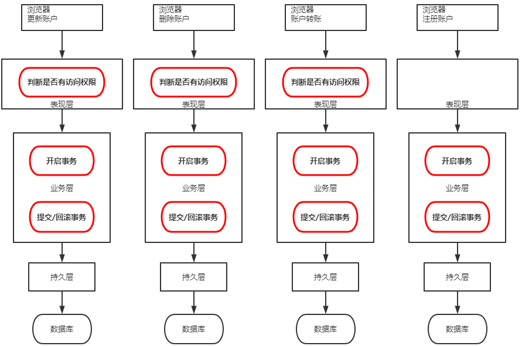
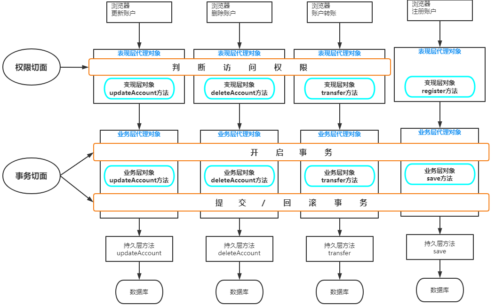
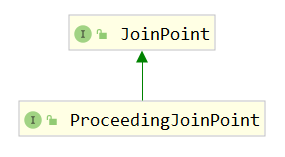

第六部分 Spring AOP 应用

> AOP本质：在不改变原有业务逻辑的情况下增强横切逻辑，横切逻辑代码往往是权限检验，日子代码，事务控制代码，性能监控代码。

# 1 AOP 相关术语

## 1.1 业务主线

在讲解AOP之前，我们先看一下下面这两张图，它们就是该部分案例需求的扩展（针对这些扩展的需求，我们只进行分析，在此基础上）



上图描述的就是未采用 AOP 思想设计的程序，当我们红色框中圈定的方法时，会带来大量的重复劳动。程序中充斥着大量的重复代码，使我们程序的独立性很差。而下图中是采用了AOP思想设计的程序，它把红框部分的代码抽取出来的同时，运用动态代理技术，在运行期对需要使用的业务逻辑方法进行增强。



## 1.2 AOP 术语

| 名称              | 解释                                                         |
| ----------------- | ------------------------------------------------------------ |
| JoinPoint(连接点) | 指的是那些**可以**用于把增强代码加入到业务主线中的点，<br>那么由上图中我们可以看出，这些点指的就是方法。<br>在方法执行的前后通过动态代理技术加入增强的代码。<br>在Spring框架AOP思想的技术实现中，也只支持方法类型的连接点。 |
| Pointcut(切入点)  | 指的是那些**已经**把增强代码写入到业务主线进来之后的连接点。<br>由上图中，我们看出表现层 `register` 方法只是连接点，<br>因为判断访问权限的功能并没有对其增强。 |
| Advice(通知/增强) | 指的是切面类中用于提供增强功能的方法。并且不同的方法增强的时机是不一样的。<br>比如，开启事务肯定要在业务方法执行之前执行；<br>提交事务要在业务方法正常执行之后执行，而回滚事务要在业务方法执行产生异常之后执行等等。<br>那么这些就是通知的类型。其分类有：**前置通知 后置通知 异常通知 最终通知 环绕通知** |
| Target(目标)      | 指的是代理的目标对象。即被代理对象                           |
| Proxy(代理)       | 指的是一个类被 AOP 织入增强后，产生的代理类。即代理对象      |
| Weaving(织入)     | 指的是把增强应用到目标对象来创建新的代理对象的过程。<br>Spring 采用动态代理织入，而 AspectJ 采用编译期织入和类装载期织入 |
| Aspect(切面)      | 指的是增强的代码所关注的方面，把这些相关的增强代码定义到一个类中，这个类就是切面类。<br>例如，事务切面。它里面定义的方法就是和事务相关的，像开启事务，提交事务，回滚事务等等，<br>不会定义其他与事务无关的方法。前面案例中 `TransactionManager` 就是一个切面。 |

1. 连接点：方法开始时，结束时，正常运行完毕时、方法异常时等这些特殊的时机点，我们称之为连接点，项目中每个方法都有连接点，连接点是一种**候选点**。

2. 切入点：指定 AOP 思想要影响的具体方法是哪些，描述感兴趣的方法

3. Advice增强：

   第一个层次：指的是横切逻辑

   第二个层次：方位点（在某一些连接点上加入横切逻辑，那么这些连接点就叫做方位点，描述的是具体的特殊时机）

   

   Aspect 切面：切面是对上述概念的一个综合

   Aspect切面 = 切入点 + 增强

   ​					 = 切入点（锁定方法）+ 方位点（锁定方法中的特殊时机）+ 横切逻辑 

# 2 Spring 中AOP的代理选择

Spring 实现 AOP 思想使用的是动态代理技术

默认情况下，Spring 会根据被代理对象是否实现接口来选择使用 jdk 还是 cglib。当被代理对象没有实现任何接口时，Spring 会选择 cglib；当被代理对象实现了接口，Spring 会选择 jdk 官方的代理技术。不过可以通过配置的方式，让 Spring 强制使用 cglib。

# 3 Spring中AOP的配置方式

在 Spring 的 AOP 配置中，也和 IoC 配置一样，支持三类配置方式：

1. 使用 xml 配置
2. 使用 xml + 注解组合配置
3. 使用纯注解配置

# 4 Spring中AOP实现

需求：横切逻辑代码是打印日志，希望把打印日志的逻辑织入到目标方法的特定位置（service 层 transfer 方法）。

## 4.1 xml 模式

（复制 turbo-transfer-iocxml-anno 到 turbo-transfer-aopxml）[gitee代码地址](https://gitee.com/turboYuu/spring-1-2/tree/master/lab/turbo-transfer-aopxml)。

Spring 是模块化开发的框架，使用 aop 就引入 aop 的 jar

- pom.xml

  ```xml
  <!--spring aop 的 jar 包支持-->
  <dependency>
      <groupId>org.springframework</groupId>
      <artifactId>spring-aop</artifactId>
      <version>5.1.12.RELEASE</version>
  </dependency>
  
  <!--第三方的 aop 框架 aspectjweaver 的jar-->
  <dependency>
      <groupId>org.aspectj</groupId>
      <artifactId>aspectjweaver</artifactId>
      <version>1.8.13</version>
  </dependency>
  ```

- AOP 核心配置

  ```xml
  <?xml version="1.0" encoding="UTF-8"?>
  <beans xmlns="http://www.springframework.org/schema/beans"
         xmlns:context="http://www.springframework.org/schema/context"
         xmlns:aop="http://www.springframework.org/schema/aop"
      xmlns:xsi="http://www.w3.org/2001/XMLSchema-instance"
      xsi:schemaLocation="
          http://www.springframework.org/schema/beans
          https://www.springframework.org/schema/beans/spring-beans.xsd
          http://www.springframework.org/schema/context
          https://www.springframework.org/schema/context/spring-context.xsd
          http://www.springframework.org/schema/aop
          https://www.springframework.org/schema/aop/spring-aop.xsd
  
  ">
  
      <!--.....-->
      
      <!--进行 aop 相关的 xml 配置, 配置aop的过程就是把相关术语落地-->
      <!--横切逻辑 bean-->
      <bean id="logUtils" class="com.turbo.edu.utils.LogUtils"></bean>
      <!--使用 config 标签表明aop配置，在其内部配置切面-->
      <aop:config>
          <!--aspect 切面 = 切入点（锁定方法）+ 方位点（锁定方法中的特殊时机）+ 横切逻辑 -->
          <aop:aspect id="logAspect" ref="logUtils">
              <!--切入点锁定我们感兴趣的方法，使用aspectj语法表达式-->
              <aop:pointcut id="pt1" expression="execution(public void com.turbo.edu.service.impl.TransferServiceImpl.transfer(java.lang.String, java.lang.String, int))"/>
              
              <!--方位信息 pointcut-ref 关联切入点-->
              <aop:before method="beforeMethod" pointcut-ref="pt1" />
          </aop:aspect>
      </aop:config>
  	
  </beans>
  ```

### 4.1.1 关于切入点表达式

- 概念及作用

  切入点表达式，也称之为 AspectJ 切入点表达式，**指的是遵循特定语法结构的字符串**，**其作用是用于对符合语法格式的连接点进行增强**。它是 AspectJ 表达式的一部分。

- 关于 AspectJ

  AspectJ 是一个基于 Java 语言的 AOP 框架，Spring 框架从 2.0 版本之后集成了 AspectJ 框架中切入点表达式的部分，开始支持 AspectJ 切入点表达式。

- 切入点表达式使用示例

  ```xml
  全限定方法名：访问修饰符  返回值  包名.包名.包名.包名.类型.方法名(参数列表)
  
  全匹配方式：
  public void com.turbo.edu.service.impl.TransferServiceImpl.transfer(java.lang.String, java.lang.String, int)
  
  访问修饰符可以省略：
  void com.turbo.edu.service.impl.TransferServiceImpl.transfer(java.lang.String, java.lang.String, int)
  
  返回值可以使用 *，标识任意返回值：
  * com.turbo.edu.service.impl.TransferServiceImpl.transfer(java.lang.String, java.lang.String, int)
  
  包名可以使用*表示任意包，但是有几级包，必须写几个
  * *.*.*.*.*.TransferServiceImpl.transfer(java.lang.String, java.lang.String, int)
  
  包名可以使用..表示当前包及其子包
  * *..TransferServiceImpl.transfer(java.lang.String, java.lang.String, int)
  
  类名和方法名，都可以使用*表示任意类，任意方法
  * *..*.*(java.lang.String, java.lang.String, int)
  
  参数列表，可以使用具体类型
  基本类型直接写类型名称：int
  引用类型必须写全限定类名：java.lang.String
  参数列表可以使用*，表示任意参数类型，但是必须有参数 * *..*.*(*)
  参数列表可以使用..，表示有无参数均可。有参数可以是任意类型 * *..*.*(..)
  全统配方式 * *..*.*(..)
  ```

  

### 4.1.2 改变代理方式的配置

Spring 在创建代理对象时，会根据被代理对象的实际情况来选择代理方式。被代理对象实现了接口，则采用基于接口的动态代理。当被代理对象没有实现任何接口的时候，Spring会自动切换到基于子类的动态代理方式。

但是我们知道，无论被代理对象是否实现接口，只要不是final修饰的类都可以采用cglib提供的方式创建代理对象。所以 Spring 也考虑到这个情况，提供了配置的方式实现强制使用基于子类的动态代理（即cglib），配置的方式有两种：

- 使用 aop:config 标签配置

  ```xml
  <aop:config proxy-target-class="true">
  ```

- 使用 aop:aspectj-autoproxy 标签配置

  ```xml
  <!--此标签注解是基于XML和注解组合配置 AOP 时的必备标签，表示Spring开启注解配置AOP的支持-->
  <aop:aspectj-autoproxy proxy-target-class="true"></aop:aspectj-autoproxy>
  ```

  

### 4.1.3 五种通知类型

#### 4.1.3.1 前置通知

**配置方式**：aop:before 标签

```xml
<!--
	作用：前置通知
	出现位置：只能出现在 aop:aspect 标签内部
	属性：
		method：用于指定前置通知的方法名称
		pointcut：用于指定切面表达式
		pointcut-ref：用于指定切入点表达式的引用
	
-->
<aop:before method="beforeMethod" pointcut-ref="pt1" />
```

**执行时机**：前置通知永远都会在切入点方法（业务核心方法）执行之前执行。

**细节**：前置通知可以获取切入点方法的参数，并对其进行增强。

```java
public void beforeMethod(JoinPoint joinPoint){
    // 获取切入点的参数
    final Object[] args = joinPoint.getArgs();
    // ...
}
```


#### 4.1.3.2 后置通知

**配置方式**：aop:after-returning

```xml
<!--
	作用：后置通知
	出现位置：只能出现在 aop:aspect 标签内部
	属性：
		method：用于指定后置通知的方法名称
		pointcut：用于指定切面表达式
		pointcut-ref：用于指定切入点表达式的引用
		returning: 中的 returnVal 对应 successMethod方法的形参，用来接收业务方法返回值
-->
<aop:after-returning method="successMethod" returning="returnVal" pointcut-ref="pt1"/>
```


#### 4.1.3.3 异常通知

**配置方式**：aop:after-throwing

```xml
<!--
	作用：配置异常通知
	出现位置：只能出现在 aop:aspect 标签内部
	属性：
		method：用于指定异常通知的方法名称
		pointcut：用于指定切面表达式
		pointcut-ref：用于指定切入点表达式的引用
-->
<aop:after-throwing method="exceptionMethod" pointcut-ref="pt1"/>
```

**执行时机**：异常通知的执行时机是在切入点方法（业务核心方法）执行产生异常之后，异常通知执行。如果切入点方法执行没有产生异常，则异常通知不会执行。

**细节**：异常通知不仅可以获取切入点方法执行的参数，也可以获取切入点方法执行产生的异常信息。

#### 4.1.3.4 最终通知

**配置方式**：aop:after

```xml
<!--
	作用：配置最终通知
	出现位置：只能出现在 aop:aspect 标签内部
	属性：
		method：用于指定最终通知的方法名称
		pointcut：用于指定切面表达式
		pointcut-ref：用于指定切入点表达式的引用
-->
<aop:after method="afterMethod" pointcut-ref="pt1"/>
```

**执行时机**：最终通知的执行时机是在切入点方法（业务核心方法）执行完成之后，切入点方法返回之前执行。换句话说，无论切入点方法执行是否产生异常，它都会在返回之前执行。

**细节**：最终通知执行时，可以获取到通知方法的参数。同时它可以做一些清理操作。

#### 4.1.3.5 环绕通知

**配置方式**：aop:around

```xml
<!--
	作用：用于环绕通知，一般独立使用
	出现位置：只能出现在 aop:aspect 标签内部
	属性：
		method：用于指定环绕通知的方法名称
		pointcut：用于指定切面表达式
		pointcut-ref：用于指定切入点表达式的引用
-->
<aop:around method="aroundMethod" pointcut-ref="pt1"/>
```

**特别说明**

环绕通知，它是有别于前面四种通知类型外的特殊通知。前面四种通知（前置、后置、异常、最终）它们都是指定合适增强的通知类型。而环绕通知，它是 Spring 框架为我们提供的一种可以通过编码的方法，控制增强代码何时执行的通知类型。它里面借助的 `ProceedingJoinPoint` 接口及其实现类，实现手动触发切入点方法的调用。

**ProceedingJoinPoint接口介绍**：

类视图：



## 4.2 xml + 注解模式

（复制 turbo-transfer-aopxml 到 turbo-transfer-aopxml-anno）[gitee代码地址](https://gitee.com/turboYuu/spring-1-2/tree/master/lab/turbo-transfer-aopxml-anno)。

- XML 中开启 Spring 对注解 AOP 的支持

  ```xml
  <!--开启spring对注解aop的支持
      proxy-target-class="true" 强制使用cglib
      -->
  <aop:aspectj-autoproxy proxy-target-class="true"/>
  ```

- 修改LogUtils.java

  ```java
  package com.turbo.edu.utils;
  
  import org.aspectj.lang.JoinPoint;
  import org.aspectj.lang.ProceedingJoinPoint;
  import org.aspectj.lang.annotation.*;
  import org.springframework.stereotype.Component;
  
  @Component
  @Aspect
  public class LogUtils {
  
      @Pointcut("execution(* com.turbo.edu.service.impl.TransferServiceImpl.*(..))")
      public void pointcut() {
      }
  
      /**
       * 业务逻辑开始执行之前执行
       *
       */
      @Before("pointcut()")
      public void beforeMethod(JoinPoint joinPoint){
          // 获取切入点的参数
          final Object[] args = joinPoint.getArgs();
          for (int i = 0; i < args.length; i++) {
              final Object arg = args[i];
              System.out.println(arg);
          }
          System.out.println("业务逻辑开始执行之前开始执行 ...... ");
      }
  
  
      /**
       * 业务逻辑结束时执行（无论异常与否都执行）
       * 最终通知
       */
      @After("pointcut()")
      public void afterMethod(){
          System.out.println("业务逻辑结束时执行 ...... ");
      }
  
      /**
       * 业务逻辑异常时执行
       */
      @AfterThrowing("pointcut()")
      public void exceptionMethod(){
          System.out.println("业务逻辑异常时执行 ...... ");
      }
  
      /**
       * 后置通知
       */
      @AfterReturning(value = "pointcut()",returning = "returnVal")
      public void successMethod(Object returnVal){
          System.out.println("业务逻正常时执行 .....");
      }
  
      /**
       * 环绕通知
       */
      /*@Around("pointcut()")*/
      public Object aroundMethod(ProceedingJoinPoint proceedingJoinPoint) throws Throwable {
          System.out.println("环绕通知中的 before.....");
  
          Object result = null;
          try {
              // 控制原有业务逻辑是否执行 类似于代理中的 method.invoke
              result = proceedingJoinPoint.proceed(proceedingJoinPoint.getArgs());
              System.out.println("环绕通知中的 after.....");
          }catch (Exception e){
              System.out.println("环绕通知中的 exception.....");
          } finally {
              System.out.println("环绕通知中的 最终通知.....");
          }
  //        System.out.println("环绕通知中的 after.....");
  //        System.out.println("环绕通知 .....");
          return result;
      }
  }
  ```

- 测试方法

  ```java
  /**
  * 测试 xml-anno aop
  */
  @Test
  public void testXmlAop() throws Exception {
      // 启动容器
      ClassPathXmlApplicationContext applicationContext = 
          new ClassPathXmlApplicationContext("applicationContext.xml");
      TransferService transferService = (TransferService) applicationContext.getBean("transferService");
      transferService.transfer("6029621011000","6029621011001",1);
  }
  ```

  

## 4.3 注解模式

（复制 turbo-transfer-aopxml-anno 到 turbo-transfer-aop-anno）[gitee代码地址](https://gitee.com/turboYuu/spring-1-2/tree/master/lab/turbo-transfer-aop-anno)。

在使用注解驱动开发 aop 时，我们要明确的就是，是注解替换掉配置文件中的下面这行配置：

```xml
<!--开启spring对注解aop的支持
    proxy-target-class="true" 强制使用cglib
    -->
<aop:aspectj-autoproxy proxy-target-class="true"/>
```

在配置类 SpringConfig.java 中使用如下注解进行替换上述配置

```java
package com.turbo.edu;

import com.alibaba.druid.pool.DruidDataSource;
import org.springframework.beans.factory.annotation.Value;
import org.springframework.context.annotation.*;

import javax.sql.DataSource;

// @Configuration 表明当前是一个配置类
@Configuration
@ComponentScan(basePackages = {"com.turbo.edu"}) // 开启注解扫描，base-package 指定扫描的包路径
@PropertySource({"classpath:jdbc.properties"}) // 引入外部资源文件
@EnableAspectJAutoProxy // 开启 spring 对注解 aop 的支持 
public class SpringConfig {
    @Value("${jdbc.driver}")
    private String driverClassName;
    @Value("${jdbc.url}")
    private String url;
    @Value("${jdbc.username}")
    private String username;
    @Value("${jdbc.password}")
    private String password;

    @Bean("dataSource")
    public DataSource createDataSource(){
        DruidDataSource druidDataSource = new DruidDataSource();
        druidDataSource.setDriverClassName(driverClassName);
        druidDataSource.setUrl(url);
        druidDataSource.setUsername(username);
        druidDataSource.setPassword(password);
        return druidDataSource;
    }
}
```

然后删除 applicationContext.xml

修改 web.xml 

```xml
<!DOCTYPE web-app PUBLIC
 "-//Sun Microsystems, Inc.//DTD Web Application 2.3//EN"
 "http://java.sun.com/dtd/web-app_2_3.dtd" >

<web-app>
  <display-name>Archetype Created Web Application</display-name>

  <!--告诉 ContextLoaderListener 知道我们使用注解的方式启动 IoC 容器-->
  <context-param>
    <param-name>contextClass</param-name>
    <param-value>org.springframework.web.context.support.AnnotationConfigWebApplicationContext</param-value>
  </context-param>

  <!--配置启动类的全限定类名-->
  <context-param>
    <param-name>contextConfigLocation</param-name>
    <param-value>com.turbo.edu.SpringConfig</param-value>
  </context-param>
  <!--使用监听器启动spring 的IoC 容器-->
  <listener>
    <listener-class>org.springframework.web.context.ContextLoaderListener</listener-class>
  </listener>
</web-app>
```

测试方法：

```java
/**
* 测试 anno aop
*/
@Test
public void testXmlAop() throws Exception {
    // 启动容器
    ApplicationContext applicationContext = new AnnotationConfigApplicationContext(SpringConfig.class);
    TransferService transferService = (TransferService) applicationContext.getBean("transferService");
    transferService.transfer("6029621011000","6029621011001",1);
}
```

# 5 Spring 声明式事务支持

编程式事务：在业务代码中添加事务控制代码，这样的事务控制就叫做编程式事务。

声明式事务：通过 xml 或者注解配置的方式达到事务控制的目的，叫做声明式事务。

## 5.1 事务回顾

### 5.1.1 事务的概念

事务指逻辑上的一组操作，组成这组操作的各个单元，要么全部成功，要么全部不成功。从而确保了数据的准确与安全。

例如：A —— B 转账，对应于如下两条 Sql 语句：

```sql
/*转出账户减钱*/
update account set money=money-100 where name=‘a’; 
/**转⼊账户加钱*/
update account set money=money+100 where name=‘b’;
```

这两条语句的执行，要么全部成功，要么全部不成功。

### 5.1.2 事务的四大特性

1. **原子性（Atomicity）**

   原子性是指一个不可分割的工作单位，事务中的操作要么都发生，要么都不发生。

   从操作角度来描述，事务中的各个操作要么都成功，要么都失败。

2. **一致性（Consistency）**

   事务必须是数据库从 **一个一致性状态** 变换到**另外 一个一致性状态**。

3. **隔离性（Isolation）**

   事务的隔离性是多个用户并发访问数据库时，数据库为每个用户开启的事务，每个事务不能被其他事务的操作数据所干扰，多个并发事务之间要相互隔离。

4. **持久性（Durability）**

   持久性是指一个事务一旦被提交，它对数据库中数据的改变就是永久性的，接下来即使数据库发生故障也不应该对其有任何影响。

### 5.1.3 事务的隔离级别

不考虑事务隔离级别，会出现以下情况：（以下情况全是错误的）

- 脏读：一个线程中的事务读到了另外一个线程中**未提交**的数据。
- 不可重复读：一个线程中的事务读到了另外一个线程中已经提交的**update** 的数据（前后不一样）
- 幻读：一个线程中的事务读到了另外一个线程中已经提交的 **insert** 或者 **delete** 的数据（前后条数不一样）。

### 5.1.4 事务的传播级别

事务往往在 service 层进行控制，如果出现 service 层方法A 调用了另外一个 service 层方法B，A和B方法本身都已经被添加了事务控制，那么A调用B的时候，就需要进行事务的一些协商，这就叫做事务的传播行为。

A 调用 B，我们站在B的角度来观察和定义事务的传播行为：

| 事务传播行为                 | 说明                                                         |
| ---------------------------- | ------------------------------------------------------------ |
| ==**PROPAGATION_REQUIRED**== | 如果当前没有事务，就新建一个事务；<br>如果已经存在一个事务，就加入到这个事务中。**这是常见的选择** |
| ==**PROPAGATION_SUPPORTS**== | 支持当前事务，如果当前没有事务，就以非事务方式执行           |
| PROPAGATION_MANDATORY        | 使用当前的事务，如果当前没有事务，就抛出异常。               |
| PROPAGATION_REQUIRES_NEW     | 新建事务，如果当前存在事务，就把当前事务挂起。               |
| PROPAGATION_NOT_SUPPORTED    | 以非事务方式执行，如果当前存在事务，就把当前事务挂起。       |
| PROPAGATION_NEVER            | 以非事务方式执行，如果当前存在事务，则抛出异常。             |
| PROPAGATION_NESTED           | 如果当前存在事务，则在嵌套事务内执行。<br>如果当前没有事务，则执行与 PROPAGATION_REQUIRED类似的操作。 |

前三个（PROPAGATION_REQUIRED、PROPAGATION_SUPPORTS、PROPAGATION_MANDATORY）支持当前事务；<br>后三个 （PROPAGATION_REQUIRES_NEW、PROPAGATION_NOT_SUPPORTED、PROPAGATION_NOT_SUPPORTED）不支持当前事务；<br>最后一个特殊。

## 5.2 Spring 中事务的 API

mybatis 中提交事务 ：sqlSession.commit();

Hibernate 中提交事务使用：session.commit();

```java
// org.springframework.transaction.PlatformTransactionManager
public interface PlatformTransactionManager {
	// 获取事务状态信息
	TransactionStatus getTransaction(@Nullable TransactionDefinition definition)
			throws TransactionException;
    // 提交事务
	void commit(TransactionStatus status) throws TransactionException;
	// 回滚事务
	void rollback(TransactionStatus status) throws TransactionException;
}

```

**作用**

此接口是 Spring 的事务管理器核心接口。Spring 本身并不支持事务实现，只是负责提供标准，应用层支持什么样的事务，需要提供具体的实现类。此时也是策略模式的具体应用。在Spring框架中，也为我们内置了一些具体策略，例如：`DataSourceTransactionManager`，`HibernateTransactionManager` 等等 （org.springframework.jdbc.datasource.DataSourceTransactionManager，org.springframework.orm.hibernate5.HibernateTransactionManager）

Spring 中 JdbcTemplate （数据库操作工具）、Mybatis（mybatis-spring.jar） 这两个对应的事务操作实现类——> `DataSourceTransactionManager`。

Hibernate 框架 对应的事务操作实现类——> `HibernateTransactionManager` 。

`DataSourceTransactionManager` 归根到底是横切逻辑代码，声明式事务要做的就是使用 AOP（动态代理）将事务控制逻辑织入到业务代码中。

## 5.3 Spring 声明式事务配置

（复制 turbo-transfer-aopxml-anno 到 turbo-transfer-transaction）[turbo-transfer-transaction 代码地址](https://gitee.com/turboYuu/spring-1-2/tree/master/lab/turbo-transfer-transaction)。

代码准备：

- applicationContext.xml修改，配置 jdbcTemplate 

  ```xml
  <bean id="jdbcTemplate" class="org.springframework.jdbc.core.JdbcTemplate">
      <constructor-arg name="dataSource" ref="dataSource"/>
  </bean>
  ```

- 重写 JdbcAccountDaoImpl.java，把 jdbcTemplate 注入

  ```java
  /**
   * @author turbo
   */
  @Repository("accountDao")
  public class JdbcAccountDaoImpl implements AccountDao {
  
      // 按照类型注入
      @Autowired
      private JdbcTemplate jdbcTemplate;
  
      @Override
      public Account queryAccountByCardNo(String cardNo) throws Exception {
  
          String sql = "select * from account where cardNo=?";
  
          return jdbcTemplate.queryForObject(sql, new RowMapper<Account>() {
              @Override
              public Account mapRow(ResultSet resultSet, int i) throws SQLException {
                  Account account = new Account();
                  account.setName(resultSet.getString("name"));
                  account.setCardNo(resultSet.getString("cardNo"));
                  account.setMoney(resultSet.getInt("money"));
                  return account;
              }
          },cardNo);
      }
  
      @Override
      public int updateAccountByCardNo(Account account) throws Exception {
          String sql = "update account set money=? where cardNo=?";
          return jdbcTemplate.update(sql,account.getMoney(),account.getCardNo());
      }
  }
  ```

- 删除手写 IoC （CreateBeanFactory）和AOP（ProxyFactory）

- 修改 TransferServlet.java

  ```java
  @Override
  public void init() throws ServletException {
      WebApplicationContext webApplicationContext = WebApplicationContextUtils
          .getWebApplicationContext(this.getServletContext());
      transferService = (TransferService) webApplicationContext.getBean("transferService");
  }
  ```

- 启动 tomcat 插件，测试成功。

### 5.3.1 纯 xml 模式

- 导入 依赖

  ```xml
  <!--spring aop 的 jar 包支持-->
  <dependency>
      <groupId>org.springframework</groupId>
      <artifactId>spring-aop</artifactId>
      <version>5.1.12.RELEASE</version>
  </dependency>
  
  <!--第三方的 aop 框架 aspectjweaver 的jar-->
  <dependency>
      <groupId>org.aspectj</groupId>
      <artifactId>aspectjweaver</artifactId>
      <version>1.8.13</version>
  </dependency>
  
  <!--引入 spring 声明式事务相关 jar-->
  <dependency>
      <groupId>org.springframework</groupId>
      <artifactId>spring-jdbc</artifactId>
      <version>5.1.12.RELEASE</version>
  </dependency>
  <dependency>
      <groupId>org.springframework</groupId>
      <artifactId>spring-tx</artifactId>
      <version>5.1.12.RELEASE</version>
  </dependency>
  ```

- xml 配置

  ```xml
  <?xml version="1.0" encoding="UTF-8"?>
  <beans xmlns="http://www.springframework.org/schema/beans"
         xmlns:context="http://www.springframework.org/schema/context"
         xmlns:aop="http://www.springframework.org/schema/aop"
         xmlns:tx="http://www.springframework.org/schema/tx"
      xmlns:xsi="http://www.w3.org/2001/XMLSchema-instance"
      xsi:schemaLocation="
          http://www.springframework.org/schema/beans
          https://www.springframework.org/schema/beans/spring-beans.xsd
          http://www.springframework.org/schema/context
          https://www.springframework.org/schema/context/spring-context.xsd
          http://www.springframework.org/schema/aop
          https://www.springframework.org/schema/aop/spring-aop.xsd
          http://www.springframework.org/schema/tx
          https://www.springframework.org/schema/tx/spring-tx.xsd
  
  ">
  
      <!--...省略...-->
  
      <bean id="jdbcTemplate" class="org.springframework.jdbc.core.JdbcTemplate">
          <constructor-arg name="dataSource" ref="dataSource"/>
      </bean>
  
      <!--开启spring对注解aop的支持
      proxy-target-class="true" 强制使用cglib
      -->
      <aop:aspectj-autoproxy proxy-target-class="true"/>
  
      <!--Spring声明式事务配置，声明式事务无非就是配置一个 AOP,只不过有些标签不一样罢了-->
      <!--横切逻辑-->
      <bean id="transactionManager" class="org.springframework.jdbc.datasource.DataSourceTransactionManager">
          <constructor-arg name="dataSource" ref="dataSource"/>
      </bean>
  
      <tx:advice id="txAdvice" transaction-manager="transactionManager">
          <!--定制事务细节 传播行为、隔离级别-->
          <tx:attributes>
              <!--一般性配置-->
              <tx:method name="*" read-only="false" propagation="REQUIRED" isolation="DEFAULT" timeout="-1"/>
              <!--针对查询的覆盖性配置-->
              <tx:method name="query*" read-only="true" propagation="SUPPORTS"/>
          </tx:attributes>
      </tx:advice>
      <aop:config>
          <!--advice-ref 指向增强 = 横切逻辑 + 方位-->
          <aop:advisor advice-ref="txAdvice" pointcut="execution(* com.turbo.edu.service.impl.TransferServiceImpl.*(..))"/>
      </aop:config>
  
  </beans>
  ```

  

### 5.3.2 基于 xml + 注解

（复制 turbo-transfer-transaction 到 turbo-transfer-transaction-xml-anno）[turbo-transfer-transaction-xml-anno 代码地址](https://gitee.com/turboYuu/spring-1-2/tree/master/lab/turbo-transfer-transaction-xml-anno)。

- xml配置

  ```xml
  <?xml version="1.0" encoding="UTF-8"?>
  <beans xmlns="http://www.springframework.org/schema/beans"
         xmlns:context="http://www.springframework.org/schema/context"
         xmlns:aop="http://www.springframework.org/schema/aop"
         xmlns:tx="http://www.springframework.org/schema/tx"
      xmlns:xsi="http://www.w3.org/2001/XMLSchema-instance"
      xsi:schemaLocation="
          http://www.springframework.org/schema/beans
          https://www.springframework.org/schema/beans/spring-beans.xsd
          http://www.springframework.org/schema/context
          https://www.springframework.org/schema/context/spring-context.xsd
          http://www.springframework.org/schema/aop
          https://www.springframework.org/schema/aop/spring-aop.xsd
          http://www.springframework.org/schema/tx
          https://www.springframework.org/schema/tx/spring-tx.xsd
  
  ">
  
      <!--...省略部分...-->
      <bean id="jdbcTemplate" class="org.springframework.jdbc.core.JdbcTemplate">
          <constructor-arg name="dataSource" ref="dataSource"/>
      </bean>
  
  
      <!--Spring声明式事务配置，声明式事务无非就是配置一个 AOP,只不过有些标签不一样罢了-->
      <!--横切逻辑-->
      <bean id="transactionManager" class="org.springframework.jdbc.datasource.DataSourceTransactionManager">
          <constructor-arg name="dataSource" ref="dataSource"/>
      </bean>
  
      <!--<tx:advice id="txAdvice" transaction-manager="transactionManager">
          &lt;!&ndash;定制事务细节 传播行为、隔离级别&ndash;&gt;
          <tx:attributes>
              &lt;!&ndash;一般性配置&ndash;&gt;
              <tx:method name="*" read-only="false" propagation="REQUIRED" isolation="DEFAULT" timeout="-1"/>
              &lt;!&ndash;针对查询的覆盖性配置&ndash;&gt;
              <tx:method name="query*" read-only="true" propagation="SUPPORTS"/>
          </tx:attributes>
      </tx:advice>
      <aop:config>
          &lt;!&ndash;advice-ref 指向增强 = 横切逻辑 + 方位&ndash;&gt;
          <aop:advisor advice-ref="txAdvice" pointcut="execution(* com.turbo.edu.service.impl.TransferServiceImpl.*(..))"/>
      </aop:config>-->
  
      <!--声明式事务的注解驱动-->
      <tx:annotation-driven transaction-manager="transactionManager"/>
  
  </beans>
  ```

- 在接口、类或者方法上添加 @Transactional 注解

  ```java
  @Transactional(readOnly = false,propagation = Propagation.REQUIRED)
  ```

  

### 5.3.3 基于注解

（复制  turbo-transfer-transaction-xml-anno 到 turbo-transfer-transaction-anno）[turbo-transfer-transaction-anno 代码地址](https://gitee.com/turboYuu/spring-1-2/tree/master/lab/turbo-transfer-transaction-anno)。

Spring 基于注解驱动开发的事务控制配置，只需要把 xml 配置部分改为注解实现。只是需要一个注解替换掉 xml 配置文件中的 `<tx:annotation-driven transaction-manager="transactionManager"/>` 配置。

在 Spring 的配置类上添加 `@EnableTransactionManagement` 注解即可。

```java
@EnableTransactionManagement // 开启 spring 对注解事务的支持
```