第七部分 Spring AOP 源码深度剖析

# 1 代理对象创建

## 1.1 AOP基础用例准备

在 spring-framework 源码的 spring-turbo 模块中编写，[gitee地址](https://gitee.com/turboYuu/spring-1-2/tree/master/source_code/spring-framework-5.1.x/spring-turbo)。

1. 编辑build.gradle

   ```xml
   <!-- dependencies 中增加一行内容-->
   compile group: 'org.aspectj', name: 'aspectjweaver', version: '1.8.6'
   ```

   

2. TurboBean中增加 print 方法

   ```java
   public void print(){
       System.out.println("print业务逻辑执行...");
   }
   ```

3. 定义切面类 LogUtils

   ```java
   package com.turbo;
   
   import org.aspectj.lang.JoinPoint;
   
   public class LogUtils {
   
   	public void beforeMethod(JoinPoint joinPoint){
   		final Object[] args = joinPoint.getArgs();
   		System.out.println("前置通知");
   	}
   }
   ```

4. 编辑applicationContext.xml，配置 aop

   ```xml
   <bean id="logUtils" class="com.turbo.LogUtils"></bean>
   
   <aop:config>
       <aop:aspect id="logAspect" ref="logUtils">
           <aop:pointcut id="print" expression="execution(public void com.turbo.TurboBean.print())"/>
           <aop:before method="beforeMethod" pointcut-ref="print"></aop:before>
       </aop:aspect>
   </aop:config>
   ```

5. 测试方法

   ```java
   @Test
   public void testAOP(){
       ApplicationContext applicationContext =
           new ClassPathXmlApplicationContext("classpath:applicationContext.xml");
       final TurboBean turboBean = applicationContext.getBean(TurboBean.class);
       turboBean.print();
   }
   ```

   

## 1.2 时机点分析


发现在 getBean 之前，TurboBean 对象已经产生（即在第一行代码中完成），而且该对象是一个代理对象（cglib代理对象），我们判定，容器初始化过程中 目标Bean已经完成了代理，返回了代理对象。

## 1.3 代理对象创建流程

代理对象的产生就是利用 BeanPostProcessor ，在 [第五部分  Spring IOC 源码深度剖析 中的 Bean 创建流程]()，中 AbstractAutowireCapableBeanFactory#doCreateBean 方法中调用了 AbstractAutowireCapableBeanFactory#initializeBean 方法，进入 AbstractAutowireCapableBeanFactory#initializeBean：

```java
protected Object initializeBean(String beanName, Object bean, @Nullable RootBeanDefinition mbd) {
    // 执行所有的AwareMethods
    if (System.getSecurityManager() != null) {
        AccessController.doPrivileged((PrivilegedAction<Object>) () -> {
            invokeAwareMethods(beanName, bean);
            return null;
        }, getAccessControlContext());
    }
    else {
        invokeAwareMethods(beanName, bean);
    }

    Object wrappedBean = bean;
    if (mbd == null || !mbd.isSynthetic()) {
        // 执行所有的 BeanPostProcessor#postProcessBeforeInitialization 初始化之前的处理器方法
        wrappedBean = applyBeanPostProcessorsBeforeInitialization(wrappedBean, beanName);
    }

    try {
        // 这里开始执行 afterPropertiesSet (实现 InitializingBean 接口) 方法和 initMethod
        invokeInitMethods(beanName, wrappedBean, mbd);
    }
    catch (Throwable ex) {
        throw new BeanCreationException(
            (mbd != null ? mbd.getResourceDescription() : null),
            beanName, "Invocation of init method failed", ex);
    }
    if (mbd == null || !mbd.isSynthetic()) {
        // 这个 Bean 初始化完成，执行 后置处理器方法
        wrappedBean = applyBeanPostProcessorsAfterInitialization(wrappedBean, beanName);
    }

    return wrappedBean;
}
```

进入 AbstractAutowireCapableBeanFactory#applyBeanPostProcessorsAfterInitialization：

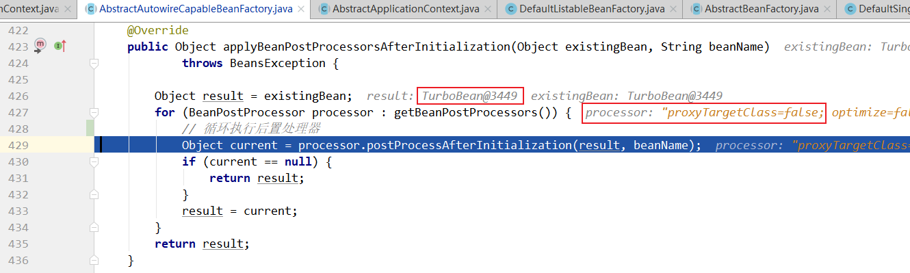


创建代理对象的后置处理器 AbstractAutoProxyCreator#postProcessAfterInitialization：

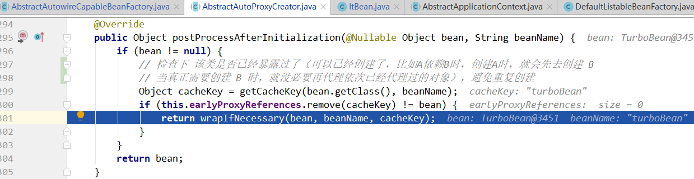


进入 AbstractAutoProxyCreator#wrapIfNecessary：

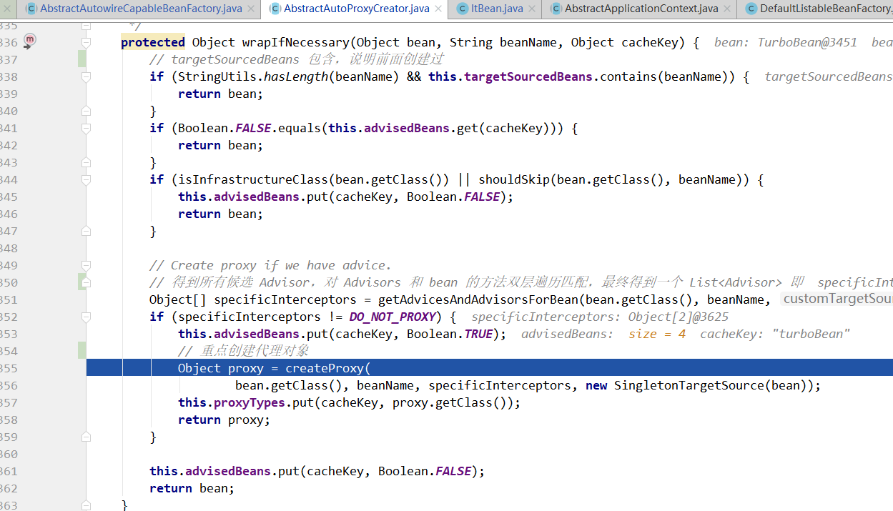


进入 AbstractAutoProxyCreator#createProxy：

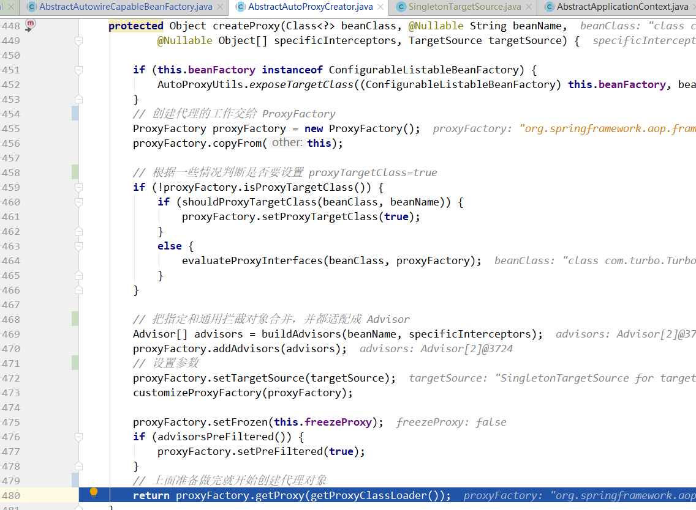

接着跟进到 ProxyFactory 中：

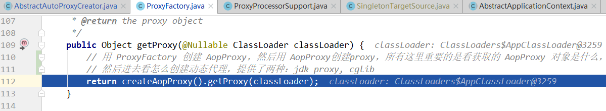

流程就是用 `AopProxyFactory` 创建 AopProxy，再用 AopProxy 创建代理对象，这里的 AopProxyFactory 默认是 DefaultAopProxyFactory，看看它的 createAopProxy 方法：

```java
// org.springframework.aop.framework.DefaultAopProxyFactory
@SuppressWarnings("serial")
public class DefaultAopProxyFactory implements AopProxyFactory, Serializable {

	@Override
	public AopProxy createAopProxy(AdvisedSupport config) throws AopConfigException {
		if (config.isOptimize() || config.isProxyTargetClass() || hasNoUserSuppliedProxyInterfaces(config)) {
			Class<?> targetClass = config.getTargetClass();
			if (targetClass == null) {
				throw new AopConfigException("TargetSource cannot determine target class: " +
						"Either an interface or a target is required for proxy creation.");
			}
			if (targetClass.isInterface() || Proxy.isProxyClass(targetClass)) {
				return new JdkDynamicAopProxy(config);
			}
			return new ObjenesisCglibAopProxy(config);
		}
		else {
			return new JdkDynamicAopProxy(config);
		}
	}

	/**
	 * Determine whether the supplied {@link AdvisedSupport} has only the
	 * {@link org.springframework.aop.SpringProxy} interface specified
	 * (or no proxy interfaces specified at all).
	 */
	private boolean hasNoUserSuppliedProxyInterfaces(AdvisedSupport config) {
		Class<?>[] ifcs = config.getProxiedInterfaces();
		return (ifcs.length == 0 || (ifcs.length == 1 && SpringProxy.class.isAssignableFrom(ifcs[0])));
	}
}
```

这里决定创建代理是用 jdk proxy，还是用 cglib，最简单的从使用方面来说：设置 `proxyTargetClass=true` 强制使用 cglib 代理，什么参数都不设置并且对象类实现类接口默认使用 jdk 代理，如果没有实现接口则也必须使用 cglib。

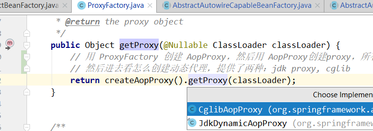

org.springframework.aop.framework.ProxyFactory#getProxy(java.lang.ClassLoader)

-- org.springframework.aop.framework.CglibAopProxy#getProxy(java.lang.ClassLoader)

```java
public Object getProxy(@Nullable ClassLoader classLoader) {
    if (logger.isTraceEnabled()) {
        logger.trace("Creating CGLIB proxy: " + this.advised.getTargetSource());
    }

    try {
        Class<?> rootClass = this.advised.getTargetClass();
        Assert.state(rootClass != null, "Target class must be available for creating a CGLIB proxy");

        Class<?> proxySuperClass = rootClass;
        if (ClassUtils.isCglibProxyClass(rootClass)) {
            proxySuperClass = rootClass.getSuperclass();
            Class<?>[] additionalInterfaces = rootClass.getInterfaces();
            for (Class<?> additionalInterface : additionalInterfaces) {
                this.advised.addInterface(additionalInterface);
            }
        }

        // Validate the class, writing log messages as necessary.
        validateClassIfNecessary(proxySuperClass, classLoader);

        // Configure CGLIB Enhancer...
        // 配置 cglib 增强
        Enhancer enhancer = createEnhancer();
        if (classLoader != null) {
            enhancer.setClassLoader(classLoader);
            if (classLoader instanceof SmartClassLoader &&
                ((SmartClassLoader) classLoader).isClassReloadable(proxySuperClass)) {
                enhancer.setUseCache(false);
            }
        }
        enhancer.setSuperclass(proxySuperClass);
        enhancer.setInterfaces(AopProxyUtils.completeProxiedInterfaces(this.advised));
        enhancer.setNamingPolicy(SpringNamingPolicy.INSTANCE);
        enhancer.setStrategy(new ClassLoaderAwareUndeclaredThrowableStrategy(classLoader));

        Callback[] callbacks = getCallbacks(rootClass);
        Class<?>[] types = new Class<?>[callbacks.length];
        for (int x = 0; x < types.length; x++) {
            types[x] = callbacks[x].getClass();
        }
        // fixedInterceptorMap only populated at this point, after getCallbacks call above
        enhancer.setCallbackFilter(new ProxyCallbackFilter(
            this.advised.getConfigurationOnlyCopy(), this.fixedInterceptorMap, this.fixedInterceptorOffset));
        enhancer.setCallbackTypes(types);

        // Generate the proxy class and create a proxy instance.
        // 生成代理类，并且创建一个代理类的实例
        return createProxyClassAndInstance(enhancer, callbacks);
    }
    catch (CodeGenerationException | IllegalArgumentException ex) {
        throw new AopConfigException("Could not generate CGLIB subclass of " + this.advised.getTargetClass() +
                                     ": Common causes of this problem include using a final class or a non-visible class",
                                     ex);
    }
    catch (Throwable ex) {
        // TargetSource.getTarget() failed
        throw new AopConfigException("Unexpected AOP exception", ex);
    }
}
```


**AOP 源码分析类方法调用关系记录**：

```java
// 从 Bean 创建的 AbstractApplicationContext#refresh 方法 开始
org.springframework.context.support.AbstractApplicationContext#refresh
    
// 调用    
org.springframework.context.support.AbstractApplicationContext#finishBeanFactoryInitialization
    
// 调用
org.springframework.beans.factory.support.DefaultListableBeanFactory#preInstantiateSingletons
    
// 调用
org.springframework.beans.factory.support.AbstractBeanFactory#getBean(java.lang.String)
    
org.springframework.beans.factory.support.AbstractBeanFactory#doGetBean

   org.springframework.beans.factory.support.AbstractAutowireCapableBeanFactory#createBean(java.lang.String, org.springframework.beans.factory.support.RootBeanDefinition, java.lang.Object[])

org.springframework.beans.factory.support.AbstractAutowireCapableBeanFactory#doCreateBean
    
// 调用
org.springframework.beans.factory.support.AbstractAutowireCapableBeanFactory#initializeBean(java.lang.String, java.lang.Object, org.springframework.beans.factory.support.RootBeanDefinition)    
    
// 调用
org.springframework.beans.factory.support.AbstractAutowireCapableBeanFactory#applyBeanPostProcessorsAfterInitialization 
    
// 调用
org.springframework.aop.framework.autoproxy.AbstractAutoProxyCreator#postProcessAfterInitialization 
// 后置处理器 AbstractAutoProxyCreator 完成 bean 代理对象创建
    
// 调用  
org.springframework.aop.framework.autoproxy.AbstractAutoProxyCreator#wrapIfNecessary
    
// 调用
org.springframework.aop.framework.autoproxy.AbstractAutoProxyCreator#createProxy 
// 在这一步把委托对象的 aop 增强和通用拦截进行合并，最终给代理对象 
    
// 调用
org.springframework.aop.framework.ProxyFactory#getProxy(java.lang.ClassLoader)
    
// 调用
org.springframework.aop.framework.ProxyCreatorSupport#createAopProxy
    
// 调用
org.springframework.aop.framework.DefaultAopProxyFactory#createAopProxy
    
// 调用
org.springframework.aop.framework.CglibAopProxy#getProxy(java.lang.ClassLoader)    
```


# 2 Spring 声明式事务控制

声明式事务很方便，尤其纯注解，仅仅几个注解就能控制事务了。

思考：这些注解都做了什么？

@EnableTransactionManagement，@Transactional

## 2.1 @EnableTransactionManagement

```java
@Target({ElementType.TYPE})
@Retention(RetentionPolicy.RUNTIME)
@Documented
@Import({TransactionManagementConfigurationSelector.class})
public @interface EnableTransactionManagement {
```

@EnableTransactionManagement 注解使用 @Import 标签引入了 TransactionManagementConfigurationSelector 类，这个类又向容器中导入了两个重要的组件：

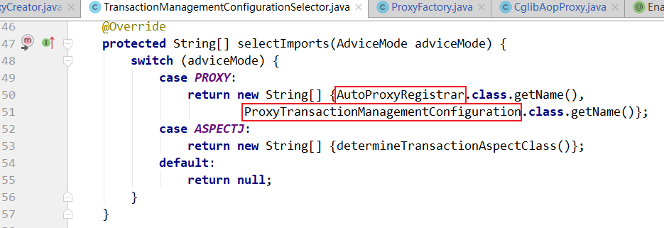

## 2.2 加载事务控制组件

### 2.2.1 AutoProxyRegistrar 组件

AutoProxyRegistrar 类的  registerBeanDefinitions 方法中又注册一个组件：

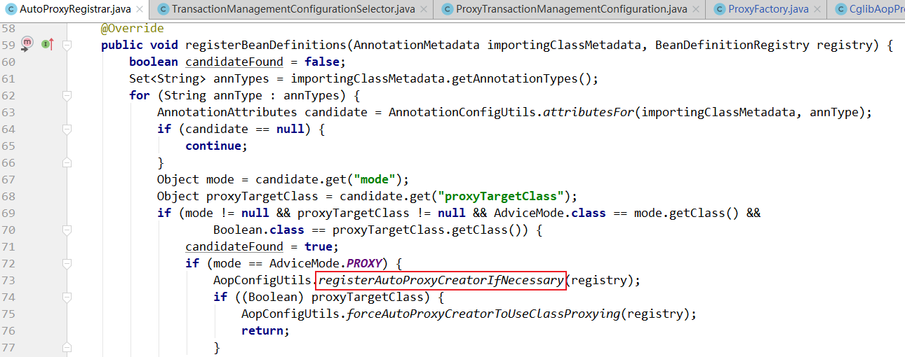

进入 AopConfigUtils.registerAutoProxyCreatorIfNecessary(registry); 方法：

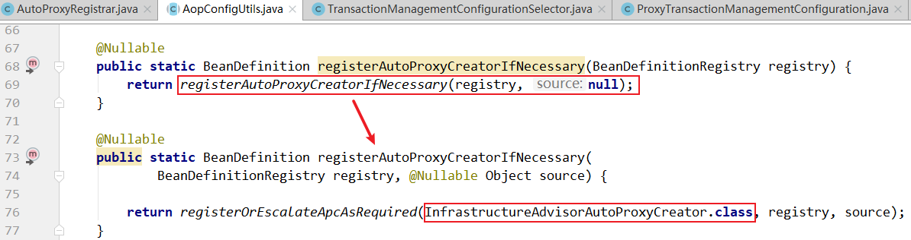

发现最终，注册了一个叫做 InfrastructureAdvisorAutoProxyCreator 的 Bean，而这个类是 AbstractAutoProxyCreator的子类，实现了  SmartInstantiationAwareBeanPostProcessor 接口：

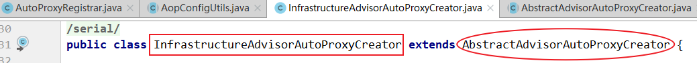

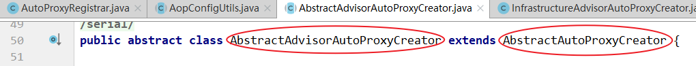

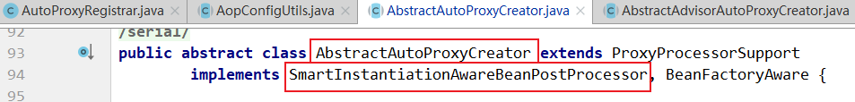

继承体系结构图如下：

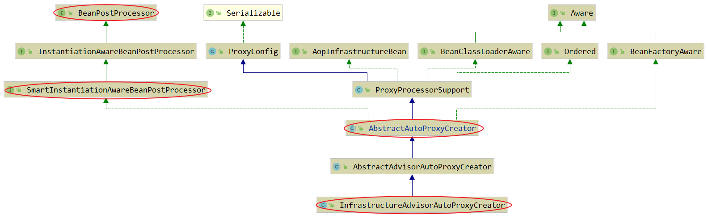

它实现了 SmartInstantiationAwareBeanPostProcessor  ，说明这是一个后置处理器，而且跟 Spring AOP 开启 @EnableAspectJAutoProxy 时注册的 AnnotationAwareAspectJAutoProxyCreator 实现的是同一个接口，所以说，声明式事务是 Spring AOP 思想的一种应用。

### 2.2.2 ProxyTransactionManagementConfiguration 组件

```java
/*
 * Copyright 2002-2020 the original author or authors.
 *
 * Licensed under the Apache License, Version 2.0 (the "License");
 * you may not use this file except in compliance with the License.
 * You may obtain a copy of the License at
 *
 *      https://www.apache.org/licenses/LICENSE-2.0
 *
 * Unless required by applicable law or agreed to in writing, software
 * distributed under the License is distributed on an "AS IS" BASIS,
 * WITHOUT WARRANTIES OR CONDITIONS OF ANY KIND, either express or implied.
 * See the License for the specific language governing permissions and
 * limitations under the License.
 */

package org.springframework.transaction.annotation;

import org.springframework.beans.factory.config.BeanDefinition;
import org.springframework.context.annotation.Bean;
import org.springframework.context.annotation.Configuration;
import org.springframework.context.annotation.Role;
import org.springframework.transaction.config.TransactionManagementConfigUtils;
import org.springframework.transaction.interceptor.BeanFactoryTransactionAttributeSourceAdvisor;
import org.springframework.transaction.interceptor.TransactionAttributeSource;
import org.springframework.transaction.interceptor.TransactionInterceptor;

/**
 * {@code @Configuration} class that registers the Spring infrastructure beans
 * necessary to enable proxy-based annotation-driven transaction management.
 *
 * @author Chris Beams
 * @since 3.1
 * @see EnableTransactionManagement
 * @see TransactionManagementConfigurationSelector
 */
@Configuration
@Role(BeanDefinition.ROLE_INFRASTRUCTURE)
public class ProxyTransactionManagementConfiguration extends AbstractTransactionManagementConfiguration {

	@Bean(name = TransactionManagementConfigUtils.TRANSACTION_ADVISOR_BEAN_NAME)
	@Role(BeanDefinition.ROLE_INFRASTRUCTURE)
	public BeanFactoryTransactionAttributeSourceAdvisor transactionAdvisor() {
		// 事务增强器
		BeanFactoryTransactionAttributeSourceAdvisor advisor = new BeanFactoryTransactionAttributeSourceAdvisor();
		// 向事务增强器中注入，属性解析器 transactionAttributeSource
		advisor.setTransactionAttributeSource(transactionAttributeSource());
		// 向事务增强器中注入 事务拦截器 transactionInterceptor
		advisor.setAdvice(transactionInterceptor());
		if (this.enableTx != null) {
			advisor.setOrder(this.enableTx.<Integer>getNumber("order"));
		}
		return advisor;
	}

	@Bean
	@Role(BeanDefinition.ROLE_INFRASTRUCTURE)
	// 属性解析器 transactionAttributeSource
	public TransactionAttributeSource transactionAttributeSource() {
		return new AnnotationTransactionAttributeSource();
	}

	@Bean
	@Role(BeanDefinition.ROLE_INFRASTRUCTURE)
	// 事务拦截器 transactionInterceptor
	public TransactionInterceptor transactionInterceptor() {
		TransactionInterceptor interceptor = new TransactionInterceptor();
		interceptor.setTransactionAttributeSource(transactionAttributeSource());
		if (this.txManager != null) {
			interceptor.setTransactionManager(this.txManager);
		}
		return interceptor;
	}
}
```

ProxyTransactionManagementConfiguration 是一个容器配置类，注册了一个组件 transactionAdvisor（称为事务增强器），然后再这个事务增强器中又注入了两个属性：transactionAttributeSource（属性解析器），transactionInterceptor（事务拦截器）。

- **属性解析器 AnnotationTransactionAttributeSource 部分源码如下**：

  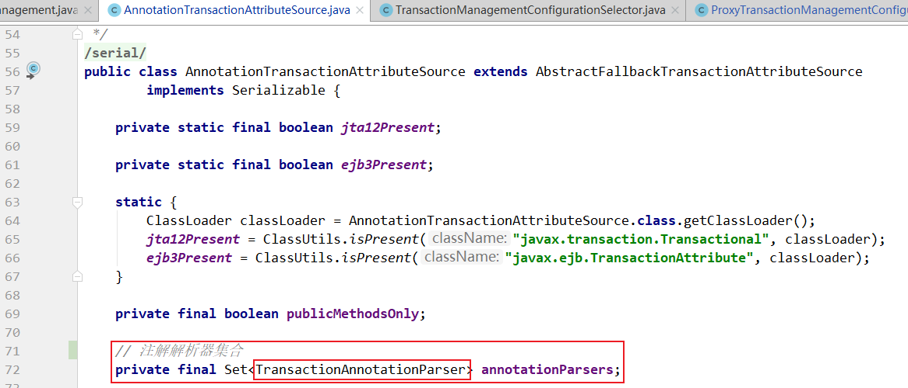

  属性解析有一个成员变量是 annotationParsers ，是一个集合，可以添加多种注解解析器（TransactionAnnotationParser），我们关注 Spring 的注解解析器，部分源码如下：

  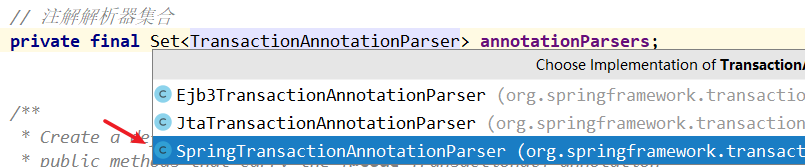

  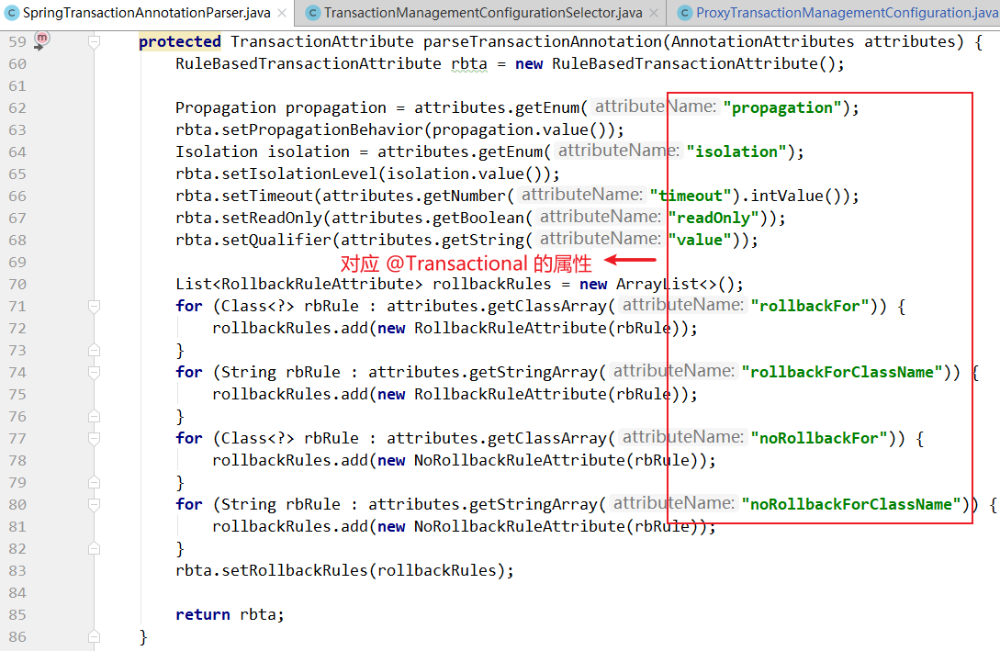

  属性解析器的作用之一就是用来解析 @Transaction 注解。

- **事务拦截器 TransactionInterceptor，部分源码**：

  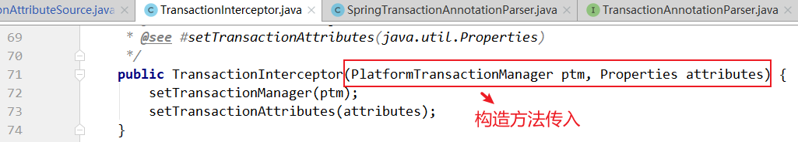

  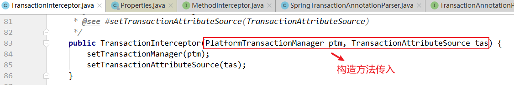

  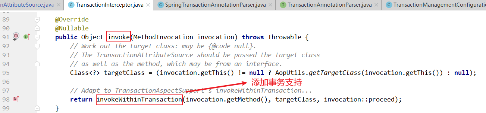


### 2.2.3 上述组件如何关联起来的？

- 事务拦截器实现了 MethodInterceptor 接口，追溯一下上面提到的 InfrastructureAdvisorAutoProxyCreator 后置处理器，它会在代理对象执行目标方法的时候获取其拦截器链，而这个拦截器链就是这个 TransactionInterceptor ，这就把两个组件联系起来了。
- TransactionInterceptor 构造方法传入 PlatformTransactionManager（事务管理器），TransactionAttributeSource（属性解析器），但是追溯一下上面的 ProxyTransactionManagementConfiguration 的源码，在注册事务拦截器的时候并没有调用这个带参构造方法，而是调用的无参构造方法，然后再调用 set 方法注入两个属性，效果一样。

### 2.2.4 invokeWithinTransaction 方法

部分源码如下（关注1、2、3、4标注）

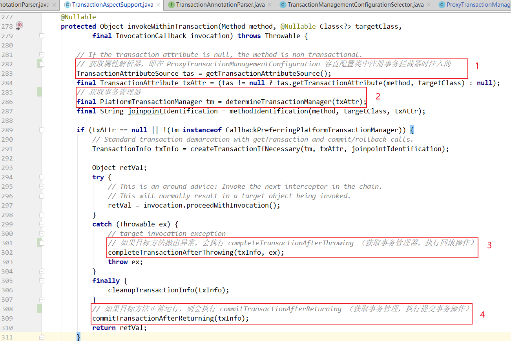

**声明式事务分析记录**：

```java
@EnableTransactionManagement 注解
1. 通过 import 引入了 TransactionManagementConfigurationSelector 类
   它的 selectImports 方法导入了两个类：AutoProxyRegistrar 和 ProxyTransactionManagementConfiguration
    
2. AutoProxyRegistrar 类分析
   方法 registerBeanDefinitions 中，引入了其他类，通过
   AopConfigUtils.registerAutoProxyCreatorIfNecessary(registry); 引入了 
   InfrastructureAdvisorAutoProxyCreator，它继承了 AbstractAutoProxyCreator 是一个后置处理器类
    
3. ProxyTransactionManagementConfiguration 是一个添加了 @Configuration 注解的配置类（注册bean）
   注册事务增强器（注入属性解析器，事务拦截器）
   属性解析器：AnnotationTransactionAttributeSource，内部持有一个解析器集合 
   Set<TransactionAnnotationParser> annotationParsers;
   具体使用的是 SpringTransactionAnnotationParser 解析器，用来解析 @Transactional 的事务属性
       
   事务拦截器 TransactionInterceptor 实现了 MethodInterceptor 接口，该通用拦截会在产生代理对象之前 和 aop 增强合并，最终一起影响到代理对象。
       
   TransactionInterceptor 的 invoke 方法中 invokeWithinTransaction 会触发原有业务逻辑调用（增强事务）
```

