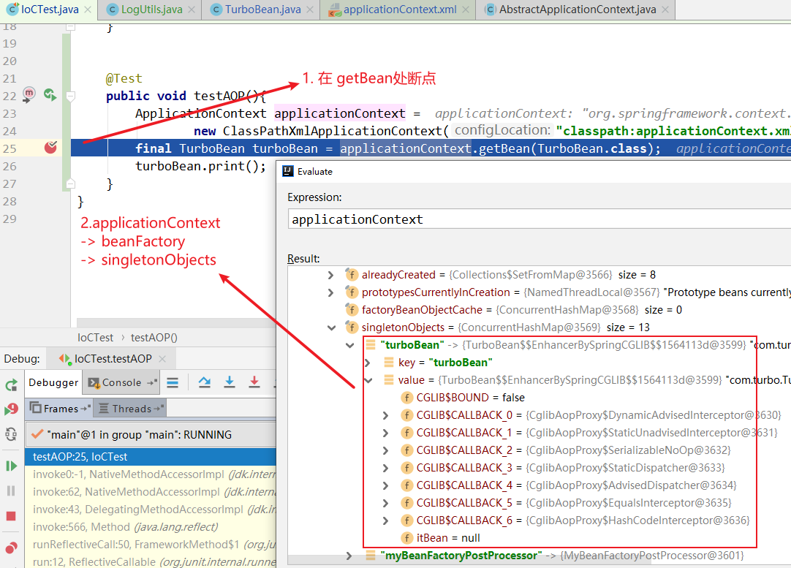

第七部分 Spring AOP 源码深度剖析

# 1 代理对象创建

## 1.1 AOP基础用例准备

在 spring-framework 源码的 spring-turbo 模块中编写

1. 编辑build.gradle

   ```xml
   <!-- dependencies 中增加一行内容-->
   compile group: 'org.aspectj', name: 'aspectjweaver', version: '1.8.6'
   ```

   

2. TurboBean中增加 print 方法

   ```java
   public void print(){
       System.out.println("print业务逻辑执行...");
   }
   ```

3. 定义切面类 LogUtils

   ```java
   package com.turbo;
   
   import org.aspectj.lang.JoinPoint;
   
   public class LogUtils {
   
   	public void beforeMethod(JoinPoint joinPoint){
   		final Object[] args = joinPoint.getArgs();
   		System.out.println("前置通知");
   	}
   }
   ```

4. 编辑applicationContext.xml，配置 aop

   ```xml
   <bean id="logUtils" class="com.turbo.LogUtils"></bean>
   
   <aop:config>
       <aop:aspect id="logAspect" ref="logUtils">
           <aop:pointcut id="print" expression="execution(public void com.turbo.TurboBean.print())"/>
           <aop:before method="beforeMethod" pointcut-ref="print"></aop:before>
       </aop:aspect>
   </aop:config>
   ```

5. 测试方法

   ```java
   @Test
   public void testAOP(){
       ApplicationContext applicationContext =
           new ClassPathXmlApplicationContext("classpath:applicationContext.xml");
       final TurboBean turboBean = applicationContext.getBean(TurboBean.class);
       turboBean.print();
   }
   ```

   

## 1.2 时机点分析



发现在 getBean 之前，TurboBean 对象已经产生（即在第一行代码中完成），而且该对象是一个代理对象（cglib代理对象），我们判定，容器初始化过程中 目标Bean已经完成了代理，返回了代理对象。

## 1.3 代理对象创建流程


# 2 Spring 声明式事务控制

## 2.1 @EnableTransactionManagement

## 2.2 加载事务控制组件