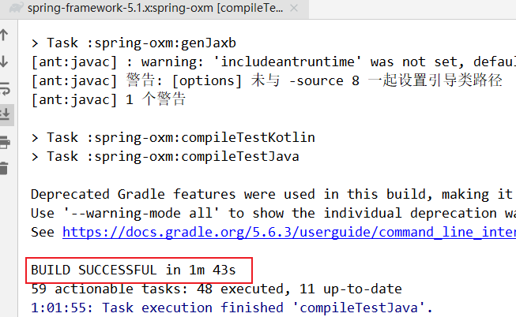

第八部分 Spring 源码编译和环境搭建

# 1 工具

| 软件名称         | 版本     |
| ---------------- | -------- |
| jdk              | 11.0.6   |
| spring-framework | 5.1.x    |
| gradle           | 5.6.3    |
| idea             | 2019.1.3 |

# 2 Spring 和 Gradle

## 2.1 官网下载 spring 源码

官方地址：https://github.com/spring-projects/spring-framework

下载版本 5.1.x


## 2.2 下载配置 gradle

https://services.gradle.org/distributions/

选择想要安装的发布版本，gradle-x.x-bin.zip 是需要下载的安装发布版，gradle-x.x-src.zip 是源码，gradle-x.x-all.zip 则是下载全部文件。选择下载 gradle-5.6.3-all.zip。


### 2.2.1 安装 gradle

配置环境变量


### 2.2.2 idea 中配置 gradle


## 2.3 idea 导入 spring 源码


**注意：gradle开始进行源码项目构建的时候，会自动下载默认gradle版本进行项目构建，此时，强制结束下载进程**

修改 build.gradle ，将仓库源改为阿里源，这样下载构建速度更快


```xml
repositories {
    maven { url "https://maven.aliyun.com/repository/spring-plugin" }
    maven { url "https://maven.aliyun.com/nexus/content/repositories/spring-plugin" }
    maven { url "https://repo.spring.io/plugins-release" }
}
```


```xml
repositories {
    maven { url "https://maven.aliyun.com/repository/central" }
    maven { url "https://repo.spring.io/libs-release" }
    mavenLocal()
}
```

idea 中 gradle 的配置：


设置完成后，刷新 gradle，让其重新构建源码：


接下来整个过程会比较长时间。

## 2.4 编译工程

顺序：

```
core	⼯程  —>tasks  —>other  —>compileTestJava
oxm	    ⼯程  —>tasks  —>other  —>compileTestJava
context	⼯程  —>tasks  —>other  —>compileTestJava
beans	⼯程  —>tasks  —>other  —>compileTestJava
aspects	⼯程  —>tasks  —>other  —>compileTestJava
aop	    ⼯程  —>tasks  —>other  —>compileTestJava
```

### 2.4.1 core


### 2.4.2 oxm




### 2.4.3 context


### 2.4.4 beans


### 2.4.5 aspects


### 2.4.6 aop


# 3 创建项目

新建 Model


在当前项目中添加 spring-context 依赖


创建测试类


编写配置文件


编写测试类


运行：报错：


解决：

步骤1：

编译spring-context 模块的 spring-context.gradle

将 optional 修改为 compile


步骤2：

重新编译 spring-context 模块：


再次测试，测试成功：

