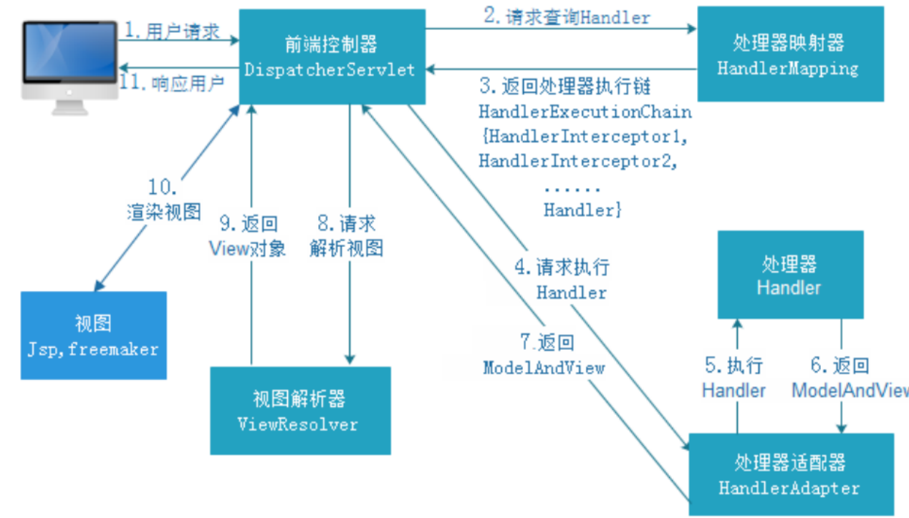

SpringMVC源码分析 通用数据操作接口设计

# 1 SpringMVC应用

## 1.1 Spring MVC简介

### 1.1.1 MVC 体系结构

### 1.1.2 Spring MVC是什么

## 1.2 Spring Web MVC工作流程

### 1.2.1 Spring MVC请求处理流程

流程说明：

1. 用户发送请求至控制器DispatcherServlet
2. DispatcherServlet收到请求调用HandlerMapping处理器映射器
3. 处理器映射器根据请求Url找到具体的Handler（后端控制器），生成处理器对象及处理器拦截器（如果 则生成）一并返回DispatcherServlet
4. DispatcherServlet调用HandlerAdapter处理器适配器去调用Handler
5. 处理器适配器执行Handler
6. Handler执行完成给处理器适配器返回ModelAndView
7. 处理器适配器像前端返回ModelAndView，ModelAndView是SpringMVC框架的一个底层对象，包括Model和View
8. 前端控制器请求视图解析器去进行视图解析，根据逻辑视图名来解析真正的视图。
9. 视图解析器向前端控制器返回View
10. 前端控制器进行视图渲染，就是将模型数据（在ModelAndView对象中）填充到request域
11. 前端控制器向用户响应结果

### 1.2.2 Spring MVC九大组件

## 1.3 请求参数绑定

## 1.4 对Restful风格请求支持

## 1.5 Ajax Json交互

# 2 SpringMVC高级技术

## 2.1 拦截器（Inteceptor）使用

### 2.1.1 监听器、过滤器和拦截器对比

## 2.2 处理multipart形式的数据

## 2.3 在控制器中处理异常

@ControllerAdvice

## 2.4 基于Flash属性的跨重定向请求数据传递

# 3 手写MVC

# 4 Spring MVC源码深度剖析

## 4.1 前端控制器DispatcherServlet继承结构

## 4.2 重要时机点分析

## 4.3 核心步骤getHandler方法剖析

## 4.4 核心步骤getHandlerAdapter方法剖析

## 4.5 核心步骤ha.handle方法剖析

## 4.6 核心步骤processDispatchResult方法剖析

## 4.7 SpringMVC九大组件初始化

# 5 SSM整合

## 5.1 整合策略

## 5.2 Mybatis整合Spring

## 5.3 整合SpringMVC

# 6 附录

## 6.1 乱码问题解决

## 6.2 玩转Spring MVC必备设计模式