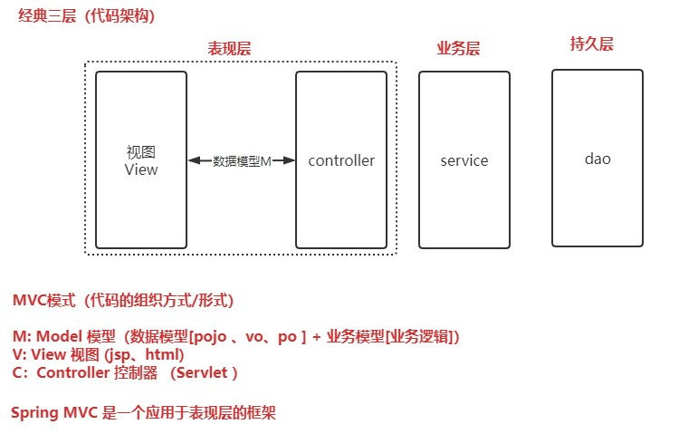
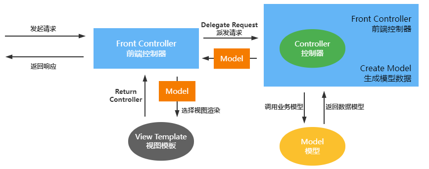
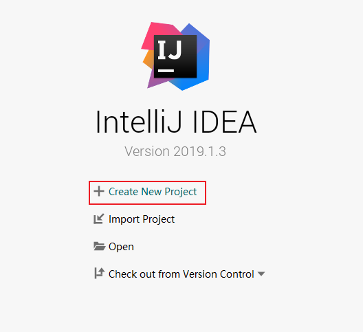
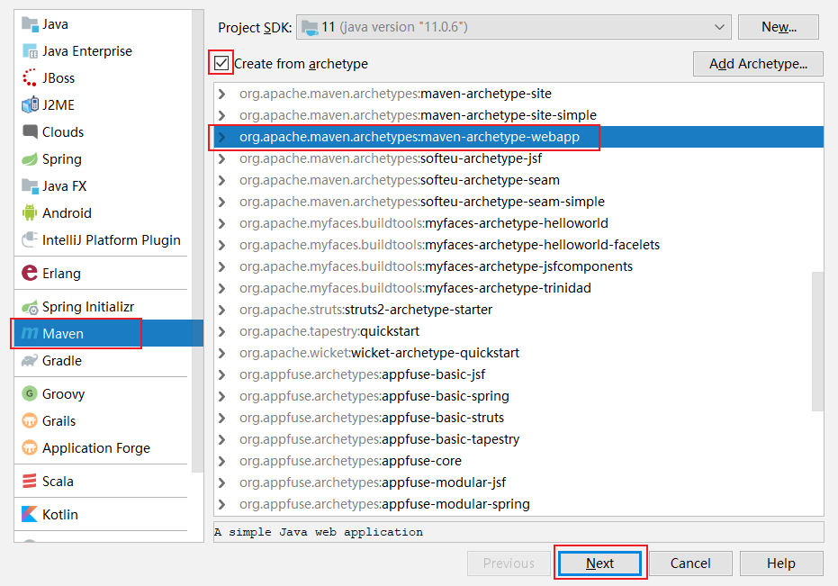
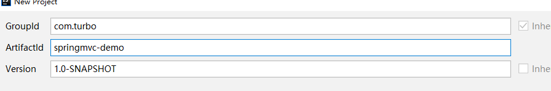
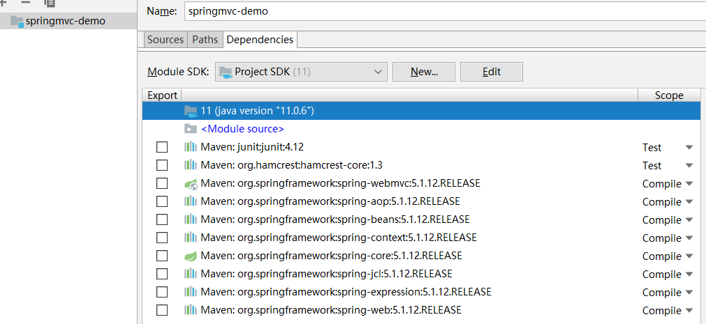
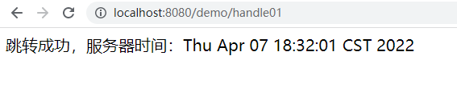
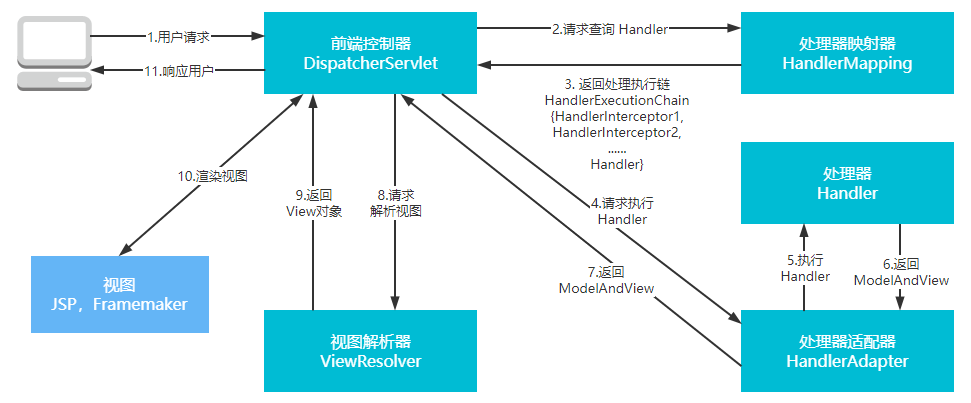

第一部分 Spring MVC应用

# 1 SpringMVC 简介

Spring MVC 是 Spring 给我们提供的一个用于简化 Web 开发的框架。

## 1.1 MVC 体系结构

在 B/S （浏览器/服务器）架构中，系统标准的三层架构包括：表现层、业务层、持久层。

- 表现层，就是常说的 web 层。它负责接收客户端响应结果，通常客户端使用 http 协议请求 web 层，web 需要接收 http 请求，完成 http 响应。

  表现层包括**展示层**和**控制层**：控制层负责接收请求，展示层负责结果的展示。

  表现层依赖业务层，接收到客户端请求一般会调用业务层进行业务处理，并将处理结果响应给客户端。

  表现层的设计一般都使用 MVC 模型。（**MVC 是表现层的设计模式/框架**，和其他层没有关系）

- 业务层

  就是常说的 service 层。它负责业务逻辑处理，和我们开发项目的需求息息相关。web 层依赖 业务层，但是业务层不依赖 web 层。

  业务层在业务处理时可能会依赖持久层，如果要对数据持久化需要保证事务一致性（事务应该放到业务层来控制）。

- 持久层

  dao 层，负责数据持久化，包括 数据层即数据库和数据访问层，数据库是对数据进行持久化的载体，数据访问层是业务层和持久层交互的接口，业务层需要通过数据层将数据持久化到数据库中。通俗讲，持久化层就是和数据库交互，对数据表进行增删改查。

**MVC 设计模式**



MVC 全名是 Model View Controller，是 模型（model）- 视图（view）- 控制器（controller）的缩写，是一种用于设计创建 web 应用程序表现层的模式。MVC 中每个部分各司其职：

- Model（模型）：模型包含业务模型和数据模型，数据模型用于封装数据，业务模式用于处理业务。
- View（视图）：通常指的就是 jsp 或者 html。作用一般是展示数据，通常视图是依据数据模型创建的。
- Controller（控制器）：是应用程序中处理用户交互的部分。作用一般就是处理程序逻辑的。

MVC 提倡：每一层只编写自己的东西，不编写任何其他的代码；分层是为了解耦，解耦是为了维护方便和分工协作。

## 1.2 Spring MVC 是什么

Spring MVC 全名叫 Spring Web MVC，是一种基于 Java 的实现 MVC 设计模型的请求驱动类型的轻量级 Web 框架，属于 Spring framework 的后续产品。

[Spring MVC 官网](https://docs.spring.io/spring-framework/docs/current/reference/html/web.html)


它通过一套注解，让一个简单的 java 类成为处理请求的控制器，而无需实现任何接口。同时它还支持 Rsetful 编程风格的请求。

Spring MVC 本质可以认为是对 servlet 的封装，简化了我们 servlet 的开发，<br>作用：1 接收请求，2 返回响应，跳转页面



# 2 Spring Web MVC 工作流程

需求：前端浏览器请求 url：[http://localhost:8080/demo/handle01](http://localhost:8080/demo/handle01)，前端页面显示后台服务器的时间。

[gitee springmvc-demo 代码地址](https://gitee.com/turboYuu/spring-mvc-1-3/tree/master/lab-springmvc/springmvc-demo)。







接下来注意 maven 配置 和 项目路径，就可以了。然后项目打开后，修改 jdk 级别为 11，删除 pom 中 build，增加 java 和 resources 目录（如果不存在的话，并且 正确标记目录）。

接下来：

1. pom

   ```xml
   <!--引入 spring-webmvc 的依赖-->
   <dependency>
       <groupId>org.springframework</groupId>
       <artifactId>spring-webmvc</artifactId>
       <version>5.1.12.RELEASE</version>
   </dependency>
   <!--配置 tomcat 插件-->
   <build>
       <plugins>
           <plugin>
               <groupId>org.apache.tomcat.maven</groupId>
               <artifactId>tomcat-maven-plugin</artifactId>
               <version>2.2</version>
               <configuration>
                   <port>8080</port>
                   <path>/</path>
               </configuration>
           </plugin>
       </plugins>
   </build>
   ```

   引入 spring-webmvc 后，spring的基础jar就都引入了：

   

2. 新建 DemoController.java

   ```java
   package com.turbo.controller;
   
   import org.springframework.stereotype.Controller;
   import org.springframework.web.bind.annotation.RequestMapping;
   import org.springframework.web.servlet.ModelAndView;
   
   import java.util.Date;
   
   @Controller
   @RequestMapping("/demo")
   public class DemoController {
   
       /**
        * url：http://localhost:8080/demo/handle01
        */
       @RequestMapping("/handle01")
       public ModelAndView handle01(){
           // 服务器时间
           Date date = new Date();
           // 返回服务器时间到前端页面
           // 封装了数据和页面信息的 modelAndView
           ModelAndView modelAndView = new ModelAndView();
           // addObject 其实是向请求域中 request.setAttribute("date",date);
           modelAndView.addObject("date",date);
           // 视图信息(封装跳转的页面信息) 逻辑视图名 success
           modelAndView.setViewName("success");
           return modelAndView;
       }
   }
   ```

3. 增加 springmvc.xml，其实是 spring 的配置文件，现在主要配置 springmvc 相关

   ```xml
   <?xml version="1.0" encoding="UTF-8"?>
   <beans xmlns="http://www.springframework.org/schema/beans"
          xmlns:context="http://www.springframework.org/schema/context"
          xmlns:mvc="http://www.springframework.org/schema/mvc"
          xmlns:xsi="http://www.w3.org/2001/XMLSchema-instance"
          xsi:schemaLocation="
          http://www.springframework.org/schema/beans
          http://www.springframework.org/schema/beans/spring-beans.xsd
          http://www.springframework.org/schema/context
          http://www.springframework.org/schema/context/spring-context.xsd
          http://www.springframework.org/schema/mvc
          http://www.springframework.org/schema/mvc/spring-mvc.xsd
   
   ">
   
       <!--开启controller扫描-->
       <context:component-scan base-package="com.turbo.controller"></context:component-scan>
   
       <!--配置视图解析器 springmvc的组件-->
       <bean class="org.springframework.web.servlet.view.InternalResourceViewResolver">
           <property name="prefix" value="/WEB-INF/jsp/"></property>
           <property name="suffix" value=".jsp"></property>
       </bean>
   
       <!--
           自动注册最合适的 处理器适配器，处理器映射器
       -->
       <mvc:annotation-driven/>
   
   
   </beans>
   ```

4. 增加 /WEB-INF/jsp/success.jsp

   ```jsp
   <%--
     Created by IntelliJ IDEA.
     User: yutao
     Date: 2022/4/7
     Time: 17:58
     To change this template use File | Settings | File Templates.
   --%>
   <%@ page contentType="text/html;charset=UTF-8" language="java" pageEncoding="UTF-8" isELIgnored="false" %>
   <html>
   <head>
       <meta http-equiv="content-type" content="text/html;charset=utf-8">
       <title>Title</title>
   </head>
   <body>
   跳转成功，服务器时间：${date}
   </body>
   </html>
   
   ```

5. 配置 web，配置 DispatcherServlet，引入 springmvc.xml

   ```xml
   <!DOCTYPE web-app PUBLIC
    "-//Sun Microsystems, Inc.//DTD Web Application 2.3//EN"
    "http://java.sun.com/dtd/web-app_2_3.dtd" >
   
   <web-app>
     <display-name>Archetype Created Web Application</display-name>
   
     <servlet>
       <servlet-name>springmvc</servlet-name>
       <servlet-class>org.springframework.web.servlet.DispatcherServlet</servlet-class>
       <init-param>
         <!--指定配置文件的地址-->
         <param-name>contextConfigLocation</param-name>
         <param-value>classpath:springmvc.xml</param-value>
       </init-param>
     </servlet>
     <servlet-mapping>
       <servlet-name>springmvc</servlet-name>
   
       <!--
           推荐使用前两种
         方式一：带后缀，比如 *.action *.do  *.aaa
         方式二： / 不会拦截 .jsp
         方式三：/* 拦截所有,包括 .jsp
       -->
       <url-pattern>/</url-pattern>
     </servlet-mapping>
   </web-app>
   ```

6. 启动服务，访问 http://localhost:8080/demo/handle01

   

   

开发过程：

1. 配置 DispatcherServlet 前端控制器
2. 开发处理具体业务逻辑的 Handler（@Controller、@RequestMapping）
3. xml 配置文件配置 controller扫描，配置 SpringMVC 三大件
4. 将 xml 文件路      径告诉 springMVC (DispatcherServlet)


## 2.1 Spring MVC 请求处理流程



**流程说明**：

1. 用户发送请求至前端控制器 DispatcherServlet。
2. DispatcherServlet 收到请求调用 HandlerMapping 处理映射器。
3. 处理器映射根据请求 Url 找到具体的 Handler（后端处理器），生成处理器对象及处理器拦截器（如果有则生成）一并返回DispatcherServlet。
4. DispatcherServlet 调用 HandlerAdapter 处理器适配器去调用 Handler。
5. 处理器适配器执行 Handler。
6. Handler 执行完成给处理器适配器返回 ModelAndView。
7. 处理适配器向前端控制器返回 ModelAndView，ModelAndView 是 SpringMVC 框架的一个底层对象，包括 Model 和 View。
8. 前端控制器请求视图解析器去进行视图解析，根据逻辑视图名来解析真正的视图。
9. 视图解析器向前端返回 view。
10. 前端控制器进行视图渲染，就是将模型数据（在 ModelAndView 对象中）填充到 request 域。
11. 前端控制器向用户响应结果。

## 2.2 Spring MVC 九大组件

1. HandlerMapping（处理器映射器）

   HandlerMapping 是用来查找 Handler 的，也就是处理器，具体的表现形式可以是类，也可以是方法。比如，标注了@RequestMapping的每个方法都可以看成是一个 Hander。Handler 负责具体实际的请求处理，在请求到达后，HandlerMapping的作用便是找到请求相应的处理器 Handler 和 Interceptor。

2. HandlerAdapter（处理器适配器）

   HandlerAdapter 是一个适配器。因为 Spring MVC 中 Handler 可以是任意形式的，只要能处理请求即可。但是把请求交给Servlet 的时候，由于 Servlet 的方法结构都是 `doService(HttpServletResponse resp)` 形式的，要让固定的 Servlet 处理方法调用 Handler 来进行处理，便是 HandlerAdapter 的职责。

3. HandlerExceptionResolver

   HandlerExceptionResolver 用于处理 Handler 产生的异常情况。它的作用是根据异常设置 ModelAndView，之后交给渲染方法进行渲染，渲染方法会将 ModelAndView 渲染成页面。

4. ViewResolver

   ViewReslover 即视图解析器，用于将 String 类型的视图和 Locale 解析为 View 类型的视图，只有一个 resolveViewName() 方法。从方法的定义可以看出，Controller层返回的 String 类型视图名 viewName 最终在这里被解析成 View。View 是用来渲染页面的，也就是说，它会将程序返回的参数和数据填入模板中，生成 html 文件。

   ViewResolver 在这个过程主要完成两件事情：ViewResolver 找到渲染所用的模板（第一件事）和 所用的技术（第二件事，其实就是找到视图的类型，如 JSP）并填入参数。默认情况下，SPring MVC 会自动为我们配置一个 InternalResourceViewReslover，是针对 JSP 类型视图的。

5. RequestToViewNameTranslator

   RequestToViewNameTranslator 组件的作用是从请求中获取 ViewName。因为 ViewResolver 根据 ViewName 查找 View，但有的 Handler处理完成之后，没有设置View，也没有设置 ViewName，便要通过这个组件从请求中查找 ViewName

6. LocaleResolver

   ViewResolver 组件的 resolveViewName 方法需要两个参数，一个是视图名，一个是 Locale。LocaleResolver 用于从请求中解析出 Locale，比如中国 Locale 是 zh-CN，用来表示一个区域。这个组件也是 i18n 的基础。

7. ThemeResolver

   ThemeResolver 组件是用来解析主题的，主题是样式、图片及它们所形成的显示效果的集合。Spring MVC 中一套主题对应一个 properties 文件，里面存放着与当前主题相关的所有资源，如图片、css 样式等。创建主题非常简单，只需要准备好资源，然后新建一个 “主题名.properties” 并将资源设置进去，放在 classpath 下，之后便可以在页面中使用了。SpringMVC 中与主题相关的类有 ThemeResolver、ThemeSource 和 Theme。ThemeResolver 负责从请求中解析出主题名，ThemeSource 根据主题名找到具体的主题，其抽象也就是 Theme，可以通过 Theme 来获取主题和具体的资源。

8. MultipartResolver

   MultipartResolver 用于上传请求，通过将普通的请求包装成 MultipartHttpServletRequest 来实现。MultipartHttpServletRequest 可以通过 getFile() 方法直接获得文件。如果上传多个文件，还可以调用 getFileMap() 方法得到 Map<FileName, File> 这样的结构，MultipartResolver 的作用就是封装普通的请求，使其拥有文件上传的功能。

9. FlashMapManager

   FlashMap 用于重定向时的参数传递，比如在处理用户订单时，为了避免重复提交，可以处理完 post 请求之后重定向到一个 get 请求，这个 get 请求可以用来显示订单详情之类的信息。这样做虽然可以避免用户重新提交订单的问题，但是在这个要显示订单的信息，这些数据从哪里来获得？因为重定向时没有传递参数这一功能，如果不想把参数写进 URL（不推荐），那么就可以通过FlashMap 来传递。只需要在重定向之前将要传递的数据写入请求（可以通过ServletRequestAttributes.getRequest()方法获得）的属性OUTPUT_FLASH_MAP_ATTRIBUTE 中，这样在重定向之后的 Handler 中 Spring 就会自动将其设置到 Model 中，在显示订单信息的页面上就可以直接从 Model 中获取数据。FlashMapManager 就是用来管理 FlashMap 的。


# 3 请求参数绑定（串讲）

- 默认支持 Servlet API 作为方法参数
- 绑定简单类型参数
- 绑定 pojo 类型参数
- 绑定 pojo 包装类型参数
- 绑定日期类型参数（需要配置自定义类型转换器）

# 4 对 Restful 风格请求支持

## 4.1 什么是 Restful

# 5 Ajax Json 交互

## 5.1 什么是 Json

## 5.2 @ResponseBody 注解

## 5.2 分析 Spring MVC 使用 Json 交互