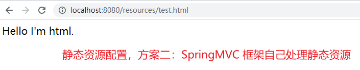
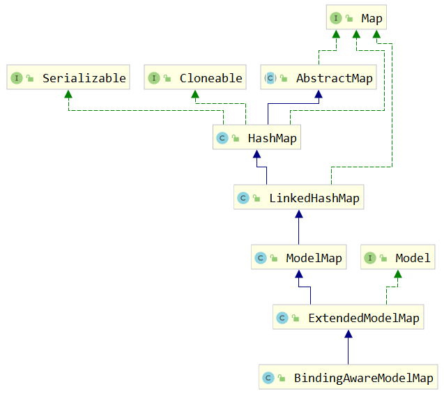

第一部分 Spring MVC应用

# 1 SpringMVC 简介

Spring MVC 是 Spring 给我们提供的一个用于简化 Web 开发的框架。

## 1.1 MVC 体系结构

在 B/S （浏览器/服务器）架构中，系统标准的三层架构包括：表现层、业务层、持久层。

- 表现层，就是常说的 web 层。它负责接收客户端响应结果，通常客户端使用 http 协议请求 web 层，web 需要接收 http 请求，完成 http 响应。

  表现层包括**展示层**和**控制层**：控制层负责接收请求，展示层负责结果的展示。

  表现层依赖业务层，接收到客户端请求一般会调用业务层进行业务处理，并将处理结果响应给客户端。

  表现层的设计一般都使用 MVC 模型。（**MVC 是表现层的设计模式/框架**，和其他层没有关系）

- 业务层

  就是常说的 service 层。它负责业务逻辑处理，和我们开发项目的需求息息相关。web 层依赖 业务层，但是业务层不依赖 web 层。

  业务层在业务处理时可能会依赖持久层，如果要对数据持久化需要保证事务一致性（事务应该放到业务层来控制）。

- 持久层

  dao 层，负责数据持久化，包括 数据层即数据库和数据访问层，数据库是对数据进行持久化的载体，数据访问层是业务层和持久层交互的接口，业务层需要通过数据层将数据持久化到数据库中。通俗讲，持久化层就是和数据库交互，对数据表进行增删改查。

**MVC 设计模式**


MVC 全名是 Model View Controller，是 模型（model）- 视图（view）- 控制器（controller）的缩写，是一种用于设计创建 web 应用程序表现层的模式。MVC 中每个部分各司其职：

- Model（模型）：模型包含业务模型和数据模型，数据模型用于封装数据，业务模式用于处理业务。
- View（视图）：通常指的就是 jsp 或者 html。作用一般是展示数据，通常视图是依据数据模型创建的。
- Controller（控制器）：是应用程序中处理用户交互的部分。作用一般就是处理程序逻辑的。

MVC 提倡：每一层只编写自己的东西，不编写任何其他的代码；分层是为了解耦，解耦是为了维护方便和分工协作。

## 1.2 Spring MVC 是什么

Spring MVC 全名叫 Spring Web MVC，是一种基于 Java 的实现 MVC 设计模型的请求驱动类型的轻量级 Web 框架，属于 Spring framework 的后续产品。

[Spring MVC 官网](https://docs.spring.io/spring-framework/docs/current/reference/html/web.html)


它通过一套注解，让一个简单的 java 类成为处理请求的控制器，而无需实现任何接口。同时它还支持 Rsetful 编程风格的请求。

Spring MVC 本质可以认为是对 servlet 的封装，简化了我们 servlet 的开发，<br>作用：1 接收请求，2 返回响应，跳转页面


# 2 Spring Web MVC 工作流程

需求：前端浏览器请求 url：[http://localhost:8080/demo/handle01](http://localhost:8080/demo/handle01)，前端页面显示后台服务器的时间。

[gitee springmvc-demo 代码地址](https://gitee.com/turboYuu/spring-mvc-1-3/tree/master/lab-springmvc/springmvc-demo)。


接下来注意 maven 配置 和 项目路径，就可以了。然后项目打开后，修改 jdk 级别为 11，删除 pom 中 build，增加 java 和 resources 目录（如果不存在的话，并且 正确标记目录）。

接下来：

1. pom

   ```xml
   <!--引入 spring-webmvc 的依赖-->
   <dependency>
       <groupId>org.springframework</groupId>
       <artifactId>spring-webmvc</artifactId>
       <version>5.1.12.RELEASE</version>
   </dependency>
   <!--配置 tomcat 插件-->
   <build>
       <plugins>
           <plugin>
               <groupId>org.apache.tomcat.maven</groupId>
               <artifactId>tomcat-maven-plugin</artifactId>
               <version>2.2</version>
               <configuration>
                   <port>8080</port>
                   <path>/</path>
               </configuration>
           </plugin>
       </plugins>
   </build>
   ```

   引入 spring-webmvc 后，spring的基础jar就都引入了：

   

2. 新建 DemoController.java

   ```java
   package com.turbo.controller;
   
   import org.springframework.stereotype.Controller;
   import org.springframework.web.bind.annotation.RequestMapping;
   import org.springframework.web.servlet.ModelAndView;
   
   import java.util.Date;
   
   @Controller
   @RequestMapping("/demo")
   public class DemoController {
   
       /**
        * url：http://localhost:8080/demo/handle01
        */
       @RequestMapping("/handle01")
       public ModelAndView handle01(){
           // 服务器时间
           Date date = new Date();
           // 返回服务器时间到前端页面
           // 封装了数据和页面信息的 modelAndView
           ModelAndView modelAndView = new ModelAndView();
           // addObject 其实是向请求域中 request.setAttribute("date",date);
           modelAndView.addObject("date",date);
           // 视图信息(封装跳转的页面信息) 逻辑视图名 success
           modelAndView.setViewName("success");
           return modelAndView;
       }
   }
   ```

3. 增加 springmvc.xml，其实是 spring 的配置文件，现在主要配置 springmvc 相关

   ```xml
   <?xml version="1.0" encoding="UTF-8"?>
   <beans xmlns="http://www.springframework.org/schema/beans"
          xmlns:context="http://www.springframework.org/schema/context"
          xmlns:mvc="http://www.springframework.org/schema/mvc"
          xmlns:xsi="http://www.w3.org/2001/XMLSchema-instance"
          xsi:schemaLocation="
          http://www.springframework.org/schema/beans
          http://www.springframework.org/schema/beans/spring-beans.xsd
          http://www.springframework.org/schema/context
          http://www.springframework.org/schema/context/spring-context.xsd
          http://www.springframework.org/schema/mvc
          http://www.springframework.org/schema/mvc/spring-mvc.xsd
   
   ">
   
       <!--开启controller扫描-->
       <context:component-scan base-package="com.turbo.controller"></context:component-scan>
   
       <!--配置视图解析器 springmvc的组件-->
       <bean class="org.springframework.web.servlet.view.InternalResourceViewResolver">
           <property name="prefix" value="/WEB-INF/jsp/"></property>
           <property name="suffix" value=".jsp"></property>
       </bean>
   
       <!--
           自动注册最合适的 处理器适配器，处理器映射器
       -->
       <mvc:annotation-driven/>
   
   
   </beans>
   ```

4. 增加 /WEB-INF/jsp/success.jsp

   ```jsp
   <%--
     Created by IntelliJ IDEA.
     User: yutao
     Date: 2022/4/7
     Time: 17:58
     To change this template use File | Settings | File Templates.
   --%>
   <%@ page contentType="text/html;charset=UTF-8" language="java" pageEncoding="UTF-8" isELIgnored="false" %>
   <html>
   <head>
       <meta http-equiv="content-type" content="text/html;charset=utf-8">
       <title>Title</title>
   </head>
   <body>
   跳转成功，服务器时间：${date}
   </body>
   </html>
   
   ```

5. 配置 web，配置 DispatcherServlet，引入 springmvc.xml

   ```xml
   <!DOCTYPE web-app PUBLIC
    "-//Sun Microsystems, Inc.//DTD Web Application 2.3//EN"
    "http://java.sun.com/dtd/web-app_2_3.dtd" >
   
   <web-app>
     <display-name>Archetype Created Web Application</display-name>
   
     <servlet>
       <servlet-name>springmvc</servlet-name>
       <servlet-class>org.springframework.web.servlet.DispatcherServlet</servlet-class>
       <init-param>
         <!--指定配置文件的地址-->
         <param-name>contextConfigLocation</param-name>
         <param-value>classpath:springmvc.xml</param-value>
       </init-param>
     </servlet>
     <servlet-mapping>
       <servlet-name>springmvc</servlet-name>
   
       <!--
           推荐使用前两种
         方式一：带后缀，比如 *.action *.do  *.aaa
         方式二： / 不会拦截 .jsp
         方式三：/* 拦截所有,包括 .jsp
       -->
       <url-pattern>/</url-pattern>
     </servlet-mapping>
   </web-app>
   ```

6. 启动服务，访问 http://localhost:8080/demo/handle01

   

   

总结开发过程：

1. 配置 DispatcherServlet 前端控制器（web.xml）
2. 开发处理具体业务逻辑的 Handler（@Controller、@RequestMapping）
3. xml 配置文件配置 controller扫描，配置 SpringMVC 三大件（springmvc.xml）
4. 将 xml 文件路径告诉 springMVC (DispatcherServlet) （web.xml）


## 2.1 Spring MVC 请求处理流程


处理器映射器、处理器适配器、视图解析器 是 SpringMVC的三个核心组件。

**流程说明**：

1. 用户发送请求至前端控制器 DispatcherServlet。
2. DispatcherServlet 收到请求调用 HandlerMapping 处理映射器。
3. 处理器映射根据请求 Url 找到具体的 Handler（后端处理器），生成处理器对象及处理器拦截器（如果有则生成）一并返回DispatcherServlet。
4. DispatcherServlet 调用 HandlerAdapter 处理器适配器去调用 Handler。
5. 处理器适配器执行 Handler。
6. Handler 执行完成给处理器适配器返回 ModelAndView。
7. 处理适配器向前端控制器返回 ModelAndView，ModelAndView 是 SpringMVC 框架的一个底层对象，包括 Model 和 View。
8. 前端控制器请求视图解析器去进行视图解析，根据逻辑视图名来解析真正的视图。
9. 视图解析器向前端返回 view。
10. 前端控制器进行视图渲染，就是将模型数据（在 ModelAndView 对象中）填充到 request 域。
11. 前端控制器向用户响应结果。

## 2.2 Spring MVC 九大组件

1. HandlerMapping（处理器映射器）

   HandlerMapping 是用来查找 Handler 的，也就是处理器，具体的表现形式可以是类，也可以是方法。比如，标注了@RequestMapping的每个方法都可以看成是一个 Hander。Handler 负责具体实际的请求处理，在请求到达后，HandlerMapping的作用便是找到请求相应的处理器 Handler 和 Interceptor。

2. HandlerAdapter（处理器适配器）

   HandlerAdapter 是一个适配器。因为 Spring MVC 中 Handler 可以是任意形式的，只要能处理请求即可。但是把请求交给Servlet 的时候，由于 Servlet 的方法结构都是 `doService(HttpServletResponse resp)` 形式的，要让固定的 Servlet 处理方法调用 Handler 来进行处理，便是 HandlerAdapter 的职责。

3. HandlerExceptionResolver

   HandlerExceptionResolver 用于处理 Handler 产生的异常情况。它的作用是根据异常设置 ModelAndView，之后交给渲染方法进行渲染，渲染方法会将 ModelAndView 渲染成页面。

4. ViewResolver

   ViewReslover 即视图解析器，用于将 String 类型的视图和 Locale 解析为 View 类型的视图，只有一个 resolveViewName() 方法。从方法的定义可以看出，Controller层返回的 String 类型视图名 viewName 最终在这里被解析成 View。View 是用来渲染页面的，也就是说，它会将程序返回的参数和数据填入模板中，生成 html 文件。

   ViewResolver 在这个过程主要完成两件事情：ViewResolver 找到渲染所用的模板（第一件事）和 所用的技术（第二件事，其实就是找到视图的类型，如 JSP）并填入参数。默认情况下，SPring MVC 会自动为我们配置一个 InternalResourceViewReslover，是针对 JSP 类型视图的。

5. RequestToViewNameTranslator

   RequestToViewNameTranslator 组件的作用是从请求中获取 ViewName。因为 ViewResolver 根据 ViewName 查找 View，但有的 Handler处理完成之后，没有设置View，也没有设置 ViewName，便要通过这个组件从请求中查找 ViewName

6. LocaleResolver

   ViewResolver 组件的 resolveViewName 方法需要两个参数，一个是视图名，一个是 Locale。LocaleResolver 用于从请求中解析出 Locale，比如中国 Locale 是 zh-CN，用来表示一个区域。这个组件也是 i18n 的基础。

7. ThemeResolver

   ThemeResolver 组件是用来解析主题的，主题是样式、图片及它们所形成的显示效果的集合。Spring MVC 中一套主题对应一个 properties 文件，里面存放着与当前主题相关的所有资源，如图片、css 样式等。创建主题非常简单，只需要准备好资源，然后新建一个 “主题名.properties” 并将资源设置进去，放在 classpath 下，之后便可以在页面中使用了。SpringMVC 中与主题相关的类有 ThemeResolver、ThemeSource 和 Theme。ThemeResolver 负责从请求中解析出主题名，ThemeSource 根据主题名找到具体的主题，其抽象也就是 Theme，可以通过 Theme 来获取主题和具体的资源。

8. MultipartResolver

   MultipartResolver 用于上传请求，通过将普通的请求包装成 MultipartHttpServletRequest 来实现。MultipartHttpServletRequest 可以通过 getFile() 方法直接获得文件。如果上传多个文件，还可以调用 getFileMap() 方法得到 Map<FileName, File> 这样的结构，MultipartResolver 的作用就是封装普通的请求，使其拥有文件上传的功能。

9. FlashMapManager

   FlashMap 用于重定向时的参数传递，比如在处理用户订单时，为了避免重复提交，可以处理完 post 请求之后重定向到一个 get 请求，这个 get 请求可以用来显示订单详情之类的信息。这样做虽然可以避免用户重新提交订单的问题，但是在这个要显示订单的信息，这些数据从哪里来获得？因为重定向时没有传递参数这一功能，如果不想把参数写进 URL（不推荐），那么就可以通过FlashMap 来传递。只需要在重定向之前将要传递的数据写入请求（可以通过ServletRequestAttributes.getRequest()方法获得）的属性OUTPUT_FLASH_MAP_ATTRIBUTE 中，这样在重定向之后的 Handler 中 Spring 就会自动将其设置到 Model 中，在显示订单信息的页面上就可以直接从 Model 中获取数据。FlashMapManager 就是用来管理 FlashMap 的。


# 3 DispatcherServlet 中 url-pattern

```xml
<!--
        推荐使用前两种
      方式一：带后缀，比如 *.action *.do  *.aaa
              该种方式比较精确，方便，在以前和现在企业中都有很大的使用比例
      方式二：/ 不会拦截 .jsp；
             但是会拦截 .html 等静态资源（静态资源：除了jsp和servlet之外的 js、css、png等）

             为什么配置为 / 会拦截静态资源 ？
                因为 tomcat 容器中有一个web.xml(父)，你的项目中也有一个 web.xml(子)，是一个继承关系
                父 web.xml 中有一个 DefaultServlet, url-pattern 是一个 /
                此时我们自己的 web.xml 中也配置了一个 /，覆写了父 web.xml 的配置
             为什么不拦截 .jsp 呢？
                因为父 web.xml 中有一个 JspServlet，这个 servlet 拦截 .jsp 文件，而 我们并没有覆写这个配置
                所以 springmvc 此时不拦截 .jsp，jsp 的处理交给了 tomcat


            如何解决拦截静态资源这件事？
              在 springmvc.xml 中进行配置


      方式三：/* 拦截所有,包括 .jsp
    -->
<!--拦截匹配规则的url请求，进入springmvc框架处理-->
<url-pattern>/</url-pattern>
```

配置为 / 时，如何解决拦截静态资源这件事，配置 springmvc.xml ：

```xml
<!--静态资源配置，方案一-->
    <!--
        原理：添加该标签之后，会在 springmvc上下文中定义一个 DefaultServletHttpRequestHandler 对象，
        这个对象如同一个检查人员，对进入 DispatcherServlet 的 url 请求进行过滤，如果发现是一个静态资源请求
        那么会把请求转由 web 应用服务器（tomcat）默认的 DefaultServlet，如果不是静态资源请求 ，那么继续由
        SpringMVC 框架处理。
        局限：静态资源只能放在 webapp 的根目录下
    -->
    <mvc:default-servlet-handler/>

    <!--静态资源配置，方案二：SpringMVC 框架自己处理静态资源
        mapping:静态资源约定的url规则
        location：指定的静态资源的存放位置
    -->
    <mvc:resources location="/,classpath:/" mapping="/resources/**" />
```





# 4 BindingAwareModelMap

```java
/**
     *  SpringMVC 在 handler 方法上传入 Map、Model 和 ModelMap 参数，并向这些参数中保存数据（放入到请求域），都可以在页面获取到
     *
     *  它们之间是什么关系？
     *  运行时的具体类型都是 BindingAwareModelMap，相当于给它 BindingAwareModelMap 保存的数据 都会放在请求域中
     *
     *  Map (jdk 中的接口)
     *  Model (spring的接口)
     *  ModelMap（class,Map接口的实现）
     *
     *  BindingAwareModelMap 继承了 ExtendedModelMap，ExtendedModelMap继承了 ModelMap，实现了 Model 接口
     */

    /**
     * 直接声明形参ModelMap,封装数据
     * url：http://localhost:8080/demo/handle11
     *
     * ==========ModelMap: class org.springframework.validation.support.BindingAwareModelMap
     */
@RequestMapping("/handle11")
public String handle11(ModelMap modelMap){
    // 服务器时间
    Date date = new Date();
    modelMap.addAttribute("date",date);
    System.out.println("==========ModelMap: "+modelMap.getClass());
    return "success";
}


/**
     * 直接声明形参Model,封装数据
     * url：http://localhost:8080/demo/handle12
     *
     * ==========Model: class org.springframework.validation.support.BindingAwareModelMap
     */
@RequestMapping("/handle12")
public String handle12(Model model){
    // 服务器时间
    Date date = new Date();
    model.addAttribute("date",date);
    System.out.println("==========Model: "+model.getClass());
    return "success";
}

/**
     * 直接声明形参 Map,封装数据
     * url：http://localhost:8080/demo/handle13
     *
     * ==========Map: class org.springframework.validation.support.BindingAwareModelMap
     */
@RequestMapping("/handle13")
public String handle13(Map<String,Object> map){
    // 服务器时间
    Date date = new Date();
    map.put("date",date);
    System.out.println("==========Map: "+map.getClass());
    return "success";
}
```

使用 SpringMVC 在 handler 方法上传入 Map、Model 和 ModelMap 参数，并向这些参数中保存数据（放入到请求域），都可以在页面获取到。运行时的具体类型都是 BindingAwareModelMap，相当于给它 BindingAwareModelMap 保存的数据 都会放在请求域中。

BindingAwareModelMap 的类图：



# 5 请求参数绑定（串讲）

请求参数绑定：简单说就是 SpringMVC 如何接收请求参数。

```java
// 原生 servlet 接收一个整型参数
// 浏览器向后端服务器发送请求使用 http协议（超文本传输协议）
1. String ageStr = request.getParamter("age");
2. Integer age = Integer.parseInt(ageStr)
```

```java
// SpringMVC 框架是对 Servlet 的封装，简化了 servlet 的很多操作
// SpingMVC 在接收整型参数的时候，直接在 Hander 方法中声明形参即可

@RequestMapping
public String handler(Integer age){
    System.out.print(age)
}
// 参数绑定：取出参数值绑定到 handler 方法的形参上
```

[gitee 代码地址](https://gitee.com/turboYuu/spring-mvc-1-3/blob/master/lab-springmvc/springmvc-demo/src/main/webapp/index.jsp)

- 默认支持 Servlet API 作为方法参数

  当需要使用 HttpServletRequest \ HttpServletResponse \ HttpSession 等原生Servlet，直接在 Handler 方法形参中声明即可.

  ```java
  /**
  * Spring MVC 对原生servlet api 的支持，url:/demo/handle02?id=1
  *
  * 如果要在 Spring MVC 中使用servlet原生对象，比如 HttpServletRequest \ HttpServletResponse \ HttpSession ，直接在 Handler 方法形参中声明即可
  * @param request
  * @param response
  * @return
  */
  @RequestMapping("/handle02")
  public ModelAndView handle02(HttpServletRequest request, HttpServletResponse response, HttpSession session){
      String id = request.getParameter("id");
  
      Date date = new Date();
      ModelAndView modelAndView = new ModelAndView();
      modelAndView.addObject("date",date);
      modelAndView.setViewName("success");
      return modelAndView;
  }
  ```

  

- 绑定简单类型参数

  简单数据类型：八种基本数据类型及其包装类型

  参数类型推荐使用包装数据类型，因为基础数据类型不可以为 null

  整型：Integer、int

  字符串：String

  单精度：Float、float

  双精度：Double、double

  布尔型：Boolean、boolean

  说明：对于布尔类型的参数，**请求的参数值为 true 或 false。或者 1 或 0**

  注意：绑定简单数据类型参数，只需要直接声明形参即可（形参参数名和传递的参数名要保持一致，建议 使用包装类型，当形参参数名和传递参数名不一致时可以使用 **`@RequestParam`** 注解进行手动映射）

  ```java
  /**
  * Spring MVC 接收简单数据类型参数，url:/demo/handle03?id=1
  *                                     /demo/handle03?ids=1&flag=1
  *                                     /demo/handle03?ids=1&flag=false
  *
  * 注意：接收简单的数据类型参数，直接在 handler 方法的形参中声明即可。框架会取出参数值然后绑定到对应参数上
  * 要求：传递的参数名 和声明的形参名称保持一致
  * @param id
  * @return
  */
  @RequestMapping("/handle03")
  public ModelAndView handle03(@RequestParam("ids") Integer id,Boolean flag){
  
      Date date = new Date();
      ModelAndView modelAndView = new ModelAndView();
      modelAndView.addObject("date",date);
      modelAndView.setViewName("success");
      return modelAndView;
  }
  ```

  

  

- 绑定 pojo 类型参数

  ```java
  /**
  * SpringMVC接收pojo类型参数  url：/demo/handle04?id=1&username=zhangsan
  *
  * 接收 pojo 类型参数，直接形参声明即可，类型就是 pojo 的类型，形参名五所谓
  * 但是要求传递的参数名必须和 pojo 的属性名保持一致
  */
  @RequestMapping("/handle04")
  public ModelAndView handle04(User user){
      Date date = new Date();
      ModelAndView modelAndView = new ModelAndView();
      modelAndView.addObject("date",date);
      modelAndView.setViewName("success");
      return modelAndView;
  }
  ```

  

- 绑定 pojo 包装类型参数

  包装类型 [QueryVo]()

  ```java
  /**
  * SpringMVC接收pojo包装类型参数  url：/demo/handle05?user.id=1&user.username=zhangsan
  *
  * 不管包装 pojo与否，它首先是一个 pojo，那么就可以按照上述 pojo 的要求来
  * 1. 绑定时直接声明形参即可
  * 2. 传参参数名和 pojo 属性保持一致，如果不能够定义数据项，那么通过属性名 + "." 的方式进一步锁定数据
  */
  @RequestMapping("/handle05")
  public ModelAndView handle05(QueryVo queryVo){
      Date date = new Date();
      ModelAndView modelAndView = new ModelAndView();
      modelAndView.addObject("date",date);
      modelAndView.setViewName("success");
      return modelAndView;
  }
  ```

  

- 绑定日期类型参数（需要配置自定义类型转换器）

  - handler方法

    ```java
    /**
    * 绑定日期类型参数
    * 定义一个SpringMVC的类型转换器  接口，扩展实现接口接口，注册你的实现
    * @param birthday
    * @return
    */
    @RequestMapping("/handle06")
    public ModelAndView handle06(Date birthday) {
        Date date = new Date();
        ModelAndView modelAndView = new ModelAndView();
        modelAndView.addObject("date",date);
        modelAndView.setViewName("success");
        return modelAndView;
    }
    ```

  - 自定义类型转换器

    ```java
    package com.turbo.converter;
    
    import org.springframework.core.convert.converter.Converter;
    
    import java.text.ParseException;
    import java.text.SimpleDateFormat;
    import java.util.Date;
    
    /**
     * S:source，源类型
     * T:target，目标类型
     */
    public class DateConverter implements Converter<String, Date> {
        @Override
        public Date convert(String s) {
            // 完成字符串向日期的转换
            SimpleDateFormat simpleDateFormat = new SimpleDateFormat("yyyy-MM-dd");
            try {
                Date parse = simpleDateFormat.parse(s);
                return parse;
            } catch (ParseException e) {
                e.printStackTrace();
            }
            return null;
        }
    }
    ```

  - 注册自定义类型转换器

    springmvc.xml

    ```xml
    <!--
      自动注册最合适的 处理器适配器，处理器映射器(调用 handler 方法)
    -->
    <mvc:annotation-driven conversion-service="conversionServiceBean"/>
    
    <!--注册自定义类型转换器-->
    <bean id="conversionServiceBean" class="org.springframework.format.support.FormattingConversionServiceFactoryBean">
        <property name="converters">
            <set>
                <bean class="com.turbo.converter.DateConverter"></bean>
            </set>
        </property>
    </bean>
    ```

    

# 6 对 RESTful 风格请求支持

- rest 风格请求是什么样的？

- springMVC 对 rest 风格请求到底提供了怎样的支持

  是一个注解的使用 **`@PathVariable`**，可以帮助我们从 uri 中取出参数

## 6.1 什么是 RESTful

Restful 是一种 web 软件架构风格，它不是标准也不是协议，它倡导的是一个资源定位及资源操作的风格。

**什么是 REST**：

REST（英文：[Representational State Transfer](https://en.wikipedia.org/wiki/Representational_state_transfer)，简称 REST）描述了一个架构样式的网络系统，比如 web 应用程序。它首次出现在 2000 年 [Roy Fielding](https://en.wikipedia.org/wiki/Roy_Fielding) 的博士论文中，他是 HTTP 规范的主要编写者之一。在目前主流的三种 Web 服务交互方案中，REST 相比于 SOAP（Simple Object Access Protocol，简单对象访问协议）以及 XML-RPC 更加简单明了，无论是对 URL 的处理还是对 Payload 的编码，REST 都倾向于更加简单轻量的方法设计和实现。值得注意的是 REST 并没有一个明确的标准，而更像是一种设计的风格。

它本身并没有什么实用性，其核心价值在于如何设计出符合 REST 风格的网络接口。

## 6.2 RESTful 的优点

它结构清晰，符合标准，易于理解，扩展方便。所以得到越来越多网站的采用。

## 6.3 RESTful 的特性

- 资源（Resources）：网络上的一个实体，或者说是网络上的一个具体信息。

  它可以是一段文本、一账图片、一首歌曲，一种服务，总之就是一个具体的存在，可以用一个 URI（统一资源定位符）指向它，每种资源对应一个特定的 URI。要获取这个资源，访问它的 URI 就可以，因此 URI 即为每一个资源的独一无二的识别符。

- 表现层（Representation）：把资源具体呈现出来的形式，叫做它的表现层（Representation）。比如，文本可以用 txt 格式表现，也可以用 HTML 格式、XML 格式、JSON 格式表现，甚至可以采用二进制格式。

- 状态转化（State Transfer）：每发出一个请求，就代表客户端和服务器的一次交互过程。

  HTTP 协议是一个无状态协议，即所有的状态都保存在服务器端。因此，如果客户端想要操作服务器，必须通过某种手段，让服务器发生 “状态变化”（State Transfer）。而这种转化是建立在表现层之上的，所以就是 “表现层状态转化”。具体说，就是 HTTP 协议里面，四个表示操作方式的动词：GET、POST、PUT、DELETE。它们分别对应四种基本操作：GET 用来获取资源，POST 用来新建资源，PUT 用来更新资源，DELETE 用来删除资源。

## 6.4 RESTful 示例

REST 是一个请求风格，基于这种请求风格设计 url

```java
// 没有rest的话，原有的url设计
http://localhost:8080/user/queryUserById?id=1
// url中定义了动作（操作）参数具体锁定到操作的是谁
```

有了 rest 风格之后，rest中，认为互联网中的所有东西都是资源，既然是资源就会有一个唯一的 uri 标识它，代表它 http://localhost:8080/user/3 代表的是 id 为 3 的那个用户记录（资源）。

锁定资源之后如何操作它？常规操作就是增删改查，根据请求方式不同，代表要做不同的操作：

```xml
get 查询，获取资源
post 增加，新建资源
put 更新
delete 删除资源
```

rest 风格带来的直观体现：就是传递参数方式的变化，参数可以在 uri 中了。

URL：资源定位符，通过 URL 地址去定位互联网中的资源（抽象的概念，比如 图片、视频、app 服务等）。

**RESTful 风格 URL**：互联网所有的事物都是资源，要求 URL 中只有表示资源的名称，没有动词。

**RESTful 风格资源操作**：使用 HTTP 请求中的 method 方法 put、delete、post、get 来操作资源。分别对应更新、删除、增加、查询。不过一般使用时还是 post 和 get，put 和 delete 几乎不使用。

**RESTful 风格资源表述**：可以根据需求对 URL 定位的资源返回不同的表述（也就是返回数据类型，比如 XML，JSON 等数据格式）。

Spring MVC 支持 RESTful 风格请求，具体讲的就是使用 **`@PathVariable`** 注解获取 RESTful 风格请求 URL 中的路径变量。


# 7 Ajax Json 交互

## 7.1 什么是 Json

## 7.2 @ResponseBody 注解

## 7.2 分析 Spring MVC 使用 Json 交互