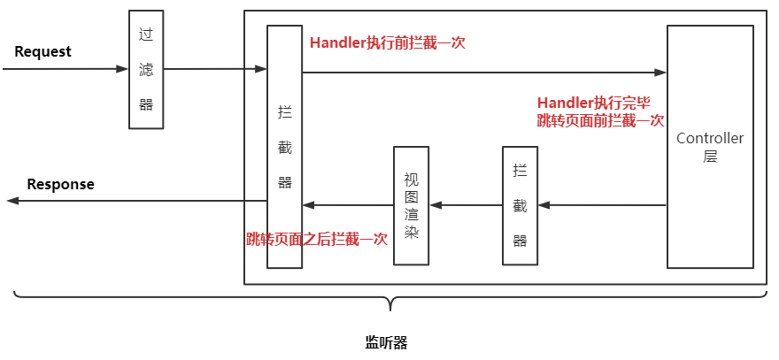
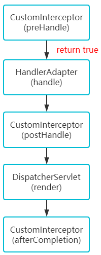
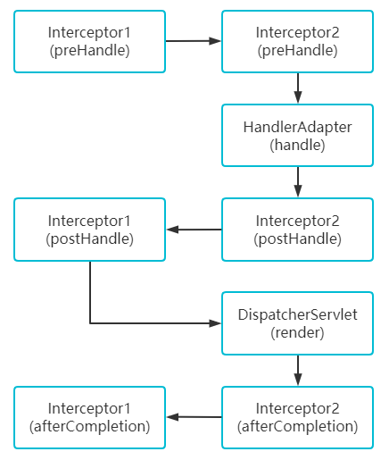

> 第二部分 Spring MVC 高级技术

# 1 拦截器（Interceptor）使用

## 1.1 监听器、过滤器 和 拦截器 对比

- Servlet：处理 Request 请求 和 Response 响应

- 过滤器（Filter）：对Request 请求起到过滤的作用，作用在 Servlet 之前，如果配置为 /* 可以对所有的资源访问（servlet、js/css 静态资源等）进行过滤处理

- 监听器（Listener）：实现了  `javax.servlet.ServletContextListener` 接口的服务器端组件，它随 Web 应用的启动而启动，只初始化一次，然后一直运行监视，随 Web 应用的停止而销毁。

  **作用一**：做一些初始化工作，web 应用中 Spring 容器启动时的 监听器 `org.springframework.web.context.ContextLoaderListener`

  **作用二**：监听 web 中的特定事件，比如 HttpSession，ServletRequest 的创建和销毁；变量的创建、销毁和修改等。可以在某些动作前后增加处理，实现监控；比如统计在线人数，利用 HttpSessionListener 等。

- 拦截器（Interceptor）：是 SpringMVC、Struts 等表现层框架自己的，不会拦截 jsp/html/css/image 等的访问，只会拦截访问的控制器方法（Handler）.

  从配置的角度也能够总结发现：servlet、filter、listener 是配置在 web.xml中的，而 Interceptor 是配置在表现层框架自己的配置文件中的。

  - 在 Handler 业务逻辑执行之前拦截一次
  - 在 Handler 逻辑执行完毕 但未跳转页面之前拦截一次
  - 在 跳转页面之后拦截一次

  

  

## 1.2 拦截器的执行流程

在运行程序时，拦截器的执行是有一定顺序的，该顺序与配置文件中所定义的拦截器的顺序相关。单个拦截器，在程序中的执行流程如下图所示：



1. 程序先执行 preHandle() 方法，如果该方法返回值为 true，则程序会继续向下执行处理器中的方法，否则将不再向下执行。
2. 在业务处理器（即控制器 Controller 类）处理完请求后，会执行 postHandle() 方法，然后会通过 DispatherServlet 向客户端返回响应。
3. 在 DispatcherServlet 处理完请求后，才会执行 afterCompletion() 方法。

## 1.3 多个拦截器的执行流程

多个拦截器（假设有两个拦截器 Interceptor1 和 Interceptor2，并且在配置文件中，Interceptor1 拦截器配置在前），在程序中的执行流程如下所示：



从图可以看出，当有多个拦截器同时工作时，它们的 preHandle() 方法会按照配置文件中拦截器的配置顺序执行，而它们的 postHandle() 方法 和 afterCompletion() 方法则会按照配置顺序的反序执行。

**示例代码**：

```java

```

注册 SpringMVC 拦截器：

```xml

```


# 2 处理 multipart 形式的数据

# 3 在控制器中处理异常

# 4 基于 Flash 属性的跨重定向请求数据传递