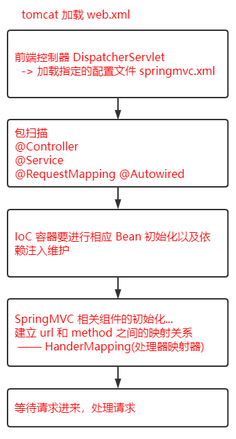
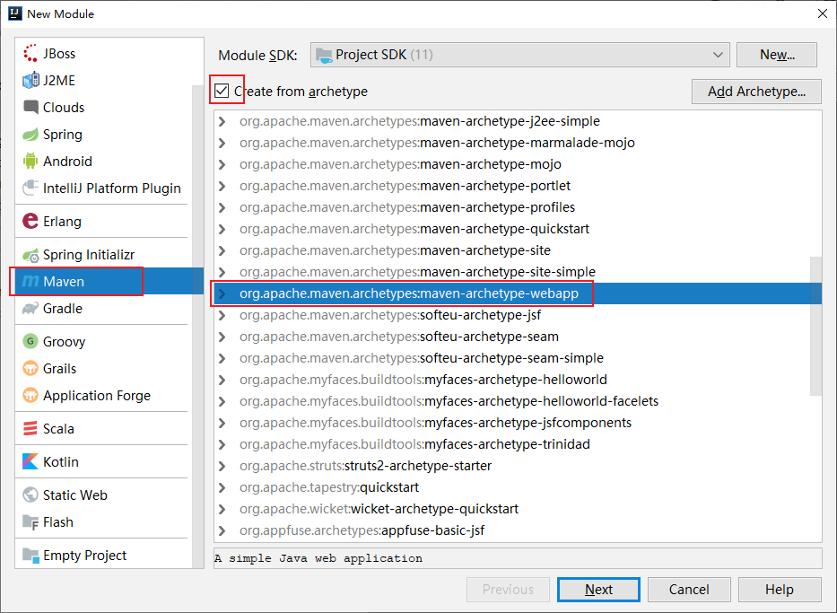
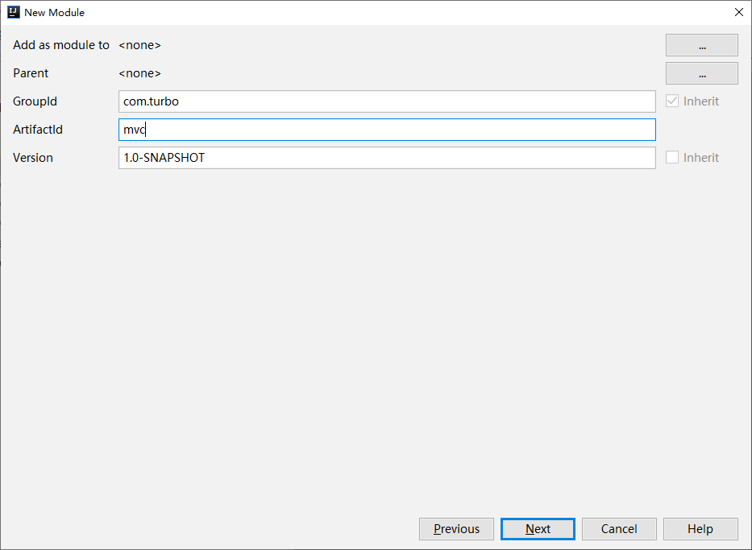
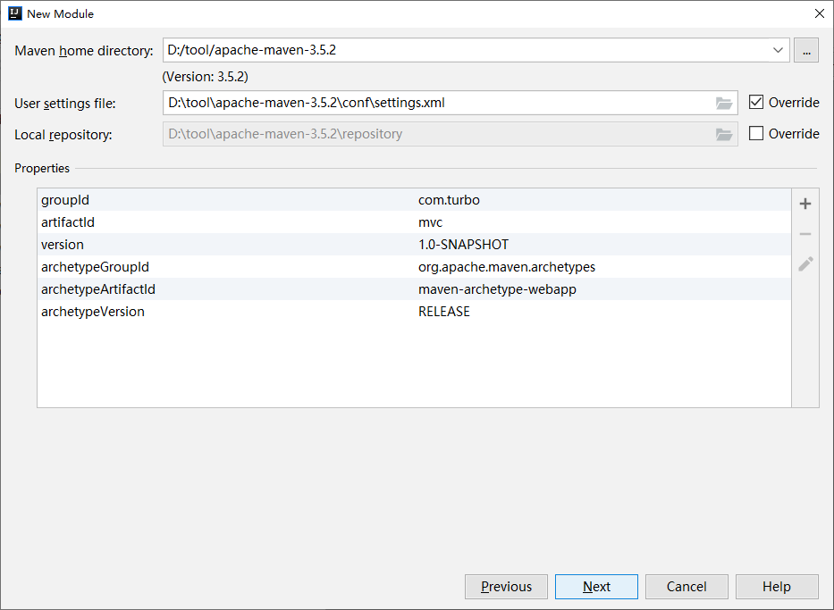
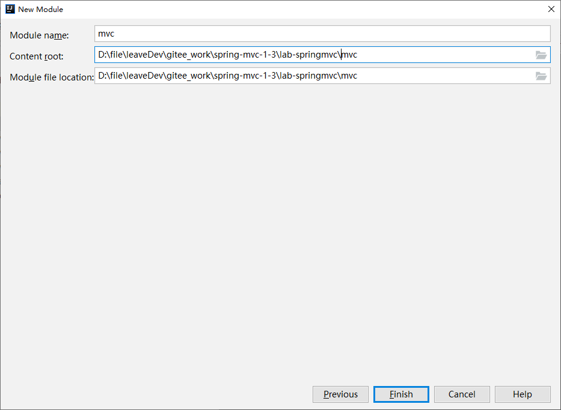
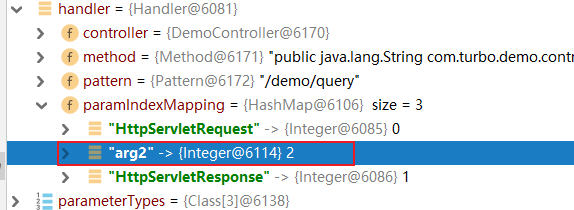
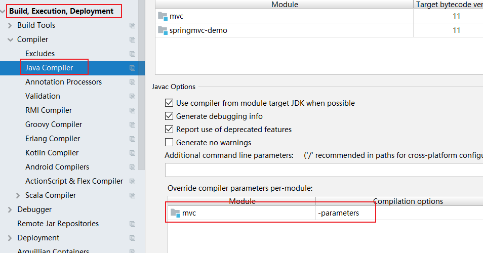

> 第三部分 手写 MVC 框架

回顾 SpringMVC 执行的大致流程，后续根据这个图模仿手写自己的 mvc 框架











然后项目打开后，修改 jdk 级别为 11，删除 pom 中 build，增加 tomcat7 插件。增加 java 和 resources 目录（如果不存在的话，并且 正确标记目录）。

```xml
<!--配置 tomcat 插件-->
<build>
    <plugins>
        <plugin>
            <groupId>org.apache.tomcat.maven</groupId>
            <artifactId>tomcat7-maven-plugin</artifactId>
            <version>2.2</version>
            <configuration>
                <port>8080</port>
                <path>/</path>
            </configuration>
        </plugin>
    </plugins>
</build>
```


[代码地址 gitee](https://gitee.com/turboYuu/spring-mvc-1-3/tree/master/lab-springmvc/mvc)

# 1 手写MVC 框架之注解开发

- TurboController

  ```java
  package com.turbo.mvcframework.annotations;
  
  import java.lang.annotation.*;
  
  @Documented
  @Target(ElementType.TYPE)
  @Retention(RetentionPolicy.RUNTIME)
  public @interface TurboController {
      String value() default "";
  }
  ```

  

- TurboService

  ```java
  package com.turbo.mvcframework.annotations;
  
  import java.lang.annotation.*;
  
  @Documented
  @Target(ElementType.TYPE)
  @Retention(RetentionPolicy.RUNTIME)
  public @interface TurboService {
      String value() default "";
  }
  ```

  

- TurboAutowired

  ```java
  package com.turbo.mvcframework.annotations;
  
  import java.lang.annotation.*;
  
  @Documented
  @Target(ElementType.FIELD)
  @Retention(RetentionPolicy.RUNTIME)
  public @interface TurboAutowired {
      String value() default "";
  }
  ```

  

- TurboRequestMapping

  ```java
  package com.turbo.mvcframework.annotations;
  
  import java.lang.annotation.*;
  
  @Documented
  @Target({ElementType.TYPE,ElementType.METHOD})
  @Retention(RetentionPolicy.RUNTIME)
  public @interface TurboRequestMapping {
      String value() default "";
  }
  ```

  

# 2 TbDispatcherServlet主干

```java
public class TbDispatcherServlet extends HttpServlet {

    @Override
    public void init(ServletConfig config) throws ServletException {
        // 1 加载配置文件 springmvc.properties
        String contextConfigLocation = config.getInitParameter("contextConfigLocation");
        doLoadConfig(contextConfigLocation);
        
        // 2 扫描相关的类，  扫描注解
        doScan(properties.getProperty("scanPackage"));
        
        // 3 初始化bean对象（实现IoC容器，基于注解）
        doInstance();

        // 4 实现依赖注入
        doAutowired();

        // 5 构造一个 HandlerMapping (处理器映射器)，将配置好的 url 和 Method 建立映射关系
        initHandlerMapping();

        System.out.println("turbo mvc 初始化完成 ...");
        // 6 等待请求进入，处理请求

    }

    @Override
    protected void doGet(HttpServletRequest req, HttpServletResponse resp) 
        throws ServletException, IOException {
        doPost(req,resp);
    }

    @Override
    protected void doPost(HttpServletRequest req, HttpServletResponse resp) 
        throws ServletException, IOException {
        // 处理请求
        
    }
}
```

接下来逐步完善 init 方法中的 5 个步骤。

# 3 配置 we.xml 和 新增 springmvc.properties

web.xml

```xml
<!DOCTYPE web-app PUBLIC
 "-//Sun Microsystems, Inc.//DTD Web Application 2.3//EN"
 "http://java.sun.com/dtd/web-app_2_3.dtd" >

<web-app>
  <display-name>Archetype Created Web Application</display-name>
  
  <servlet>
    <servlet-name>tbmvc</servlet-name>
    <servlet-class>com.turbo.mvcframework.servlet.TbDispatcherServlet</servlet-class>
    <init-param>
      <param-name>contextConfigLocation</param-name>
      <param-value>springmvc.properties</param-value>
    </init-param>
  </servlet>
  <servlet-mapping>
    <servlet-name>tbmvc</servlet-name>
    <url-pattern>/*</url-pattern>
  </servlet-mapping>
</web-app>
```

springmvc.properties

```properties
# 扫描路径
scanPackage=com.turbo.demo
```

在扫描路径下增加 controller 和 service。

DemoController：

```java
package com.turbo.demo.controller;

import com.turbo.demo.service.IDemoService;
import com.turbo.mvcframework.annotations.TurboAutowired;
import com.turbo.mvcframework.annotations.TurboController;
import com.turbo.mvcframework.annotations.TurboRequestMapping;


import javax.servlet.http.HttpServletRequest;
import javax.servlet.http.HttpServletResponse;

@TurboController
@TurboRequestMapping("/demo")
public class DemoController {

    @TurboAutowired
    private IDemoService demoService;

    /**
     * localhost:8080/demo/query?name=yuuu
     * URL: /demo/query
     * @param request
     * @param response
     * @param name
     * @return
     */
    @TurboRequestMapping("/query")
    public String query(HttpServletRequest request, HttpServletResponse response, String name){
        return demoService.get(name);
    }
}
```

接口 IDemoService：

```java
package com.turbo.demo.service;

public interface IDemoService {

    String get(String name);
}
```

实现类 DemoServiceImpl：

```java
package com.turbo.demo.service.impl;

import com.turbo.demo.service.IDemoService;
import com.turbo.mvcframework.annotations.TurboService;

@TurboService("demoService")
public class DemoServiceImpl implements IDemoService {

    @Override
    public String get(String name) {
        System.out.println("service 实现类中的name参数："+name);
        return name;
    }
}
```


# 4 加载配置文件 springmvc.properties

```java
/**
 * 加载配置文件
 * @param contextConfigLocation
 */
private void doLoadConfig(String contextConfigLocation) {
    InputStream resourceAsStream = this.getClass().getClassLoader()
        .getResourceAsStream(contextConfigLocation);

    try {
        properties.load(resourceAsStream);
    } catch (IOException e) {
        e.printStackTrace();
    }
}
```

# 5 扫描相关的类 和 扫描注解

```java
/**
 * 扫描类
 * scanPackage : com.turbo.demo --> 磁盘上的文件夹（File）
 */
private void doScan(String scanPackage) {
    String scanPackagePath = Thread.currentThread()
        .getContextClassLoader().getResource("").getPath() 
        + scanPackage.replaceAll("\\.","/");
    File pack = new File(scanPackagePath);

    File[] files = pack.listFiles();

    for (File file : files) {
        if(file.isDirectory()){ // 子 package
            // 递归
            doScan(scanPackage+"."+file.getName());
        }else if(file.getName().endsWith(".class")){
            String className = scanPackage + "." + file.getName().replaceAll(".class", "");
            classNames.add(className);

        }
    }
}
```

# 6 初始化bean对象（实现IoC容器，基于注解）

```java
/**
 * IoC 容器
 * 基于classNames 缓存的类的全限定类名，以及反射技术，完成对象的创建和管理
 */
private void doInstance() {
    if (classNames.size() == 0) return;

    try {
        for (int i = 0; i < classNames.size(); i++) {
            String className = classNames.get(i); // com.turbo.demo.controller.DemoController
            // 反射
            Class<?> aClass = Class.forName(className);
            // 区分 controller ,区分 service
            if(aClass.isAnnotationPresent(TurboController.class)){
                // controller 的 id 此处不做过多处理，不取value,就拿类的首字母小写作为 id,保存到 IoC 中
                String lowerFirstSimpleName = lowerFirst(aClass.getSimpleName());// demoController
                Object newInstance = aClass.newInstance();
                ioc.put(lowerFirstSimpleName,newInstance);
            } else if(aClass.isAnnotationPresent(TurboService.class)){

                TurboService annotation = aClass.getAnnotation(TurboService.class);
                // 获取注解 value
                String beanName = annotation.value();
                // 如果指定了 id,就以指定为准
                if(!"".equals(beanName.trim())){
                    ioc.put(beanName.trim(),aClass.newInstance());
                } else {
                    // 如果没有指定，就以类名首字母小写
                    beanName = lowerFirst(aClass.getSimpleName());
                    ioc.put(beanName,aClass.newInstance());
                }

                // service 层往往是有接口的，面向接口开发，此时再以接口名为id,放到 ioc 中一份，便于后期根据接口类型注入
                Class<?>[] interfaces = aClass.getInterfaces();
                for (int j = 0; j < interfaces.length; j++) {
                    Class<?> anInterface = interfaces[j];
                    // 以接口的全限定类名作为id 放入
                    ioc.put(anInterface.getName(),aClass.newInstance());
                }
            } else {
                continue;
            }
        }
    } catch (ClassNotFoundException e) {
        e.printStackTrace();
    } catch (InstantiationException e) {
        e.printStackTrace();
    } catch (IllegalAccessException e) {
        e.printStackTrace();
    }
}
```

# 7 实现依赖注入

```java
/**
 * 实现依赖注入
 */
private void doAutowired() {
    if (ioc.isEmpty()) return;

    // 有对象再进行依赖注入处理
    // 遍历 ioc 中所有对象，查看对象中的字段，是否有 @TurboAutowired 注解，如果有，需要维护依赖注入关系
    for (Map.Entry<String, Object> entry : ioc.entrySet()) {
        // 获取 bean 对象中的字段信息
        Field[] declaredFields = entry.getValue().getClass().getDeclaredFields();
        // 遍历判断处理
        for (int i = 0; i < declaredFields.length; i++) {
            Field declaredField = declaredFields[i];
            if(!declaredField.isAnnotationPresent(TurboAutowired.class)){
                continue;
            }
            // 有该注解
            TurboAutowired annotation = declaredField.getAnnotation(TurboAutowired.class);
            String beanName = annotation.value(); // 主要注入的 bean 的 id
            if("".equals(beanName)){
                // 没有配置具体的bean id，那就需要根据当前字段的类型注入（接口注入）
                beanName = declaredField.getType().getName();
            }

            // 开启注入
            declaredField.setAccessible(true);
            try {
                declaredField.set(entry.getValue(),ioc.get(beanName));
            } catch (IllegalAccessException e) {
                e.printStackTrace();
            }
        }
    }
}
```

# 8 构造一个 HandlerMapping (处理器映射器)

将配置好的 url 和 Method 建立映射关系

```java
/**
 * 构造一个HandlerMapping 处理器映射器
 * 手写 mvc ,最关键的环节，
 * 目的：将 url 和 method 建立关联
 */
private void initHandlerMapping() {
    if (ioc.isEmpty()) return;

    for (Map.Entry<String, Object> entry : ioc.entrySet()) {
        // 获取 ioc 中当前遍历的对象的 class 类型
        Class<?> aClass = entry.getValue().getClass();
        if (!aClass.isAnnotationPresent(TurboController.class)){
            continue;
        }
        String baseUrl = "";
        if(aClass.isAnnotationPresent(TurboRequestMapping.class)){
            TurboRequestMapping annotation = aClass.getAnnotation(TurboRequestMapping.class);
            baseUrl = annotation.value(); // /demo
        }

        // 获取方法
        Method[] methods = aClass.getMethods();
        for (int i = 0; i < methods.length; i++) {
            Method method = methods[i];
            // 方法没有标识 TurboRequestMapping ，就不处理
            if(!method.isAnnotationPresent(TurboRequestMapping.class)){continue;}

            // 如果标识就处理
            TurboRequestMapping annotation = method.getAnnotation(TurboRequestMapping.class);
            String methodUrl = annotation.value(); // /query
            String url = baseUrl + methodUrl; // 计算出来的 url /demo/query

            // 把 method 所有信息及url封装成一个 Handler
            Handler handler = new Handler(entry.getValue(), method, Pattern.compile(url));
            // 处理计算参数位置信息 // query(ServletRequest request, ServletResponse response, String name)
            Parameter[] parameters = method.getParameters();
            for (int j = 0; j < parameters.length; j++) {
                Parameter parameter = parameters[j];

                if (parameter.getType() == HttpServletRequest.class || parameter.getType() == HttpServletResponse.class){
                    // 如果是 request 和 response 对象，那么参数名称存 HttpServletRequest 和 HttpServletResponse
                    handler.getParamIndexMapping().put(parameter.getType().getSimpleName(),j);
                }else{
                    handler.getParamIndexMapping().put(parameter.getName(),j); // <name,2>
                }
            }
            // 建立 url 和 method 之间的映射关系(map缓存起来)
            handlerMapping.add(handler);
        }
    }

}
```

## 8.1 Handler

```java
package com.turbo.mvcframework.pojo;

import java.lang.reflect.Method;
import java.util.HashMap;
import java.util.Map;
import java.util.regex.Pattern;

/**
 * 封装 handler 方法相关的信息
 */
public class Handler {

    private Object controller; // method.invoke(obj,)

    private Method method;

    private Pattern pattern; // spring 中 url 是支持正则的

    private Map<String,Integer> paramIndexMapping; // 参数顺序，是为了进行参数绑定，key 是参数名，value 代表参数顺序 <name,2>

    public Handler(Object controller, Method method, Pattern pattern) {
        this.controller = controller;
        this.method = method;
        this.pattern = pattern;
        this.paramIndexMapping = new HashMap<>();
    }

    public Object getController() {
        return controller;
    }

    public void setController(Object controller) {
        this.controller = controller;
    }

    public Method getMethod() {
        return method;
    }

    public void setMethod(Method method) {
        this.method = method;
    }

    public Pattern getPattern() {
        return pattern;
    }

    public void setPattern(Pattern pattern) {
        this.pattern = pattern;
    }

    public Map<String, Integer> getParamIndexMapping() {
        return paramIndexMapping;
    }

    public void setParamIndexMapping(Map<String, Integer> paramIndexMapping) {
        this.paramIndexMapping = paramIndexMapping;
    }
}
```

# 9 处理请求

```java
@Override
protected void doPost(HttpServletRequest req, HttpServletResponse resp) throws ServletException, IOException {
    // 处理请求

    // 根据 uri 获取到能够处理当前请求的 handler(从handlerMapping中（list）)
    Handler handler = getHandler(req);
    if(handler == null){
        resp.getWriter().write("404 not found");
        return;
    }
    // 参数绑定

    // 获取所有参数类型数组，这个数组的长度，就是最后要传入的 args 数组的长度
    Class<?>[] parameterTypes = handler.getMethod().getParameterTypes();
    // 根据上述数组长度创建一个新的数组（参数数组，是要传入反射调用的）
    Object[] paramValues = new Object[parameterTypes.length];

    // 以下就是为了向参数数组中塞值，而且保证参数的顺序和方法中的形参顺序一致

    Map<String, String[]> parameterMap = req.getParameterMap();

    // 遍历 request 中所有参数（填充处理 request 、response 之外的参数）
    for (Map.Entry<String, String[]> param : parameterMap.entrySet()) {
        // name=1&name=2 name [1,2]

        String value = StringUtils.join(param.getValue(), ","); // 如同 1，2

        // 如果参数和方法中的参数匹配上了，填充数据
        if(!handler.getParamIndexMapping().containsKey(param.getKey())){continue;}

        // 确实有该参数，找到它的索引位置，对应的把参数放到 paramValues
        Integer paramIndex = handler.getParamIndexMapping().get(param.getKey()); // name 在第2位置
        paramValues[paramIndex] = value; // 把前台传递过来的参数值，填充到对应位置

    }

    Integer requestIndex = handler.getParamIndexMapping()
        .get(HttpServletRequest.class.getSimpleName()); // 0
    paramValues[requestIndex] = req;

    Integer responseIndex = handler.getParamIndexMapping()
        .get(HttpServletResponse.class.getSimpleName()); // 1
    paramValues[responseIndex] = resp;

    // 最终调用handler 的 method 属性
    try {
        handler.getMethod().invoke(handler.getController(),paramValues);
    } catch (IllegalAccessException e) {
        e.printStackTrace();
    } catch (InvocationTargetException e) {
        e.printStackTrace();
    }
}
```


# 10 完整的 TbDispatcherServlet

```java
package com.turbo.mvcframework.servlet;

import com.turbo.mvcframework.annotations.TurboAutowired;
import com.turbo.mvcframework.annotations.TurboController;
import com.turbo.mvcframework.annotations.TurboRequestMapping;
import com.turbo.mvcframework.annotations.TurboService;
import com.turbo.mvcframework.pojo.Handler;
import org.apache.commons.lang3.StringUtils;

import javax.servlet.ServletConfig;
import javax.servlet.ServletException;
import javax.servlet.http.HttpServlet;
import javax.servlet.http.HttpServletRequest;
import javax.servlet.http.HttpServletResponse;
import java.io.File;
import java.io.IOException;
import java.io.InputStream;
import java.lang.reflect.Field;
import java.lang.reflect.InvocationTargetException;
import java.lang.reflect.Method;
import java.lang.reflect.Parameter;
import java.util.*;
import java.util.regex.Matcher;
import java.util.regex.Pattern;

public class TbDispatcherServlet extends HttpServlet {

    private Properties properties = new Properties();
    // 缓存 扫描到的类的全限定类名
    private List<String> classNames = new ArrayList<>();

    // IoC 容器
    private Map<String,Object> ioc = new HashMap<>();

    // handlerMapping ，存储 url 和 method 之间的映射关系
    // private Map<String, Object> handlerMapping = new HashMap<>();
    private List<Handler> handlerMapping = new ArrayList<>();

    @Override
    public void init(ServletConfig config) throws ServletException {
        // 1 加载配置文件 springmvc.properties
        String contextConfigLocation = config.getInitParameter("contextConfigLocation");
        doLoadConfig(contextConfigLocation);
        
        // 2 扫描相关的类，  扫描注解
        doScan(properties.getProperty("scanPackage"));
        
        // 3 初始化bean对象（实现IoC容器，基于注解）
        doInstance();

        // 4 实现依赖注入
        doAutowired();

        // 5 构造一个 HandlerMapping (处理器映射器)，将配置好的 url 和 Method 建立映射关系
        initHandlerMapping();

        System.out.println("turbo mvc 初始化完成 ...");
        // 6 等待请求进入，处理请求

    }

    /**
     * 构造一个HandlerMapping 处理器映射器
     * 手写 mvc ,最关键的环节，
     * 目的：将 url 和 method 建立关联
     */
    private void initHandlerMapping() {
        if (ioc.isEmpty()) return;

        for (Map.Entry<String, Object> entry : ioc.entrySet()) {
            // 获取 ioc 中当前遍历的对象的 class 类型
            Class<?> aClass = entry.getValue().getClass();
            if (!aClass.isAnnotationPresent(TurboController.class)){
                continue;
            }
            String baseUrl = "";
            if(aClass.isAnnotationPresent(TurboRequestMapping.class)){
                TurboRequestMapping annotation = aClass.getAnnotation(TurboRequestMapping.class);
                baseUrl = annotation.value(); // /demo
            }

            // 获取方法
            Method[] methods = aClass.getMethods();
            for (int i = 0; i < methods.length; i++) {
                Method method = methods[i];
                // 方法没有标识 TurboRequestMapping ，就不处理
                if(!method.isAnnotationPresent(TurboRequestMapping.class)){continue;}

                // 如果标识就处理
                TurboRequestMapping annotation = method.getAnnotation(TurboRequestMapping.class);
                String methodUrl = annotation.value(); // /query
                String url = baseUrl + methodUrl; // 计算出来的 url /demo/query

                // 把 method 所有信息及url封装成一个 Handler
                Handler handler = new Handler(entry.getValue(), method, Pattern.compile(url));
                // 处理计算参数位置信息 // query(ServletRequest request, ServletResponse response, String name)
                Parameter[] parameters = method.getParameters();
                for (int j = 0; j < parameters.length; j++) {
                    Parameter parameter = parameters[j];

                    if (parameter.getType() == HttpServletRequest.class || parameter.getType() == HttpServletResponse.class){
                        // 如果是 request 和 response 对象，那么参数名称存 HttpServletRequest 和 HttpServletResponse
                        handler.getParamIndexMapping().put(parameter.getType().getSimpleName(),j);
                    }else{
                        handler.getParamIndexMapping().put(parameter.getName(),j); // <name,2>
                    }
                }
                // 建立 url 和 method 之间的映射关系(map缓存起来)
                handlerMapping.add(handler);
            }
        }

    }

    /**
     * 实现依赖注入
     */
    private void doAutowired() {
        if (ioc.isEmpty()) return;

        // 有对象再进行依赖注入处理
        // 遍历 ioc 中所有对象，查看对象中的字段，是否有 @TurboAutowired 注解，如果有，需要维护依赖注入关系
        for (Map.Entry<String, Object> entry : ioc.entrySet()) {
            // 获取 bean 对象中的字段信息
            Field[] declaredFields = entry.getValue().getClass().getDeclaredFields();
            // 遍历判断处理
            for (int i = 0; i < declaredFields.length; i++) {
                Field declaredField = declaredFields[i];
                if(!declaredField.isAnnotationPresent(TurboAutowired.class)){
                    continue;
                }
                // 有该注解
                TurboAutowired annotation = declaredField.getAnnotation(TurboAutowired.class);
                String beanName = annotation.value(); // 主要注入的 bean 的 id
                if("".equals(beanName)){
                    // 没有配置具体的bean id，那就需要根据当前字段的类型注入（接口注入）
                    beanName = declaredField.getType().getName();
                }

                // 开启注入
                declaredField.setAccessible(true);
                try {
                    declaredField.set(entry.getValue(),ioc.get(beanName));
                } catch (IllegalAccessException e) {
                    e.printStackTrace();
                }
            }
        }
    }

    /**
     * IoC 容器
     * 基于classNames 缓存的类的全限定类名，以及反射技术，完成对象的创建和管理
     */
    private void doInstance() {
        if (classNames.size() == 0) return;

        try {
            for (int i = 0; i < classNames.size(); i++) {
                String className = classNames.get(i); // com.turbo.demo.controller.DemoController
                // 反射
                Class<?> aClass = Class.forName(className);
                // 区分 controller ,区分 service
                if(aClass.isAnnotationPresent(TurboController.class)){
                    // controller 的 id 此处不做过多处理，不取value,就拿类的首字母小写作为 id,保存到 IoC 中
                    String lowerFirstSimpleName = lowerFirst(aClass.getSimpleName());// demoController
                    Object newInstance = aClass.newInstance();
                    ioc.put(lowerFirstSimpleName,newInstance);
                } else if(aClass.isAnnotationPresent(TurboService.class)){

                    TurboService annotation = aClass.getAnnotation(TurboService.class);
                    // 获取注解 value
                    String beanName = annotation.value();
                    // 如果指定了 id,就以指定为准
                    if(!"".equals(beanName.trim())){
                        ioc.put(beanName.trim(),aClass.newInstance());
                    } else {
                        // 如果没有指定，就以类名首字母小写
                        beanName = lowerFirst(aClass.getSimpleName());
                        ioc.put(beanName,aClass.newInstance());
                    }

                    // service 层往往是有接口的，面向接口开发，此时再以接口名为id,放到 ioc 中一份，便于后期根据接口类型注入
                    Class<?>[] interfaces = aClass.getInterfaces();
                    for (int j = 0; j < interfaces.length; j++) {
                        Class<?> anInterface = interfaces[j];
                        // 以接口的全限定类名作为id 放入
                        ioc.put(anInterface.getName(),aClass.newInstance());
                    }
                } else {
                    continue;
                }
            }
        } catch (ClassNotFoundException e) {
            e.printStackTrace();
        } catch (InstantiationException e) {
            e.printStackTrace();
        } catch (IllegalAccessException e) {
            e.printStackTrace();
        }
    }


    /**
     * 扫描类
     * scanPackage : com.turbo.demo --> 磁盘上的文件夹（File）
     */
    private void doScan(String scanPackage) {
        String scanPackagePath = Thread.currentThread().getContextClassLoader().getResource("").getPath() + scanPackage.replaceAll("\\.","/");
        File pack = new File(scanPackagePath);

        File[] files = pack.listFiles();

        for (File file : files) {
            if(file.isDirectory()){ // 子 package
                // 递归
                doScan(scanPackage+"."+file.getName());
            }else if(file.getName().endsWith(".class")){
                String className = scanPackage + "." + file.getName().replaceAll(".class", "");
                classNames.add(className);

            }
        }
    }

    /**
     * 加载配置文件
     * @param contextConfigLocation
     */
    private void doLoadConfig(String contextConfigLocation) {
        InputStream resourceAsStream = this.getClass().getClassLoader().getResourceAsStream(contextConfigLocation);

        try {
            properties.load(resourceAsStream);
        } catch (IOException e) {
            e.printStackTrace();
        }
    }

    @Override
    protected void doGet(HttpServletRequest req, HttpServletResponse resp) throws ServletException, IOException {
        doPost(req,resp);
    }

    @Override
    protected void doPost(HttpServletRequest req, HttpServletResponse resp) throws ServletException, IOException {
        // 处理请求
        // 需要根据 url 找到对应的method，进行调用处理

        // 获取uri
//        String requestURI = req.getRequestURI();
        // 获取到一个反射的方法
//        Method method = handlerMapping.get(requestURI);
        // 反射调用,需要传入对象 和 参数，此处无法完成调用，没有把对象缓存起来，也没有参数 ！！！改造 inithandlerMapping();
//        method.invoke()

        // 根据 uri 获取到能够处理当前请求的 handler(从handlerMapping中（list）)
        Handler handler = getHandler(req);
        if(handler == null){
            resp.getWriter().write("404 not found");
            return;
        }
        // 参数绑定

        // 获取所有参数类型数组，这个数组的长度，就是最后要传入的 args 数组的长度
        Class<?>[] parameterTypes = handler.getMethod().getParameterTypes();
        // 根据上述数组长度创建一个新的数组（参数数组，是要传入反射调用的）
        Object[] paramValues = new Object[parameterTypes.length];

        // 以下就是为了向参数数组中塞值，而且保证参数的顺序和方法中的形参顺序一致

        Map<String, String[]> parameterMap = req.getParameterMap();

        // 遍历 request 中所有参数（填充处理 request 、response 之外的参数）
        for (Map.Entry<String, String[]> param : parameterMap.entrySet()) {
            // name=1&name=2 name [1,2]

            String value = StringUtils.join(param.getValue(), ","); // 如同 1，2

            // 如果参数和方法中的参数匹配上了，填充数据
            if(!handler.getParamIndexMapping().containsKey(param.getKey())){continue;}

            // 确实有该参数，找到它的索引位置，对应的把参数放到 paramValues
            Integer paramIndex = handler.getParamIndexMapping().get(param.getKey()); // name 在第2位置
            paramValues[paramIndex] = value; // 把前台传递过来的参数值，填充到对应位置

        }

        Integer requestIndex = handler.getParamIndexMapping().get(HttpServletRequest.class.getSimpleName()); // 0
        paramValues[requestIndex] = req;

        Integer responseIndex = handler.getParamIndexMapping().get(HttpServletResponse.class.getSimpleName()); // 1
        paramValues[responseIndex] = resp;

        // 最终调用handler 的 method 属性
        try {
            handler.getMethod().invoke(handler.getController(),paramValues);
        } catch (IllegalAccessException e) {
            e.printStackTrace();
        } catch (InvocationTargetException e) {
            e.printStackTrace();
        }
    }

    private Handler getHandler(HttpServletRequest req) {
        if(handlerMapping.isEmpty()){return null;}
        String uri = req.getRequestURI();

        for (Handler handler : handlerMapping) {
            Matcher matcher = handler.getPattern().matcher(uri);
            if(!matcher.matches()){
                continue;
            }
            return handler;
        }
        return null;
    }


    /**
     * 首字母小写
     * @return
     */
    public String lowerFirst(String str){
        char[] chars = str.toCharArray();
        if('A' <= chars[0] && chars[0] <= 'Z'){
            chars[0] += 32;
        }
        return String.valueOf(chars);
    }
}
```


# 11 注意的点

## 11.1 注意点一

```xml
<!--注意点1 ：provided意味着打包的时候可以不用包进去
    tomcat会提供这个servlet-api.jar 包，所以当我们项目发布的时候这个包是不需要打到包里的
    -->
<dependency>
    <groupId>javax.servlet</groupId>
    <artifactId>javax.servlet-api</artifactId>
    <version>3.1.0</version>
    <scope>provided</scope>
</dependency>
```

## 11.2 注意点二

编译器编译时并不会记录形参的真实名称，而是 arg0，arg1，arg2，....



导致通过反射构造一个参数数组会有问题。

**解决方法**：

```xml
<!--注意点2 ：编译插件定义编译细节-->
<plugin>
    <groupId>org.apache.maven.plugins</groupId>
    <artifactId>maven-compiler-plugin</artifactId>
    <version>3.1</version>
    <configuration>
        <source>11</source>
        <target>11</target>
        <encoding>utf-8</encoding>
        <!--告诉编译器，编译的时候记录下形参的真实名称-->
        <compilerArgs>
            <arg>-parameters</arg>
        </compilerArgs>
    </configuration>
</plugin>
```

