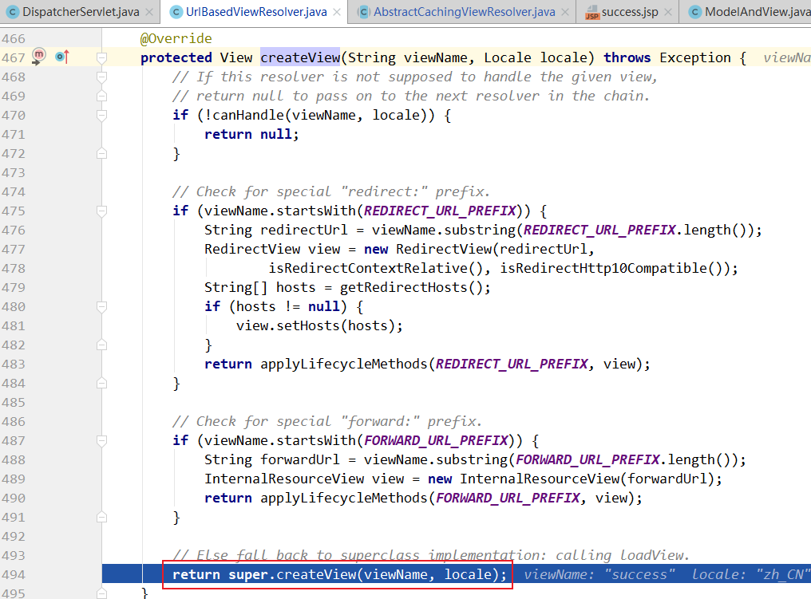
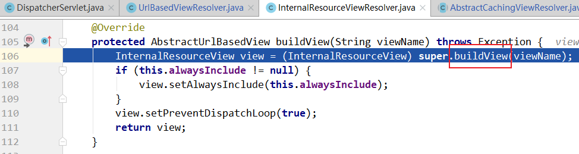
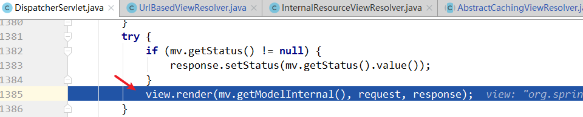

> 第四部分 SpringMVC源码深度剖析

**代码准备**：在 [spring-framework-5.1.x](https://gitee.com/turboYuu/spring-1-2/tree/master/source_code/spring-framework-5.1.x) 的源码中新建一个 web 的 module：


然后 编辑 build.gradle：

```properties
plugins {
    id 'java'
    id 'war'
}

group 'org.springframework'
version '5.1.21.BUILD-SNAPSHOT'

sourceCompatibility = 11

repositories {
    mavenCentral()
}

dependencies {
	# 新增部分
    compile(project(":spring-webmvc")) 
    testCompile group: 'junit', name: 'junit', version: '4.11'
    testCompile group: 'junit', name: 'junit', version: '4.12'
}
```

编辑后：


手动新增红框中的内容：


DemoController：

```java
package com.turbo.controller;


import org.springframework.stereotype.Controller;
import org.springframework.web.bind.annotation.RequestMapping;
import java.util.Date;
import java.util.Map;

@Controller
@RequestMapping("/demo")
public class DemoController {

	@RequestMapping("/handle01")
	public String handle01(String name, Map map){
		System.out.println("hander业务逻辑正在处理中...");
		Date date = new Date();
		map.put("date",date);
		return "success";
	}
}
```

springmvc.xml

```xml
<?xml version="1.0" encoding="UTF-8"?>
<beans xmlns="http://www.springframework.org/schema/beans"
	   xmlns:context="http://www.springframework.org/schema/context"
	   xmlns:xsi="http://www.w3.org/2001/XMLSchema-instance"
	   xmlns:mvc="http://www.springframework.org/schema/mvc"
	   xsi:schemaLocation="http://www.springframework.org/schema/beans
       http://www.springframework.org/schema/beans/spring-beans.xsd
	   http://www.springframework.org/schema/context
       http://www.springframework.org/schema/context/spring-context.xsd
       http://www.springframework.org/schema/mvc
       http://www.springframework.org/schema/mvc/spring-mvc.xsd">

	<!--开启controller扫描-->
	<context:component-scan base-package="com.turbo.controller"/>


	<!--
    视图解析器 处理器映射器 处理器适配器 称为 spring mvc 三大件
    -->

	<!--配置 spring mvc的视图解析器-->
	<bean class="org.springframework.web.servlet.view.InternalResourceViewResolver">
		<property name="prefix" value="/WEB-INF/jsp/"/>
		<property name="suffix" value=".jsp"/>
	</bean>

	<!--<mvc:annotation-driven/>-->

</beans>
```

success.jsp

```jsp
<%--
  Created by IntelliJ IDEA.
  User: yutao
  Date: 2021/4/10
  Time: 17:41
  To change this template use File | Settings | File Templates.
--%>
<%@ page contentType="text/html;charset=UTF-8" language="java" isELIgnored="false" pageEncoding="utf-8" %>
<html>
<head>
    <title>Title</title>
</head>
<body>
<%System.out.println("跳转到页面");%>
跳转成功！ 当前服务器时间：${ date }
</body>
</html>
```

web.xml

```xml
<?xml version="1.0" encoding="UTF-8"?>
<web-app xmlns="http://xmlns.jcp.org/xml/ns/javaee"
		 xmlns:xsi="http://www.w3.org/2001/XMLSchema-instance"
		 xsi:schemaLocation="http://xmlns.jcp.org/xml/ns/javaee http://xmlns.jcp.org/xml/ns/javaee/web-app_3_1.xsd"
		 version="3.1">

	<servlet>
		<servlet-name>springmvc</servlet-name>
		<servlet-class>org.springframework.web.servlet.DispatcherServlet</servlet-class>
		<init-param>
			<param-name>contextConfigLocation</param-name>
			<param-value>classpath*:springmvc.xml</param-value>
		</init-param>
	</servlet>

	<servlet-mapping>
		<servlet-name>springmvc</servlet-name>
		<url-pattern>/</url-pattern>
	</servlet-mapping>

</web-app>
```

index.jsp

```jsp
<%--
  Created by IntelliJ IDEA.
  User: yutao
  Date: 2021/4/10
  Time: 17:35
  To change this template use File | Settings | File Templates.
--%>
<%@ page contentType="text/html;charset=UTF-8" language="java" %>
<html>
  <head>
    <title>$Title$</title>
  </head>
  <body>
  <a href="/demo/handle01?name=zhangsan">点我测试</a>
  </body>
</html>

```

使用tomcat 部署项目：


成功！提示，在源码中启动服务速度会比较慢。

[gitee 代码地址](https://gitee.com/turboYuu/spring-1-2/tree/master/source_code/spring-framework-5.1.x/spring-turbo-mvc)

# 1 前端控制器 DispatcherServlet 继承结构


# 2 重要时机点分析

## 2.1 Handler 方法的执行时机

打断点


doDispatch 方法中的 1041 行 ha.handle 代码完成 handler 方法调用。

## 2.2 页面渲染时机


## 2.3 总结

SpringMVC 处理请求的流程即为 org.springframework.web.servlet.DispatcherServlet#doDispatch 方法的执行过程，其中步骤 2，3，4，5 是核心步骤

1. 调用 getHandler() 获取到能够处理当前请求的执行链 HandlerExecutionChain （Handler + 拦截器），但如何去 getHandler的？后面分析。
2. 调用 getHandlerAdapter() ，获取能够执行 1 中的 Handler 的适配器。但是如何去 getHandlerAdapter 的？后面分析。
3. 适配器调用 Handler 执行 ha.handle（总会返回一个 ModelAndView对象）
4. 调用 processDispatchResult() 方法完成视图渲染跳转

```java
// org.springframework.web.servlet.DispatcherServlet#doDispatch
protected void doDispatch(HttpServletRequest request, HttpServletResponse response) throws Exception {
    HttpServletRequest processedRequest = request;
    HandlerExecutionChain mappedHandler = null;
    boolean multipartRequestParsed = false;

    WebAsyncManager asyncManager = WebAsyncUtils.getAsyncManager(request);

    try {
        ModelAndView mv = null;
        Exception dispatchException = null;

        try {
            // 1 检查是否是文件上传的请求
            processedRequest = checkMultipart(request);
            multipartRequestParsed = (processedRequest != request);

            // Determine handler for the current request.
            /**
				 * 2 取得处理当前请求的 Controller,这里也称为 Handler，即 处理器
				 * 这里并不是直接返回 Controller，而是返回 HandlerExecutionChain ，请求处理链对象
				 * 该对象 封装了 Handler 和 Interceptor
				 */
            mappedHandler = getHandler(processedRequest);
            if (mappedHandler == null) {
                // 如果 handler 为空，则返回 404
                noHandlerFound(processedRequest, response);
                return;
            }

            // Determine handler adapter for the current request.
            // 3 获取处理请求的处理器适配器 HandlerAdapter
            HandlerAdapter ha = getHandlerAdapter(mappedHandler.getHandler());

            // Process last-modified header, if supported by the handler.
            // 处理 last-modified 请求头
            String method = request.getMethod();
            boolean isGet = "GET".equals(method);
            if (isGet || "HEAD".equals(method)) {
                long lastModified = ha.getLastModified(request, mappedHandler.getHandler());
                if (new ServletWebRequest(request, response).checkNotModified(lastModified) && isGet) {
                    return;
                }
            }

            if (!mappedHandler.applyPreHandle(processedRequest, response)) {
                return;
            }

            // Actually invoke the handler.
            // 4 实际处理器处理请求，返回结果视图对象
            mv = ha.handle(processedRequest, response, mappedHandler.getHandler());

            if (asyncManager.isConcurrentHandlingStarted()) {
                return;
            }
            // 结果视图对象的处理
            applyDefaultViewName(processedRequest, mv);
            mappedHandler.applyPostHandle(processedRequest, response, mv);
        }
        catch (Exception ex) {
            dispatchException = ex;
        }
        catch (Throwable err) {
            // As of 4.3, we're processing Errors thrown from handler methods as well,
            // making them available for @ExceptionHandler methods and other scenarios.
            dispatchException = new NestedServletException("Handler dispatch failed", err);
        }
        // 5 跳转页面，渲染视图
        processDispatchResult(processedRequest, response, mappedHandler, mv, dispatchException);
    }
    catch (Exception ex) {
        // 最终会调用 HandlerInterceptor 的 afterCompletion 方法
        triggerAfterCompletion(processedRequest, response, mappedHandler, ex);
    }
    catch (Throwable err) {
        // 最终会调用 HandlerInterceptor 的 afterCompletion 方法
        triggerAfterCompletion(processedRequest, response, mappedHandler,
                               new NestedServletException("Handler processing failed", err));
    }
    finally {
        if (asyncManager.isConcurrentHandlingStarted()) {
            // Instead of postHandle and afterCompletion
            if (mappedHandler != null) {
                mappedHandler.applyAfterConcurrentHandlingStarted(processedRequest, response);
            }
        }
        else {
            // Clean up any resources used by a multipart request.
            if (multipartRequestParsed) {
                cleanupMultipart(processedRequest);
            }
        }
    }
}
```


# 3 核心步骤 getHandler 方法剖析

遍历两个 HandlerMapping，视图获取能够处理当前请求的执行链：


# 4 核心步骤 getHandlerAdapter 方法剖析

遍历各个 HandlerAdapter，看那个 Adapter 支持处理当前 Handler。


# 5 核心步骤 ha.handle 方法剖析

入口


从入口进入


进入该方法：RequestMappingHandlerAdapter#invokeHandlerMethod


进入：


进入：


# 6 核心步骤 processDispatchResult 方法剖析

**render 方法完成渲染**

`org.springframework.web.servlet.DispatcherServlet#processDispatchResult`


进入 org.springframework.web.servlet.DispatcherServlet#render


**视图解析器解析出 View 视图对象**：

org.springframework.web.servlet.DispatcherServlet#resolveViewName


org.springframework.web.servlet.view.AbstractCachingViewResolver#resolveViewName


**在解析出 View 视图对象的过程中会判断是否重定向，是否转发等，不同的情况封装的是不同的View 实现**。

org.springframework.web.servlet.view.UrlBasedViewResolver#createView



org.springframework.web.servlet.view.AbstractCachingViewResolver#createView


org.springframework.web.servlet.view.UrlBasedViewResolver#loadView


org.springframework.web.servlet.view.InternalResourceViewResolver#buildView




**解析出 View 视图对象的过程中，要将逻辑视图名解析为物理视图名**

org.springframework.web.servlet.view.UrlBasedViewResolver#buildView


**封装 View 视图对象之后，调用了 view 对象的 render 方法**

返回到  org.springframework.web.servlet.DispatcherServlet#render 方法中，调用  view 对象的 render 方法



**渲染数据**

org.springframework.web.servlet.view.AbstractView#render


**把 modelMap 中的数据暴露到 request 域中，这也是为什么后台 model.add 之后在 jsp 中可以从请求域取出来的根本原因**：

org.springframework.web.servlet.view.InternalResourceView#renderMergedOutputModel


**将数据设置到请求域中**：

org.springframework.web.servlet.view.AbstractView#exposeModelAsRequestAttributes


# 7 SpringMVC 九大组件初始化