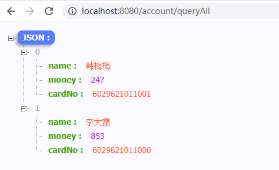

> 第五部分 SSM 整合

# 1 整合策略

SSM = Spring + SpringMVC + Mybatis = (Spring + Mybatis) + SpringMVC

先整合 Spring + Mybatis，然后再整合 SpringMVC

基于的需求：查询 Account 表的全部数据显示到页面。

新建一个 web、maven 项目。[gitee 代码地址](https://gitee.com/turboYuu/spring-mvc-1-3/tree/master/lab-springmvc/ssm)


# 2 Mybatis 整合 Spring

## 2.1 整合目标

- 数据库连接池以及事务管理 都交给 Spring 容器来完成
- SqlSessionFactory 对象应该放到 Spring 容器中作为 单例对象 管理
- Mapper 动态代理对象交给 Spring 管理，我们从 Spring 容器中直接获得 Mapper 的代理对象

## 2.2 整合所需 Jar 分析

- Junit测试 jar （4.12 版本）
- Mybatis的 jar （3.4.5）
- Spring 相关 jar（spring-context、spring-text、spring-jdbc、spring-tx、spring-aop、aspectweaver）
- Mybatis / Spring 整合包 jar （mybatis-spring-xx.jar）
- MySQL 数据库驱动 jar
- Druid 数据库连接池的 jar

## 2.3 整合后的 pom 坐标

```xml
<?xml version="1.0" encoding="UTF-8"?>

<project xmlns="http://maven.apache.org/POM/4.0.0" xmlns:xsi="http://www.w3.org/2001/XMLSchema-instance"
  xsi:schemaLocation="http://maven.apache.org/POM/4.0.0 http://maven.apache.org/xsd/maven-4.0.0.xsd">
  <modelVersion>4.0.0</modelVersion>

  <groupId>com.turbo</groupId>
  <artifactId>ssm</artifactId>
  <version>1.0-SNAPSHOT</version>
  <packaging>war</packaging>

  <name>ssm Maven Webapp</name>
  <!-- FIXME change it to the project's website -->
  <url>http://www.example.com</url>

  <properties>
    <project.build.sourceEncoding>UTF-8</project.build.sourceEncoding>
    <maven.compiler.source>11</maven.compiler.source>
    <maven.compiler.target>11</maven.compiler.target>
  </properties>

  <dependencies>
    <!--junit-->
    <dependency>
      <groupId>junit</groupId>
      <artifactId>junit</artifactId>
      <version>4.12</version>
    </dependency>
    <!--mybatis-->
    <dependency>
      <groupId>org.mybatis</groupId>
      <artifactId>mybatis</artifactId>
      <version>3.4.5</version>
    </dependency>

    <!--spring相关-->
    <dependency>
      <groupId>org.springframework</groupId>
      <artifactId>spring-context</artifactId>
      <version>5.1.12.RELEASE</version>
    </dependency>
    <dependency>
      <groupId>org.springframework</groupId>
      <artifactId>spring-test</artifactId>
      <version>5.1.12.RELEASE</version>
    </dependency>
    <dependency>
      <groupId>org.springframework</groupId>
      <artifactId>spring-jdbc</artifactId>
      <version>5.1.12.RELEASE</version>
    </dependency>
    <dependency>
      <groupId>org.springframework</groupId>
      <artifactId>spring-tx</artifactId>
      <version>5.1.12.RELEASE</version>
    </dependency>
    <dependency>
      <groupId>org.springframework</groupId>
      <artifactId>spring-aop</artifactId>
      <version>5.1.12.RELEASE</version>
    </dependency>

    <!--aspectweaver-->
    <dependency>
      <groupId>org.aspectj</groupId>
      <artifactId>aspectjweaver</artifactId>
      <version>1.8.9</version>
    </dependency>

    <!--mybatis和spring整合包-->
    <dependency>
      <groupId>org.mybatis</groupId>
      <artifactId>mybatis-spring</artifactId>
      <version>2.0.4</version>
    </dependency>

    <!--数据库驱动 jar-->
    <dependency>
      <groupId>mysql</groupId>
      <artifactId>mysql-connector-java</artifactId>
      <version>5.1.48</version>
    </dependency>

    <!--druid 连接池-->
    <dependency>
      <groupId>com.alibaba</groupId>
      <artifactId>druid</artifactId>
      <version>1.1.21</version>
    </dependency>

  </dependencies>

  <build>
    <plugins>
      <!--配置 tomcat 插件-->
      <plugin>
        <groupId>org.apache.tomcat.maven</groupId>
        <artifactId>tomcat7-maven-plugin</artifactId>
        <version>2.2</version>
        <configuration>
          <port>8080</port>
          <path>/</path>
        </configuration>
      </plugin>
    </plugins>
  </build>

</project>
```


## 2.4 AccountMapper接口

```java
package com.turbo.mapper;

import com.turbo.pojo.Account;

import java.util.List;

public interface AccountMapper {

    // 定义dao层接口方法，查询 account 表所有数据
    public List<Account> queryAccountList() throws Exception;
}

```


## 2.5 AccountMapper.xml

在 resources 中的路径和 AccountMapper.java 路径保持一致

```xml
<!DOCTYPE mapper PUBLIC "-//mybatis.org//DTD Mapper 3.0//EN"
        "http://mybatis.org/dtd/mybatis-3-mapper.dtd">
<mapper namespace="com.turbo.mapper.AccountMapper">

    <select id="queryAccountList" resultType="com.turbo.pojo.Account">
         select * from account
    </select>
</mapper>
```


## 2.6 AccountService

- AccountService

  ```java
  package com.turbo.service;
  
  import com.turbo.pojo.Account;
  
  import java.util.List;
  
  public interface AccountService {
  
      public List<Account> queryAccountList() throws Exception;
  }
  ```

- AccountServiceImpl

  ```java
  package com.turbo.service.impl;
  
  import com.turbo.mapper.AccountMapper;
  import com.turbo.pojo.Account;
  import com.turbo.service.AccountService;
  import org.springframework.beans.factory.annotation.Autowired;
  import org.springframework.stereotype.Service;
  
  import java.util.List;
  
  @Service
  public class AccountServiceImpl implements AccountService {
  
      @Autowired
      private AccountMapper accountMapper;
  
      @Override
      public List<Account> queryAccountList() throws Exception {
          return accountMapper.queryAccountList();
      }
  }
  ```

  

## 2.6 jdbc.properties

```properties
jdbc.driver=com.mysql.jdbc.Driver
jdbc.url=jdbc:mysql://152.136.177.192:3306/bank
jdbc.username=root
jdbc.password=123456
```


## 2.7 Spring 配置文件

applicationContext.xml

```xml
<?xml version="1.0" encoding="UTF-8"?>
<beans xmlns="http://www.springframework.org/schema/beans"
       xmlns:context="http://www.springframework.org/schema/context"
       xmlns:tx="http://www.springframework.org/schema/tx"
       xmlns:xsi="http://www.w3.org/2001/XMLSchema-instance"
       xsi:schemaLocation="
       http://www.springframework.org/schema/beans
       http://www.springframework.org/schema/beans/spring-beans.xsd
       http://www.springframework.org/schema/context
       http://www.springframework.org/schema/context/spring-context.xsd
       http://www.springframework.org/schema/tx
       http://www.springframework.org/schema/tx/spring-tx.xsd

">

    <!--包扫描-->
    <context:component-scan base-package="com.turbo.mapper" />
    <context:component-scan base-package="com.turbo.service" />

    <!--数据库连接池以及事务管理都交给 spring 容器来完成-->
    <!--引入外部资源文件-->
    <context:property-placeholder location="classpath:jdbc.properties"/>

    <!--第三方jar中的 bean 定义在 xml 中-->
    <bean id="dataSource" class="com.alibaba.druid.pool.DruidDataSource">
        <property name="driverClassName" value="${jdbc.driver}"/>
        <property name="url" value="${jdbc.url}"/>
        <property name="username" value="${jdbc.username}" />
        <property name="password" value="${jdbc.password}" />
    </bean>

    <!--事务管理-->
    <bean id="transactionManager" class="org.springframework.jdbc.datasource.DataSourceTransactionManager">
        <property name="dataSource" ref="dataSource"/>
    </bean>

    <!--事务管理注解驱动-->
    <tx:annotation-driven transaction-manager="transactionManager" />

    <!--SqlSessionFactory 对象应该放到 Spring 容器中作为单例对象管理
        原来 mybatis 中 sqlSessionFactory 的构建是需要素材的：SqlMapConfig.xml 中的内容-->
    <bean id="sqlSessionFactory" class="org.mybatis.spring.SqlSessionFactoryBean">
        <!--别名映射扫描-->
        <property name="typeAliasesPackage" value="com.turbo.pojo" />
        <!--数据源 dataSource-->
        <property name="dataSource" ref="dataSource" />
    </bean>

    <!--Mapper 动态代理对象交给 Spring 管理，我们从 spring 容器中直接获得 Mapper 的代理对象-->
    <!--扫描 mapper接口，生成代理对象，生成的代理对象会存储在 ioc 容器中-->
    <bean class="org.mybatis.spring.mapper.MapperScannerConfigurer">
        <!--mapper接口包路径配置-->
        <property name="basePackage" value="com.turbo.mapper"/>
        <property name="sqlSessionFactoryBeanName" value="sqlSessionFactory" />
    </bean>

</beans>
```


## 2.8 测试工作

```java
import com.turbo.pojo.Account;
import com.turbo.service.AccountService;
import org.junit.Test;
import org.junit.runner.RunWith;
import org.springframework.beans.factory.annotation.Autowired;
import org.springframework.test.context.ContextConfiguration;
import org.springframework.test.context.junit4.SpringJUnit4ClassRunner;

import java.util.List;

@RunWith(SpringJUnit4ClassRunner.class)
@ContextConfiguration(locations = {"classpath:applicationContext.xml"})
public class MybatisSpringTest {

    // 希望测试 ioc 容器中的哪个对象，注入即可。
    @Autowired
    private AccountService accountService;

    @Test
    public void testMybatis() throws Exception {
        List<Account> accounts = accountService.queryAccountList();
        for (int i = 0; i < accounts.size(); i++) {
            Account account =  accounts.get(i);
            System.out.println(account);
        }
    }
}
```


# 3 整合 SpringMVC

## 3.1 整合思路

把 SpringMVC 的入门案例整合进来即可（在已有工程基础之上开发一个 SpringMVC 入门案例）

## 3.2 引入 pom 坐标

```xml
<!--SpringMVC-->
<dependency>
    <groupId>org.springframework</groupId>
    <artifactId>spring-webmvc</artifactId>
    <version>5.1.12.RELEASE</version>
</dependency>
<!--jsp-api & servlet-api -->
<dependency>
    <groupId>javax.servlet</groupId>
    <artifactId>jsp-api</artifactId>
    <version>2.0</version>
    <scope>provided</scope>
</dependency>
<!--页面使用 jstl 表达式-->
<dependency>
    <groupId>jstl</groupId>
    <artifactId>jstl</artifactId>
    <version>1.2</version>
</dependency>
<dependency>
    <groupId>taglibs</groupId>
    <artifactId>standard</artifactId>
    <version>1.1.2</version>
</dependency>
<!--json数据交互所需jar，start-->
<dependency>
    <groupId>com.fasterxml.jackson.core</groupId>
    <artifactId>jackson-core</artifactId>
    <version>2.9.0</version>
</dependency>
<dependency>
    <groupId>com.fasterxml.jackson.core</groupId>
    <artifactId>jackson-databind</artifactId>
    <version>2.9.0</version>
</dependency>
<dependency>
    <groupId>com.fasterxml.jackson.core</groupId>
    <artifactId>jackson-annotations</artifactId>
    <version>2.9.0</version>
</dependency>
<!--json数据交互所需jar，start-->
```

## 3.2 添加 SpringMVC 入门案例

### 3.2.1 SpringMVC.xml

```xml
<?xml version="1.0" encoding="UTF-8"?>
<beans xmlns="http://www.springframework.org/schema/beans"
       xmlns:context="http://www.springframework.org/schema/context"
       xmlns:mvc="http://www.springframework.org/schema/mvc"
       xmlns:xsi="http://www.w3.org/2001/XMLSchema-instance"
       xsi:schemaLocation="
       http://www.springframework.org/schema/beans
       http://www.springframework.org/schema/beans/spring-beans.xsd
       http://www.springframework.org/schema/context
       http://www.springframework.org/schema/context/spring-context.xsd
       http://www.springframework.org/schema/mvc
       http://www.springframework.org/schema/mvc/spring-mvc.xsd

">

    <context:component-scan base-package="com.turbo.controller" />
    <mvc:annotation-driven />
</beans>
```

### 3.2.2 Controller 类

```java
package com.turbo.controller;

import com.turbo.pojo.Account;
import com.turbo.service.AccountService;
import org.springframework.beans.factory.annotation.Autowired;
import org.springframework.stereotype.Controller;
import org.springframework.web.bind.annotation.RequestMapping;
import org.springframework.web.bind.annotation.RestController;

import java.util.List;

@RestController
@RequestMapping("/account")
public class AccountController {

    /**
     * Spring 容器和 SpringMVC 容器是有层次的（父子容器）
     * Spring 容器：servlet对象+dao对象
     * SpringMVC 容器：controller对象，可以引用到 Spring 容器中的对象
     */

    @Autowired
    private AccountService accountService;

    @RequestMapping("/queryAll")
    public List<Account> queryAll() throws Exception {
        return accountService.queryAccountList();
    }
}

```

### 3.2.3 web.xml

```xml
<!DOCTYPE web-app PUBLIC
 "-//Sun Microsystems, Inc.//DTD Web Application 2.3//EN"
 "http://java.sun.com/dtd/web-app_2_3.dtd" >

<web-app>
  <display-name>Archetype Created Web Application</display-name>

  <context-param>
    <param-name>contextConfigLocation</param-name>
    <param-value>classpath:applicationContext.xml</param-value>
  </context-param>

  <!--Spring 框架启动-->
  <listener>
    <listener-class>org.springframework.web.context.ContextLoaderListener</listener-class>
  </listener>

  <!--springmvc启动-->
  <servlet>
    <servlet-name>springmvc</servlet-name>
    <servlet-class>org.springframework.web.servlet.DispatcherServlet</servlet-class>
    <init-param>
      <param-name>contextConfigLocation</param-name>
      <param-value>classpath*:springmvc.xml</param-value>
    </init-param>
    <load-on-startup>1</load-on-startup>
  </servlet>
  <servlet-mapping>
    <servlet-name>springmvc</servlet-name>
    <url-pattern>/</url-pattern>
  </servlet-mapping>
</web-app>
```

