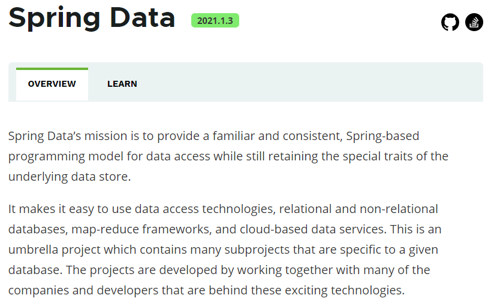
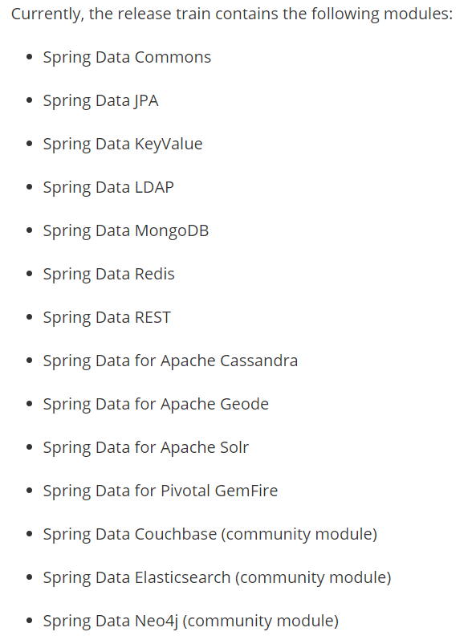

> 第一部分 Spring Data JPA 概述

**什么是 Spring Data JPA**

Spring Data JPA 是 Spring  基于 JPA 规范的基础上封装的一套 JPA 应用框架，可使开发者用极简的代码即可实现对数据库的访问和操作。它提供了包括增删改查等在内的常用功能！学习和使用Spring Data JPA 可以极大提高开发效率。

说明：Spring Data JPA 极大简化了数据访问层代码。

如何简化呢？使用了 Spring Data JPA，我们 Dao 层中只需要写接口，不需要写实现类，就自动具有了增删改查、分页查询等方法。

**Spring Data 家族**

