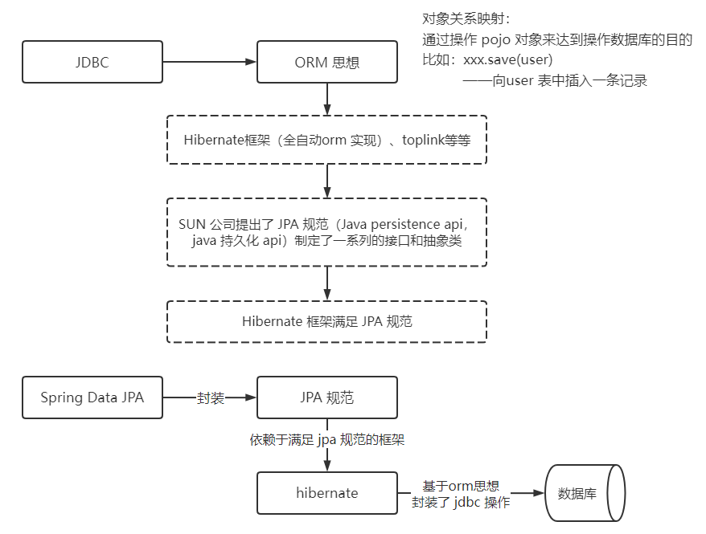

> 第二部分 Spring Data JPA,JAP规范和Hibernate之间的关系

Spring Data JPA 是 Spring 提供的一个封装了 JPA 操作的框架，而 JPA 仅仅是规范，单独使用规范无法具体做什么，那么 Spring Data JPA、JPA规范 以及 Hibernate（JPA规范的一种实现）之间的关系是什么？

JPA是一套规范，内部是由接口和抽象类组成的，Hibernate 是一套成熟的 ORM 框架，而且 Hibernate 实现了 JPA 规范，所以可以称 Hibernate 为 JPA 的 一种实现方式，我们使用 JPA 的 API 编程，意味着站在更高的角度去看待问题（面向接口编程）。

Spring Data JPA 是 Spring 提供的一套对 JPA 操作更加高级的封装，是在 JPA 规范下的专门用来进行数据持久化的解决方案。

