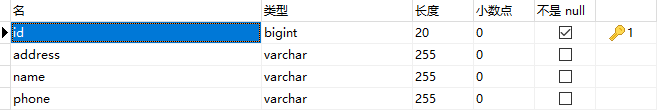

> ​	第三部分 Spring Data JPA 应用

需求：使用 Spring Data JPA 完成对 tb_resume 表 的 Dao 层操作（增删改查、排序，分页等）

数据表设计：



初始化 sql 语句：

```sql
SET NAMES utf8mb4;
SET FOREIGN_KEY_CHECKS = 0;
-- ---------------------------- 
-- Table structure for tb_resume
-- ---------------------------- 
DROP TABLE IF EXISTS `tb_resume`; 
CREATE TABLE `tb_resume` (
	`id` BIGINT (20) NOT NULL AUTO_INCREMENT,
	`address` VARCHAR (255) DEFAULT NULL,
	`name` VARCHAR (255) DEFAULT NULL,
	`phone` VARCHAR (255) DEFAULT NULL,
	PRIMARY KEY (`id`)
) ENGINE = INNODB AUTO_INCREMENT = 4 DEFAULT CHARSET = utf8;
-- ---------------------------- 
-- Records of tb_resume
-- ---------------------------- 
BEGIN;
INSERT INTO `tb_resume` VALUES (1, '北京', '张三', '131000000');
INSERT INTO `tb_resume` VALUES (2, '上海', '李四', '151000000');
INSERT INTO `tb_resume` VALUES (3, '⼴州', '王五', '153000000');
COMMIT;
SET FOREIGN_KEY_CHECKS = 1;
```

# 1 Spring Data JPA 开发步骤梳理

- 构建工程（普通maven）
  - 创建工程导入坐标（Java框架于我们而言就是一堆 jar）
  - 配置 Spring 的配置文件（配置指定框架执行的细节）
  - 编写实体类 Resume，使用 JPA 注解配置映射关系
  - 编写一个符合 Spring Data JPA 的 Dao 层接口（ResumeDao 接口）
- 操作 ResumeDao 接口完成 Dao 层开发

# 2 Spring Data JPA 开发实现

## 2.1 导入坐标

```xml
<?xml version="1.0" encoding="UTF-8"?>
<project xmlns="http://maven.apache.org/POM/4.0.0"
         xmlns:xsi="http://www.w3.org/2001/XMLSchema-instance"
         xsi:schemaLocation="http://maven.apache.org/POM/4.0.0 http://maven.apache.org/xsd/maven-4.0.0.xsd">
    <modelVersion>4.0.0</modelVersion>

    <groupId>com.turbo</groupId>
    <artifactId>spring-data-jpa</artifactId>
    <version>1.0-SNAPSHOT</version>

    <dependencies>
        <dependency>
            <groupId>junit</groupId>
            <artifactId>junit</artifactId>
            <version>4.13</version>
            <scope>test</scope>
        </dependency>

        <!--spring-data-jpa 需要引入的 jar，start-->
        <dependency>
            <groupId>org.springframework.data</groupId>
            <artifactId>spring-data-jpa</artifactId>
            <version>2.1.9.RELEASE</version>
        </dependency>

        <dependency>
            <groupId>javax.el</groupId>
            <artifactId>javax.el-api</artifactId>
            <version>3.0.1-b04</version>
        </dependency>

        <dependency>
            <groupId>org.glassfish.web</groupId>
            <artifactId>javax.el</artifactId>
            <version>2.2.6</version>
        </dependency>
        <!--spring-data-jpa 需要引入的 jar，end-->

        <!--spring 相关jar ，start-->
        <dependency>
            <groupId>org.springframework</groupId>
            <artifactId>spring-aop</artifactId>
            <version>5.1.12.RELEASE</version>
        </dependency>
        <dependency>
            <groupId>org.aspectj</groupId>
            <artifactId>aspectjweaver</artifactId>
            <version>1.8.13</version>
        </dependency>
        <dependency>
            <groupId>org.springframework</groupId>
            <artifactId>spring-context</artifactId>
            <version>5.1.12.RELEASE</version>
        </dependency>
        <dependency>
            <groupId>org.springframework</groupId>
            <artifactId>spring-context-support</artifactId>
            <version>5.1.12.RELEASE</version>
        </dependency>

        <!--spring 对 orm 框架的支持包-->
        <dependency>
            <groupId>org.springframework</groupId>
            <artifactId>spring-orm</artifactId>
            <version>5.1.12.RELEASE</version>
        </dependency>
        <dependency>
            <groupId>org.springframework</groupId>
            <artifactId>spring-beans</artifactId>
            <version>5.1.12.RELEASE</version>
        </dependency>
        <dependency>
            <groupId>org.springframework</groupId>
            <artifactId>spring-core</artifactId>
            <version>5.1.12.RELEASE</version>
        </dependency>
        <!--spring 相关jar ，end-->

        <!--hibernate相关jar包， start-->
        <dependency>
            <groupId>org.hibernate</groupId>
            <artifactId>hibernate-core</artifactId>
            <version>5.4.0.Final</version>
        </dependency>
        <!--hibernate 对 jpa 的实现 jar-->
        <dependency>
            <groupId>org.hibernate</groupId>
            <artifactId>hibernate-entitymanager</artifactId>
            <version>5.4.0.Final</version>
        </dependency>
        <dependency>
            <groupId>org.hibernate</groupId>
            <artifactId>hibernate-validator</artifactId>
            <version>5.4.0.Final</version>
        </dependency>
        <!--hibernate相关jar包， start-->

        <!--mysql 连接-->
        <dependency>
            <groupId>mysql</groupId>
            <artifactId>mysql-connector-java</artifactId>
            <version>5.1.47</version>
        </dependency>

        <!--druid 连接池-->
        <dependency>
            <groupId>com.alibaba</groupId>
            <artifactId>druid</artifactId>
            <version>1.1.21</version>
        </dependency>

        <!--spring-test-->
        <dependency>
            <groupId>org.springframework</groupId>
            <artifactId>spring-test</artifactId>
            <version>5.1.12.RELEASE</version>
        </dependency>
        <dependency>
            <groupId>org.projectlombok</groupId>
            <artifactId>lombok</artifactId>
            <version>1.18.16</version>
            <scope>compile</scope>
        </dependency>
    </dependencies>

    <build>
        <plugins>
            <plugin>
                <groupId>org.apache.maven.plugins</groupId>
                <artifactId>maven-compiler-plugin</artifactId>
                <version>3.1</version>
                <configuration>
                    <source>11</source>
                    <target>11</target>
                    <encoding>utf-8</encoding>
                </configuration>
            </plugin>
        </plugins>
    </build>

</project>
```

## 2.2 配置 applicationContext.xml 和 jdbc.properties

jdbc.properties：

```properties
jdbc.driver=com.mysql.jdbc.Driver
jdbc.url=jdbc:mysql://152.136.177.192:3306/turbo?characterEncoding=utf8
jdbc.username=root
jdbc.password=123456
```

applicationContext.xml：

```xml
<?xml version="1.0" encoding="UTF-8"?>
<beans xmlns="http://www.springframework.org/schema/beans"
       xmlns:context="http://www.springframework.org/schema/context"
       xmlns:jpa="http://www.springframework.org/schema/data/jpa"
       xmlns:xsi="http://www.w3.org/2001/XMLSchema-instance"
       xmlns:tx="http://www.springframework.org/schema/tx"
       xsi:schemaLocation="
       http://www.springframework.org/schema/beans
       http://www.springframework.org/schema/beans/spring-beans.xsd
       http://www.springframework.org/schema/context
       http://www.springframework.org/schema/context/spring-context.xsd
       http://www.springframework.org/schema/data/jpa
       http://www.springframework.org/schema/data/jpa/spring-jpa.xsd
       http://www.springframework.org/schema/tx
       http://www.springframework.org/schema/tx/spring-tx">

    <!--对Spring和SpringDataJPA进行配置-->

    <!--1、创建数据库连接池 druid-->
    <!--引入外部资源文件-->
    <context:property-placeholder location="classpath:jdbc.properties"/>
    <!--第三方jar中的bean定义在xml-->
    <bean id="dataSource" class="com.alibaba.druid.pool.DruidDataSource">
        <property name="driverClassName" value="${jdbc.driver}"/>
        <property name="url" value="${jdbc.url}"/>
        <property name="username" value="${jdbc.username}"/>
        <property name="password" value="${jdbc.password}"/>
    </bean>

    <!--2、配置一个JPA中非常重要的对象，entityManagerFactory
        entityManager 类似于 mybatis 中的 SqlSession
        entityManagerFactory 类似于 Mybatis 中的 SqlSessionFactory-->
    <bean id="entityManagerFactory" class="org.springframework.orm.jpa.LocalContainerEntityManagerFactoryBean">
        <!--配置一些细节....-->

        <!--配置数据源-->
        <property name="dataSource" ref="dataSource"/>
        <!--配置包扫描 （pojo实体所在的包）-->
        <property name="packagesToScan" value="com.turbo.pojo"/>
        <!--指定 jpa的具体实现，也就是 hibernate-->
        <property name="persistenceProvider">
            <bean class="org.hibernate.jpa.HibernatePersistenceProvider"/>
        </property>
        <!--JPA方言配置，不同的jpa实现对于类似于beginTransaction等细节实现起来是不一样的，所以传入JpaDialect具体的实现类-->
        <property name="jpaDialect">
            <bean class="org.springframework.orm.jpa.vendor.HibernateJpaDialect"></bean>
        </property>

        <!--配置具体provider，hibernate框架的执行细节-->
        <property name="jpaVendorAdapter">
            <bean class="org.springframework.orm.jpa.vendor.HibernateJpaVendorAdapter">
                <!--定义hibernate框架的一些细节-->
                <!--配置数据库表是否自动创建
                    因为我们会建立pojo和数据表之间的映射关系，
                    程序启动时，如果数据表还没有创建，是否要程序创建一下
                    -->
                <property name="generateDdl" value="false"/>
                <!--指定数据库的类型，hibernate本身是个dao层框架，可以支持多种数据库类型，
                    这里就指定本次使用的什么数据库-->
                <property name="database" value="MYSQL"/>
                <!--配置数据库的方言 hibernate 可以帮助我们拼装 sql 语句，
                    但是不同的数据 sql 语法是不同的，所以需要我们注入具体的数据库方言-->
                <property name="databasePlatform" value="org.hibernate.dialect.MySQLDialect"/>
                <!--是否显示sql，操作数据库时，是否打印sql-->
                <property name="showSql" value="true"/>
            </bean>
        </property>
    </bean>

    <!--3、引用上面创建的 entityManagerFactory
        <jpa:repositories> 配置jpa 的 dao 层细节
        base-package: 指定dao层接口所在的包-->
    <jpa:repositories base-package="com.turbo.dao" entity-manager-factory-ref="entityManagerFactory"
                      transaction-manager-ref="transactionManager" />

    <!--4、事务管理器配置
        jdbcTemplate/mybatis 使用的是 DataSourceTransactionManager
        jpa 规范：JpaTransactionManager-->
    <bean id="transactionManager" class="org.springframework.orm.jpa.JpaTransactionManager">
        <property name="entityManagerFactory" ref="entityManagerFactory"/>
    </bean>

    <!--5、声明式事务-->
    <!--<tx:annotation-driven/>-->

    <!--6、配置spring包扫描-->
    <context:component-scan base-package="com.turbo"/>
</beans>
```

## 2.3 编写实体类 Resume

使用 JPA 注解配置映射关系

```java
package com.turbo.pojo;

import lombok.Data;

import javax.persistence.*;

/**
 * 实体类（在类中要使用注解建立实体类和数据表之间的映射关系 ，以及属性和字段的映射关系）
 * 1、实体类和数据表映射关系
 * @Entity
 * @Table
 * 2、实体类属性和表字段的映射关系
 * @Id 标识主键
 * @GeneratedValue 标识主键的生成策略
 * @Column 建立属性和字段映射
 */
@Entity
@Table(name = "tb_resume")
@Data
public class Resume {

    @Id
    /**
     * ⽣成策略经常使⽤的两种：
     * GenerationType.IDENTITY 依赖数据库中主键⾃增功能  Mysql
     * GenerationType.SEQUENCE 依靠序列来产⽣主键     Oracle
     */
    @GeneratedValue(strategy = GenerationType.IDENTITY)
    @Column(name = "id")
    private Long id;

    @Column(name = "address")
    private String address;

    @Column(name = "name")
    private String name;

    @Column(name = "phone")
    private String phone;

    @Override
    public String toString() {
        return "Resume{" +
                "id=" + id +
                ", address='" + address + '\'' +
                ", name='" + name + '\'' +
                ", phone='" + phone + '\'' +
                '}';
    }
}
```

## 2.4 编写ResumeDao 接口

```java
package com.turbo.dao;

import com.turbo.pojo.Resume;
import org.springframework.data.jpa.repository.JpaRepository;
import org.springframework.data.jpa.repository.JpaSpecificationExecutor;
import org.springframework.data.jpa.repository.Query;

import java.util.List;

/**
 * 一个符合SpringDataJpa要求的Dao层接口需要继承 JpaRepository 和 JpaSpecificationExecutor
 * JpaRepository<操作的实体类类型，主键类型> 封装了基本的CRUD操作
 *
 * JpaSpecificationExecutor<操作的实体类类型>
 *     封装了复杂的查询（分页，排序等）
 */
public interface ResumeDao extends JpaRepository<Resume,Long>,
        JpaSpecificationExecutor<Resume> {

    /**
     * 方法名字规则查询
     * 按照 name 模糊查询（like）
     *      方法名以 findBy 开头
     *          - 属性名(首字母大写)
     *              - 查询方式（模糊查询、等价查询），如果不屑查询方式，默认等价查询
     * @param name
     * @return
     */
    public List<Resume> findByNameLikeAndAddress(String name,String address);

    @Query("from Resume where id=?1 and name = ?2 ")
    public List<Resume> findByJpql(Long id,String name);

    @Query(value = "select * from tb_resume where name like ?1 and address like ?2",nativeQuery = true)
    public List<Resume> findBySql(String name,String address);
}

```

## 2.5 测试

操作 ResumeDao 接口完成 Dao 层开发（客户端测试）

```java
import com.turbo.dao.ResumeDao;
import com.turbo.pojo.Resume;
import org.junit.Test;
import org.junit.runner.RunWith;
import org.springframework.beans.factory.annotation.Autowired;
import org.springframework.data.domain.*;
import org.springframework.data.jpa.domain.Specification;
import org.springframework.test.context.ContextConfiguration;
import org.springframework.test.context.junit4.SpringJUnit4ClassRunner;

import javax.persistence.criteria.*;
import java.util.Iterator;
import java.util.List;
import java.util.Optional;

@RunWith(SpringJUnit4ClassRunner.class)
@ContextConfiguration(locations = {"classpath:applicationContext.xml"})
public class ResumeDaoTest {

    // 要测试IoC哪个对象注入即可
    @Autowired
    private ResumeDao resumeDao;

    /**
     * dao 层接口调用，分成两块
     * 1. 基础的增删改查
     * 2. 专门针对查询的详细分析使用
     */


    @Test
    public void testFindById(){
        Optional<Resume> optionalResume = resumeDao.findById(1L);
        /**
         * select resume0_.id as id1_0_0_, resume0_.address as address2_0_0_,
         * resume0_.name as name3_0_0_, resume0_.phone as phone4_0_0_
         * from tb_resume resume0_ where resume0_.id=?
         */
        Resume resume = optionalResume.get();
        System.out.println(resume);
    }

    @Test
    public void testFindOne(){
        Resume resume = new Resume();
        resume.setId(1L);
        resume.setName("张三");

        Example<Resume> example = Example.of(resume);
        // select resume0_.id as id1_0_, resume0_.address as address2_0_, resume0_.name as name3_0_, resume0_.phone as phone4_0_ from tb_resume resume0_ where resume0_.name=? and resume0_.id=1
        // 查询结果为多个也只返回1个
        Optional<Resume> optionalResume = resumeDao.findOne(example);
        System.out.println(optionalResume.isEmpty());
        System.out.println(optionalResume.get());
    }


    @Test
    public void testSave(){
        /**
         * 新增和更新都使用save方法，通过传入的对象的主键有无来区分，
         * 没有主键那就是新增，有主键信息就是更新
         */
        Resume resume = new Resume();
        resume.setName("孙六");
        resume.setAddress("成都");
        resume.setPhone("163000000");
        // insert into tb_resume (address, name, phone) values (?, ?, ?)
        Resume save = resumeDao.save(resume);
        // Resume{id=4, address='成都', name='孙六', phone='163000000'}
        System.out.println(save);
    }

    @Test
    public void testDelete(){
        // select resume0_.id as id1_0_0_, resume0_.address as address2_0_0_, resume0_.name as name3_0_0_, resume0_.phone as phone4_0_0_ from tb_resume resume0_ where resume0_.id=?
        resumeDao.deleteById(4L);
    }


    @Test
    public void testFindAll(){
        // Hibernate: select resume0_.id as id1_0_, resume0_.address as address2_0_, resume0_.name as name3_0_, resume0_.phone as phone4_0_
        // from tb_resume resume0_
        List<Resume> all = resumeDao.findAll();
        for (Resume resume : all) {
            System.out.println(resume);
        }
    }

    @Test
    public void testSort(){
        // select resume0_.id as id1_0_, resume0_.address as address2_0_, resume0_.name as name3_0_, resume0_.phone as phone4_0_
        // from tb_resume resume0_ order by resume0_.id desc, resume0_.name desc
        Sort sort = new Sort(Sort.Direction.DESC, "id", "name");
        List<Resume> all = resumeDao.findAll(sort);
        for (Resume resume : all) {
            System.out.println(resume);
        }
    }

    @Test
    public void testPage(){

        /**
         * Hibernate: select resume0_.id as id1_0_, resume0_.address as address2_0_, resume0_.name as name3_0_, resume0_.phone as phone4_0_ from tb_resume resume0_ limit ?
         * Hibernate: select count(resume0_.id) as col_0_0_ from tb_resume resume0_
         * 页数共：2
         * Resume{id=1, address='北京', name='张三', phone='131000000'}
         * Resume{id=2, address='上海', name='赵四', phone='151000000'}
         */

        /**
         * 第一个参数：当前查询的页数，从 0 开始
         * 第二个参数：每页查询的数量
         */
        PageRequest pageRequest = PageRequest.of(0, 2);

        Page<Resume> resumes = resumeDao.findAll(pageRequest);
        System.out.println("页数共："+resumes.getTotalPages());

        Iterator<Resume> iterator = resumes.iterator();
        while (iterator.hasNext()){
            System.out.println(iterator.next());
        }
    }

    /**
     * ----------------------------------针对查询的使用进行分析-----------------------------------------
     * 方式一：调用继承的接口中的方法 findOne(),findById()
     * 方式二：可以引入 jpql(jpa查询语言)语句进行查询（====>>> jpql 语句类似于sql，只不过sql操作的是数据表和字段，jpql操作的是对象和属性，
     *      比如 from Resume where id=?1 and name = ?2  ）hql
     * 方式三：可以引入原生的 sql 语句
     * 方式四：可以在接口中自定义方法，而且不必引入 jpql或者 sql语句，这种方式叫做方法命名规则查询，
     *         也就是说定义的接口方法名是按照一定规则形成的，那么框架就能够理解我们的意图；
     *      https://docs.spring.io/spring-data/jpa/docs/current/reference/html/#jpa.query-methods.query-creation
     *
     * 方式五：动态查询
     *         service层传入dao的条件不确定，把 service 拿到条件封装成一个对象传递给dao层，这个对象就叫做Specification（对条件的一个封装）
     *         https://docs.spring.io/spring-data/jpa/docs/current/reference/html/#jpa.named-parameters
     *
     *         Optional<T> findOne(@Nullable Specification<T> spec);
     *
     *         List<T> findAll(@Nullable Specification<T> spec);
     *
     *         Page<T> findAll(@Nullable Specification<T> spec, Pageable pageable);
     *
     *         List<T> findAll(@Nullable Specification<T> spec, Sort sort);
     *
     *         long count(@Nullable Specification<T> spec);
     *
     *         org.springframework.data.jpa.domain.Specification
     *              Predicate toPredicate(Root<T> root, CriteriaQuery<?> query, CriteriaBuilder criteriaBuilder); 用来封装查询条件的
     *              Root: 根查询（查询所需要的任何属性都可以从根对象中获取）
     *              CriteriaQuery：自定义查询方式（用不上）
     *              CriteriaBuilder：查询构造器，封装了很多的查询条件（like = 等）
     *
     */

    /**
     * 方式二：可以引入 jpql(jpa查询语言)语句进行查询
     */
    @Test
    public void testJpql(){
        // select resume0_.id as id1_0_,
        // resume0_.address as address2_0_,
        // resume0_.name as name3_0_,
        // resume0_.phone as phone4_0_
        // from tb_resume resume0_ where resume0_.id=? and resume0_.name=?
        List<Resume> resumes = resumeDao.findByJpql(1L, "张三");
        for (Resume resume : resumes) {
            System.out.println(resume);
        }
    }

    /**
     * 方式三：可以引入原生的 sql 语句
     */
    @Test
    public void testSql(){
        // select * from tb_resume where name like ? and address like ?
        List<Resume> resumes = resumeDao.findBySql("赵%", "%海");
        for (Resume resume : resumes) {
            System.out.println(resume);
        }
    }

    /**
     * 方法命名规则查询
     */
    @Test
    public void testMethodName(){
        // select resume0_.id as id1_0_, resume0_.address as address2_0_, resume0_.name as name3_0_, resume0_.phone as phone4_0_ from tb_resume resume0_ where (resume0_.name like ? escape ?) and resume0_.address=?
        List<Resume> resumes = resumeDao.findByNameLikeAndAddress("赵%", "上海");
        for (Resume resume : resumes) {
            System.out.println(resume);
        }
    }

    @Test
    public void testSpecification(){
        Specification<Resume> specification = new Specification<>() {
            @Override
            public Predicate toPredicate(Root<Resume> root, CriteriaQuery<?> query, CriteriaBuilder criteriaBuilder) {
                // 获取到name属性
                Path<Object> name = root.get("name");
                // 使用CriteriaBuilder针对name属性构建条件（精准查询）
                Predicate predicate = criteriaBuilder.equal(name, "张三");
                return predicate;
            }
        };
        // select resume0_.id as id1_0_, resume0_.address as address2_0_, resume0_.name as name3_0_, resume0_.phone as phone4_0_ from tb_resume resume0_ where resume0_.name=?
        Optional<Resume> resumeOptional = resumeDao.findOne(specification);
        Resume resume = resumeOptional.get();
        System.out.println(resume);
    }


    @Test
    public void testSpecificationMultiCon(){
        Specification<Resume> specification = new Specification<>() {
            @Override
            public Predicate toPredicate(Root<Resume> root, CriteriaQuery<?> query, CriteriaBuilder criteriaBuilder) {
                Path<Object> name = root.get("name");
                Path<Object> address = root.get("address");
                Predicate predicate1 = criteriaBuilder.equal(name, "张三");
                Predicate predicate2 = criteriaBuilder.like(address.as(String.class), "北%");
                Predicate and = criteriaBuilder.and(predicate1, predicate2);
                return and;
            }
        };
        // select resume0_.id as id1_0_, resume0_.address as address2_0_, resume0_.name as name3_0_, resume0_.phone as phone4_0_ from tb_resume resume0_ where resume0_.name=? and (resume0_.address like ?)
        List<Resume> resumes = resumeDao.findAll(specification);
        for (Resume resume : resumes) {
            System.out.println(resume);
        }
    }
}
```


[使用 JPA 的步骤](https://docs.spring.io/spring-data/jpa/docs/current/reference/html/#repositories.query-methods)

[JPA Query 的策略](https://docs.spring.io/spring-data/jpa/docs/current/reference/html/#jpa.query-methods)

[specifications 动态查询](https://docs.spring.io/spring-data/jpa/docs/current/reference/html/#specifications)

