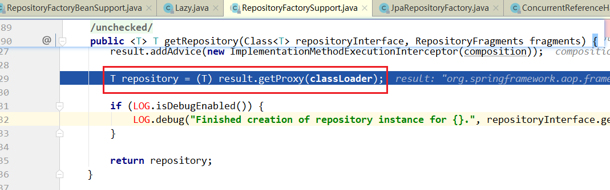

> 第四部分 Spring Data JPA 执行过程源码分析

Spring Data JPA 的源码很少有人去分析，原因如下：

1. Spring Data JPA 地位没有之前学习的框架高，大家习惯把它当成一个工具来用，不愿意对它进行源码层次的解读。
2. 开发Dao接口，接口的实现对象肯定是通过动态代理来完成的（增强），代理对象的产生过程在源码中很难跟踪，特别讲究技巧。

**源码剖析的主要过程，就是代理对象产生的过程**

发现 resumeDao 是一个代理对象，这个代理对象的类型是 SimpleJpaRepository

# 1 疑问：这个代理对象是怎么产生的，过程是？

以往：如果要给一个对象产生代理对象，我们知道是在 AbstractApplicationContext 的 refresh 方法中，那么能不能在这个方法中找到什么当前场景的线索？

新的问题又来了？

**问题1**：为什么会给它指定为一个 JpaRepositoryFactoryBean （getObject方法返回具体的对象）？

**问题2**：指定这个 FactoryBean 是在什么时候发生的？

首先解决问题2 ：

传入一个 resumeDao 就返回一个已经指定class为 JpaRepositoryFactoryBean  的 BeanDefinition 对象了，那么应该在上图中的 get 的时候就有了，所以断点进入

问题来了，什么时候put到 `mergedBeanDefinitions` 这个map中去的？定位到了一个方法在做这件事：

*在断点中设置条件*

发现，传入该方法的时候，BeanDefinition 中的class就已经被指定为FactoryBean了，那么观察该方法的调用栈：

 断点进入：

在该类中 搜索 `beanDefinitionMap.put`：

观察调用栈：

断点进入：

断点跟踪：

通过上述追踪发现，<jpa:repositories base-package ，扫描到的接口，在进行BeanDefinition注册时候，class会被固定的指定为 JpaRepositoryFactoryBean。

至此问题2追踪完毕。

**那么接下来，再来追踪问题1 ，JpaRepositoryFactoryBean 是一个什么样的类？**

它是一个 FactoryBean，重点关注FactoryBean的getObject方法

搜一下 `this.repository` 什么时候被赋值？在 afterPropertiesSet() 方法中。

其父类实现了 `InitializingBean` 接口，Spring 将调用 afterPropertiesSet() 方法。 

由此可见，JdkDynamicAopProxy 会生成一个代理对象类型为 SimpleJpaRespository，而该对象的增强逻辑就在 JdkDynamicAopProxy 类的 invoke 方法中。

至此问题1 追踪完成。

# 2 疑问：这个代理对象 SimpleJpaRepository 有什么特别的？

原来 SimpleJpaRepository 类实现了 JpaRepository 接口 和 JpaSpecificationExecutor 接口

