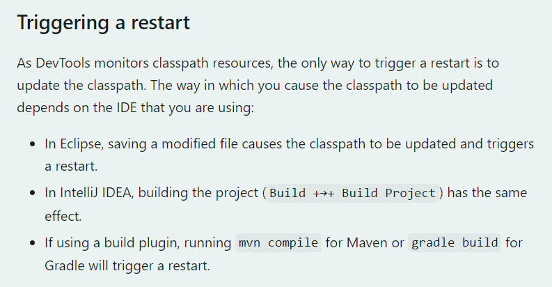
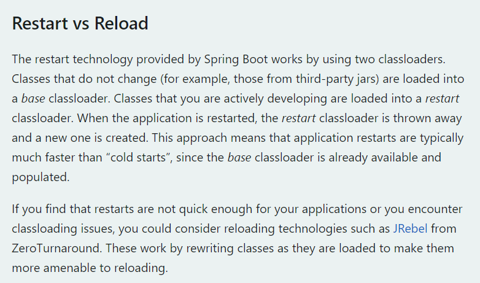
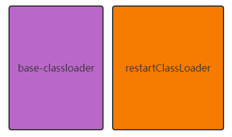
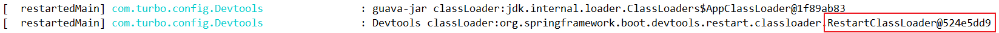
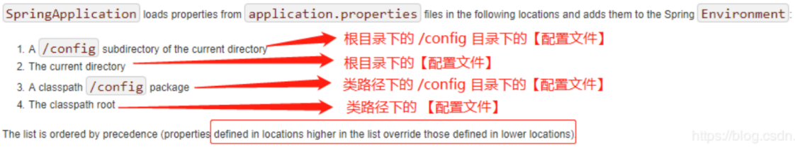
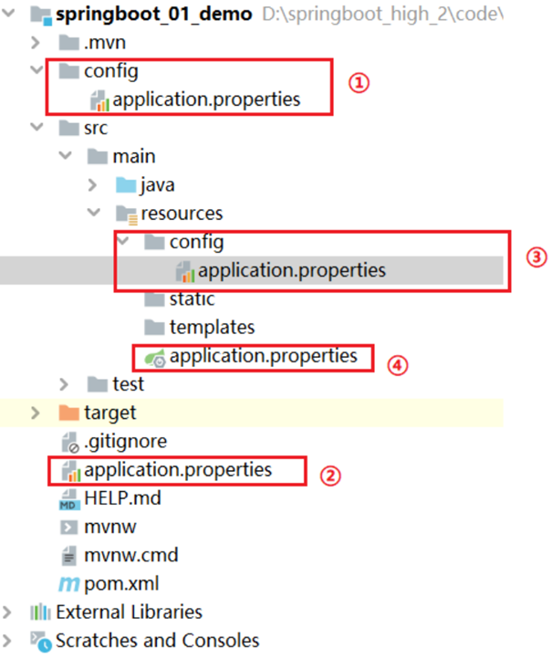

第一部分 SpringBoot应用回顾

# 1 约定优于配置

概念：约定优于配置（Convention over Configuration），又称为约定编程，是一种软件设计规范。本质上是对系统、类库或者框架中一些东西假定一个大众化合理的默认值（缺省值）。


# 2 SpringBoot概念

## 2.1 什么是 SpringBoot

spring官方网站：[https://spring.io/projects/spring-boot](https://spring.io/projects/spring-boot)


*通过 Spring Boot，可以轻松地创建独立的，基于生产级别的 Spring 的应用程序，并且可以 运行 它们*。

其实 Spring Boot 的设计是为了让你尽快的跑起来 Spring 应用程序并且尽可能减少你的配置文件。

**以下内容来自百度百科**

> SpringBoot是由Pivotal团队在2013年开始研发，2014年4月发布第一个版本的全新开源的轻量级框架。它基于Spring4.0设计，不仅继承了Spring框架原有的优秀特性，而且还通过简化配置来进一步简化了Spring应用的整个搭建和开发过程，另外SpringBoot通过集成大量的框架使得依赖包的版本冲突，以及引用的不稳定性等问题得到了很好的解决。


## 2.2 SpringBoot主要特性

1. SpringBoot Starter：它将常用的依赖分组进行了整合，将其合并到一个依赖中，这样就可以一次性添加到项目的Maven或Gradle构建中；
2. 使编码变得简单，SpringBoot采用 JavaConfig 的方式对Spring进行配置，并且提供了大量的注解，极大的提高了工作效率。
3. 自动配置：SpringBoot的自动配置特性利用了Spring对条件化配置的支持，合理的推测应用所需的bean并自动化配置它们；
4. 使部署变得简单，SpringBoot内置了三种Servlet容器，Tomcat，Jetty，undertow。我们只需要一个Java的运行环境就可以跑SpringBoot的项目了，SpringBoot的项目可以打成一个jar包。

# 3 SpringBoot 案例实现

## 3.1 案例实现

**案例需求**：使用Spring Initializr 方式构建 Spring Boot 项目，并请求 Controller 中的目标方法，将返回值相应到页面。

**1 使用Spring Initializr方式构建Spring Boot项目**

本质上说，Spring Initializr 是一个Web应用，它提供了一个基本的项目结构，能够帮助我们快速构建一个基础的Spring Boot项目。


Project SDK 用于设置创建项目使用的JDK版本，这里，使用 JDK 11；在 Choose Initializr Service URL（选择初始化服务地址）下使用默认的初始化服务地址 https://start.spring.io/，进行Spring Boot项目创建（注意使用快捷方式创建Spring Boot现目时，所在主机必须在联网状态下）


SpringBoot项目就创建好了，创建好的Spring Boot项目结构如图：


使用Spring Initializr方式构建的Spring Boot会默认生成项目的启动类，存放前端静态资源和页面的文件夹、编写项目配置的配置文件以及进行项目单元测试的测试类。

**2 创建Controller**

com.turbo包下创建名为 controller 的包，在该包下创建一个请求处理控制类 DemoController，并编写一个请求处理方法。

```java
@RestController // 该注解为组合注解，等同于Spring中 @Controller + @ResponseBody 注解
public class DemoController {

    @RequestMapping("/hello")
    public String demo(){
        return "hello spring boot";
    }
}
```

**3 运行项目**

运行主程序启动类：SpringbootDemoApplication，项目启动成功后，在控制台上会发现 Spring Boot 项目默认启动的端口号为 8080，此时，可以在浏览器上访问 ：http://localhost:8080/hello


至此，构建Spring Boot项目就完成了

**附：解决中文乱码：**

解决方法一：

```java
@RequestMapping(produces = "application/json;charset=utf-8")
```

解决方法二：

```properties
#设置响应为 utf-8，（高版本的SpringBoot已经弃用）
spring.http.encoding.force-response=true
```

## 3.2 疑问

1. starter是什么？我们如何去使用这些starter？
2. 为什么包扫描只会扫描核心启动类所在的包及其子包？
3. 在SpringBoot启动的过程中，是如何完成自动装配的？
4. 内嵌Tomcat是如何被创建及启动的？
5. 使用了web场景对应的starter，springmvc是如何自动装配？

在源码剖析部分，解答以上疑问。


# 4 热部署

spring开发团队带来一个插件：spring-boot-devtools，很好的解决了本地验证缓慢的问题。

## 4.1 热部署实现演示

https://docs.spring.io/spring-boot/docs/current/reference/html/using.html#using.devtools

1. **添加spring-boot-devtools热部署依赖启动器**

   在Spring Boot项目进行热部署测试之前，需要现在项目的pom.xml文件中添加 spring-boot-devtools热部署依赖启动器：

   ```xml
   <!-- 引入热部署依赖 -->
   <dependency>
       <groupId>org.springframework.boot</groupId>
       <artifactId>spring-boot-devtools</artifactId>
       <version>2.4.2</version>
   </dependency>
   ```

   由于使用的是IDEA开发工具，添加热部署以来后可能没有任何效果，接下来还需要针对IDEA开发工具进行热部署相关的功能设置

2. **IDEA工具热部署设置**

   

   在项目任意页面使用组合快捷键 “Ctrl+Shift+Alt+/”，打开 Registry 页面，

   

   列表中找到“complier.automake.allow.when.app.running”，将该选项后的Value值勾选，用于指定 IDEA 工具在程序运行过程中自动编译，最后单击【Close】按钮完成设置。

3. **热部署效果测试**

   启动服务，http://localhost:8080/hello

   

   接下来，在不关闭当前项目的情况下，将DemoController类中的请求处理方法 demo() 的返回值修改为 "你好 spring boot"，查看控制台信息会发现项目能够自动构建和编译，说明热部署生效。

   

## 4.2 热部署原理分析

该原理其实很好说明，就是我们编辑器上启动项目，然后改动相关的代码，然后编辑器自动触发替换掉历史的 .class 文件后，项目检测到有文件变更后会重启 spring-boot 项目。

可以看官网的触发描述：

[SpringBoot Automatic Restart](https://docs.spring.io/spring-boot/docs/current/reference/html/using.html#using.devtools.restart)



可以看到，我们引入插件后，插件后监控我们classpath 的资源变化，当classpath 发生变化后，会触发重启。





这里提到了，该插件重启快速的原因：这里对类加载器采用了两种类加载器，对于第三方 jar 包 采用 base-classloader 来加载，对于开发人员自己开发的代码则使用 restartClassLoader 来进行加载，这使得比停掉服务重启要快的多，因为使用插件只是重启开发人员编写的代码部分。

做个简单的验证：

```java
package com.turbo.config;

import org.slf4j.Logger;
import org.slf4j.LoggerFactory;
import org.springframework.beans.factory.InitializingBean;
import org.springframework.stereotype.Component;
import org.springframework.web.servlet.DispatcherServlet;

@Component
public class Devtools implements InitializingBean {

    private static final Logger log = LoggerFactory.getLogger(Devtools.class);

    @Override
    public void afterPropertiesSet() throws Exception {
        log.info("guava-jar classLoader:" + DispatcDisherServlet.class.getClassLoader().toString());
        log.info("Devtools classLoader:" + this.getClass().getClassLoader().toString());
    }
}
```

先去掉 spring-boot-devtools 插件，跑一下工程：


可以看到，DispatcDisherServlet（第三方jar包）和 Devtools（自己编写的类）使用的都是 AppClassLoader 加载的。

现在加上插件，然后执行下代码 ：



发现第三方的 jar 包的类加载器缺失是使用的系统的类加载器，而我们自己写的代码的类加载器为 RestartClassLoader，并且每次重启，类加载器的实例都会改变，即 Devtools.jar 文件会被修改。


## 4.3 排除资源

[Excluding Resource](https://docs.spring.io/spring-boot/docs/current/reference/html/using.html#using.devtools.restart.excluding-resources)

某些资源在更改后不一定需要触发重新启动。例如 Thymeleaf 模板可以就地编辑。改变 `/META-INF/maven`, `/META-INF/resources`, `/resources`, `/static`, `/public`, or `/templates`  不需要重新启动，但会触发重新启动。如果要自定义这些排除项，则可以使用该`spring.devtools.restart.exclude`属性。例如，仅排除 `/static`，`/public` 你可以设置以下属性：

```properties
spring.devtools.restart.exclude=static/**,public/**
```


# 5 全局配置文件

## 5.1 全局配置文件概述及优先级

全局配置文件能够对一些默认配置值进行修改及自定义配置。

Spring Boot 使用一个 application.properties 或者 application.yaml 的文件作为全局配置文件：



也可以从 ConfigFileApplicationListener 这个类中看出，其中 DEFAULT_SEARCH_LOCATIONS 属性设置了加载目录：


翻译成文件系统：

```xml
-file:./config/
-file:./
-classpath:/config/
-classpath:/
```

翻译成语言如下（`按照优先级从高到低`）：

1. 先到项目根目录寻找 config 文件下找配置文件
2. 再去根目录下找配置文件
3. 去 resources 下找 config 文件夹下找配置文件
4. 去 resources 下找配置文件



整个设计非常巧妙。SpringBoot会从这四个位置全部加载主配置文件，如果高优先级中配置文件属性 与 低优先级配置文件不冲突的属性，则会共同存在-`互补配置`。

SpringBoot会加载全部主配置文件；互补配置；

```html
备注：
这里说的配置文件，都还是在项目里面。最终都会被打进 jar 包，需要注意。

```

如果我们的配置文件名字不叫 application.properties 或者 application.yml 可以通过以下参数来指定配置文件的名字，myproject是配置文件名（配置文件在项目中）

```bash
$ java -jar myproject.jar --spring.config.name=myproject
```

同时可以其他位置的配置文件来生效，指定配置文件和默认加载的这些配置文件共同起作用形成互补配置。

```bash
java -jar run-0.0.1-SNAPSHOT.jar --spring.config.location=D:/application.properties
```

**知识补充**

SpringBoot不同版本之间 properties 和 yml 的优先级有所不同。

## 5.2 application.properties配置文件

使用Spring Initializr 方式构建 SpringBoot项目时，会在 resources 目录下自动生成一个空的

## 5.3 application.yml配置文件

# 6 属性注入

# 7 SpringBoot日志框架