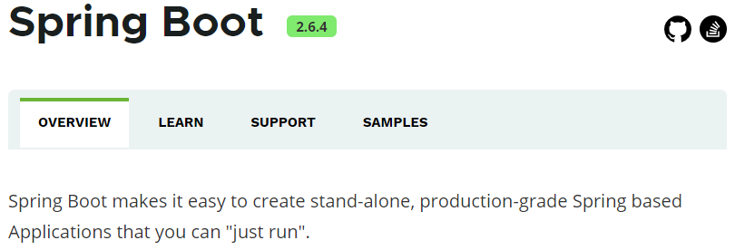

第一部分 SpringBoot应用回顾

# 1 约定优于配置

概念：约定优于配置（Convention over Configuration），又称为约定编程，是一种软件设计规范。本质上是对系统、类库或者框架中一些东西假定一个大众化合理的默认值（缺省值）。

# 2 SpringBoot概念

## 2.1 什么是 SpringBoot

spring官方网站：[https://spring.io/projects/spring-boot](https://spring.io/projects/spring-boot)

*通过 Spring Boot，可以轻松地创建独立的，基于生产级别的 Spring 的应用程序，并且可以 运行 它们*。

其实 Spring Boot 的设计是为了让你尽快的跑起来 Spring 应用程序并且尽可能减少你的配置文件。

**以下内容来自百度百科**

> SpringBoot是由Pivotal团队在2013年开始研发，2014年4月发布第一个版本的全新开源的轻量级框架。它基于Spring4.0设计，不仅继承了Spring框架原有的优秀特性，而且还通过简化配置来进一步简化了Spring应用的整个搭建和开发过程，另外SpringBoot通过集成大量的框架使得依赖包的版本冲突，以及引用的不稳定性等问题得到了很好的解决。

## 2.2 SpringBoot主要特性

1. SpringBoot Starter：它将常用的依赖分组进行了整合，将其合并到一个依赖中，这样就可以一次性添加到项目的Maven或Gradle构建中；
2. 使编码变得简单，SpringBoot采用 JavaConfig 的方式对Spring进行配置，并且提供了大量的注解，极大的提高了工作效率。
3. 自动配置：SpringBoot的自动配置特性利用了Spring对条件化配置的支持，合理的推测应用所需的bean并自动化配置它们；
4. 使部署变得简单，SpringBoot内置了三种Servlet容器，Tomcat，Jetty，undertow。我们只需要一个Java的运行环境就可以跑SpringBoot的项目了，SpringBoot的项目可以打成一个jar包。

# 3 SpringBoot 案例实现

## 3.1 案例实现

**案例需求**：使用Spring Initializr 方式构建 Spring Boot 项目，并请求 Controller 中的目标方法，将返回值相应到页面。

**使用Spring Initializr方式构建Spring Boot项目**

本质上说，Spring Initializr 是一个Web应用，它提供了一个基本的项目结构，能够帮助我们快速构建一个基础的Spring Boot项目。

# 4 热部署

# 5 全局配置文件

# 6 属性注入

# 7 SpringBoot日志框架