第一部分 SpringBoot应用回顾

# 1 约定优于配置

概念：约定优于配置（Convention over Configuration），又称为约定编程，是一种软件设计规范。本质上是对系统、类库或者框架中一些东西假定一个大众化合理的默认值（缺省值）。


# 2 SpringBoot概念

## 2.1 什么是 SpringBoot

spring官方网站：[https://spring.io/projects/spring-boot](https://spring.io/projects/spring-boot)


*通过 Spring Boot，可以轻松地创建独立的，基于生产级别的 Spring 的应用程序，并且可以 运行 它们*。

其实 Spring Boot 的设计是为了让你尽快的跑起来 Spring 应用程序并且尽可能减少你的配置文件。

**以下内容来自百度百科**

> SpringBoot是由Pivotal团队在2013年开始研发，2014年4月发布第一个版本的全新开源的轻量级框架。它基于Spring4.0设计，不仅继承了Spring框架原有的优秀特性，而且还通过简化配置来进一步简化了Spring应用的整个搭建和开发过程，另外SpringBoot通过集成大量的框架使得依赖包的版本冲突，以及引用的不稳定性等问题得到了很好的解决。


## 2.2 SpringBoot主要特性

1. SpringBoot Starter：它将常用的依赖分组进行了整合，将其合并到一个依赖中，这样就可以一次性添加到项目的Maven或Gradle构建中；
2. 使编码变得简单，SpringBoot采用 JavaConfig 的方式对Spring进行配置，并且提供了大量的注解，极大的提高了工作效率。
3. 自动配置：SpringBoot的自动配置特性利用了Spring对条件化配置的支持，合理的推测应用所需的bean并自动化配置它们；
4. 使部署变得简单，SpringBoot内置了三种Servlet容器，Tomcat，Jetty，undertow。我们只需要一个Java的运行环境就可以跑SpringBoot的项目了，SpringBoot的项目可以打成一个jar包。

# 3 SpringBoot 案例实现

## 3.1 案例实现

**案例需求**：使用Spring Initializr 方式构建 Spring Boot 项目，并请求 Controller 中的目标方法，将返回值相应到页面。

**1 使用Spring Initializr方式构建Spring Boot项目**

本质上说，Spring Initializr 是一个Web应用，它提供了一个基本的项目结构，能够帮助我们快速构建一个基础的Spring Boot项目。


Project SDK 用于设置创建项目使用的JDK版本，这里，使用 JDK 11；在 Choose Initializr Service URL（选择初始化服务地址）下使用默认的初始化服务地址 https://start.spring.io/，进行Spring Boot项目创建（注意使用快捷方式创建Spring Boot现目时，所在主机必须在联网状态下）


SpringBoot项目就创建好了，创建好的Spring Boot项目结构如图：


使用Spring Initializr方式构建的Spring Boot会默认生成项目的启动类，存放前端静态资源和页面的文件夹、编写项目配置的配置文件以及进行项目单元测试的测试类。

**2 创建Controller**

com.turbo包下创建名为 controller 的包，在该包下创建一个请求处理控制类 DemoController，并编写一个请求处理方法。

```java
@RestController // 该注解为组合注解，等同于Spring中 @Controller + @ResponseBody 注解
public class DemoController {

    @RequestMapping("/hello")
    public String demo(){
        return "hello spring boot";
    }
}
```

**3 运行项目**

运行主程序启动类：SpringbootDemoApplication，项目启动成功后，在控制台上会发现 Spring Boot 项目默认启动的端口号为 8080，此时，可以在浏览器上访问 ：http://localhost:8080/hello


至此，构建Spring Boot项目就完成了

**附：解决中文乱码：**

解决方法一：

```java
@RequestMapping(produces = "application/json;charset=utf-8")
```

解决方法二：

```properties
#设置响应为 utf-8，（高版本的SpringBoot已经弃用）
spring.http.encoding.force-response=true
```

## 3.2 疑问

1. starter是什么？我们如何去使用这些starter？
2. 为什么包扫描只会扫描核心启动类所在的包及其子包？
3. 在SpringBoot启动的过程中，是如何完成自动装配的？
4. 内嵌Tomcat是如何被创建及启动的？
5. 使用了web场景对应的starter，springmvc是如何自动装配？

在源码剖析部分，解答以上疑问。


# 4 热部署

spring开发团队带来一个插件：spring-boot-devtools，很好的解决了本地验证缓慢的问题。

## 4.1 热部署实现演示

https://docs.spring.io/spring-boot/docs/current/reference/html/using.html#using.devtools

1. **添加spring-boot-devtools热部署依赖启动器**

   在Spring Boot项目进行热部署测试之前，需要现在项目的pom.xml文件中添加 spring-boot-devtools热部署依赖启动器：

   ```xml
   <!-- 引入热部署依赖 -->
   <dependency>
       <groupId>org.springframework.boot</groupId>
       <artifactId>spring-boot-devtools</artifactId>
       <version>2.4.2</version>
   </dependency>
   ```

   由于使用的是IDEA开发工具，添加热部署以来后可能没有任何效果，接下来还需要针对IDEA开发工具进行热部署相关的功能设置

2. **IDEA工具热部署设置**

   

   在项目任意页面使用组合快捷键 “Ctrl+Shift+Alt+/”，打开 Registry 页面，

   

   列表中找到“complier.automake.allow.when.app.running”，将该选项后的Value值勾选，用于指定 IDEA 工具在程序运行过程中自动编译，最后单击【Close】按钮完成设置。

3. **热部署效果测试**

   启动服务，http://localhost:8080/hello

   

   接下来，在不关闭当前项目的情况下，将DemoController类中的请求处理方法 demo() 的返回值修改为 "你好 spring boot"，查看控制台信息会发现项目能够自动构建和编译，说明热部署生效。

   

## 4.2 热部署原理分析

该原理其实很好说明，就是我们编辑器上启动项目，然后改动相关的代码，然后编辑器自动触发替换掉历史的 .class 文件后，项目检测到有文件变更后会重启 spring-boot 项目。

可以看官网的触发描述：

[SpringBoot Automatic Restart](https://docs.spring.io/spring-boot/docs/current/reference/html/using.html#using.devtools.restart)


可以看到，我们引入插件后，插件后监控我们classpath 的资源变化，当classpath 发生变化后，会触发重启。


这里提到了，该插件重启快速的原因：这里对类加载器采用了两种类加载器，对于第三方 jar 包 采用 base-classloader 来加载，对于开发人员自己开发的代码则使用 restartClassLoader 来进行加载，这使得比停掉服务重启要快的多，因为使用插件只是重启开发人员编写的代码部分。

做个简单的验证：

```java
package com.turbo.config;

import org.slf4j.Logger;
import org.slf4j.LoggerFactory;
import org.springframework.beans.factory.InitializingBean;
import org.springframework.stereotype.Component;
import org.springframework.web.servlet.DispatcherServlet;

@Component
public class Devtools implements InitializingBean {

    private static final Logger log = LoggerFactory.getLogger(Devtools.class);

    @Override
    public void afterPropertiesSet() throws Exception {
        log.info("guava-jar classLoader:" + DispatcDisherServlet.class.getClassLoader().toString());
        log.info("Devtools classLoader:" + this.getClass().getClassLoader().toString());
    }
}
```

先去掉 spring-boot-devtools 插件，跑一下工程：


可以看到，DispatcDisherServlet（第三方jar包）和 Devtools（自己编写的类）使用的都是 AppClassLoader 加载的。

现在加上插件，然后执行下代码 ：


发现第三方的 jar 包的类加载器缺失是使用的系统的类加载器，而我们自己写的代码的类加载器为 RestartClassLoader，并且每次重启，类加载器的实例都会改变，即 Devtools.jar 文件会被修改。


## 4.3 排除资源

[Excluding Resource](https://docs.spring.io/spring-boot/docs/current/reference/html/using.html#using.devtools.restart.excluding-resources)

某些资源在更改后不一定需要触发重新启动。例如 Thymeleaf 模板可以就地编辑。改变 `/META-INF/maven`, `/META-INF/resources`, `/resources`, `/static`, `/public`, or `/templates`  不需要重新启动，但会触发重新启动。如果要自定义这些排除项，则可以使用该`spring.devtools.restart.exclude`属性。例如，仅排除 `/static`，`/public` 你可以设置以下属性：

```properties
spring.devtools.restart.exclude=static/**,public/**
```


# 5 全局配置文件

## 5.1 全局配置文件概述及优先级

全局配置文件能够对一些默认配置值进行修改及自定义配置。

Spring Boot 使用一个 application.properties 或者 application.yaml 的文件作为全局配置文件：


也可以从 ConfigFileApplicationListener 这个类中看出，其中 DEFAULT_SEARCH_LOCATIONS 属性设置了加载目录：

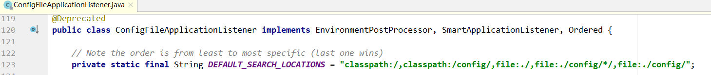

翻译成文件系统：

```xml
-file:./config/
-file:./
-classpath:/config/
-classpath:/
```

翻译成语言如下（`按照优先级从高到低`）：

1. 先到项目根目录寻找 config 文件下找配置文件
2. 再去根目录下找配置文件
3. 去 resources 下找 config 文件夹下找配置文件
4. 去 resources 下找配置文件


整个设计非常巧妙。SpringBoot会从这四个位置全部加载主配置文件，如果高优先级中配置文件属性 与 低优先级配置文件不冲突的属性，则会共同存在-`互补配置`。

SpringBoot会加载全部主配置文件；互补配置；

```html
备注：
这里说的配置文件，都还是在项目里面。最终都会被打进 jar 包，需要注意。

1、如果同一个目录下，有application.yml也有application.properties，默认先读取 application.properties。
2、如果同一个配置属性，在多个配置文件都配置了，默认使用第1个读取到的，后面读取的不覆盖前面读取到的。
3、创建SpringBoot项目时，一般的配置文件放置在“项目的resources目录下”
```

如果我们的配置文件名字不叫 application.properties 或者 application.yml 可以通过以下参数来指定配置文件的名字，myproject是配置文件名（配置文件在项目中）

```bash
$ java -jar myproject.jar --spring.config.name=myproject
```

同时可以其他位置的配置文件来生效，指定配置文件和默认加载的这些配置文件共同起作用形成互补配置。

```bash
java -jar run-0.0.1-SNAPSHOT.jar --spring.config.location=D:/application.properties
```

**知识补充**

SpringBoot不同版本之间 properties 和 yml 的优先级有所不同。


Spring Boot 2.4 改进了处理 application.properties 和 application.yml 配置文件的方式，

如果是2.4.0之前版本，优先级properties>yaml

但是如果是2.4.0的版本，优先级yaml>properties

如果想继续使用 Spring Boot 2.3 的配置逻辑，也可以通过在 application.properties 或者 application.yml 配置文件中添加以下参数：

```properties
spring.config.use-legacy-processing = true
```

目前 测试 2.4.5 中properties优先级高。


## 5.2 application.properties配置文件

使用Spring Initializr 方式构建 SpringBoot项目时，会在 resources 目录下自动生成一个空的application.properties文件，Spring Boot项目启动时会自动加载 application.properties文件。

可以在application.properties文件中定义 Spring Boot 项目的相关属性，当然，这些相关属性可以是 系统属性、环境变量、命令参数等信息，也可以是自定义配置文件名称和位置

**演示**

预先准备两个实体类文件，后续会演示将 application.properties 配置文件中的自定义配置属性注入到 Person实体类的对应属性中

1. 先在项目的 com.turbo 包下创建一个 pojo 包，并在该包下创建两个实体类 Pet 和 Person

   ```java
   @Data
   public class Pet {
       private String type;
       private String name;
   }
   ```

   ```java
   @Data
   @Component // 用于将Person类作为 Bean 注入到 Spring 容器中
   @ConfigurationProperties(prefix = "person") // 将配置文件中以 person开头的属性注入到该类中
   public class Person {
       
       private String name;    
       private List hobby;   
       private String[] family; 
       private Map map;    
       private Pet pet;
   }
   ```

   @ConfigurationProperties(prefix = "person") 注解的作用是将 配置文件中 以 person 开头的属性值通过 setXX() 方法注入到实体类对应属性中

   @Component 注解的作用是将当前注入属性值的 Person 类对象作为 Bean 组件放到 Spring 容器中，只有这样才能被 @ConfigurationProperties 注解进行赋值

2. 在application.properties 配置文件中编写需要 对 Person 类设置的配置属性

   ```properties
   person.id=1
   person.name=turbo
   person.hobby=eat,sleep,唱歌
   person.family=father,mother
   person.map.k1=v1
   person.map.k2=v2
   person.pet.type=dog
   person.pet.name=wangwang
   ```

   

   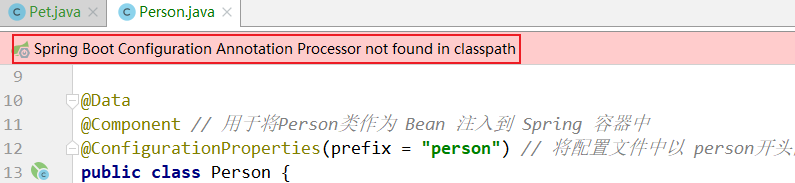

   编写application.properties配置文件时，由于要配置的Person对象属性是自定义的，SpringBoot无法自动识别，所以不会有任何提示。在实际开发中，使用@ConfigurationProperties  注解进行配置文件属性值注入时，可以在 pom.xml 文件中添加一个 Spring Boot 提供的配置处理器依赖：

   ```xml
   <dependency>
       <groupId>org.springframework.boot</groupId>
       <artifactId>spring-boot-configuration-processor</artifactId>
       <optional>true</optional>
   </dependency>
   ```

   在 pom.xml 中添加上述配置依赖后，还需要重新运行项目启动类或者使用 【Ctrl+F9】重构当前SpringBoot项目方可生效。

3. 查看 application.properties 配置文件是否正确，同时查看属性配置效果，编写测试类，在测试类中引入 Person 实体类 Bean ，并打印。

   ```java
   @SpringBootTest // 标记为 Spring Boot 单元测试类，并加载项目的 ApplicationContext 上下文
   @RunWith(SpringRunner.class) // 测试启动器，并加载 Spring Boot 测试注解
   class SpringbootDemoApplicationTests {
   
       @Autowired
       private Person person;
   
       @Test
       void contextLoads() {
           System.out.println(person);
       }
   }
   ```

   打印结果

   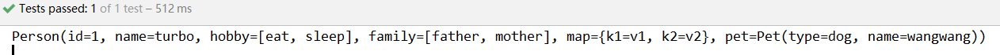

   

## 5.3 application.yml配置文件

YAML文件格式是Spring Boot 支持的一种 JSON 超级文件格式，以数据为中心，比properties、xml 等更适合做配置文件

```
- yml和xml 相比，少了一些结构化的代码，使得数据更直接
- 相比 properties 文件更简洁
- YAML 文件的扩展名可以使用 .yml 或者 .yaml
- application.yml 文件使用 "key:(空格)value" 格式配置属性，使用缩进控制层级关系
```

这里针对不同数据类型的属性值，介绍 YAML

1. value值为普通数据类型（例如数字、字符串、布尔等）

   可以直接配置对应的属性值，同时对于字符串类型的属性值，不需要额外添加引号，如下：

   ```yaml
   server:
     port: 8080
     servlet:
       context-path: /hello
   ```

2. value 值为数组和单列集合

   主要有两种书写方式：缩进式和行内式写法。

   其中缩进式有两种形式，如下：

   ```yaml
   person:
     hobby:
       - play
       - read
       - sleep
   ```

   或者

   ```yaml
   person:
     hobby:
       play,
       read,
       sleep
   ```

   其中一种形式为 “-(空格)属性值” ，另一种形式为 多个属性值之后加英文分割（注意最后一个不要加逗号）。

   ```yaml
   person:
     hobby: [play,read,sleep]
   # 或
   person:
     hobby: play,read,sleep
   ```

3. value值为Map集合和对象

   两种书写方式：缩进式和行内式

   其中缩进式：

   ```yaml
   person:
     map:
       k1: v1
       k2: v2
   ```

   行内式：

   ```yaml
   person:
     map: {k1: v1,k2: v2}
   ```

   行内式写法的属性必须要用 大括号 "{}" 包含

4. 测试，编写application.yaml配置文件，编写 Person 类设置的配置属性

   ```yaml
   person:
     id: 1
     name: lily
     hobby: [sleep,read,sing]
     family: [father,mother]
     map: {k1: v1,k2: v2}
     pet: {type: dog,name: Cligao}
   ```

   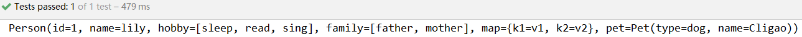

# 6 属性注入

使用Spring Boot全局配置文件设置属性时：

如果配置属性是 Spring Boot 已有属性，例如服务端口 server.port，那么SpringBoot内部会自动扫描并读取这些配置文件中的属性值并覆盖默认属性。

如果配置的属性是用户自定义属性，还必须在程序中注入这些配置属性方可生效。

## 6.1 属性注入常用注解

@Configuration：声明一个类作为配置类

@Bean：声明在方法上，将方法的返回值加入 Bean 容器

@Value：属性注入

@ConfigurationProperties(prefix="person")：批量属性注入

@PropertySource("classpath:/jdbc.properties")：指定外部属性文件，在类上添加

## 6.2 @Value属性值注入

1. 引入数据源连接池依赖

   ```xml
   <dependency>
       <groupId>com.github.drtrang</groupId>
       <artifactId>druid-spring-boot2-starter</artifactId>
       <version>1.1.10</version>
   </dependency>
   ```

2. application.properties添加信息

   ```properties
   jdbc.driverClassName=com.mysql.jdbc.Driver
   jdbc.url=jdbc:mysql://127.0.0.1:3306/springboot_h
   jdbc.username=root
   jdbc.password=123
   ```
   
3. 配置数据源

   创建JdbcConfiguration类：使用Spring中的`@Value`注解对每个属性进行注入，用`@Bean`注解将返回值添加到容器中

   ```java
   package com.turbo.config;
   
   import com.alibaba.druid.pool.DruidDataSource;
   import org.springframework.beans.factory.annotation.Value;
   import org.springframework.context.annotation.Bean;
   import org.springframework.context.annotation.Configuration;
   
   import javax.sql.DataSource;
   
   @Configuration
   public class JdbcConfiguration {
   
       @Value("${jdbc.url}")
       private String url;
   
       @Value("${jdbc.driverClassName}")
       private String driverClassName;
   
       @Value("${jdbc.username}")
       private String username;
   
       @Value("${jdbc.password}")
       private String password;
   
       @Bean
       public DataSource dataSource(){
           DruidDataSource dataSource = new DruidDataSource();
           dataSource.setDriverClassName(driverClassName);
           dataSource.setUrl(url);
           dataSource.setUsername(username);
           dataSource.setPassword(password);
           return dataSource;
       }
   
       @Override
       public String toString() {
           return "JdbcConfiguration{" +
                   "url='" + url + '\'' +
                   ", driverClassName='" + driverClassName + '\'' +
                   ", username='" + username + '\'' +
                   ", password='" + password + '\'' +
                   '}';
       }
   }
   ```

4. 测试方法

   ```java
   @Autowired
   private JdbcConfiguration jdbcConfiguration;
   
   @Autowired
   private DataSource dataSource;
   
   @Test
   public void test1(){
       System.out.println(jdbcConfiguration);
       System.out.println(dataSource);
   }
   ```

   

## 6.3 @ConfigurationProperties 批量注入

**新建`JdbcProperties`，用来属性注入**。

```java
@ConfigurationProperties(prefix = "jdbc")
@Data
public class JdbcProperties {

    private String url;
    private String driverClassName;
    private String username;
    private String password;
}
```

有警告：

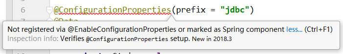

`@EnableConfigurationProperties` 是 Spring Boot 提供的一个注解，使用该注解用于启用应用对另外一个注解 `@ConfigurationProperties`的支持，用于设置一组使用了`@ConfigurationProperties` 的类，用于作为`bean`定义到容器中。

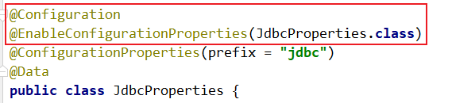

**application.properties添加信息**

```properties
jdbc.driverClassName=com.mysql.jdbc.Driver
jdbc.url=jdbc:mysql://127.0.0.1:3306/springboot_h
jdbc.username=root
jdbc.password=123
```

注意：将配置信息添加到这里，通过前缀进行区分，进行引用

**查看效果**

```java
@Autowired
private JdbcProperties jdbcProperties;

@Test
public void test2(){
    System.out.println(jdbcProperties);
}
```

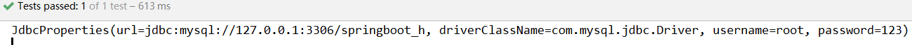

## 6.4 第三方配置

除了`@ConfigurationProperties` 用于注释类之外，还可以在公共`@Bean`方法上使用它。当要将属性绑定到控件之外的第三方组件时，这样做特别有用。

创建一个其他组件类

```java
package com.turbo.pojo;

import lombok.Data;
import java.net.InetAddress;

@Data
public class AnotherComponent {
    private boolean enabled;
    private InetAddress remoteAddress;
}
```

创建MyService

```java
package com.turbo.config;

import com.turbo.pojo.AnotherComponent;
import org.springframework.boot.context.properties.ConfigurationProperties;
import org.springframework.context.annotation.Bean;
import org.springframework.context.annotation.Configuration;

@Configuration
public class MyService {

    @Bean
    @ConfigurationProperties(prefix = "another")
    public AnotherComponent anotherComponent(){
        return new AnotherComponent();
    }
}
```

配置文件

```properties
another.enabled=true
another.remoteAddress=192.168.31.1
```

测试：

```java
@Autowired
private AnotherComponent anotherComponent;

@Test
public void test3(){
    System.out.println(anotherComponent);
}
```

通过测试可以获得 AnotherComponent 组件的实例对象

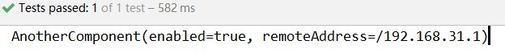

## 6.5 松散绑定

Spring Boot 使用一些宽松的规则将环境属性绑定到 `@ConfigurationProperties ` bean，因此环境属性名和bean属性名称之间不需要完全匹配

例如属性类：

```java
package com.turbo.config;

import lombok.Data;
import org.springframework.boot.context.properties.ConfigurationProperties;
import org.springframework.stereotype.Component;

@Data
@Component
@ConfigurationProperties("acme.my-person.person")
public class OwnerProperties {
    private String firstName;
}
```

```yaml
acme:
  my-person:
    person:
      firstName: 千万次地问
```

| 属性文件中配置                   | 说明                         |
| -------------------------------- | ---------------------------- |
| acme.my-person.person.first-name | 羊肉串模式，默认，推荐       |
| acme.myPerson.person.firstName   | 标准驼峰模式                 |
| acme.my_person.person.first_name | 下划线模式                   |
| ACME.MYPERSON.PERSON.FIRSTNAME   | 大写，如果使用系统环境时推荐 |


## 6.6 @ConfigurationProperties vs @Value

| 特征                                                         | `@ConfigurationProperties` | `@Value`                  |
| ------------------------------------------------------------ | -------------------------- | ------------------------- |
| [宽松的绑定](https://docs.spring.io/spring-boot/docs/2.4.0/reference/html/spring-boot-features.html#boot-features-external-config-relaxed-binding) | yes                        | Limited(详见下方官网截图) |
| [元数据支持](https://docs.spring.io/spring-boot/docs/2.4.0/reference/html/appendix-configuration-metadata.html#configuration-metadata) | yes                        | no                        |
| `SpEL`表达式                                                 | no                         | yes                       |
| 应用场景                                                     | 批量属性绑定               | 单个属性绑定              |


# 7 SpringBoot日志框架

## 7.1 日志框架介绍

在项目的开发中，日志是必不可少的一个记录事件的组件，所以也会相应的在项目中实现和构建我们所需的日志框架。

常见的日志框架：JCL(最后一次更新时间：2014)、SLF4J、Jboss-logging、jUL、log4j、log4j2、logback 等等，如何选择？

通常情况下，日志是由一个抽象层 + 实现层 的组合来搭建的。（slf4j log4j logback 是同一个作者）

| 日志抽象层                                                   | 日志实现层                                         |
| ------------------------------------------------------------ | -------------------------------------------------- |
| JCL(Jakarta Commons Logging)、**SLF4J**(Simple Logging Facade for Java)、jboss-logging | jul(java.util.logging)、log4j、**logback**、log4j2 |

Spring 框架选择使用了 JCL 作为默认日志输出。而 Spring Boot 默认选择了 SLF4J 结合 LogBack。

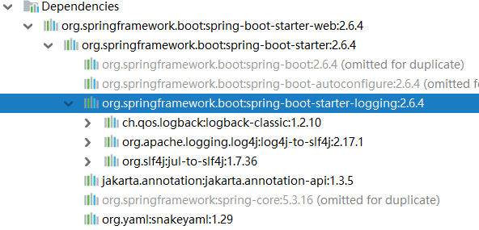

## 7.2 SLF4J 的使用

在开发的时候不应该直接使用日志实现类，应该使用日志的抽象层，具体参考[SLF4J 官方](https://www.slf4j.org/manual.html)

SLF4J 官方给出了简单示例，首先要导入 SLF4J 的jar。

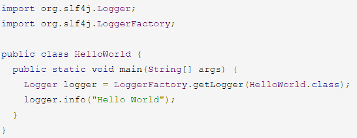

下图是 SLF4J 结合各种日志框架的官方示例，从图中可以清晰的看出 SLF4J API 永远作为日志的门面，直接应用于程序中。


注意：由于每一个日志的实现框架都有自己的配置文件，所以在使用SLF4J之后，配置文件还是要使用 ***实现日志框架的配置文件***。

## 7.3 统一日志框架的使用

遗留问题：A项目（slf4j + logback）：Spring（commons logging）、Hibernate（jboss-logging）、mybatis...

一般情况下，在项目中存在着各种不同的第三方 jar，且它们的日志选择也可能不尽相同，显然这样不利于我们使用，那么如果想为项目设置统一的日志框架怎么办？

在[SLF4J 官方]()，也给了我们参考的例子


从图中得到一种统一日志框架使用的方式，可以使用一种和要替换的日志框架类完全一样的jar进行替换，这样不至于原来的第三方 jar 报错，而这个替换的 jar 其实使用了 SLF4J API 。这样项目中的日志都可以通过 SLF4J API 结合自己的选择的 日志实现层框架进行日志输出。

**统一日志框架使用步骤归纳如下**：

1. 排除系统中的其他日志框架
2. 使用中间包替换 要替换的日志框架
3. 导入我们选择的 SLF4J 实现

## 7.4 Spring Boot 的日志关系

### 7.4.1 排除其他日志框架

根据上面总结的， 要统一日志框架的使用，第一步要排除其他日志框架，在Spring Boot 的Maven 依赖里可以清除的看到 Spring Boot 排除了其他日志框架。


### 7.4.2 统一框架引入替换包

Spring Boot 使用了 SLF4J + logback 的日志框架组合，查看 Spring Boot 项目的Maven依赖关系可以看到 Spring Boot 的核心启动器 spring-boot-starter 引入了 spring-boot-starter-logging 。

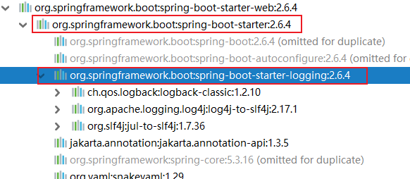

而 spring-boot-starter-logging 的 Maven 依赖主要引入了 logback-classic（包含了日志框架 Logback的实现），log4j-to-slf4j（在log4j 日志框架作者此框架时，还没有想到使用日志抽象层进行开发，因此出现了log4j 向 slf4j 转换的工具），jul-to-slf4j（java自带的日志框架转换为 slf4j）。

```xml
<dependencies>
    <dependency>
        <groupId>ch.qos.logback</groupId>
        <artifactId>logback-classic</artifactId>
        <version>1.2.10</version>
        <scope>compile</scope>
    </dependency>
    <dependency>
        <groupId>org.apache.logging.log4j</groupId>
        <artifactId>log4j-to-slf4j</artifactId>
        <version>2.17.1</version>
        <scope>compile</scope>
    </dependency>
    <dependency>
        <groupId>org.slf4j</groupId>
        <artifactId>jul-to-slf4j</artifactId>
        <version>1.7.36</version>
        <scope>compile</scope>
    </dependency>
</dependencies>
```

从上面的分析，Spring Boot 对日志框架的使用已经是清晰明了，使用IDEA 工具查看 Maven 依赖关系，可以清晰看到日志框架的引用

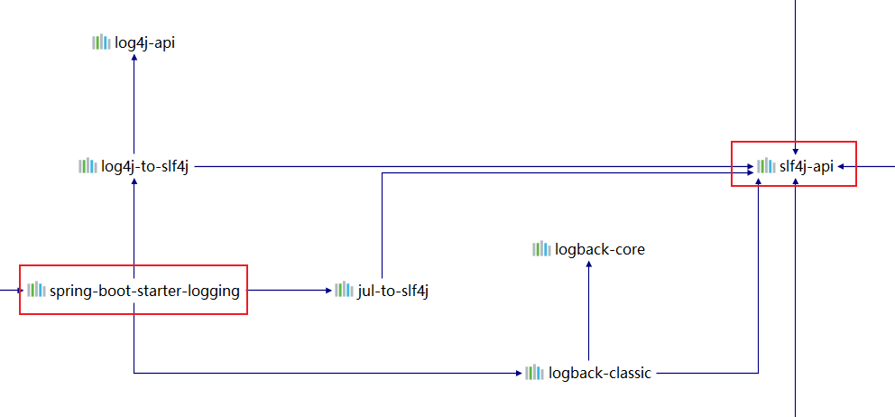

由此可见，Spring Boot 可以自动地适配日志框架，而且底层使用 SLF4J+LogBack 记录日志，如果引入其他框架，需要排除其他日志框架。

## 7.5 Spring Boot 的日志使用

**日志级别和格式**

从上面的分析，发现 Spring Boot 默认已经使用了 **SLF4J + LogBack**，所以不在进行额外操作就可以使用 **SLF4J + LogBack** 进行日志输出。

编写 Java 测试类进行测试：

```java
Logger logger = LoggerFactory.getLogger(this.getClass());

@Test
public void testLog(){
    logger.trace("trace 日志 ...");
    logger.debug("debug 日志 ...");
    logger.info("info 日志 ...");
    logger.warn("warn 日志 ...");
    logger.error("error 日志 ...");
}
```

已知 日志级别从小到大 trace < debug < info < warn < error。运行到的输出如下，由此可见 ***Spring Boot 默认日志隔离级别为 INFO***。

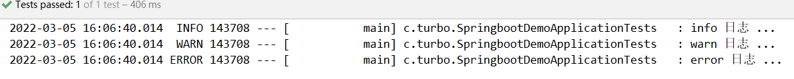

从上面的日志结合 LogBack 日志格式可以知道 Spring Boot 默认日志格式是：

```
%d{yyyy-MM-dd HH:mm:ss.SSS} [%thread] %-5level %logger{50} - %msg%n 
# %d{yyyy-MM-dd HH:mm:ss.SSS} 时间
# %thread 线程名称
# %-5level 日志级别从左显示5个字符宽度 
# %logger{50} 类名
# %msg%n 日志信息加换行
```

至于为什么 Spring Boot 的默认日子输出格式是这样？

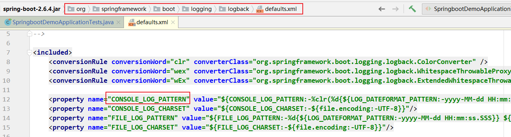

可以在 Spring Boot 的源码里找到答案。


## 7.6 自定义日志输出

可以直接在配置文件编写日志相关配置

```properties
# 日志配置
# 指定具体包的日记级别
logging.level.com.turbo = debug
# 控制台的日志输出格式
logging.pattern.console=%d{yyyy-MM-dd HH:mm:ss.SSS} [%thread] %-5level %logger{50} - %msg%n
# 日志文件输出格式
logging.pattern.file=%d{yyyy-MM-dd HH:mm:ss.SSS} [%thread] %-5level %logger{50} - %msg%n

# 日志输出路径(当前项目根目录下)
#logging.file.path=turbo
# 日志输出名字；默认spring.log
logging.file.name=turbo/turbo.log
# 日志输出到 D 盘根目录
#logging.file.name=D:/turbo.log
```

关于日志的输出路径，可以使用 logging.file.name 或者 logging.file.path进行定义。


## 7.7 替换日志框架

演示替换日志框架为 log4j2 的方式，根据 [官网](https://docs.spring.io/spring-boot/docs/current/reference/html/using-spring-boot.html#using-boot) 需要 Log4j 与 logging 二选一，因此修改 pom 如下：

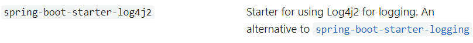

```xml
<dependency>
    <groupId>org.springframework.boot</groupId>
    <artifactId>spring-boot-starter-web</artifactId>
    <exclusions>
        <exclusion>
            <artifactId>spring-boot-starter-logging</artifactId>
            <groupId>org.springframework.boot</groupId>
        </exclusion>
    </exclusions>
</dependency>

<dependency>
    <groupId>org.springframework.boot</groupId>
    <artifactId>spring-boot-starter-log4j2</artifactId>
</dependency>
```

