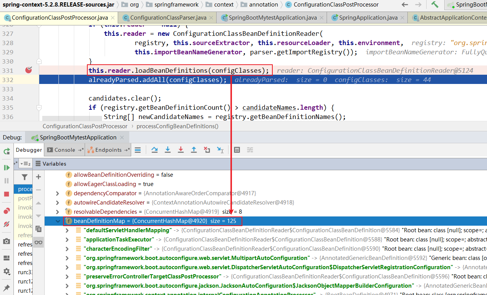
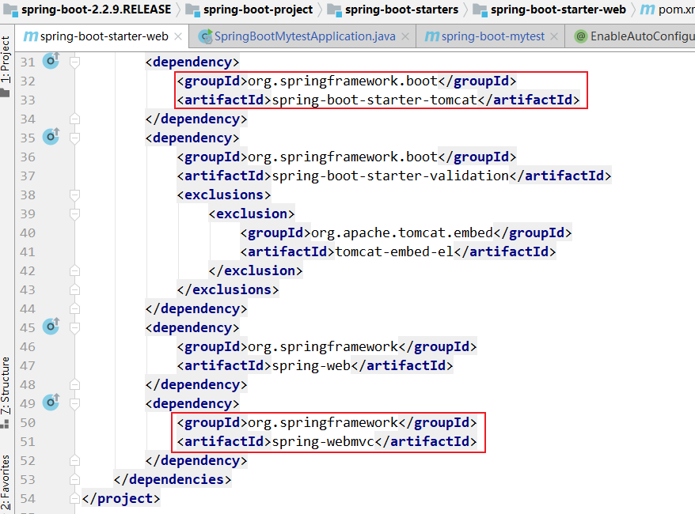

第二部分 SpringBoot源码剖析

# 1 SpringBoot源码环境构建

参考：https://blog.csdn.net/chuanchengdabing/article/details/115871178?spm=1001.2014.3001.5501

## 1.1 下载源码

下载地址：https://github.com/spring-projects/spring-boot/releases

采用 spring-boot-2.2.9.RELEASE 


## 1.2 环境准备

1. JDK 1.8 +
2. Maven 3.5 +


注意：源码不要放在中文目录下，最好使用11版本的JDK（JDK1.8一直没有成功）

## 1.3 编译源码

进入 spring-boot 源码根目录

执行 mvn 命令：

```bash
# 跳过测试用例，会下载大量jar包，时间会长一些
mvn clean install -DskipTests -Pfast
```


## 1.4 导入IDEA

将编译后的项目导入 IDEA 中


依赖加载完毕后，此时 pom 配置文件中存在错误引用，打开 pom.xml ，关闭 maven 代码检查，pom 报错消失。


在pom.xml中可能会出现 **java.lang.outofmemoryerror gc overhead limit exceeded** 的报错，修改 idea maven 的 import 的 vm 参数。


## 1.5 新建一个module


**注意**：**修改新创建的子项目的父工程为当前构建的Springboot的版本**


## 1.6 新建一个Controller

```java
package com.turbo.contorller;

import org.springframework.web.bind.annotation.RequestMapping;
import org.springframework.web.bind.annotation.RestController;

@RestController
public class TestController {

	@RequestMapping("/test")
	public String test(){
		System.out.println("源码环境构建完成，congratulations");
		return "源码环境构建完成，congratulations";
	}
}
```

启动测试


# 2 源码剖析-依赖管理

> **问题1**：为什么导入dependency时，不需要指定版本？

在Spring Boot 入门程序中，项目 pom.xml 文件有两个核心依赖，分别是 spring-boot-starter-parent 和 spring-boot-starter-web ，这两个依赖的相关介绍如下：

## 2.1 spring-boot-starter-parent

在新增module中的pom.xml文件中找到 spring-boot-starter-parent 依赖，如下：

```xml
<parent>
    <groupId>org.springframework.boot</groupId>
    <artifactId>spring-boot-starter-parent</artifactId>
    <version>2.2.9.RELEASE</version>
    <relativePath/> <!-- lookup parent from repository -->
</parent>
```

上述代码中，将 spring-boot-starter-parent 依赖作为 Spring Boot 项目的统一父项目依赖管理，并将项目版本号统一为 2.2.9.RELEASE，可根据实际开发修改。

查看 spring-boot-starter-parent 底层源文件，先看 spring-boot-starter-parent 做了哪些事

**首先看 `spring-boot-starter-parent` 的 `properties` 节点** 

```xml
<properties>
    <main.basedir>${basedir}/../../..</main.basedir>
    <java.version>1.8</java.version>
    <resource.delimiter>@</resource.delimiter> <!-- delimiter that doesn't clash with Spring ${} placeholders -->
    <project.build.sourceEncoding>UTF-8</project.build.sourceEncoding>
    <project.reporting.outputEncoding>UTF-8</project.reporting.outputEncoding>
    <maven.compiler.source>${java.version}</maven.compiler.source>
    <maven.compiler.target>${java.version}</maven.compiler.target>
</properties>
```

在这里`spring-boot-starter-parent` 定义了：

1. 工程的Java版本为`1.8`
2. 工程代码的编译源文件编码格式为 `UTF-8`
3. 工程编译后文件编码格式为`UTF-8`
4. Maven 打包编译的版本

**再来看 `spring-boot-starter-parent` 的 `build` 节点** 

接下来看 POM 的`build`节点，分别定义了 `resource` 资源 和 `pluginManagement`

```xml
<!-- Turn on filtering by default for application properties -->
<resources>
    <resource>
        <directory>${basedir}/src/main/resources</directory>
        <filtering>true</filtering>
        <includes>
            <include>**/application*.yml</include>
            <include>**/application*.yaml</include>
            <include>**/application*.properties</include>
        </includes>
    </resource>
    <resource>
        <directory>${basedir}/src/main/resources</directory>
        <excludes>
            <exclude>**/application*.yml</exclude>
            <exclude>**/application*.yaml</exclude>
            <exclude>**/application*.properties</exclude>
        </excludes>
    </resource>
</resources>
```

详细看一下`resources`节点，里面定义了资源过滤，针对`application`的 `yml`、`properties` 格式进行了过滤，可以支持不同环境的配置，比如 `application-dev.yml`、`application-test.yml`、 `application-dev.properties`、`application-test.properties`等等。

`pluginManagement`则是引入了相应的插件和对应的版本依赖


最后来看 `spring-boot-starter-parent` 的父依赖 `spring-boot-dependencies`，`spring-boot-dependencies` 的 properties 节点。

看定义POM，这个才是 SpringBoot 项目真正管理依赖的项目，里面定义了 SpringBoot 相关的版本：

```xml
<properties>
    <main.basedir>${basedir}/../..</main.basedir>
    <!-- Dependency versions -->
    <activemq.version>5.15.13</activemq.version>
    <antlr2.version>2.7.7</antlr2.version>
    <appengine-sdk.version>1.9.81</appengine-sdk.version>
    <artemis.version>2.10.1</artemis.version>
    <aspectj.version>1.9.6</aspectj.version>
    <assertj.version>3.13.2</assertj.version>
    <atomikos.version>4.0.6</atomikos.version>
    <awaitility.version>4.0.3</awaitility.version>
    <bitronix.version>2.1.4</bitronix.version>
    <byte-buddy.version>1.10.13</byte-buddy.version>
    <caffeine.version>2.8.5</caffeine.version>
    <cassandra-driver.version>3.7.2</cassandra-driver.version>
    <classmate.version>1.5.1</classmate.version>
    ...
</properties>
```

spring-boot-dependencies 的 dependencyManagement 节点，在这里，dependencies 定义了 SpringBoot 版本的依赖组件以及相应版本。

```xml
<dependencyManagement>
    <dependencies>
        <!-- Spring Boot -->
        <dependency>
            <groupId>org.springframework.boot</groupId>
            <artifactId>spring-boot</artifactId>
            <version>${revision}</version>
        </dependency>
        <dependency>
            <groupId>org.springframework.boot</groupId>
            <artifactId>spring-boot-test</artifactId>
            <version>${revision}</version>
        </dependency>
        <dependency>
            <groupId>org.springframework.boot</groupId>
            <artifactId>spring-boot-test-autoconfigure</artifactId>
            <version>${revision}</version>
        </dependency>
        <dependency>
            <groupId>org.springframework.boot</groupId>
            <artifactId>spring-boot-actuator</artifactId>
            <version>${revision}</version>
        </dependency>
        <dependency>
            <groupId>org.springframework.boot</groupId>
            <artifactId>spring-boot-actuator-autoconfigure</artifactId>
            <version>${revision}</version>
        </dependency>
        ...
	<dependencies>
</dependencyManagement>
```

`spring-boot-starter-parent`  通过继承 `spring-boot-dependencies` 从而实现了 SpringBoot 的版本依赖管理，所以我们的SpringBoot 工程继承 `spring-boot-starter-parent` 后就已经具备版本锁定等配置了，这就是在 Spring Boot 项目中 **部分依赖 不需要写版本号**的原因。

## 2.2 spring-boot-starter-web

> 问题2：spring-boot-starter-parent 父依赖启动器的主要作用是进行版本统一管理，那么项目运行依赖的JAR包是从何而来？

查看 spring-boot-starter-web 依赖文件源码，核心代码具体如下：

```xml
<dependencies>
    <dependency>
        <groupId>org.springframework.boot</groupId>
        <artifactId>spring-boot-starter</artifactId>
    </dependency>
    <dependency>
        <groupId>org.springframework.boot</groupId>
        <artifactId>spring-boot-starter-json</artifactId>
    </dependency>
    <dependency>
        <groupId>org.springframework.boot</groupId>
        <artifactId>spring-boot-starter-tomcat</artifactId>
    </dependency>
    <dependency>
        <groupId>org.springframework.boot</groupId>
        <artifactId>spring-boot-starter-validation</artifactId>
        <exclusions>
            <exclusion>
                <groupId>org.apache.tomcat.embed</groupId>
                <artifactId>tomcat-embed-el</artifactId>
            </exclusion>
        </exclusions>
    </dependency>
    <dependency>
        <groupId>org.springframework</groupId>
        <artifactId>spring-web</artifactId>
    </dependency>
    <dependency>
        <groupId>org.springframework</groupId>
        <artifactId>spring-webmvc</artifactId>
    </dependency>
</dependencies>
```

从上述代码可以发现，spring-boot-starter-web 依赖启动器的主要作用就是打包Web开发场景需要的底层所有依赖（基于依赖传递，当前项目也存在对应的依赖 jar 包）。

正是如此，在pom.xml中引入 spring-boot-starter-web 依赖启动器时，就可以实现 web 场景 开发，而不需要额外导入 Tomcat 服务器以及其他Web依赖文件等。当然这些引入的依赖文件的版本还是由 `spring-boot-starter-parent` 父依赖进行统一管理。

Spring Boot 除了提供有上述介绍的Web依赖启动器外，还提供了其他许多开发场景的相关依赖，可以 [Spring Boot 官网](https://docs.spring.io/spring-boot/docs/current/reference/html/using.html#using.build-systems.starters)，查询场景依赖启动器。


上图这些依赖启动器适用于不同的场景开发，使用时只需要在 pom.xml 文件中导入对应的依赖启动器即可。

但Spring Boot官方并不是对所有场景开发的技术框架都提供场景启动器。例如 Druid 数据源 druid-spring-boot-starter，在 pom.xml问价中引入这些第三方依赖启动器，要配置版本号。

# 3 自动配置

自动配置：根据我们添加的 jar 包依赖，会自动将一些配置类的 bean 注册进 IOC 容器，可以在需要的地方使用 @Autowired 或者 @Resource 等注解来使用。

> 问题3：Spring Boot 到底是如何进行自动配置的，都把哪些组件进行了自动配置？

Spring Boot 应用的启动入口是 @SpringBootApplication 注解标注类中的 main() 方法，`@SpringBootApplication`：Spring Boot 应用标注在某个类上，说明这个类是 Spring Boot 的主配置类，Spring Boot 就应该运行这个类的 main() 方法启动 SpringBoot 应用。


## 3.1 @SpringBootApplication

下面查看 `@SpringBootApplication` 内部源码进行分析，核心代码具体如下：

```java
@Target(ElementType.TYPE) // 注解的适用范围，Type表示注解可以描述在类、接口、注解或枚举中
@Retention(RetentionPolicy.RUNTIME) // 表示注解的声明周期，Runtime 运行时
@Documented // 表示注解可以记录在 javadoc 中
@Inherited // 表示可以被子类继承该注解
@SpringBootConfiguration // 表明该类为配置类
@EnableAutoConfiguration // 启动自动配置功能
@ComponentScan(excludeFilters = { @Filter(type = FilterType.CUSTOM, classes = TypeExcludeFilter.class),
		@Filter(type = FilterType.CUSTOM, classes = AutoConfigurationExcludeFilter.class) })
public @interface SpringBootApplication {

	// 根据class来排除特定的类，使其不能加入Spring容器，传入参数value类型是class类型
	@AliasFor(annotation = EnableAutoConfiguration.class)
	Class<?>[] exclude() default {};

	// 根据classname 来排除特定的类，使其不能加入spring容器，传入参数 value 类型是 class 的全类名字符串数组
	@AliasFor(annotation = EnableAutoConfiguration.class)
	String[] excludeName() default {};

	// 指定扫描包，参数是包名的字符串数组
	@AliasFor(annotation = ComponentScan.class, attribute = "basePackages")
	String[] scanBasePackages() default {};

	// 扫描特定的包，参数类似是Class类型数组
	@AliasFor(annotation = ComponentScan.class, attribute = "basePackageClasses")
	Class<?>[] scanBasePackageClasses() default {};
}
```

从上述源码可以看出，`@SpringBootApplication` 注解是一个组合注解，前面 4 个是注解元数据信息，主要看后面 3 个注解：@SpringBootConfiguration、@EnableAutoConfiguration、@ComponentScan  三个核心注解，下面具体说明：

## 3.2 @SpringBootConfiguration

@SpringBootConfiguration：SpringBoot 的配置类，标注在某个类上，表示这是一个 SpringBoot 的配置类。

查看 @SpringBootConfiguration 注解源码，核心代码如下：

```java
@Target(ElementType.TYPE)
@Retention(RetentionPolicy.RUNTIME)
@Documented
@Configuration // 配置类的作用等同于配置文件，配置类也是容器中的一个对象
public @interface SpringBootConfiguration {
	@AliasFor(annotation = Configuration.class)
	boolean proxyBeanMethods() default true;
}
```

从上述源码可以看出，@SpringBootConfiguration 注解内部有一个核心注解 @Configuration ，该注解是 Spring 框架提供的，表示当前类是一个配置类（XML配置文件的注解表现形式），并可以被租价扫描器扫描。由此可见，@SpringBootConfiguration 注解的作用与 @Configuration 注解相同，**都是标识一个可以被组件扫描器扫描的配置类**，只不过 @SpringBootConfiguration 是被 SpringBoot进行了重新封装命名而已。

## 3.3 @EnableAutoConfiguration

```java
@Target(ElementType.TYPE)
@Retention(RetentionPolicy.RUNTIME)
@Documented
@Inherited
// 自动配置包
// 导入的组件是 AutoConfigurationPackages.Registrar.class
@AutoConfigurationPackage 
// Spring的底层注解@Import，给容器中导入一个组件
@Import(AutoConfigurationImportSelector.class)
// 告诉SpringBoot开启自动配置功能，这样自动配置才能生效
public @interface EnableAutoConfiguration {

	String ENABLED_OVERRIDE_PROPERTY = "spring.boot.enableautoconfiguration";

	// 返回不会被导入到 Spring 容器中的类
	Class<?>[] exclude() default {};

	// 返回不会被导入到 Spring 容器中的类名
	String[] excludeName() default {};
}
```

Spring 中有很多以 `Enable` 开头的注解，其作用就是借助 `@Import` 来收集并注册特定场景相关的 `Bean`，并加载到`IOC`容器。

@EnableAutoConfiguration 就是借助 @Import 来收集所有符合自动配置条件的 bean 定义，并加载到 IoC 容器。

### 3.3.1 @AutoConfigurationPackage

```java
@Target(ElementType.TYPE)
@Retention(RetentionPolicy.RUNTIME)
@Documented
@Inherited
@Import(AutoConfigurationPackages.Registrar.class) // 导入Registrar中注册的组件
public @interface AutoConfigurationPackage {

}
```

`@AutoConfigurationPackage`：自动配置包，也是一个组合注解，其中最重要的注解是 `@Import(AutoConfigurationPackages.Registrar.class)` ，是 Spring 框架的底层注解，它的作用就是给容器中导入某个组件类，例如 `@Import(AutoConfigurationPackages.Registrar.class)` ，它就是将 `Registrar` 这个组件类导入到容器中，可查看 `Registrar` 类中 `registerBeanDefinitions` 方法：

```java
@Override
public void registerBeanDefinitions(AnnotationMetadata metadata, BeanDefinitionRegistry registry) {
    // 将注解标注的元信息传入，获取到相应的包名
    register(registry, new PackageImport(metadata).getPackageName());
}
```

对 `new PackageImport(metadata).getPackageName()` 进行检索，看其结果是什么：


再看 register 方法：

```java
public static void register(BeanDefinitionRegistry registry, String... packageNames) {
		// 这里参数 packageNames 缺省情况下就是一个字符串，是使用了注解
		// @SpringBootApplication 的 Spring Boot 应用程序入口所在的包
		if (registry.containsBeanDefinition(BEAN)) {
			// 如果该bean已经注册，则将要注册包名称添加进去
			BeanDefinition beanDefinition = registry.getBeanDefinition(BEAN);
			ConstructorArgumentValues constructorArguments = beanDefinition
                .getConstructorArgumentValues();
			constructorArguments.addIndexedArgumentValue(0, 
            	addBasePackages(constructorArguments, packageNames));
		}
		else {
			// 如果该 bean 尚未注册，则注册该bean，参数中提供的包名会被设置到 bean 定义中去
			GenericBeanDefinition beanDefinition = new GenericBeanDefinition();
			beanDefinition.setBeanClass(BasePackages.class);
            // packageNames(com.turbo) = @AutoConfigurationPackage 这个注解的类所在包路径
			beanDefinition.getConstructorArgumentValues().addIndexedArgumentValue(0, packageNames);
			beanDefinition.setRole(BeanDefinition.ROLE_INFRASTRUCTURE);
			registry.registerBeanDefinition(BEAN, beanDefinition);
		}
	}
```

AutoConfigurationPackages.Registrar 这个类就干一个事，注册一个 `Bean` ，这个 `Bean` 就是 `org.springframework.boot.autoconfigure.AutoConfigurationPackages.BasePackages`，它有一个参数，这个参数是使用了 `@AutoConfigurationPackage` 这个注解的类所在包路径，保存自动配置类以供之后的使用，比如给 `JPA entity` 扫描器用来扫描开发人员通过注解 `@Entity`定义的 `entity`类。

### 3.3.2 @Import(AutoConfigurationImportSelector.class)

`@Import(AutoConfigurationImportSelector.class)`：将 `AutoConfigurationImportSelector` 这个类导入到 Spring 容器中，`AutoConfigurationImportSelector`  可以帮助 SpringBoot 应用将所有符合条件的 `@Configuration` 配置都加载到当前 Spring Boot 创建并使用的 IOC 容器（ApplicationContext）中。


可以看到 `AutoConfigurationImportSelector` 重点是实现了 `DeferredImportSelector` 接口和各种 `Aware` 接口，然后 `DeferredImportSelector` 又继承了 `ImportSelector` 接口。

其实不止实现了 `ImportSelector` 接口，还实现了很多其他的 `Aware` 接口，分别表示在某个时机 会被回调。


#### 3.3.2.1 确定自动配置实现逻辑的入口方法

因为 `AutoConfigurationImportSelector`  实现了 接口 `DeferredImportSelector`，那么在 SpringBoot启动时，就会执行 `org.springframework.context.annotation.ConfigurationClassParser.DeferredImportSelectorGrouping#getImports`方法。

所以，和 自动配置逻辑相关的入口方法在 `DeferredImportSelectorGrouping` 类的 `getImports` 方法处，因此我们就从 `org.springframework.context.annotation.ConfigurationClassParser.DeferredImportSelectorGrouping#getImports` 开始分析 SpringBoot的自动配置源码。

先看 `getImports` 方法代码：

```java
// org.springframework.context.annotation.ConfigurationClassParser.DeferredImportSelectorGrouping
public Iterable<Group.Entry> getImports() {
    // 遍历 DeferredImportSelectorHolder 对象集合 deferredImport，deferredImport 集合装了各种 ImportSelector，当然这里装的是 AutoConfigurationImportSelector
    for (DeferredImportSelectorHolder deferredImport : this.deferredImports) {
        // 【1】 利用 AutoConfigurationGroup 的 process 方法来处理自动配置的相关逻辑，决定导入哪些配置类（这是分析重点，自动配置逻辑全在这里）
        this.group.process(deferredImport.getConfigurationClass().getMetadata(),
                           deferredImport.getImportSelector());
    }
    // 【2】 经过上面的处理后，然后再进行选择导入哪些配置类
    return this.group.selectImports();
}
```

标 【1】 处的代码是分析的**重点**，自动配置相关的绝大部分逻辑全在这里。那么 `this.group.process(deferredImport.getConfigurationClass().getMetadata(),deferredImport.getImportSelector())` 主要做的事情就是在 `this.group` 即 `AutoConfigurationGroup` 对象的 `process` 方法中，传入的`AutoConfigurationImportSelector` 对象 来选择一些符合条件的自动配置类，过滤掉一些不符合条件的自动配置类。


> 注：
> AutoConfigurationGroup：是 AutoConfigurationImportSelector 的内部类，主要用来处理自动配置相关的逻辑，拥有 process 和 selectImports 方法，然后拥有 entries 和 autoConfigurationEntries 集合属性，这两个集合分别存储被处理后的符合条件的自动配置类；
>
> AutoConfigurationImportSelector ：承担自动配置的绝大部分逻辑，负责选择一些符合条件的自动配置类；
>
> Metadata：标注在 SpringBoot 启动类上的 @SpringBootApplication 注解元数据，标【2】的 this.group.selectImports 的方法主要针对前面的 process 方法处理后的自动配置类再进一步有选择地导入

再进入到 AutoConfigurationImportSelector.AutoConfigurationGroup#process 方法：


通过图中可以看到，自动配置逻辑相关的入口方法在 process 方法中。

#### 3.3.2.2 分析自动配置的主要逻辑

```java
// 这里用来处理自动配置类，比如过滤不符合匹配条件的自动配置类
// org.springframework.boot.autoconfigure.AutoConfigurationImportSelector.AutoConfigurationGroup#process
@Override
public void process(AnnotationMetadata annotationMetadata, 
                    DeferredImportSelector deferredImportSelector) {
    Assert.state(deferredImportSelector instanceof AutoConfigurationImportSelector,
                 () -> String.format("Only %s implementations are supported, got %s",
                                     AutoConfigurationImportSelector.class.getSimpleName(),
                                     deferredImportSelector.getClass().getName()));
    // 【1】 调用 getAutoConfigurationEntry 方法得到自动配置类放入 autoConfigurationEntry 对象中
    AutoConfigurationEntry autoConfigurationEntry = 
        ((AutoConfigurationImportSelector) deferredImportSelector)
        .getAutoConfigurationEntry(getAutoConfigurationMetadata(), annotationMetadata);
    // 【2】 又封装了自动配置类的 autoConfigurationEntry 对象装进 autoConfigurationEntries 集合
    this.autoConfigurationEntries.add(autoConfigurationEntry);
    // 【3】 遍历刚获取的自动配置类
    for (String importClassName : autoConfigurationEntry.getConfigurations()) {
        // 这里符合条件的自动配置类作为 key,annotationMetadata作为值 放进 entries 集合
        this.entries.putIfAbsent(importClassName, annotationMetadata);
    }
}
```

上面代码中我们再来看 标【1】的方法 `getAutoConfigurationEntry`，这个方法主要是用来获取自动配置类，承担了自动配置类的主要逻辑，代码：

```java
// org.springframework.boot.autoconfigure.AutoConfigurationImportSelector#getAutoConfigurationEntry
// 获取符合条件自动配置类，避免加载不必要的自动配置类从而造成内存浪费
protected AutoConfigurationEntry getAutoConfigurationEntry(
    AutoConfigurationMetadata autoConfigurationMetadata,
    AnnotationMetadata annotationMetadata) {
    // 获取是否有配置 spring.boot.enableautoconfiguration 属性，默认返回true
    if (!isEnabled(annotationMetadata)) {
        return EMPTY_ENTRY;
    }
    // 获得 @Configuration 标注的 Configuration 类即被视为 introspectedClass 的注解数据
    // 比如：@SpringBootApplication(exclude = FreeMarkerAutoConfiguration.class)
    // 将会获取到 exclude = FreeMarkerAutoConfiguration.class 和 excludeName = "" 的注解数据
    AnnotationAttributes attributes = getAttributes(annotationMetadata);
    // 【1】 得到 spring.factories 文件配置的所有自动配置类
    List<String> configurations = getCandidateConfigurations(annotationMetadata, attributes);
    // 利用LinkedHashSet移除重复的配置类
    configurations = removeDuplicates(configurations);
    // 得到要排除的自动配置类，比如注解属性 exclude 的配置类
    // 比如：@SpringBootApplication(exclude = FreeMarkerAutoConfiguration.class)
    // 将会获取到 exclude = FreeMarkerAutoConfiguration.class 的注解数据
    Set<String> exclusions = getExclusions(annotationMetadata, attributes);
    // 检查要被排除的配置类，因为有些不是自动配置类，故要抛出异常
    checkExcludedClasses(configurations, exclusions);
    // 【2】 将要排除的配置类移除
    configurations.removeAll(exclusions);
    // 【3】 因为从  spring.factories 文件获取的自动配置类太多，如果有些不必要的自动配置类都加载进内存，会造成内存浪费，因此这里需要进行过滤
    // 注意这里会调用 AutoConfigurationImportFilter 的 match 方法来判断是否符合 @ConditionalOnBean，@ConditionalOnClass 或 @ConditionalOnWebApplication，后面重点分析
    configurations = filter(configurations, autoConfigurationMetadata);
    // 【4】 获取了符合条件的自动配置类后，此时触发 AutoConfigurationImportEvent 事件
    // 目的是告诉 ConditionEvaluationReport 条件评估器对象来记录符合条件的自动配置类
    // 该事件什么时候会被触发？ --> 在刷新容器时调用 invokeBeanFactoryPostProcessors 后置处理器时触发
    fireAutoConfigurationImportEvents(configurations, exclusions);
    // 【5】 将符合条件和要排除的自动配置类封装进 AutoConfigurationEntry 对象，并返回
    return new AutoConfigurationEntry(configurations, exclusions);
}
```

#### 3.3.2.3 深入 getCandidateConfigurations 方法

这个方法中有一种重要方法 `loadFactoryNames`，这个方法是让 `SpringFactoriesLoader` 去加载一些组件的名字。

```java
//org.springframework.boot.autoconfigure.AutoConfigurationImportSelector#getCandidateConfigurations
protected List<String> getCandidateConfigurations(
    AnnotationMetadata metadata, AnnotationAttributes attributes) {
    
    // 这个方法需要传入两个参数 getSpringFactoriesLoaderFactoryClass() 和 getBeanClassLoader()
    // getSpringFactoriesLoaderFactoryClass() 返回的是 EnableAutoConfiguration.class
    // getBeanClassLoader() 返回是 beanClassLoader（类加载器）
    List<String> configurations = SpringFactoriesLoader.loadFactoryNames(
        getSpringFactoriesLoaderFactoryClass(),
        getBeanClassLoader());
    Assert.notEmpty(configurations, "No auto configuration classes found in META-INF/spring.factories. If you "
                    + "are using a custom packaging, make sure that file is correct.");
    return configurations;
}
```

继续点开 `loadFactoryNames` 方法

```java
// org.springframework.core.io.support.SpringFactoriesLoader#loadFactoryNames
public static List<String> loadFactoryNames(Class<?> factoryType, @Nullable ClassLoader classLoader) {
    // 获取注入的键 （在自动配置时=EnableAutoConfiguration.class）
    String factoryTypeName = factoryType.getName();
    return loadSpringFactories(classLoader).getOrDefault(factoryTypeName, Collections.emptyList());
}
// org.springframework.core.io.support.SpringFactoriesLoader#loadSpringFactories
private static Map<String, List<String>> loadSpringFactories(@Nullable ClassLoader classLoader) {
    MultiValueMap<String, String> result = cache.get(classLoader);
    if (result != null) {
        return result;
    }

    try {
        // 如果类加载器不为 null，则加载类路径下 spring.factories 文件，将其中设置的 配置类的全路径信息封装为 Enumeration 类对象
        Enumeration<URL> urls = (classLoader != null ?
                                 classLoader.getResources("META-INF/spring.factories") :
                                 ClassLoader.getSystemResources("META-INF/spring.factories");
        result = new LinkedMultiValueMap<>();
		// 循环 Enumeration 类对象，根据相应的节点信息生成 Properties 对象，通过传入的键获取值，在将值切割为一个个小的字符串转化为 Array,方法 result 集合中
        while (urls.hasMoreElements()) {
            URL url = urls.nextElement();
            UrlResource resource = new UrlResource(url);
            Properties properties = PropertiesLoaderUtils.loadProperties(resource);
            for (Map.Entry<?, ?> entry : properties.entrySet()) {
                String factoryTypeName = ((String) entry.getKey()).trim();
                for (String factoryImplementationName : 
                     StringUtils.commaDelimitedListToStringArray((String) entry.getValue())) {
                    result.add(factoryTypeName, factoryImplementationName.trim());
                }
            }
        }
        cache.put(classLoader, result);
        return result;
    }
    catch (IOException ex) {
        throw new IllegalArgumentException("Unable to load factories from location [" +
                                           FACTORIES_RESOURCE_LOCATION + "]", ex);
    }
}
```

从代码中可以知道，这个方法中会遍历整个ClassLoader中所有所有 jar 包下的 spring.factories 文件。spring.factories 里面保存着 springboot的默认提供的自动配置类。


`getAutoConfigurationEntry` 方法主要所做的事情就是获取符合条件的自动配置类，避免加载不必要的自动配置类从而造成内存浪费。**下面总结下 `getAutoConfigurationEntry` 方法主要做的事情**：

1. 从 `spring.factories` 配置文件中加载  `EnableAutoConfiguration` 自动配置类，获取的自动配置类如上图。
2. 若 `@EnableAutoConfiguration`  等注解标有要 `exclude` 的自动配置类，那么再将这个自动配置类排除掉。
3. 排除掉 `exclude`的自动配置类后，然后调用 `filter`方法进一步的过滤，再次排除一些不符合条件的自动配置类。
4. 经过重重过滤后，此时再触发 `AutoConfigurationImportEvent` 事件，告诉 `ConditionEvaluationReport` 条件评估报告器来记录符合条件的自动配置类。
5. 最后再将符合条件的自动配置类返回。

再细看 `org.springframework.boot.autoconfigure.AutoConfigurationImportSelector#filter`  方法：

```java
private List<String> filter(List<String> configurations, 
                            AutoConfigurationMetadata autoConfigurationMetadata) {
    long startTime = System.nanoTime();
    // 将从spring.factories 中获取的自动配置类转出字符串数组
    String[] candidates = StringUtils.toStringArray(configurations);
    // 定义skip数组，是否跳过。注意skip数组与candidates数组顺序一一对应
    boolean[] skip = new boolean[candidates.length];
    boolean skipped = false;
    // getAutoConfigurationImportFilters 方法：拿到 OnBeanCondition，OnClassCondition 和 OnWebApplicationCondition
    // 然后遍历这三个条件类 去过滤从 spring.factories 加载的大量配置类
    for (AutoConfigurationImportFilter filter : getAutoConfigurationImportFilters()) {
        // 调用各种 aware 方法，将beanClassLoader，beanFactory 等注入到 filter 对象中，
        // 这里的 filter 对象即 OnBeanCondition，OnClassCondition 或 OnWebApplicationCondition
        invokeAwareMethods(filter);
        // 判断各种filter，来判断每个 candidates （这里实质要通过 candidates [自动配置类] 拿到其标注的
        // @ConditionalOnClass,@ConditionalOnBean 和 @ConditionalOnWebApplication 里面的注解值）是否匹配。
        // 注意 candidates 数组与 match 数组一一对应
        /************************【主线，重点】******************************/
        boolean[] match = filter.match(candidates, autoConfigurationMetadata);
        // 遍历 match 数组，注意 match 顺序跟  candidates(自动配置类) 一一对应
        for (int i = 0; i < match.length; i++) {
            // 若不匹配的话
            if (!match[i]) {
                // 不匹配的将记录在 skip 数组，标志 skip[i]=true，也与 candidates 数组一一对应
                skip[i] = true;
                // 因为不匹配，将相应的自动配置类置空
                candidates[i] = null;
                // 标注 skipped 为 true
                skipped = true;
            }
        }
    }
    // 这里表示若所有自动配置类经过  OnBeanCondition，OnClassCondition， OnWebApplicationCondition 过滤后，全部都匹配的话，则全部原样返回
    if (!skipped) {
        return configurations;
    }
    // 建立 result 集合来装配的自动配置类
    List<String> result = new ArrayList<>(candidates.length);
    for (int i = 0; i < candidates.length; i++) {
        // 若 skip[i] 为 false，则说明是符合条件的自动配置类，添加到result集合中
        if (!skip[i]) {
            result.add(candidates[i]);
        }
    }
    // 打印日志
    if (logger.isTraceEnabled()) {
        int numberFiltered = configurations.size() - result.size();
        logger.trace("Filtered " + numberFiltered + " auto configuration class in "
                     + TimeUnit.NANOSECONDS.toMillis(System.nanoTime() - startTime) + " ms");
    }
    // 最后返回符合条件的自动配置类
    return new ArrayList<>(result);
}
```

`AutoConfigurationImportSelector`的`filter` 方法主要所得事情就是 **调用** `org.springframework.boot.autoconfigure.AutoConfigurationImportFilter`接口的`match`  方法来判断每一个自动配置类上的条件注解 `@ConditionalOnClass`，`@ConditionalOnBean` 或 `@ConditionalOnWebApplication` 是否满足条件，若满足，返回true；否则返回 false。

### 3.3.3 **关于条件注解的讲解**

@Conditional 是 Spring4 新提供的注解，它的作用是按照一定的条件进行判断，满足条件就向容器注册bean。

1. @ConditionalOnBean：仅仅在当前上下文中存在某个对象时，才会实例化一个Bean。
2. @ConditionalOnMissingBean：仅仅在当前上下文中不存在某个对象时，才会实例化一个Bean。
3. @ConditionalOnClass：某个class位于类路径上，才会实例化一个Bean。
4. @ConditionalOnMissingClass：某个class在类路径上不存在时，才会实例化一个Bean。
5. @ConditionalOnExpression：当表达式为true的时候，才会实例化一个Bean。基于SpEL表达式的条件判断。
6. @ConditionalOnWebApplication：当项目是一个Web项目时，才进行实例化。
7. @ConditionalOnNotWebApplication：当一个项目不是Web项目时进行实例化。
8. @ConditionalOnProperty：当指定的属性有指定的值时进行实例化。
9. @ConditionalOnJava：当JVM版本为指定的版本范围时触发实例化。
10. @ConditionalOnResource：当类路径下有指定的资源时触发实例化。
11. @ConditionalOnJndi：在JNDI村子啊的条件下触发实例化。
12. @ConditionalOnSingleCandidate：当指定的Bean在容器中只有一个，或者有多个但是指定了首选的Bean时触发实例化。


**有选择地导入自动配置类**

`this.group.selectImports()`方法时如何进一步有效的导入自动配置类的：

```java
// AutoConfigurationImportSelector.AutoConfigurationGroup#selectImports
public Iterable<Entry> selectImports() {
    if (this.autoConfigurationEntries.isEmpty()) {
        return Collections.emptyList();
    }
    // 这里得到所有要排除的自动配置类的set集合
    Set<String> allExclusions = this.autoConfigurationEntries.stream()
        .map(AutoConfigurationEntry::getExclusions)
        .flatMap(Collection::stream)
        .collect(Collectors.toSet());
    // 这里得到过滤后所有符合条件的自动配置类的set集合
    Set<String> processedConfigurations = this.autoConfigurationEntries.stream()
        .map(AutoConfigurationEntry::getConfigurations)
        .flatMap(Collection::stream)
        .collect(Collectors.toCollection(LinkedHashSet::new));
    // 移除掉要排除的自动配置类
    processedConfigurations.removeAll(allExclusions);
    // 对标注有 @Order 注解的自动配置类进行排序
    return sortAutoConfigurations(processedConfigurations, getAutoConfigurationMetadata()).stream()
        .map((importClassName) -> new Entry(this.entries.get(importClassName), importClassName))
        .collect(Collectors.toList());
}
```

可以看到，`selectImports` 方法主要是针对经过排除掉 `exclude` 的 和 被 `AutoConfigurationImportFilter` 接口过滤后的满足条件的自动配置类，**再进一步排除 `exclude` 的自动配置类**，然后再排序。

最后，**总结下SpringBoot自动配置的原理**，主要做了以下事情：

1. 从spring.factories 配置文件中加载自动配置类；
2. 加载的自动配置类中排除掉 `@EnableAutoConfiguration`注解的 `exclude` 属性指定的自动配置类；
3. 然后再用 `AutoConfigurationImportFilter` 接口去过滤自动配置类是否符合其标注注解（若有的话）`@ConditionalOnClass`，`@ConditionalOnBean` 或 `@ConditionalOnWebApplication` 的条件，若都符合的话则返回匹配结果；
4. 再触发 `AutoConfigurationImportEvent` 事件，告诉 `ConditionEvaluationReport` 条件评估报告器来记录符合条件的自动配置类和 `exclude`的自动配置类；
5. 最后Spring再将最后筛选后的自动配置类导入 IOC 容器中。

### 3.3.4 以 `HttpEncodingAutoConfiguration` （`Http`编码自动配置）为例解释自动配置原理

```java
// org.springframework.boot.autoconfigure.web.servlet.HttpEncodingAutoConfiguration

// 表示这是一个配置类，和以前编写的配置文件一样，也可以给容器中添加组件
@Configuration(proxyBeanMethods = false)
// 启动指定类的 ConfigurationProperties 功能：将配置文件中对应的值和 HttpProperties 绑定起来；
@EnableConfigurationProperties(HttpProperties.class)
// Spring 底层 @Conditional注解，根据不同的条件，如果满足指定的条件，整个配置类里面的配置就会生效
// 判断当前应用是否是web应用，如果是，当前配置类生效。
@ConditionalOnWebApplication(type = ConditionalOnWebApplication.Type.SERVLET)
// 判断当前项目中有没有这个 CharacterEncodingFilter ：SpringMVC中进行乱码解决的过滤器
@ConditionalOnClass(CharacterEncodingFilter.class)
// 判断配置文件中是否存在某个配置 spring.http.encoding ，如果不存在，判断也是成立的
// matchIfMissing = true 表示即使配置文件中不配置  spring.http.encoding.enabled = true,也是默认生效的
@ConditionalOnProperty(prefix = "spring.http.encoding", value = "enabled", matchIfMissing = true)
public class HttpEncodingAutoConfiguration {

	// 它已经和 SpringBoot 配置文件中的值进行映射了
	private final HttpProperties.Encoding properties;

	// 只有一个有参构造器的情况下，参数的值就会从容器中拿
	public HttpEncodingAutoConfiguration(HttpProperties properties) {
		this.properties = properties.getEncoding();
	}

	@Bean // 给容器中添加一个组件，这个组件中的某些值需要从 properties 中获取
	@ConditionalOnMissingBean // 判断容器中 没有 这个组件
	public CharacterEncodingFilter characterEncodingFilter() {
		CharacterEncodingFilter filter = new OrderedCharacterEncodingFilter();
		filter.setEncoding(this.properties.getCharset().name());
		filter.setForceRequestEncoding(this.properties.shouldForce(Type.REQUEST));
		filter.setForceResponseEncoding(this.properties.shouldForce(Type.RESPONSE));
		return filter;
	}
}
```

根据当前不同的条件判断，决定这个配置类是否生效。

一旦这个配置类生效，这个配置类就会给容器中添加各种组件；这些组件的属性是从对应的 `properties` 类中获取的，这些类里面的每一个属性又是和配置文件绑定的。

```properties
spring.http.encoding.enabled=true
spring.http.encoding.charset=utf-8
spring.http.encoding.force=true
```

所有在配置文件中能配置的属性都是在 `xxxProperties` 类中封装着，配置文件能配置什么就可以参照某个功能对应的这个属性类。

```java
@ConfigurationProperties(prefix = "spring.http")
public class HttpProperties {
    public static class Encoding {
		public static final Charset DEFAULT_CHARSET = StandardCharsets.UTF_8;
    }
}
```


### 3.3.5 精髓

1. SpringBoot 启动会加载大量的自动配置类
2. 看我们需要实现的功能有没有 `SpringBoot` 默认写好的自动配置类
3. 再来看看这个自动配置类中到底设置了哪些组件（只要有我们要用的组件，我们就不需要再来配置了）
4. 给容器中自动配置类添加组件的时候，会从 `properties` 类中获取某些属性，我们就可以在配置文件中指定这些属性的值。


`xxxAutoConfiguration`：自动配置类，用于给容器中添加组件从而代替之前我们手动完成大量繁琐的配置。

`xxxProperties`：封装了对应自动配置类的默认属性值，如果我们需要自定义属性值，只需要根据 `xxxProperties` 寻找相关属性在配置文件设置即可。

## 3.4 @ComponentScan  注解

### 3.4.1 @ComponentScan 使用

主要是从定义的扫描路径中，找出标识了需要装配的类自动装配到 Spring 的 Bean 容器中。

常用属性如下：

1. basePackages, value：指定扫描路径，如果为空则以 @ComponentScan 注解的类所在的包为基本的扫描路径
2. basePackageClasses：指定具体扫描类
3. includeFilters：指定满足Filter条件的类
4. excludeFilters：指定排除Filter条件的类

includeFilters 和 excludeFilters 的 FilterType 可选：ANNOTATION（注解类型 默认）、ASSIGNABLE_TYPE（指定固定类）、ASPECTJ（ASPECTJ类型），REGEX（正则表达式），CUSTOM（自定义类型），自定义的Filter需要实现 TypeFilter 接口。

```java
@ComponentScan(excludeFilters = { @Filter(type = FilterType.CUSTOM, classes = TypeExcludeFilter.class),
		@Filter(type = FilterType.CUSTOM, classes = AutoConfigurationExcludeFilter.class) }) 
```

借助 excludeFilters 将 TypeExcludeFilter 及 AutoConfigurationExcludeFilter 这两个类进行排除。

当前 @ComponentScan 注解没有标注 basePackages 及 value，所以扫描路径默认为 @ComponentScan  注解所在的包路径为基本的扫描路径（也就是标注了 @SpringBootApplication 注解的项目启动类所在的路径）。


> 问题：@EnableAutoConfiguration 注解是通过 @Import 注解加载了自动配置的 bean，
>
> ​			@ComponentScan 注解自动进行扫描
>
> **那么 真正根据包扫描，把组件类生成实例对象存到 IOC 容器中，又是怎么来完成的**？

# 4 Run方法执行流程

SpringBoot 项目的 main 函数

```java
@SpringBootApplication // 标注一个主程序类，说明这是一个 Spring Boot 应用
public class SpringBootMytestApplication {
	public static void main(String[] args) {
		SpringApplication.run(SpringBootMytestApplication.class, args);
	}
}
```

点击 `run`  方法 

```java
public static ConfigurableApplicationContext run(Class<?> primarySource, String... args) {
    // 调用重载方法
    return run(new Class<?>[] { primarySource }, args);
}

public static ConfigurableApplicationContext run(Class<?>[] primarySources, String[] args) {
    // 两件事：1.初始化 SpringApplication 2.执行 run 方法
    return new SpringApplication(primarySources).run(args);
}
```

## 4.1 SpringApplication() 构造方法

继续查看源码，SpringApplication 实例化过程，首先是进入带参数的构造方法，最终回来到两个参数的构造方法。

```java
public SpringApplication(Class<?>... primarySources) {
    this(null, primarySources);
}

@SuppressWarnings({ "unchecked", "rawtypes" })
public SpringApplication(ResourceLoader resourceLoader, Class<?>... primarySources) {
    // 设置资源加载器为 null
    this.resourceLoader = resourceLoader;

    // 断言加载资源类不能为null
    Assert.notNull(primarySources, "PrimarySources must not be null");

    // 将 primarySources 数组转换为 List，最后 放到 LinkedHashSet 集合中
    this.primarySources = new LinkedHashSet<>(Arrays.asList(primarySources));
    // 【1.1】 推断应用类型，后面会根据类型初始化对应的环境。常用的一般都是 servlet 环境
    this.webApplicationType = WebApplicationType.deduceFromClasspath();
    // 【1.2】 初始化 classpath 下 META-INFO/spring.factories 中已配置的 ApplicationContextInitializer
    setInitializers((Collection) getSpringFactoriesInstances(ApplicationContextInitializer.class));
    // 【1.3】 初始化 classpath 下所有已配置的 ApplicationListener
    setListeners((Collection) getSpringFactoriesInstances(ApplicationListener.class));
    // 【1.4】 根据调用栈，推断出 main 方法的类名 
    this.mainApplicationClass = deduceMainApplicationClass();
}
```

### 4.1.1 deduceFromClasspath()

```java
// org.springframework.boot.WebApplicationType
public enum WebApplicationType {
    
	// 应用程序不是web应用，也不应该用web服务器去启动
	NONE,

	// 应用程序应作为基于servlet的web应用程序运行，并应启动嵌入式servlet web（tomcat）服务器。
	SERVLET,

	// 应用程序应作为reactive web应用程序运行，并应启动嵌入式reactive web服务器。
	REACTIVE;
    
    private static final String[] SERVLET_INDICATOR_CLASSES = { "javax.servlet.Servlet",
                "org.springframework.web.context.ConfigurableWebApplicationContext" };

    private static final String WEBFLUX_INDICATOR_CLASS = "org.springframework.web.reactive.DispatcherHandler";

    // 判断应用类型
    static WebApplicationType deduceFromClasspath() {
        // classpath 下必须存在 org.springframework.web.reactive.DispatcherHandler
        if (ClassUtils.isPresent(WEBFLUX_INDICATOR_CLASS, null) 
            && !ClassUtils.isPresent(WEBMVC_INDICATOR_CLASS, null)
            && !ClassUtils.isPresent(JERSEY_INDICATOR_CLASS, null)) {
            return WebApplicationType.REACTIVE;
        }
        for (String className : SERVLET_INDICATOR_CLASSES) {
            // classpath 环境下不存在 javax.servlet.Servlet 或 org.springframework.web.context.ConfigurableWebApplicationContext
            if (!ClassUtils.isPresent(className, null)) {
                return WebApplicationType.NONE;
            }
        }
        return WebApplicationType.SERVLET;
    }
}
```

返回类型是 WebApplicationType 的枚举类型，WebApplicationType 有三个枚举，三个枚举的解释：

- WebApplicationType.REACTIVE classpath下存在
  org.springframework.web.reactive.DispatcherHandler；
- WebApplicationType.SERVLET classpath下存在javax.servlet.Servlet或者 org.springframework.web.context.ConfigurableWebApplicationContext；
- WebApplicationType.NONE 不满足以上条件。

### 4.1.2 setInitializers((Collection) getSpringFactoriesInstances(ApplicationContextInitializer.class))

初始化 classpath 下 META-INF/spring.factories 中已配置的  ApplicationContextInitializer

```java
private <T> Collection<T> getSpringFactoriesInstances(Class<T> type) {
    return getSpringFactoriesInstances(type, new Class<?>[] {});
}

/**
	 * 通过指定的 classloader 从 META-INF/spring.factories 获取指定的 Spring 的工厂实例
	 * @param type
	 * @param parameterTypes
	 * @param args
	 * @param <T>
	 * @return
	 */
private <T> Collection<T> getSpringFactoriesInstances(Class<T> type, 
                                                      Class<?>[] parameterTypes, 
                                                      Object... args) {
    ClassLoader classLoader = getClassLoader();
    // Use names and ensure unique to protect against duplicates
    // 通过指定的classLoader 从 META-INF/spring.factories 的资源文件中，
    // 读取 key 为 type.getName() 的 value (ApplicationContextInitializer.class)
    Set<String> names = new LinkedHashSet<>(SpringFactoriesLoader.loadFactoryNames(type, classLoader));
    // 创建 Spring 工厂实例
    List<T> instances = createSpringFactoriesInstances(type, parameterTypes, classLoader, args, names);
    // 对 Spring 工厂实例排序（org.springframework.core.annotation.Order注解指定的顺序）
    AnnotationAwareOrderComparator.sort(instances);
    return instances;
}
```

看看 getSpringFactoriesInstances 都做了什么，看源码，有一个很重要的  `SpringFactoriesLoader.loadFactoryNames` 方法，这个方法很重要，这个方法是 spring-core 中提供的从 META-INF/spring.factories中获取指定的类（key）的统一入口方法。

在这里，获取的key 为 `org.springframework.context.ApplicationContextInitializer` 的类。


上面说了，是从classpath 下 META-INF/spring.factories 中获取的，验证一下：


发现在上图所示的两个工程中找到了 debug 中看到的结果。

`ApplicationContextInitializer`  是 Spring 框架的类，这个类的主要目的就是在 ConfigurableApplicationContext 调用 refresh() 方法之前，回调这个类`ApplicationContextInitializer`  的 initialize 方法。

通过 ConfigurableApplicationContext 的实例获取容器的环境 Environment，从而实现对配置文件的修改完善等工作。

### 4.1.3 setListeners((Collection) getSpringFactoriesInstances(ApplicationListener.class))

初始化classpath 下 META-INF/spring.facotires 中已配置的 ApplicationListener。

ApplicationListener 的加载过程 和 上面的 ApplicationContextInitializer 类的加载过程是一样的。至于 ApplicationListener 是 Spring 的事件监听器，典型的观察者模式，通过 ApplicationEvent 类 和 ApplicationListener 接口，可以实现对 Spring 容器全生命周期的监听，当然也可以自定义监听事件。

### 4.1.4 总结

关于 SpringApplication 类的构造过程，到这里就梳理完了。纵观 SpringApplication 类的实例化过程，我们可以看到，合理的利用该类，我们能在 Spring 容器创建之前做一些预备工作，和定制化的需求。

比如，自定义 SpringBoot 的 Banner，自定义事件监听器，再比如 在容器 refresh 之前通过自定义的 ApplicationContextInitializer 修改一些配置 或 获取指定的bean 都可以。

## 4.2 run(String... args) 

这一节，总结SpringBoot 启动流程最重要的部分 run 方法。通过 run 方法梳理出 SpringBoot 的启动流程。

经过深入分析，会发现 SpringBoot 也就是给 Spring 包了一层，事先替我们准备好 Spring 所需的环境及一些基础。

```java
/**
	 * Run the Spring application, creating and refreshing a new
	 * {@link ApplicationContext}.
	 * @param args the application arguments (usually passed from a Java main method)
	 * @return a running {@link ApplicationContext}
	 * 运行 Spring 应用，并刷新一个新的 ApplicationContext （Spring 的上下文）
	 * ConfigurableApplicationContext 是 ApplicationContext 接口的子接口，
	 * 在 ApplicationContext 的基础上增加了配置上下文的工具，
	 * ConfigurableApplicationContext 是容器的高级接口。
	 */
public ConfigurableApplicationContext run(String... args) {
    // 记录运行事件
    StopWatch stopWatch = new StopWatch();
    stopWatch.start();
    // ConfigurableApplicationContext Spring de 上下文
    ConfigurableApplicationContext context = null;
    Collection<SpringBootExceptionReporter> exceptionReporters = new ArrayList<>();
    configureHeadlessProperty();
    // 从 META-INF/spring.factories 中获取监听器
    // 1. 获取并启动监听器
    SpringApplicationRunListeners listeners = getRunListeners(args);
    listeners.starting();
    try {
        ApplicationArguments applicationArguments = new DefaultApplicationArguments(args);
        // 2. 构造应用上下文环境
        ConfigurableEnvironment environment = prepareEnvironment(listeners, applicationArguments);
        // 处理需要忽略的Bean
        configureIgnoreBeanInfo(environment);
        // 打印 banner
        Banner printedBanner = printBanner(environment);
        // 3. 初始化应用上下文
        context = createApplicationContext();
        // 实例化 SpringBootExceptionReporter.class，用来支持报告关于启动的错误
        exceptionReporters = getSpringFactoriesInstances(
            SpringBootExceptionReporter.class,
            new Class[] { ConfigurableApplicationContext.class }, 
            context);
        // 4. 刷新应用上下文前的准备阶段
        prepareContext(context, environment, listeners, applicationArguments, printedBanner);
        // 5. 刷新应用上下文
        refreshContext(context);
        // 6. 刷新应用上下文后的扩展接口
        afterRefresh(context, applicationArguments);
        // 时间记录停止
        stopWatch.stop();
        if (this.logStartupInfo) {
            new StartupInfoLogger(
                this.mainApplicationClass).logStarted(getApplicationLog(), 
                                                      stopWatch);
        }
        // 发布容器启动完成事件
        listeners.started(context);
        callRunners(context, applicationArguments);
    }
    catch (Throwable ex) {
        handleRunFailure(context, ex, exceptionReporters, listeners);
        throw new IllegalStateException(ex);
    }

    try {
        listeners.running(context);
    }
    catch (Throwable ex) {
        handleRunFailure(context, ex, exceptionReporters, null);
        throw new IllegalStateException(ex);
    }
    return context;
}
```

在以上的代码中，启动过程中的重要步骤 分为六步：

1. 获取并启动监听器
2. 构造应用上下文环境
3. 初始化应用上下文
4. **刷新应用上下文前的准备阶段**  :star:
5. **刷新应用上下文** :star:
6. 刷新应用上下文后的扩展接口

下马 SpringBoot 的启动流程分析，就根据这六大步骤进行详细解读。最重要的是 第4、第5步。

### 4.2.1 获取并启动监听器

事件机制在 Spring 中是很重要的一部分内容，通过事件机制我们可以监听Spring容器中正在发生的一些事件，同样也可以自定义监听事件。Spring的事件为 Bean 和 Bean 之间的消息传递提供支持。当一个对象处理完某种任务后，通知另外的对象进行某些处理，常用的场景有进行某些操作后发通知、消息、邮件等。

```java
private SpringApplicationRunListeners getRunListeners(String[] args) {
    Class<?>[] types = new Class<?>[] { SpringApplication.class, String[].class };
    // SpringApplicationRunListener 负责在 SpringBoot 启动的不同阶段
	// 广播出不同的消息，传递给ApplicationListener 监听器实现类
    return new SpringApplicationRunListeners(
        logger,
        getSpringFactoriesInstances(SpringApplicationRunListener.class, types, this, args));
}
```

这里是不是看到一个熟悉的方法：`getSpringFactoriesInstances()`，可以看下面的注释，前面的小节已经详细介绍过该方法是怎么一步步获取到 META-INF/spring.factories 中的指定 key 的 value，获取到以后怎么实例化类的。

```java
/**
	 * 通过指定的 classloader 从 META-INF/spring.factories 获取指定的 Spring 的工厂实例
	 * @param type
	 * @param parameterTypes
	 * @param args
	 * @param <T>
	 * @return
	 */
private <T> Collection<T> getSpringFactoriesInstances(Class<T> type, 
                                                      Class<?>[] parameterTypes, 
                                                      Object... args) {
    ClassLoader classLoader = getClassLoader();
    // Use names and ensure unique to protect against duplicates
    // 通过指定的classLoader 从 META-INF/spring.factories 的资源文件中，
    // 读取 key 为 type.getName() 的 value
    Set<String> names = new LinkedHashSet<>(SpringFactoriesLoader.loadFactoryNames(type, classLoader));
    // 创建 Spring 工厂实例
    List<T> instances = createSpringFactoriesInstances(type, parameterTypes, classLoader, args, names);
    // 对 Spring 工厂实例排序（org.springframework.core.annotation.Order注解指定的顺序）
    AnnotationAwareOrderComparator.sort(instances);
    return instances;
}
```

回到 run 方法，debug 这个代码 `SpringApplicationRunListeners listeners = getRunListeners(args);` 看一下获取到的是哪个监听器：


EventPublishingRunListener 监听器是Spring容器的启动监听器。`listeners.starting();` 开启了监听事件。

### 4.2.2 构造应用上下文环境

应用上下文环境包括什么？包括计算机的环境，Java环境，Spring的运行环境，Spring项目的配置（在SpringBoot中就是那个熟悉的 application.properties/yml）等等。

首先看一下 `prepareEnvironment()` 方法：

```java
private ConfigurableEnvironment prepareEnvironment(SpringApplicationRunListeners listeners,
			ApplicationArguments applicationArguments) {
    // Create and configure the environment
    // 1.创建并配置相应的环境
    ConfigurableEnvironment environment = getOrCreateEnvironment();
    // 2.根据用户配置，配置 environment 系统环境
    configureEnvironment(environment, applicationArguments.getSourceArgs());
    ConfigurationPropertySources.attach(environment);
    // 3.启动响用的监听器，其中一个重要的监听器 ConfigFileApplicationListener 就是加载项目配置文件的监听器
    listeners.environmentPrepared(environment);
    bindToSpringApplication(environment);
    if (!this.isCustomEnvironment) {
        environment = new EnvironmentConverter(getClassLoader()).
            convertEnvironmentIfNecessary(environment, deduceEnvironmentClass());
    }
    ConfigurationPropertySources.attach(environment);
    return environment;
}
```

看上面的注释，方法中主要完成的工作，首先是创建并按相应的应用类型配置相应的环境，然后根据用户的配置，配置系统环境，然后启动监听器，并加载系统配置文件。

#### 4.2.2.1 ConfigurableEnvironment environment = getOrCreateEnvironment()

看看 `getOrCreateEnvironment()` 做了什么？

```java
private ConfigurableEnvironment getOrCreateEnvironment() {
    if (this.environment != null) {
        return this.environment;
    }
    switch (this.webApplicationType) {
            // 如果应用类型是 SERVLET 则实例化 StandardServletEnvironment
        case SERVLET:
            return new StandardServletEnvironment();
        case REACTIVE:
            return new StandardReactiveWebEnvironment();
        default:
            return new StandardEnvironment();
    }
}
```

通过代码可以看到根据不同的应用类型初始化不同的系统环境实例。


从上面的继承关系可以看出，`StandardServletEnvironment` 是 `StandardEnvironment` 的子类。这两个对象没有什么好讲的，当是web项目的时候，环境上会多一些关于web环境的配置。

#### 4.2.2.2 configureEnvironment(environment, applicationArguments.getSourceArgs())

```java
protected void configureEnvironment(ConfigurableEnvironment environment, String[] args) {
    if (this.addConversionService) {
        ConversionService conversionService = ApplicationConversionService.getSharedInstance();
        environment.setConversionService((ConfigurableConversionService) conversionService);
    }
    // 将 main 函数的 args 封装成 SimpleCommandlinePropertySource 加入环境中。 
    configurePropertySources(environment, args);
    // 激活相应的配置文件
    configureProfiles(environment, args);
}
```

在执行完方法中的两行代码后，debug的截图如下：


如下图所示，在 springboot 的启动中指定了参数 `--spring.profiles.active=prod` （就是启动多个实例用的）


在 `configureEnvironment(ConfigurableEnvironment environment, String[] args)` 中将 args 封装成了 `SimpleCommandLinePropertySource` 并加入到 environment 中。

`configureProfiles(environment, args)` 根据指定启动参数激活了相应的配置文件。

#### 4.2.2.3 listeners.environmentPrepared(environment)

进入到方法一路跟下去，就到了`SimpleApplicationEventMulticaster#multicastEvent(org.springframework.context.ApplicationEvent)` 方法。

```java
@Override
public void multicastEvent(ApplicationEvent event) {
    multicastEvent(event, resolveDefaultEventType(event));
}
```


查看 `getApplicationListeners(event, type)` 执行结果，发现一个重要的监听器 `ConfigFileApplicationListener`。

先看看这个类的注释：

```java
/**
 * {@link EnvironmentPostProcessor} that configures the context environment by loading
 * properties from well known file locations. By default properties will be loaded from
 * 'application.properties' and/or 'application.yml' files in the following locations:
 * <ul>
 * <li>file:./config/</li>
 * <li>file:./</li>
 * <li>classpath:config/</li>
 * <li>classpath:</li>
 * </ul>
 * The list is ordered by precedence (properties defined in locations higher in the list
 * override those defined in lower locations).
 * <p>
 * Alternative search locations and names can be specified using
 * {@link #setSearchLocations(String)} and {@link #setSearchNames(String)}.
 * <p>
 * Additional files will also be loaded based on active profiles. For example if a 'web'
 * profile is active 'application-web.properties' and 'application-web.yml' will be
 * considered.
 * <p>
 * The 'spring.config.name' property can be used to specify an alternative name to load
 * and the 'spring.config.location' property can be used to specify alternative search
 * locations or specific files.
 * <p>
 * 从默认的位置加载配置文件，将其加入上下文的 environment 变量中
 * @author Dave Syer
 * @author Phillip Webb
 * @author Stephane Nicoll
 * @author Andy Wilkinson
 * @author Eddú Meléndez
 * @author Madhura Bhave
 * @since 1.0.0
 */
```

这个监听器默认的从注释中 标签所示的几个位置加载配置文件，并将其加入上下文的 environment 变量中。当然能也可以通过配置指定。

debug 跳过 `listeners.environmentPrepared(environment);` 查看 environment 属性，配置文件的配置信息已经加上来了。


注：如果debug没有出现 `OriginTrackedMapPropertySource`，可以在配置文件中添加一些配置信息。


### 4.2.3 初始化应用上下文

在SpringBoot工程中，应用类型分为三种，如下代码所示。

```java
public enum WebApplicationType {

	/**
	 * 应用程序不是Web应用，也不应该用web服务器去启动
	 */
	NONE,

	/**
	 * 应用程序作为基于servlet 的 web 应用程序运行，并应启动嵌入式 servlet web (tomcat) 服务器
	 */
	SERVLET,

	/**
	 * 应用程序作为 reactive web 应用程序运行，并启动嵌入式 reactive web 服务器
	 */
	REACTIVE;
}
```

对用三种应用类型，SpringBoot项目有三种对应的应用上下文，我们以 web 工程为例，即其上下文为 `AnnotationConfigServletWebServerApplicationContext`。

```java
/**
	 * The class name of application context that will be used by default for non-web
	 * environments.
	 */
public static final String DEFAULT_CONTEXT_CLASS = "org.springframework.context."
			+ "annotation.AnnotationConfigApplicationContext";

/**
	 * The class name of application context that will be used by default for web
	 * environments.
	 */
public static final String DEFAULT_SERVLET_WEB_CONTEXT_CLASS = "org.springframework.boot."
    + "web.servlet.context.AnnotationConfigServletWebServerApplicationContext";

/**
	 * The class name of application context that will be used by default for reactive web
	 * environments.
	 */
public static final String DEFAULT_REACTIVE_WEB_CONTEXT_CLASS = "org.springframework."
    + "boot.web.reactive.context.AnnotationConfigReactiveWebServerApplicationContext";

protected ConfigurableApplicationContext createApplicationContext() {
    Class<?> contextClass = this.applicationContextClass;
    if (contextClass == null) {
        try {
            switch (this.webApplicationType) {
                case SERVLET:
                    contextClass = Class.forName(DEFAULT_SERVLET_WEB_CONTEXT_CLASS);
                    break;
                case REACTIVE:
                    contextClass = Class.forName(DEFAULT_REACTIVE_WEB_CONTEXT_CLASS);
                    break;
                default:
                    contextClass = Class.forName(DEFAULT_CONTEXT_CLASS);
            }
        }
        catch (ClassNotFoundException ex) {
            throw new IllegalStateException(
                "Unable create a default ApplicationContext, "
                +"please specify an ApplicationContextClass", ex);
        }
    }
    return (ConfigurableApplicationContext) BeanUtils.instantiateClass(contextClass);
}
```

先看一下 `AnnotationConfigServletWebServerApplicationContext` 的设计：


应用上下文可以理解成 IoC 容器的高级表现形式，应用上下文确实是在 IoC 容器的基础上丰富了一些高级功能。

应用上下文对 IoC 容器是持有的关系。它的一个属性 beanFactor 就是 IoC 容器 （DefaultListableBeanFactory）。所以它们之间是持有 和 扩展的。

接下来看 `GenericApplicationContext` 类

```java
public class GenericApplicationContext extends AbstractApplicationContext implements BeanDefinitionRegistry {

	private final DefaultListableBeanFactory beanFactory;
    ...
	/**
	 * Create a new GenericApplicationContext.
	 * @see #registerBeanDefinition
	 * @see #refresh
	 */
	public GenericApplicationContext() {
		this.beanFactory = new DefaultListableBeanFactory();
	}
    ...
}
```

beanFactory 正是在 `AnnotationConfigServletWebServerApplicationContext` 实现的接口 `GenericApplicationContext` 中定义的。在上面 `createApplicationContext()`方法中的 `BeanUtils.instantiateClass(contextClass)` 这个方法，不但初始化了 `AnnotationConfigServletWebServerApplicationContext` 类，也就是我们的上下文 context，同样也触发了 `GenericApplicationContext`  类的构造函数，从而 IoC 容器也被创建了。

仔细看它的构造函数，有没有发现一个很熟悉的类 `DefaultListableBeanFactory`，没错，`DefaultListableBeanFactory` 就是 IoC 容器的真实面目。在后面的 refresh() 方法分析中，`DefaultListableBeanFactory` 是无处不在的存在感。


如上图所示，context 就是我们熟悉的上下文（也有人称之为容器，都可以，看个人理解），beanFactory 就是我们常说的 IoC 容器的真实面孔了（beanFactory是 context 上下文的一个属性）。细细感受下上下文和容器的联系和区别，对于我们理解源码有很大的帮助。在我们的学习过程中，我们也是将上下文和容器严格区分开来的。

### 4.2.4 刷新应用上下文前的准备阶段

就是完成context上下文 属性的设置。包含核心启动类 Bean 对象的创建。

#### 4.2.4.1 prepareContext() 方法

首先看 `prepareContext()` 方法：

```java
private void prepareContext(ConfigurableApplicationContext context, 
                            ConfigurableEnvironment environment,
							SpringApplicationRunListeners listeners, 
                            ApplicationArguments applicationArguments, 
                            Banner printedBanner) {
    // 设置容器环境
    context.setEnvironment(environment);
    // 执行容器后置处理
    postProcessApplicationContext(context);
    // 执行容器中的 ApplicationContextInitializer 包括 spring.factories 和 通过三种方式自定义的
    applyInitializers(context);
    // 向各个监听器发送容器已经准备好的事件
    listeners.contextPrepared(context);
    if (this.logStartupInfo) {
        logStartupInfo(context.getParent() == null);
        logStartupProfileInfo(context);
    }
    // Add boot specific singleton beans
    // 将 main 函数中的 args 参数封装成单例 Bean，注册容器
    ConfigurableListableBeanFactory beanFactory = context.getBeanFactory();
    beanFactory.registerSingleton("springApplicationArguments", applicationArguments);
    // 将 printedBanner 也封装成单例，注册进容器
    if (printedBanner != null) {
        beanFactory.registerSingleton("springBootBanner", printedBanner);
    }
    if (beanFactory instanceof DefaultListableBeanFactory) {
        ((DefaultListableBeanFactory) beanFactory)
        .setAllowBeanDefinitionOverriding(this.allowBeanDefinitionOverriding);
    }
    if (this.lazyInitialization) {
        context.addBeanFactoryPostProcessor(new LazyInitializationBeanFactoryPostProcessor());
    }
    // Load the sources
    Set<Object> sources = getAllSources();
    Assert.notEmpty(sources, "Sources must not be empty");
    // 加载我们的启动类，将启动类注入容器
    load(context, sources.toArray(new Object[0]));
    // 发布容器已加载事件
    listeners.contextLoaded(context);
}
```

首先看这行 Set< Object> sources = getAllSources(); 在 getAllSources() 中拿到了我们的启动类。

将重点讲解这行 load(context, sources.toArray(new Object[0]));，其他方法参阅注释。

进入 load() 方法，看源码：

```java
protected void load(ApplicationContext context, Object[] sources) {
    if (logger.isDebugEnabled()) {
        logger.debug("Loading source " + StringUtils.arrayToCommaDelimitedString(sources));
    }
    // 创建 BeanDefinitionLoader
    BeanDefinitionLoader loader = createBeanDefinitionLoader(
        getBeanDefinitionRegistry(context), sources);
    if (this.beanNameGenerator != null) {
        loader.setBeanNameGenerator(this.beanNameGenerator);
    }
    if (this.resourceLoader != null) {
        loader.setResourceLoader(this.resourceLoader);
    }
    if (this.environment != null) {
        loader.setEnvironment(this.environment);
    }
    loader.load();
}
```

#### 4.2.4.2 getBeanDefinitionRegistry()

继续看 getBeanDefinitionRegistry() 方法的源码：

```java
private BeanDefinitionRegistry getBeanDefinitionRegistry(ApplicationContext context) {
    if (context instanceof BeanDefinitionRegistry) {
        return (BeanDefinitionRegistry) context;
    }
    ...
}
```

> Spring 容器在启动的时候，会将类解析成 spring 内部的 beanDefinition 结构，并将 beanDefinition 存储到 `DefaultListableBeanFactory`  的 beanDefinitionMap 中。

这里将我们前文创建的上下文强转为 `BeanDefinitionRegistry`，它们之间有继承关系。`BeanDefinitionRegistry`定义了很重要的方法 `registerBeanDefinition()`，该方法将 BeanDefinition  注册进`DefaultListableBeanFactory` 容器的 beanDefinitionMap 中。

#### 4.2.4.3 createBeanDefinitionLoader()

继续看 createBeanDefinitionLoader() 方法，最终进入了 BeanDefinitionLoader 类的构造方法，如下：

```java
BeanDefinitionLoader(BeanDefinitionRegistry registry, Object... sources) {
    Assert.notNull(registry, "Registry must not be null");
    Assert.notEmpty(sources, "Sources must not be empty");
    this.sources = sources;
    // 注解形式的 Bean 定义读取器 比如： @Configuration @Bean @Component @Controller @Service 等
    this.annotatedReader = new AnnotatedBeanDefinitionReader(registry);
    // XML 形式的 Bean 定义读取器
    this.xmlReader = new XmlBeanDefinitionReader(registry);
    if (isGroovyPresent()) {
        this.groovyReader = new GroovyBeanDefinitionReader(registry);
    }
    // 类路径扫描器
    this.scanner = new ClassPathBeanDefinitionScanner(registry);
    // 扫描器添加排除过滤器
    this.scanner.addExcludeFilter(new ClassExcludeFilter(sources));
}
```

先记住上面的三个属性，上面三个属性在 BeanDefinition 的 Resource 定位 和 BeanDefinition  的注册中起到了很重要的作用。

#### 4.2.4.4 loader.load()

跟进 load() 方法

```java
int load() {
    int count = 0;
    for (Object source : this.sources) {
        count += load(source);
    }
    return count;
}

private int load(Object source) {
    Assert.notNull(source, "Source must not be null");
    // 从Class加载
    if (source instanceof Class<?>) {
        return load((Class<?>) source);
    }
    // 从Resource加载
    if (source instanceof Resource) {
        return load((Resource) source);
    }
    // 从 Package 加载
    if (source instanceof Package) {
        return load((Package) source);
    }
    // 从 CharSequence 加载
    if (source instanceof CharSequence) {
        return load((CharSequence) source);
    }
    throw new IllegalArgumentException("Invalid source type " + source.getClass());
}
```

当前我们的主类会按 Class 加载，继续跟进 load() 方法：

```java
private int load(Class<?> source) {
    if (isGroovyPresent() && GroovyBeanDefinitionSource.class.isAssignableFrom(source)) {
        // Any GroovyLoaders added in beans{} DSL can contribute beans here
        GroovyBeanDefinitionSource loader = BeanUtils
            .instantiateClass(source,
                              GroovyBeanDefinitionSource.class);
        load(loader);
    }
    // 核心启动类上是否标注了 @Component 注解
    if (isComponent(source)) {
        // 将启动类的BeanDefinition 注册进 beanDefinitionMap
        this.annotatedReader.register(source);
        return 1;
    }
    return 0;
}
```

isComponent(source) 判断主类是不是存在 @Component 注解，主类 @SpringBootApplication是一个组合注解，包含 @Component。

this.annotatedReader.register(source); 跟进 register() 方法，最终进到 AnnotatedBeanDefinitionReader#doRegisterBean 方法：

```java
// org.springframework.context.annotation.AnnotatedBeanDefinitionReader#doRegisterBean
private <T> void doRegisterBean(Class<T> beanClass, @Nullable String name,
			@Nullable Class<? extends Annotation>[] qualifiers, 
                                @Nullable Supplier<T> supplier,
			@Nullable BeanDefinitionCustomizer[] customizers) {
	// 将指定的类，封装为 AnnotatedGenericBeanDefinition
    AnnotatedGenericBeanDefinition abd = new AnnotatedGenericBeanDefinition(beanClass);
    if (this.conditionEvaluator.shouldSkip(abd.getMetadata())) {
        return;
    }

    abd.setInstanceSupplier(supplier);
    // 获取该类的 scope 属性
    ScopeMetadata scopeMetadata = this.scopeMetadataResolver.resolveScopeMetadata(abd);
    abd.setScope(scopeMetadata.getScopeName());
    String beanName = (name != null ? name : this.beanNameGenerator
                       .generateBeanName(abd, this.registry));

    AnnotationConfigUtils.processCommonDefinitionAnnotations(abd);
    if (qualifiers != null) {
        for (Class<? extends Annotation> qualifier : qualifiers) {
            if (Primary.class == qualifier) {
                abd.setPrimary(true);
            }
            else if (Lazy.class == qualifier) {
                abd.setLazyInit(true);
            }
            else {
                abd.addQualifier(new AutowireCandidateQualifier(qualifier));
            }
        }
    }
    if (customizers != null) {
        for (BeanDefinitionCustomizer customizer : customizers) {
            customizer.customize(abd);
        }
    }

    BeanDefinitionHolder definitionHolder = new BeanDefinitionHolder(abd, beanName);
    definitionHolder = AnnotationConfigUtils
        .applyScopedProxyMode(scopeMetadata, 
                              definitionHolder, 
                              this.registry);
    // 将该 BeanDefinition 注册到 IoC 容器的 beanDefinitionMap 中
    BeanDefinitionReaderUtils.registerBeanDefinition(definitionHolder, this.registry);
}
```

在该方法中将主类封装成 AnnotatedGenericBeanDefinition ，BeanDefinitionReaderUtils.registerBeanDefinition(definitionHolder, this.registry); 方法将 BeanDefinition 注册进 beanDefinitionMap 。

```java
// org.springframework.beans.factory.support.BeanDefinitionReaderUtils#registerBeanDefinition
public static void registerBeanDefinition(
			BeanDefinitionHolder definitionHolder, BeanDefinitionRegistry registry)
			throws BeanDefinitionStoreException {

    // Register bean definition under primary name.
    // primary name 其实就是 id
    String beanName = definitionHolder.getBeanName();
    registry.registerBeanDefinition(beanName, definitionHolder.getBeanDefinition());

    // Register aliases for bean name, if any.
    // 然后就是注册别名
    String[] aliases = definitionHolder.getAliases();
    if (aliases != null) {
        for (String alias : aliases) {
            registry.registerAlias(beanName, alias);
        }
    }
}
```

继续跟进 registerBeanDefinition() 方法：

```java
// org.springframework.beans.factory.support.DefaultListableBeanFactory#registerBeanDefinition
@Override
public void registerBeanDefinition(String beanName, BeanDefinition beanDefinition)
    throws BeanDefinitionStoreException {

    Assert.hasText(beanName, "Bean name must not be empty");
    Assert.notNull(beanDefinition, "BeanDefinition must not be null");

    if (beanDefinition instanceof AbstractBeanDefinition) {
        try {
            // 最后一次校验了
            // 对 bean 的 Overrides 进行校验，还不知道会在哪处理这些 overrides
            ((AbstractBeanDefinition) beanDefinition).validate();
        }
        catch (BeanDefinitionValidationException ex) {
            throw new BeanDefinitionStoreException(beanDefinition.getResourceDescription(), beanName,
                                                   "Validation of bean definition failed", ex);
        }
    }

    // 判断是否存在重复名字的bean，之后看允不允许 overrides
    // 以前使用 synchronized 实现互斥访问，现在采用 ConcurrentHashMap
    BeanDefinition existingDefinition = this.beanDefinitionMap.get(beanName);
    if (existingDefinition != null) {
        // 如果该类不允许 overriding 直接抛出异常
        if (!isAllowBeanDefinitionOverriding()) {
            throw new BeanDefinitionOverrideException(beanName, beanDefinition, existingDefinition);
        }
        else if (existingDefinition.getRole() < beanDefinition.getRole()) {
            // e.g. was ROLE_APPLICATION, now overriding with ROLE_SUPPORT or ROLE_INFRASTRUCTURE
            if (logger.isInfoEnabled()) {
                logger.info("Overriding user-defined bean definition for bean '" + beanName +
                            "' with a framework-generated bean definition: replacing [" +
                            existingDefinition + "] with [" + beanDefinition + "]");
            }
        }
        else if (!beanDefinition.equals(existingDefinition)) {
            if (logger.isDebugEnabled()) {
                logger.debug("Overriding bean definition for bean '" + beanName +
                             "' with a different definition: replacing [" + existingDefinition +
                             "] with [" + beanDefinition + "]");
            }
        }
        else {
            if (logger.isTraceEnabled()) {
                logger.trace("Overriding bean definition for bean '" + beanName +
                             "' with an equivalent definition: replacing [" + existingDefinition +
                             "] with [" + beanDefinition + "]");
            }
        }
        // 注册进 beanDefinitionMap
        this.beanDefinitionMap.put(beanName, beanDefinition);
    }
    else {
        if (hasBeanCreationStarted()) {
            // Cannot modify startup-time collection elements anymore (for stable iteration)
            synchronized (this.beanDefinitionMap) {
                this.beanDefinitionMap.put(beanName, beanDefinition);
                List<String> updatedDefinitions = new ArrayList<>(this.beanDefinitionNames.size() + 1);
                updatedDefinitions.addAll(this.beanDefinitionNames);
                updatedDefinitions.add(beanName);
                this.beanDefinitionNames = updatedDefinitions;
                removeManualSingletonName(beanName);
            }
        }
        else {
            // Still in startup registration phase
            // 如果仍处于启动注册阶段，注册进 beanDefinitionMap
            this.beanDefinitionMap.put(beanName, beanDefinition);
            this.beanDefinitionNames.add(beanName);
            removeManualSingletonName(beanName);
        }
        this.frozenBeanDefinitionNames = null;
    }

    if (existingDefinition != null || containsSingleton(beanName)) {
        resetBeanDefinition(beanName);
    }
    else if (isConfigurationFrozen()) {
        clearByTypeCache();
    }
}
```

最终来到 org.springframework.beans.factory.support.DefaultListableBeanFactory#registerBeanDefinition ，DefaultListableBeanFactory 是 IoC 容器的具体产品。

仔细看这个方法 registerBeanDefinition()，首先会检查是否已经存在，如果存在并且不允许被覆盖则直接抛出异常。不存在的话直接注册进 beanDefinitionMap 中。

debug 跳过 prepareContext() 方法，可以看到，启动类的 BeanDefinition 已经注册进来了：


OK，到这里启动流程的第四步就讲解完了，其实在没必要讲这么细，因为启动类 BeanDefinition 的注册流程和 后面 自定义的 BeanDefinition 注册流程是一样的。

### 4.2.5 刷新应用上下文（IOC容器的初始化过程）

首先我们要知道 IoC 容器的初始化过程，主要分为下面三步：

1. BeanDefinition 的 Resource 定位
2. BeanDefinition 的载入
3. 向 IoC 容器中注册 BeanDefinition 

接下来，主要从 refresh() 方法中总结 IoC 容器的初始化过程。从 run 方法的 refreshContext() 方法一路跟下去，最终来到 org.springframework.context.support.AbstractApplicationContext#refresh 方法 ：

```java
@Override
public void refresh() throws BeansException, IllegalStateException {
    synchronized (this.startupShutdownMonitor) {
        // Prepare this context for refreshing.
        // 刷新上下文环境
        prepareRefresh();

        // Tell the subclass to refresh the internal bean factory.
        // 这里是在子类中启动 refreshBeanFactory() 的地方
        ConfigurableListableBeanFactory beanFactory = obtainFreshBeanFactory();

        // Prepare the bean factory for use in this context.
        // 准备 bean 工厂，以便在此上下文中使用 
        prepareBeanFactory(beanFactory);

        try {
            // Allows post-processing of the bean factory in context subclasses.
            // 设置 beanFactory 的后置处理
            postProcessBeanFactory(beanFactory);

            // Invoke factory processors registered as beans in the context.
            // 调用 beanFactory 的后置处理器，这些处理器是在 Bean 定义中向容器注册的
            invokeBeanFactoryPostProcessors(beanFactory);

            // Register bean processors that intercept bean creation.
            // 注册 Bean 的后置处理器，在 Bean 创建过程中调用
            registerBeanPostProcessors(beanFactory);

            // Initialize message source for this context.
            // 对上下文中的消息源进行初始化
            initMessageSource();

            // Initialize event multicaster for this context.
            // 初始化上下文中的事件机制
            initApplicationEventMulticaster();

            // Initialize other special beans in specific context subclasses.
            // 初始化其他特殊的 Bean
            onRefresh();

            // Check for listener beans and register them.
            // 检查监听Bean并且将这些监听Bean向容器注册
            registerListeners();

            // Instantiate all remaining (non-lazy-init) singletons.
            // 实例化所有的（non-lazy-init）单件
            finishBeanFactoryInitialization(beanFactory);

            // Last step: publish corresponding event.
            // 发布容器事件，结束Refresh过程
            finishRefresh();
        }

        catch (BeansException ex) {
            if (logger.isWarnEnabled()) {
                logger.warn("Exception encountered during context initialization - " +
                            "cancelling refresh attempt: " + ex);
            }

            // Destroy already created singletons to avoid dangling resources.
            destroyBeans();

            // Reset 'active' flag.
            cancelRefresh(ex);

            // Propagate exception to caller.
            throw ex;
        }

        finally {
            // Reset common introspection caches in Spring's core, since we
            // might not ever need metadata for singleton beans anymore...
            resetCommonCaches();
        }
    }
}
```

从以上代码中可以看到，refresh() 方法中所作的工作也挺多，我们没有办法面面俱到，主要根据 IoC 容器的初始化步骤进行分析，所以我们主要介绍重要的方法。

#### 4.2.5.1 obtainFreshBeanFactory()

在启动流程的第三步：初始化应用上下文中，我们创建的应用上下文，并触发了 `GenericApplicationContext` 类的构造方法如下，创建了 beanFactory，也就是创建了 DefaultListableBeanFactory 类。

```java
public class GenericApplicationContext extends AbstractApplicationContext implements BeanDefinitionRegistry {

	private final DefaultListableBeanFactory beanFactory;
    ...
	/**
	 * Create a new GenericApplicationContext.
	 * @see #registerBeanDefinition
	 * @see #refresh
	 */
	public GenericApplicationContext() {
		this.beanFactory = new DefaultListableBeanFactory();
	}
    ...
}
```

关于 obtainFreshBeanFactory() 方法，其实就是拿到我们之前创建的 beanFactory。

```java
// org.springframework.context.support.AbstractApplicationContext#obtainFreshBeanFactory
protected ConfigurableListableBeanFactory obtainFreshBeanFactory() {
    //刷新 BeanFactory
    refreshBeanFactory();
    // 获取beanFactory
    return getBeanFactory();
}
```

从上面代码可知，在该方法中主要做了三个工作，刷新 beanFactory ，获取 beanFactory ，返回 beanFactory 。

首先，看一下 refreshBeanFactory() 方法，跟下去来到 GenericApplicationContext#refreshBeanFactory 方法，发现并没有做什么。

```java
@Override
protected final void refreshBeanFactory() throws IllegalStateException {
    if (!this.refreshed.compareAndSet(false, true)) {
        throw new IllegalStateException(
            "GenericApplicationContext does not support multiple refresh attempts: just call 'refresh' once");
    }
    this.beanFactory.setSerializationId(getId());
}
```

> TIPS：
>
> 1. AbstractApplicationContext 类 有两个子类实现了 refreshBeanFactory()，但是在前面第三步初始化上下文的时候，实例化了 GenericApplicationContex 类，所以没有进入 AbstractRefreshableApplicationContext 中的 refreshBeanFactory() 方法。
>
> 2. this.refreshed.compareAndSet(false, true) ，这行代码在这里表示：GenericApplicationContex 只允许刷新一次，这行代码很重要，不是在 Spring 中很重要，而是这行代码本身。首先看一下 this.refreshed 属性：
>
>    private final AtomicBoolean refreshed = new AtomicBoolean(); java JUC 并发包中一个很重要的原子类 AtomicBoolean 。通过该类的 compareAndSet() 方法可以实现一段代码绝对 只实现一次的功能。


#### 4.2.5.2 prepareBeanFactory(beanFactory)

字面意思是准备 BeanFactory。

看代码，具体看看做了哪些准备工作。这个方法不是重点，

```java
protected void prepareBeanFactory(ConfigurableListableBeanFactory beanFactory) {
    // Tell the internal bean factory to use the context's class loader etc.
    // 配置类加载器：默认使用当前上下文的类加载器
    beanFactory.setBeanClassLoader(getClassLoader());
    // 配置 EL 表达式：在Bean 初始化完成，填充属性的时候用到
    beanFactory.setBeanExpressionResolver(
        new StandardBeanExpressionResolver(beanFactory.getBeanClassLoader()));
    // 添加属性编辑器 PropertyEditor
    beanFactory.addPropertyEditorRegistrar(new ResourceEditorRegistrar(this, getEnvironment()));

    // Configure the bean factory with context callbacks.
    // 添加 Bean 的后置处理器类
    beanFactory.addBeanPostProcessor(new ApplicationContextAwareProcessor(this));
    // 忽略装配以下指定的类
    beanFactory.ignoreDependencyInterface(EnvironmentAware.class);
    beanFactory.ignoreDependencyInterface(EmbeddedValueResolverAware.class);
    beanFactory.ignoreDependencyInterface(ResourceLoaderAware.class);
    beanFactory.ignoreDependencyInterface(ApplicationEventPublisherAware.class);
    beanFactory.ignoreDependencyInterface(MessageSourceAware.class);
    beanFactory.ignoreDependencyInterface(ApplicationContextAware.class);

    // BeanFactory interface not registered as resolvable type in a plain factory.
    // MessageSource registered (and found for autowiring) as a bean.
    // 将以下类 注册到 beanFactory （DefaultListableBeanFactory）ResolvableDependencies 属性中。
    beanFactory.registerResolvableDependency(BeanFactory.class, beanFactory);
    beanFactory.registerResolvableDependency(ResourceLoader.class, this);
    beanFactory.registerResolvableDependency(ApplicationEventPublisher.class, this);
    beanFactory.registerResolvableDependency(ApplicationContext.class, this);

    // Register early post-processor for detecting inner beans as ApplicationListeners.
    // 将早期的后置处理器注册为 application 监听器，用于检测内部 bean
    beanFactory.addBeanPostProcessor(new ApplicationListenerDetector(this));

    // Detect a LoadTimeWeaver and prepare for weaving, if found.
    // 如果当前 BeanFactory 包含 loadTimeWeaver Bean，说明存在类加载织入 AspectJ,
    // 则把当前 BeanFactory 交给类加载器 BeanPostProcessor 实现类 LoadTimeWeaverAwareProcessor 来处理，
    // 从而实现类加载期间织入 AspectJ 的目的。
    if (beanFactory.containsBean(LOAD_TIME_WEAVER_BEAN_NAME)) {
        beanFactory.addBeanPostProcessor(new LoadTimeWeaverAwareProcessor(beanFactory));
        // Set a temporary ClassLoader for type matching.
        beanFactory.setTempClassLoader(
            new ContextTypeMatchClassLoader(beanFactory.getBeanClassLoader()));
    }

    // Register default environment beans.
    // 将当前环境变量（environment）注册为单例 bean
    if (!beanFactory.containsLocalBean(ENVIRONMENT_BEAN_NAME)) {
        beanFactory.registerSingleton(ENVIRONMENT_BEAN_NAME, getEnvironment());
    }
    // 将当前系统配置（systemProperties）注册为单例 Bean
    if (!beanFactory.containsLocalBean(SYSTEM_PROPERTIES_BEAN_NAME)) {
        beanFactory.registerSingleton(
            SYSTEM_PROPERTIES_BEAN_NAME, 
            getEnvironment().getSystemProperties());
    }
    // 将当前系统环境（systemEnvironment）注册为单例 Bean
    if (!beanFactory.containsLocalBean(SYSTEM_ENVIRONMENT_BEAN_NAME)) {
        beanFactory.registerSingleton(
            SYSTEM_ENVIRONMENT_BEAN_NAME, 
            getEnvironment().getSystemEnvironment());
    }
}
```

#### 4.2.5.3 postProcessBeanFactory(beanFactory)

postProcessBeanFactory() 方法向上下文中添加了一些列的 Bean 后置处理器。

后置处理器工作时机是在所有beanDenfition 加载完成之后，bean 实例化之前。简单来说明Bean的后置处理器可以修改 BeanDenfition   的属性信息。

#### 4.2.5.4 invokeBeanFactoryPostProcessors(beanFactory) :star:

> 在该方法中解析 核心启动类上的注解，

IoC 容器的初始化过程包括三个步骤，在 invokeBeanFactoryPostProcessors() 方法中完成了 IoC 容器初始化过程的三个步骤。

##### 4.2.5.4.1 第一步，Resource 定位

在 SpringBoot 中，我们知道它的包扫描是从主类所在的包开始扫描的，prepareContext()（第4步，刷新应用上下文前的准备阶段）方法中，会先将主类解析成 BeanDefinition，然后在 refresh() 方法的 invokeBeanFactoryPostProcessors() 方法中解析主类的 BeanDefinition 获取 basePackage 的 路径。这样就完成了定位的过程。

其次 SpringBoot的各种 starter 是通过 SPI 扩展机制实现的自动装配，SpringBoot 的自动装配同样也是在 invokeBeanFactoryPostProcessors() 方法中实现的。还有 一种情况，在 SpringBoot 中有很多的 @EnableXXX 注解，细心点进去应该知道其底层是 @Import 注解，在invokeBeanFactoryPostProcessors() 方法中也实现了对该注解指定的配置类的定位加载。

常规的在 SpringBoot 中有三种实现定位，第一个是主类所在包的，第二个是 SPI 扩展机制实现的自动装配（比如各种 starter），第三种就是 @Import 注解指定的类。（非常规的不讨论）

##### 4.2.5.4.2 第二步，BeanDefinition的载入

在第一步中说了三种 Resource 的定位情况，定位后紧接着就是 BeanDefinition 的分别载入。所谓的载入就是通过上面的定位得到的 basePackage，SpringBoot 会将该路径拼接成：classpath:com.turbo/**/.class 这样的形式，然后一个叫做 xPathMatchingResourcePatternResolver 的类会将该路径下的所有的 .class 文件都加载进来，然后遍历判断是不是有 @Component 注解，如果有的话，就是我们要装载的 BeanDefinition。大致过程就是这样了。

> TIPS:
>
> @Configuration，@Controller，@Service 等注解底层都是 @Component 注解，只不过包装了一层罢了。


##### 4.2.5.4.3 第三步，注册BeanDefinition

这个过程通过调用上下文提到的 BeanDefinitionRegistry 接口的实现来完成。这个注册过程把载入过程中解析得到的 BeanDefinition 向 IoC 容器进行注册。通过上下文的分析，我们可以看到，在 IoC 容器中将 BeanDefinition  注入到一个 ConcurrentHashMap中，IoC 容器就是通过 HashMap 来持有这些 BeanDefinition 数据的。比如  DefaultListableBeanFactory 中的 beanDefinitionMap属性。

> Spring 容器在启动的时候，会将类解析成 spring 内部的 beanDefinition 结构，并将 beanDefinition 存储到 `DefaultListableBeanFactory`  的 beanDefinitionMap 中。


------


总结完了，加下来通过代码看看具体实现：

```java
// org.springframework.context.support.AbstractApplicationContext#invokeBeanFactoryPostProcessors
protected void invokeBeanFactoryPostProcessors(ConfigurableListableBeanFactory beanFactory) {
    PostProcessorRegistrationDelegate
        .invokeBeanFactoryPostProcessors(beanFactory, getBeanFactoryPostProcessors());
	...
}

// org.springframework.context.support.PostProcessorRegistrationDelegate#invokeBeanFactoryPostProcessors(org.springframework.beans.factory.config.ConfigurableListableBeanFactory, java.util.List<org.springframework.beans.factory.config.BeanFactoryPostProcessor>)
public static void invokeBeanFactoryPostProcessors(
			ConfigurableListableBeanFactory beanFactory, 
    List<BeanFactoryPostProcessor> beanFactoryPostProcessors) {
	...
        invokeBeanDefinitionRegistryPostProcessors(currentRegistryProcessors, registry);
    ...
}

// org.springframework.context.support.PostProcessorRegistrationDelegate#invokeBeanDefinitionRegistryPostProcessors
private static void invokeBeanDefinitionRegistryPostProcessors(
			Collection<? extends BeanDefinitionRegistryPostProcessor> postProcessors, 
    BeanDefinitionRegistry registry) {
    for (BeanDefinitionRegistryPostProcessor postProcessor : postProcessors) {
        postProcessor.postProcessBeanDefinitionRegistry(registry);
    }
}	

// org.springframework.context.annotation.ConfigurationClassPostProcessor#postProcessBeanDefinitionRegistry
/**
* Derive further bean definitions from the configuration classes in the registry.
*/
@Override
public void postProcessBeanDefinitionRegistry(BeanDefinitionRegistry registry) {
	...
    processConfigBeanDefinitions(registry);
}

// org.springframework.context.annotation.ConfigurationClassPostProcessor#processConfigBeanDefinitions
public void processConfigBeanDefinitions(BeanDefinitionRegistry registry) {
    ...
    do {
        parser.parse(candidates);
        parser.validate();
        ...
    }
    ...
}
```

一路跟踪调用栈，来到  org.springframework.context.annotation.ConfigurationClassParser 类的 parse() 方法：

```java
// org.springframework.context.annotation.ConfigurationClassParser#parse(java.util.Set<org.springframework.beans.factory.config.BeanDefinitionHolder>)
public void parse(Set<BeanDefinitionHolder> configCandidates) {
    for (BeanDefinitionHolder holder : configCandidates) {
        BeanDefinition bd = holder.getBeanDefinition();
        try {
            // 如果是 SpringBoot 项目进来的，bd 其实就是前面主类封装成的 AnnotatedGenericBeanDefinition（AnnotatedBeanDefinition接口的实现类）
            if (bd instanceof AnnotatedBeanDefinition) {
                parse(((AnnotatedBeanDefinition) bd).getMetadata(), holder.getBeanName());
            }
            else if (bd instanceof AbstractBeanDefinition 
                     && ((AbstractBeanDefinition) bd).hasBeanClass()) {
                parse(((AbstractBeanDefinition) bd).getBeanClass(), holder.getBeanName());
            }
            else {
                parse(bd.getBeanClassName(), holder.getBeanName());
            }
        }
        catch (BeanDefinitionStoreException ex) {
            throw ex;
        }
        catch (Throwable ex) {
            throw new BeanDefinitionStoreException(
                "Failed to parse configuration class [" + bd.getBeanClassName() + "]", ex);
        }
    }

    this.deferredImportSelectorHandler.process();
}
```

看上面的注释，在前面的 `prepareContext()`  方法中，我们详细介绍了我们的主类是如何一步步的封装成 AnnotatedGenericBeanDefinition ，并注册进 IoC 容器的 beanDefinitionMap 中的。


继续沿着 parse(((AnnotatedBeanDefinition) bd).getMetadata(), holder.getBeanName()); 方法跟下去，看 org.springframework.context.annotation.ConfigurationClassParser#doProcessConfigurationClass 方法。（SpringBoot 的包扫描的入口方法，重点  :star: ）

```java
// org.springframework.context.annotation.ConfigurationClassParser#parse(org.springframework.core.type.AnnotationMetadata, java.lang.String)
protected final void parse(AnnotationMetadata metadata, String beanName) throws IOException {
    processConfigurationClass(new ConfigurationClass(metadata, beanName), DEFAULT_EXCLUSION_FILTER);
}
// org.springframework.context.annotation.ConfigurationClassParser#processConfigurationClass
protected void processConfigurationClass(ConfigurationClass configClass, Predicate<String> filter) throws IOException {
    ...
    // Recursively process the configuration class and its superclass hierarchy.
    // 递归地处理配置类及其父类层次结构
    SourceClass sourceClass = asSourceClass(configClass, filter);
    do {
        // 递归处理 Bean，如果有父类，递归处理，直到顶层父类
        sourceClass = doProcessConfigurationClass(configClass, sourceClass, filter);
    }
    while (sourceClass != null);

    this.configurationClasses.put(configClass, configClass);
}

// org.springframework.context.annotation.ConfigurationClassParser#doProcessConfigurationClass
@Nullable
protected final SourceClass doProcessConfigurationClass(
    ConfigurationClass configClass, 
    SourceClass sourceClass, 
    Predicate<String> filter) throws IOException {

    if (configClass.getMetadata().isAnnotated(Component.class.getName())) {
        // Recursively process any member (nested) classes first
        // 首先递归处理内部类，（SpringBoot项目的主类一般没有内部类）
        processMemberClasses(configClass, sourceClass, filter);
    }

    // Process any @PropertySource annotations
    // 针对 @PropertySource 注解的属性配置处理
    for (AnnotationAttributes propertySource : AnnotationConfigUtils.attributesForRepeatable(
        sourceClass.getMetadata(), PropertySources.class,
        org.springframework.context.annotation.PropertySource.class)) {
        if (this.environment instanceof ConfigurableEnvironment) {
            processPropertySource(propertySource);
        }
        else {
            logger.info("Ignoring @PropertySource annotation on [" + sourceClass.getMetadata().getClassName() +
                        "]. Reason: Environment must implement ConfigurableEnvironment");
        }
    }

    // Process any @ComponentScan annotations
    // 根据 @ComponentScan 注解，扫描项目中的 Bean (SpringBoot 启动类上有该注解)
    Set<AnnotationAttributes> componentScans = AnnotationConfigUtils.attributesForRepeatable(
        sourceClass.getMetadata(), ComponentScans.class, ComponentScan.class);
    if (!componentScans.isEmpty() &&
        !this.conditionEvaluator.shouldSkip(sourceClass.getMetadata(), 
                                            ConfigurationPhase.REGISTER_BEAN)) {
        for (AnnotationAttributes componentScan : componentScans) {
            // The config class is annotated with @ComponentScan -> perform the scan immediately
            // 立即执行扫描，（SpringBoot项目为什么是从主类所在的包扫描，这就是关键了）
            Set<BeanDefinitionHolder> scannedBeanDefinitions =
                this.componentScanParser.parse(componentScan, sourceClass.getMetadata().getClassName());
            // Check the set of scanned definitions for any further config classes and parse recursively if needed
            for (BeanDefinitionHolder holder : scannedBeanDefinitions) {
                BeanDefinition bdCand = holder.getBeanDefinition().getOriginatingBeanDefinition();
                if (bdCand == null) {
                    bdCand = holder.getBeanDefinition();
                }
                // 检查是否是 ConfigurationClass（是否有Configuration，Component两个注解），如果是，递归查找该类相关联的配置类
                // 所谓相关配置类，比如 @Configuration 中的@Bean 定义的 bean。或者在有 @Component 注解的类上继续存在 @Import注解
                if (ConfigurationClassUtils.checkConfigurationClassCandidate(bdCand, this.metadataReaderFactory)) {
                    parse(bdCand.getBeanClassName(), holder.getBeanName());
                }
            }
        }
    }

    // Process any @Import annotations
    // 递归处理 @Import 注解（SpringBoot 项目中经常用的各种 @Enable*** ，注解基本都是封装的 @Import）
    processImports(configClass, sourceClass, getImports(sourceClass), filter, true);

    // Process any @ImportResource annotations
    AnnotationAttributes importResource =
        AnnotationConfigUtils.attributesFor(sourceClass.getMetadata(), ImportResource.class);
    if (importResource != null) {
        String[] resources = importResource.getStringArray("locations");
        Class<? extends BeanDefinitionReader> readerClass = importResource.getClass("reader");
        for (String resource : resources) {
            String resolvedResource = this.environment.resolveRequiredPlaceholders(resource);
            configClass.addImportedResource(resolvedResource, readerClass);
        }
    }

    // Process individual @Bean methods
    Set<MethodMetadata> beanMethods = retrieveBeanMethodMetadata(sourceClass);
    for (MethodMetadata methodMetadata : beanMethods) {
        configClass.addBeanMethod(new BeanMethod(methodMetadata, configClass));
    }

    // Process default methods on interfaces
    processInterfaces(configClass, sourceClass);

    // Process superclass, if any
    if (sourceClass.getMetadata().hasSuperClass()) {
        String superclass = sourceClass.getMetadata().getSuperClassName();
        if (superclass != null && !superclass.startsWith("java") &&
            !this.knownSuperclasses.containsKey(superclass)) {
            this.knownSuperclasses.put(superclass, configClass);
            // Superclass found, return its annotation metadata and recurse
            return sourceClass.getSuperClass();
        }
    }

    // No superclass -> processing is complete
    return null;
}
```

大致说一下这个方法里面都做了什么：

> TIPS:
>
> 在以上代码的 parse(bdCand.getBeanClassName(), holder.getBeanName()); （68行）会进行递归调用，因为当 Spring 扫描倒需要加载的类会进一步判断每一个类是否满足  @Configuration，@Component 注解的类，如果满足会递归调用 parse() 方法，查找其相关的类。
>
> 同样的 processImports(configClass, sourceClass, getImports(sourceClass), filter, true); （76行）通过 @Import 注解查找到类同样也会递归查找其相关的类。
>
> 两个递归在 debug 的时候会很乱，用文字描述起来更让人难以理解，所以，只关注对主类的解析，及其类的扫描过程。

上面代码中 for (AnnotationAttributes propertySource : AnnotationConfigUtils.attributesForRepeatable(... 获取主类上的 @PropertySources注解))，解析该注解并将该注解指定的 properties 配置文件中的值存储到 Spring 的 Environment 中，解析该注解并将该注解指定的 properties 配置文件中的值存储到 Spring 的 Environment 中，Environment 接口提供方法去读取配置文件中的值，参数是 properties 文件中定义的 key 值。

```java
// 解析主类上的 @ComponentScan 注解，后面的代码将会解析该注解并进行包扫描
Set<AnnotationAttributes> componentScans = AnnotationConfigUtils.attributesForRepeatable(
      sourceClass.getMetadata(), ComponentScans.class, ComponentScan.class);
      
```

```java
// 解析主类上的@Import注解，并加载该注解指定的配置类
processImports(configClass, sourceClass, getImports(sourceClass), filter, true);
```

> TIPS：
>
> 在 Spring 中有好多注解都是一层一层封装的，比如 @EnableXXX，是对 @Import 注解的二次封装。
>
> @SpringBootApplication注解  = @ComponentScan + @EnableAutoConfiguration + @Import + @Configuration + @Component。
>
> @Controller，@Service 等等是对 @Component 的二次封装....

继续向下看：

```java
Set<BeanDefinitionHolder> scannedBeanDefinitions =
      this.componentScanParser.parse(componentScan, sourceClass.getMetadata().getClassName());
```

进入该方法：

```java
public Set<BeanDefinitionHolder> parse(AnnotationAttributes componentScan, final String declaringClass) {
    ClassPathBeanDefinitionScanner scanner = new ClassPathBeanDefinitionScanner(
        this.registry,
        componentScan.getBoolean("useDefaultFilters"), 
        this.environment, 
        this.resourceLoader);

    // ...
    // 根据 declaringClass （如果是SpringBoot项目，则参数为主类的全路径名）
    if (basePackages.isEmpty()) {
        basePackages.add(ClassUtils.getPackageName(declaringClass));
    }

    // ...
    // 根据 basePackages 扫描类
    return scanner.doScan(StringUtils.toStringArray(basePackages));
}
```

发现有两行重要的代码，为了验证代码中的注释，debug，看一下 declaringClass ，如下图所示确实是我们的主类的全路径名。


跳过这一行，继续 debug，查看 basePackages，该set集合中只有一个，就是主类所在的路径。


> TIPS：为什么只有一个还要用集合，因为我们也可以用多个 @ComponentScan 注解指定扫描路径。

到这里 IoC 容器初始化三个步骤的第一步，Resource 定位就完成了，成功定位到了主类所在的包。

接着往下看 return scanner.doScan(StringUtils.toStringArray(basePackages));，Spring 是如何进行类扫描的，进入 doScan() 方法。

```java
// org.springframework.context.annotation.ClassPathBeanDefinitionScanner#doScan
protected Set<BeanDefinitionHolder> doScan(String... basePackages) {
    Assert.notEmpty(basePackages, "At least one base package must be specified");
    Set<BeanDefinitionHolder> beanDefinitions = new LinkedHashSet<>();
    for (String basePackage : basePackages) {
        // 从指定的包中扫描需要装载的Bean
        Set<BeanDefinition> candidates = findCandidateComponents(basePackage);
        for (BeanDefinition candidate : candidates) {
            ScopeMetadata scopeMetadata = this.scopeMetadataResolver.resolveScopeMetadata(candidate);
            candidate.setScope(scopeMetadata.getScopeName());
            String beanName = this.beanNameGenerator.generateBeanName(candidate, this.registry);
            if (candidate instanceof AbstractBeanDefinition) {
                postProcessBeanDefinition((AbstractBeanDefinition) candidate, beanName);
            }
            if (candidate instanceof AnnotatedBeanDefinition) {
                AnnotationConfigUtils.processCommonDefinitionAnnotations((AnnotatedBeanDefinition) candidate);
            }
            if (checkCandidate(beanName, candidate)) {
                BeanDefinitionHolder definitionHolder = new BeanDefinitionHolder(candidate, beanName);
                definitionHolder =
                    AnnotationConfigUtils.applyScopedProxyMode(scopeMetadata, definitionHolder, this.registry);
                beanDefinitions.add(definitionHolder);
                // 将该 Bean 注册进 IoC 容器（beanDefinitionMap）
                registerBeanDefinition(definitionHolder, this.registry);
            }
        }
    }
    return beanDefinitions;
}
```

这个方法中有两个比较重要的方法，第7行 `Set<BeanDefinition> candidates = findCandidateComponents(basePackage);` 从 basePackage 中扫描类并解析成 BeanDefinition，拿到所有符合条件的类后，在第24行 `registerBeanDefinition(definitionHolder, this.registry);` 将该类注册进 IoC 容器。也就是说在这个方法中完成了 IoC 容器初始化过程的 第二三步，BeanDefinition 的载入，和 BeanDefinition 的注册。

`findCandidateComponents(basePackage)` 跟踪调用栈

```java
// org.springframework.context.annotation.ClassPathScanningCandidateComponentProvider#findCandidateComponents
public Set<BeanDefinition> findCandidateComponents(String basePackage) {
    // ...
    else {
        return scanCandidateComponents(basePackage);
    }
}
// org.springframework.context.annotation.ClassPathScanningCandidateComponentProvider#scanCandidateComponents
private Set<BeanDefinition> scanCandidateComponents(String basePackage) {
    Set<BeanDefinition> candidates = new LinkedHashSet<>();
    try {
        // 拼接扫描路径，比如：classpath*:com/turbo/**/*.class
        String packageSearchPath = ResourcePatternResolver.CLASSPATH_ALL_URL_PREFIX +
            resolveBasePackage(basePackage) + '/' + this.resourcePattern;
        // 从 packageSearchPath 路径中扫描所有的类
        Resource[] resources = getResourcePatternResolver().getResources(packageSearchPath);
        boolean traceEnabled = logger.isTraceEnabled();
        boolean debugEnabled = logger.isDebugEnabled();
        for (Resource resource : resources) {
            if (traceEnabled) {
                logger.trace("Scanning " + resource);
            }
            if (resource.isReadable()) {
                try {
                    MetadataReader metadataReader = getMetadataReaderFactory().getMetadataReader(resource);
                    // 判断该类是不是 @Component 注解标注的类，并且不是需要排除掉的类
                    if (isCandidateComponent(metadataReader)) {
                        // 将该类封装成 ScannedGenericBeanDefinition（BeanDefinition 接口的实现类）类
                        ScannedGenericBeanDefinition sbd = new ScannedGenericBeanDefinition(metadataReader);
                        sbd.setSource(resource);
                        if (isCandidateComponent(sbd)) {
                            if (debugEnabled) {
                                logger.debug("Identified candidate component class: " + resource);
                            }
                            candidates.add(sbd);
                        }
                        else {
                            if (debugEnabled) {
                                logger.debug("Ignored because not a concrete top-level class: " + resource);
                            }
                        }
                    }
                    else {
                        if (traceEnabled) {
                            logger.trace("Ignored because not matching any filter: " + resource);
                        }
                    }
                }
                catch (Throwable ex) {
                    throw new BeanDefinitionStoreException(
                        "Failed to read candidate component class: " + resource, ex);
                }
            }
            else {
                if (traceEnabled) {
                    logger.trace("Ignored because not readable: " + resource);
                }
            }
        }
    }
    catch (IOException ex) {
        throw new BeanDefinitionStoreException("I/O failure during classpath scanning", ex);
    }
    return candidates;
}
```

在第 13 行 将 basePackage 拼接成 classpath*:com/turbo/**/*.class，在第 16 行 的 getResources(packageSearchPath) 方法中扫描到了该路径下的所有类。然后遍历这些 resources，在第 27 行判断该类是不是 @Component 注解标注的类，并且不是需要排除掉的类。在第 29 行 将扫描倒类解析成 ScannedGenericBeanDefinition，该类是 BeanDefinition 接口的实现类。OK，IoC 容器的 BeanDefinition 载入到这里就结束了。

回到前面的 doScan() 方法，debug 看一下结果（截图中所示的就是定位的需要）


` doScan` 中的 `registerBeanDefinition(definitionHolder, this.registry);` 方法，是不是有点眼熟，在前面介绍的 prepareContext() 方法是，我们主要介绍了主类 BeanDefinition 是怎么一步一步注册进 DefaultListableBeanFactory 的 beanDefinitionMap 中的。完成了 BeanDefinition 的注册，就完成了 IoC 容器的初始化过程。此时，在使用的 IoC 容器 DefaultListableBeanFactory 中已经建立了整个 Bean 的配置信息，而这些 BeanDefinition 已经可以被容器使用了。它们都在 beanDefinitionMap 里被检索和使用。容器的作用就是对这些信息进行处理和维护。这些信息是容器 依赖反转的基础。

```java
// org.springframework.context.annotation.ClassPathBeanDefinitionScanner#registerBeanDefinition
protected void registerBeanDefinition(BeanDefinitionHolder definitionHolder, 
                                      BeanDefinitionRegistry registry) {
    BeanDefinitionReaderUtils.registerBeanDefinition(definitionHolder, registry);
}
```

OK，到这里 IoC 容器的初始化过程的三个步骤就梳理完了，当然这只是针对 SpringBoot 的包扫描的定位方式的 BeanDefinition 的定位，加载，和注册过程。前面说过，还有两种方式 @Import 和 SPI 扩展实现的 starter 的自动装配。

#### 4.2.5.5 @Import注解的解析过程

现在大家也应该知道了，各种 @EnableXXX 注解，很大一部分都是对 @Import 的二次封装（其实也是为了解耦，比如当 @Import 导入的类发生变化时，我们的业务系统也不需要修改任何代码）。

又要回到 上文中的 org.springframework.context.annotation.ConfigurationClassParser#doProcessConfigurationClass 方法的 processImports(configClass, sourceClass, getImports(sourceClass), filter, true); 跳跃比较大，只针对主类进行分析，因为这里有递归。

`processImports(configClass, sourceClass, getImports(sourceClass), filter, true);` 中的 configClass 和 sourceClass 参数都是主类相对应的。

首先看 getImports(sourceClass) ：

```java
private Set<SourceClass> getImports(SourceClass sourceClass) throws IOException {
    Set<SourceClass> imports = new LinkedHashSet<>();
    Set<SourceClass> visited = new LinkedHashSet<>();
    collectImports(sourceClass, imports, visited);
    return imports;
}
```

debug 


两个是主类的 @SpringBootApplication 中的 @Import 注解指定的类

接下来，是不是要进行执行了 

记下来，再回到 `org.springframework.context.annotation.ConfigurationClassParser#parse(java.util.Set<org.springframework.beans.factory.config.BeanDefinitionHolder>) ` 方法：

```java
public void parse(Set<BeanDefinitionHolder> configCandidates) {
    for (BeanDefinitionHolder holder : configCandidates) {
        BeanDefinition bd = holder.getBeanDefinition();
        try {
            if (bd instanceof AnnotatedBeanDefinition) {
                parse(((AnnotatedBeanDefinition) bd).getMetadata(), holder.getBeanName());
            }
            else if (bd instanceof AbstractBeanDefinition 
                     && ((AbstractBeanDefinition) bd).hasBeanClass()) {
                parse(((AbstractBeanDefinition) bd).getBeanClass(), holder.getBeanName());
            }
            else {
                parse(bd.getBeanClassName(), holder.getBeanName());
            }
        }
        catch (BeanDefinitionStoreException ex) {
            throw ex;
        }
        catch (Throwable ex) {
            throw new BeanDefinitionStoreException(
                "Failed to parse configuration class [" + bd.getBeanClassName() + "]", ex);
        }
    }
	// 去执行组件类 点进去
    this.deferredImportSelectorHandler.process();
}
```

点击 process 方法：

```java
//org.springframework.context.annotation.ConfigurationClassParser.DeferredImportSelectorHandler#process
public void process() {
    List<DeferredImportSelectorHolder> deferredImports = this.deferredImportSelectors;
    this.deferredImportSelectors = null;
    try {
        if (deferredImports != null) {
            DeferredImportSelectorGroupingHandler handler = new DeferredImportSelectorGroupingHandler();
            deferredImports.sort(DEFERRED_IMPORT_COMPARATOR);
            deferredImports.forEach(handler::register);
            // 继续点进
            handler.processGroupImports();
        }
    }
    finally {
        this.deferredImportSelectors = new ArrayList<>();
    }
}
```

继续点击  handler.processGroupImports();

```java
public void processGroupImports() {
    for (DeferredImportSelectorGrouping grouping : this.groupings.values()) {
        Predicate<String> exclusionFilter = grouping.getCandidateFilter();
        // 查看调用的 getImports
        grouping.getImports().forEach(entry -> {
            ConfigurationClass configurationClass = this.configurationClasses.get(entry.getMetadata());
            try {
                processImports(configurationClass, asSourceClass(configurationClass, exclusionFilter),
                               Collections.singleton(asSourceClass(entry.getImportClassName(), exclusionFilter)),
                               exclusionFilter, false);
            }
            catch (BeanDefinitionStoreException ex) {
                throw ex;
            }
            catch (Throwable ex) {
                throw new BeanDefinitionStoreException(
                    "Failed to process import candidates for configuration class [" +
                    configurationClass.getMetadata().getClassName() + "]", ex);
            }
        });
    }
}
```

```java
// org.springframework.context.annotation.ConfigurationClassParser.DeferredImportSelectorGrouping#getImports
public Iterable<Group.Entry> getImports() {
    for (DeferredImportSelectorHolder deferredImport : this.deferredImports) {
        // 调用了 process 方法
        this.group.process(deferredImport.getConfigurationClass().getMetadata(),
                           deferredImport.getImportSelector());
    }
    return this.group.selectImports();
}
```

和之前 分析的自动配置主要逻辑 完美衔接

```java
// 这里用来处理自动配置类，比如过滤不符合匹配条件的自动配置类
// org.springframework.boot.autoconfigure.AutoConfigurationImportSelector.AutoConfigurationGroup#process
@Override
public void process(AnnotationMetadata annotationMetadata, 
                    DeferredImportSelector deferredImportSelector) {
    Assert.state(deferredImportSelector instanceof AutoConfigurationImportSelector,
                 () -> String.format("Only %s implementations are supported, got %s",
                                     AutoConfigurationImportSelector.class.getSimpleName(),
                                     deferredImportSelector.getClass().getName()));
    // 【1】 调用 getAutoConfigurationEntry 方法得到自动配置类放入 autoConfigurationEntry 对象中
    AutoConfigurationEntry autoConfigurationEntry = 
        ((AutoConfigurationImportSelector) deferredImportSelector)
        .getAutoConfigurationEntry(getAutoConfigurationMetadata(), annotationMetadata);
    // 【2】 又封装了自动配置类的 autoConfigurationEntry 对象装进 autoConfigurationEntries 集合
    this.autoConfigurationEntries.add(autoConfigurationEntry);
    // 【3】 遍历刚获取的自动配置类
    for (String importClassName : autoConfigurationEntry.getConfigurations()) {
        // 这里符合条件的自动配置类作为 key,annotationMetadata作为值 放进 entries 集合
        this.entries.putIfAbsent(importClassName, annotationMetadata);
    }
}
```

但 此时 还没有添加到容器中的，debug中看到自动配置类还没有注册进入容器中。


在 `org.springframework.context.annotation.ConfigurationClassPostProcessor#processConfigBeanDefinitions` 方法中的 `this.reader.loadBeanDefinitions(configClasses);` 中完成自动配置类的注入。



### 4.2.6 刷新应用上下文后的扩展接口

```java
// org.springframework.boot.SpringApplication#afterRefresh
protected void afterRefresh(ConfigurableApplicationContext context, ApplicationArguments args) {
}
```

扩展接口，设计模式中的模板方法，默认为空实现。如果有自定义需求，可以重写该方法。比如打印一些启动结束 log，或者一些其他后置处理。


# 5 自定义Start

## 5.1 SpringBoot starter 机制

SpringBoot 中的 starter 是一种非常重要的机制，能够抛弃以前繁杂的配置，将其统一集成进 starter，应用着只需要在 maven 中引入 starter 依赖，SpringBoot 就能自动扫描到要加载的信息并启动相应的默认配置。starter 让完美摆脱了各种依赖库的处理，需要配置各种信息的困扰。SpringBoot 会自动通过 classpath 路径下的类发现需要的 Bean，并注册进 IOC 容器。SpringBoot 提供了针对日常企业应用研发各种场景的 spring-boot-starter 依赖模块。所有这些依赖模块都遵循着约定成俗的默认配置，并允许完美调整这些配置，即遵循 "约定大于配置" 的理念。

比如我们在 SpringBoot 里面要引入 redis，那么我们就需要在 pom 中引入以下内容。

```xml
<dependency>
	<groupId>org.springframework.boot</groupId>
	<artifactId>spring-boot-starter-data-redis</artifactId>
</dependency>
```

着其实就是一个 starter。

简而言之，starter就是一个外部的项目，我们需要使用它的使用就可以在当前SpringBoot 项目中引入它。

**为什么要自定义 starter**

在我们的日常开发工作中，经常有一些独立于业务之外的配置模块，经常将其放到一个特定的包下，然后如果另一个工程复用这个功能模块的时候，需要将代码拷贝到另一个工程，重新集成一遍，麻烦。

如果我们将这些可独立于业务代码之外的配置模块封装成一个个 starter，复用的时候只需要将其在 pom 中引入依赖即可，再由 SpringBoot 为我们完成自动装配，就非常轻松了。

## 5.2 自定义 starter 的案例

以下案例是开发中遇到的部分场景：

- 动态数据源
- 登录模块
- 基于 AOP 技术实现日志切面。


## 5.3 自定义 starter 的命名规则

SpringBoot 提供的 starter 以 `spring-boot-starter-xxx` 的方式命名的。

官方建议自定义的 starter 使用 `xxx-spring-boot-starter` 命名规则，以区分 SpringBoot 生态提供的 starter

## 5.4 自定义 starter 代码的实现

整个过程分为两部分：

1. 自定义 starter
2. 使用 starter

### 5.4.1 自定义 starter

首先，先完成自定义 starter

1. 新建 maven jar 工程，工程名为 customize-spring-boot-starter，导入依赖：

   ```xml
   <dependencies>
       <dependency>
           <groupId>org.springframework.boot</groupId>
           <artifactId>spring-boot-autoconfigure</artifactId>
           <version>2.2.9.RELEASE</version>
       </dependency>
   </dependencies>
   ```

2. 编写javaBean

   ```java
   package com.turbo.pojo;
   
   import org.springframework.boot.context.properties.ConfigurationProperties;
   import org.springframework.boot.context.properties.EnableConfigurationProperties;
   import org.springframework.context.annotation.Configuration;
   
   @EnableConfigurationProperties
   @ConfigurationProperties(prefix = "simplebean")
   public class SimpleBean {
   	private int id;
   	private String name;
   
   	public int getId() {
   		return id;
   	}
   
   	public void setId(int id) {
   		this.id = id;
   	}
   
   	public String getName() {
   		return name;
   	}
   
   	public void setName(String name) {
   		this.name = name;
   	}
   }
   ```

3. 编写配置类 MyAutoConfiguration

   ```java
   package com.turbo.config;
   
   import com.turbo.pojo.SimpleBean;
   import org.springframework.context.annotation.Bean;
   import org.springframework.context.annotation.Configuration;
   
   @Configuration
   public class MyAutoConfiguration {
   
   	static {
   		System.out.println("MyAutoConfiguration init ... ");
   	}
   
   	@Bean
   	public SimpleBean simpleBean(){
   		return new SimpleBean();
   	}
   }
   ```

4. resources 下创建 /META-INF/spring.factories

   注意：META-INF 是自己手动创建的目录，spring.factories 也是手动创建的文件，在该文件中配置自己的自动配置类

   ```properties
   # Auto Configure
   org.springframework.boot.autoconfigure.EnableAutoConfiguration=\
com.turbo.config.MyAutoConfiguration
   ```
   
   上面这句话的意思就是SpringBoot启动的时候会去加载我们的 simpleBean 到 IOC 容器中。这其实是一种变形的 SPI 机制。

### 5.4.2 使用自定义 starter

1. 导入自定义 starter 的依赖

   ```xml
   <dependency>
       <groupId>com.turbo</groupId>
       <artifactId>customize-spring-boot-starter</artifactId>
       <version>1.0-SNAPSHAOT</version>
   </dependency>
   ```

2. 在全局配置文件中配置属性值

   ```properties
   simplebean.id=1
   simplebean.name=turbo
   ```

3. 编写测试方法

   ```java
   @RunWith(SpringRunner.class)
   @SpringBootTest
   class SpringBootMytestApplicationTests {
   
   	@Autowired
   	private SimpleBean simpleBean;
   
   	@Test
   	void contextLoads() {
   		System.out.println(simpleBean);
   	}
   	
   }
   ```

但此处有一个问题，如果有一天我们不想要启动工程的时候装配 simpleBean，参考 下一节。

## 5.5 热插拔技术

还记得我们经常在启动类 Application 上面加 @EnableXXX 注解。


其实这个 @EnableXXX 注解就是一种热插拔技术，加了这个注解可以启动对应的 starter，当不需要对应的 starter 的时候只需要把这个注解注释掉就可以了，比较优雅。

改造 customize 工程新增热插拔支持类，新增标记类 ConfigMarker：

```java
package com.turbo.config;

public class ConfigMark {
}
```


新增 EnableRegisterServer 注解：

```java
package com.turbo.config;

import org.springframework.context.annotation.Import;

import java.lang.annotation.ElementType;
import java.lang.annotation.Retention;
import java.lang.annotation.RetentionPolicy;
import java.lang.annotation.Target;

@Target(ElementType.TYPE)
@Retention(RetentionPolicy.RUNTIME)
@Import(ConfigMark.class)
public @interface EnableRegisterServer {
}
```

改造 `MyAutoConfiguration` 新增条件注解 `@ConditionalOnBean(ConfigMark.class)`，这个是条件注解，前面的意思代表只有当前上下文中含有 `ConfigMark` 对象，被标注的类才会被实例化。

```java
@Configuration
@ConditionalOnBean(ConfigMark.class)
public class MyAutoConfiguration {

	static {
		System.out.println("MyAutoConfiguration init ... ");
	}

	@Bean
	public SimpleBean simpleBean(){
		return new SimpleBean();
	}
}
```

改造 mytest 工程，在启动类上新增 `@EnableRegisterServer` 注解：


到此，热插拔就实现好了，当你加了 `@EnableRegisterServer` 的时候启动 customize 工程就会自动装配 SimpleBean，反之则不装配。

让装配的原理也很简单，当加了   `@EnableRegisterServer` 注解的时候，由于这个注解使用了 `@Import(ConfigMark.class)` ，所以会导致Spring去加载 `ConfigMark` 到上下文中，而又因为条件注解 `@ConditionalOnBean(ConfigMark.class)` 的存在，所以 `MyAutoConfiguration` 类就会被实例化。


## 5.6 关于条件注解的讲解

参考 3.3.3 

# 6 内嵌Tomcat

SpringBoot 默认支持 Tomcat，Jetty 和 Undertow 作为底层容器。

而 SpringBoot 默认使用 Tomcat，一旦引入 spring-boot-starter-web 模块，就默认使用 Tomcat 容器。

```xml
<dependency>
    <groupId>org.springframework.boot</groupId>
    <artifactId>spring-boot-starter-web</artifactId>
</dependency>
```


## 6.1 Servlet 容器的使用

### 6.1.1 默认 Servlet 容器

看一下 spring-boot-starter-web 这个 starter 中有什么 ：



核心就是引入了 tomcat 和 SpingMVC。

## 6.2 切换 Servlet 容器

那如果想要切换其他 Servlet 容器，只需要如下两步：

- 将 tomcat 依赖移除掉
- 引入其他 Servlet 容器依赖

引入 jetty：

```xml
<dependency>
    <groupId>org.springframework.boot</groupId>
    <artifactId>spring-boot-starter-web</artifactId>
    <exclusions>
        <exclusion>
            <groupId>org.springframework.boot</groupId>
            <artifactId>spring-boot-starter-tomcat</artifactId>
        </exclusion>
    </exclusions>
</dependency>

<dependency>
    <groupId>org.springframework.boot</groupId>
    <artifactId>spring-boot-starter-jetty</artifactId>
</dependency>
```


## 6.3 内嵌 Tomcat 自动配置原理

在启动 SpringBoot 的时候是很简单的，只需要执行以下代码：

```java
public static void main(String[] args) {
    SpringApplication.run(SpringBootMytestApplication.class, args);
}
```

那些看似简单的事务，其实并不简单，之所以觉得简单，是因为复杂性都被隐藏了。通过上述代码，大概率可以剔除以下几个疑问：

- SpringBoot是如何启动内置 tomcat 的？
- SpringBoot 为什么可以响应请求，它是如何配置 SpringMVC的？

### 6.3.1 SpringBoot 启动内置 tomcat 流程

1. 进入SpringBoot启动类，点击 `@SpringBootApplication` 源码，如下图：

   

2. 继续点进 `@EnableAutoConfiguration ` ，进入该注解，如下图：

   

3. 上图中使用 @Import 注解对 AutoConfigurationImportSelector 类进行了引入，该类做了什么？进入源码，首先调用 process() 方法，在该方法中调用了 getAutoConfigurationEntry() 方法，在之中又调用了 getCandidateConfigurations() 方法，getCandidateConfigurations() 方法就去  META-INF/spring.factories 配置文件中加载相关配置类

   

   这个 spring.factories  配置文件是加载 spring-boot-autoconfigure 的 配置文件：

   

   继续打开 spring.factories 配置文件，找到 tomcat 所在类，tomcat 加载在  `ServletWebServerFactoryAutoConfiguration` 配置类中：

   

   进入该类，里面也通过 @Import 注解将 EmbeddedTomcat, EmbeddedJetty, EmbeddedUndertow 等嵌入式容器类加载进来了，SpringBoot 默认式启动嵌入式 tomcat 容器，如果要改变，启动 jetty 或者 undertow 容器，需要在 pom 文件中去设置，如下图：

   

   继续进入 EmbeddedTomcat 类中，见下图：

   

   进入 TomcatServletWebServerFactory 类，里面的 getWebServer() 是关键方法，如图：

   

   继续进入 getTomcatWebServer() 方法，一直往下跟到 tomcat 初始化方法，调用 tomcat.start() 方法，tomcat 就正式开启运行，见下图：

   

   走到这里 tomcat 在 SpringBoot 中的配置以及最终启动的流程就走完了，有一个问题：上上图中的 getWebServer() 方法是在哪里调用的？上面的代码流程并没有发现 getWebServer() 被调用的地方。因为 getWebServer() 方法的调用不在上面的代码流程中，是在另外一个流程中被调用的。

### 6.3.2 getWebServer() 的调用分析

首先进入 SpringBoot 启动类的 run 方法：

```java
SpringApplication.run(SpringBootMytestApplication.class, args);
```

最终调用到一个同名方法 `run(String... args)`

```java
public ConfigurableApplicationContext run(String... args) {
    // StopWatch 主要是用来统计每项任务执行时长，例如Spring Boot 启动占用总时长
    StopWatch stopWatch = new StopWatch();
    stopWatch.start();
    // ConfigurableApplicationContext Spring 的 上下文
    ConfigurableApplicationContext context = null;
    Collection<SpringBootExceptionReporter> exceptionReporters = new ArrayList<>();
    configureHeadlessProperty();
    // 从 META-INF/spring.factories 中获取监听器
    // 1. 获取并启动监听器
    SpringApplicationRunListeners listeners = getRunListeners(args);
    listeners.starting();
    try {
        ApplicationArguments applicationArguments = new DefaultApplicationArguments(args);
        // 2. 构造应用上下文环境
        ConfigurableEnvironment environment = prepareEnvironment(listeners, applicationArguments);
        // 处理需要忽略的Bean
        configureIgnoreBeanInfo(environment);
        // 打印 banner
        Banner printedBanner = printBanner(environment);
        // 3. 初始化应用上下文
        context = createApplicationContext();
        // 实例化 SpringBootExceptionReporter.class，用来支持报告关于启动的错误
        exceptionReporters = getSpringFactoriesInstances(SpringBootExceptionReporter.class,
                                                         new Class[] { ConfigurableApplicationContext.class }, context);
        // 4. 刷新应用上下文前的准备阶段
        prepareContext(context, environment, listeners, applicationArguments, printedBanner);
        // 5. 刷新应用上下文
        // refresh 方法在 spring 整个源码体系中举足轻重，是实现 ioc 和 aop 的关键
        refreshContext(context);
        // 6. 刷新应用上下文后的扩展接口
        afterRefresh(context, applicationArguments);
        // 时间记录停止
        stopWatch.stop();
        if (this.logStartupInfo) {
            new StartupInfoLogger(this.mainApplicationClass).logStarted(getApplicationLog(), stopWatch);
        }
        // 发布容器启动完成事件
        listeners.started(context);
        /**
		* 遍历所有注册的 ApplicationRunner 和 CommandLineRunner，并执行其 run() 方法
		* 可以实现自己的 ApplicationRunner 或者 CommandLineRunner，来对SpringBoot的启动过程进行扩展。
		*/
        callRunners(context, applicationArguments);
    }
    catch (Throwable ex) {
        handleRunFailure(context, ex, exceptionReporters, listeners);
        throw new IllegalStateException(ex);
    }

    try {
        // 应用已经安城的监听事件
        listeners.running(context);
    }
    catch (Throwable ex) {
        handleRunFailure(context, ex, exceptionReporters, null);
        throw new IllegalStateException(ex);
    }
    return context;
}
```

这个方法大概做了以下几件事：

1. 获取并启动监听器，通过加载 META-INF/spring.factories 完成了 SpringApplicationRunListener 实例化工作。
2. 构造容器环境，简而言之就是加载系统变量，环境变量，配置文件
3. 创建容器，实例化 SpringBootExceptionReporter.class，用来支持报告关于启动的错误
4. 准备容器
5. 刷新容器
6. 刷新容器后的扩展接口

那么内置 tomcat 启动源码，就是隐藏在上述的第五步：refreshContext(context); 方法里面，该方法最终会调用到 org.springframework.context.support.AbstractApplicationContext#refresh 方法，进入 refresh () 方法：

```java
@Override
public void refresh() throws BeansException, IllegalStateException {
    synchronized (this.startupShutdownMonitor) {
        // Prepare this context for refreshing.
        prepareRefresh();

        // Tell the subclass to refresh the internal bean factory.
        ConfigurableListableBeanFactory beanFactory = obtainFreshBeanFactory();

        // Prepare the bean factory for use in this context.
        prepareBeanFactory(beanFactory);

        try {
            // Allows post-processing of the bean factory in context subclasses.
            postProcessBeanFactory(beanFactory);

            // Invoke factory processors registered as beans in the context.
            invokeBeanFactoryPostProcessors(beanFactory);

            // Register bean processors that intercept bean creation.
            registerBeanPostProcessors(beanFactory);

            // Initialize message source for this context.
            initMessageSource();

            // Initialize event multicaster for this context.
            initApplicationEventMulticaster();

            // Initialize other special beans in specific context subclasses.
            // 点进去
            onRefresh();

            // Check for listener beans and register them.
            registerListeners();

            // Instantiate all remaining (non-lazy-init) singletons.
            finishBeanFactoryInitialization(beanFactory);

            // Last step: publish corresponding event.
            finishRefresh();
        }

        catch (BeansException ex) {
            if (logger.isWarnEnabled()) {
                logger.warn("Exception encountered during context initialization - " +
                            "cancelling refresh attempt: " + ex);
            }

            // Destroy already created singletons to avoid dangling resources.
            destroyBeans();

            // Reset 'active' flag.
            cancelRefresh(ex);

            // Propagate exception to caller.
            throw ex;
        }

        finally {
            // Reset common introspection caches in Spring's core, since we
            // might not ever need metadata for singleton beans anymore...
            resetCommonCaches();
        }
    }
}
```

onRefresh() 会调用到 org.springframework.boot.web.servlet.context.ServletWebServerApplicationContext#createWebServer 方法：


```java
// org.springframework.boot.web.servlet.context.ServletWebServerApplicationContext#createWebServer
private void createWebServer() {
    WebServer webServer = this.webServer;
    ServletContext servletContext = getServletContext();
    if (webServer == null && servletContext == null) {
        ServletWebServerFactory factory = getWebServerFactory();
        this.webServer = factory.getWebServer(getSelfInitializer());
    }
    else if (servletContext != null) {
        try {
            getSelfInitializer().onStartup(servletContext);
        }
        catch (ServletException ex) {
            throw new ApplicationContextException("Cannot initialize servlet context", ex);
        }
    }
    initPropertySources();
}
```

createWebServer() 就是启动 web 服务，但是还没有真正启动 Tomcat，既然 webServer 是通过 ServletWebServerFactory 来获取的，那就是看看这个工厂的真面目：


可以看到，tomcat，Jetty，undertow 都实现了这个 getWebServer 方法，TomcatServletWebServerFactory 中的 getWebServer(ServletContextInitializer... initializers)：


最终就调用了 org.springframework.boot.web.embedded.tomcat.TomcatServletWebServerFactory#getWebServer 方法。


### 6.3.3 小结

SpringBoot 的内部通过 `new Tomcat()` 的方式启动了一个内置 Tomcat。但这里还有一个问题，这里只是启动了 tomcat，但是我们的 SpringMVC 是如何加载的？

# 7 自动配置SpringMVC

## 7.1 自动配置一 自动配置 DispatcherServlet 和 DispatcherServletRegistry

### 7.1.1 DispatcherServletAutoConfiguration 自动配置类

### 7.1.2 配置 DispatcherServletConfiguration 这个配置类

### 7.1.3 配置 DispatcherServletRegistrationConfiguration

### 7.1.4 总结

## 7.2 自动配置二 注册 DispatcherServlet 到 ServletContext

### 7.2.1 DispatcherServletRegistrationBean 的类图

### 7.2.2 注册 DispatcherServlet 流程

### 7.2.3 ServletContextInitializer

### 7.2.4 RegistrationBean

### 7.2.5 DynamicRegistrationBean

### 7.2.6 ServletRegistrationBean

### 7.2.7 SpringBoot启动流程中具体体现


